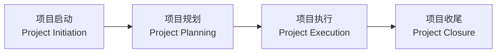
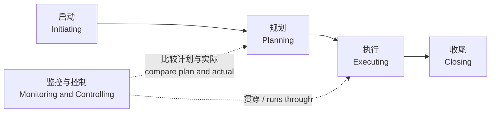
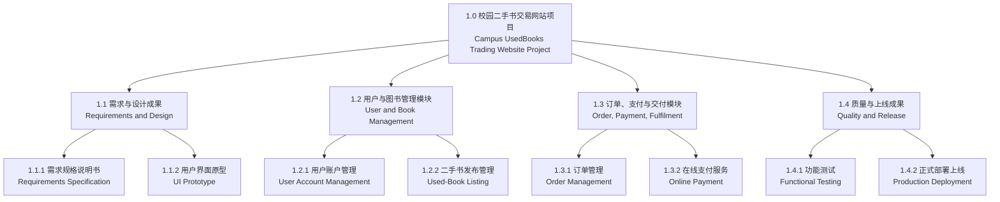
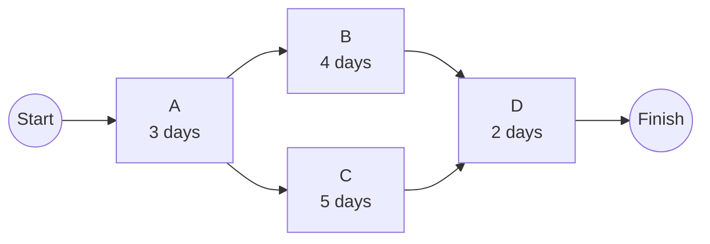
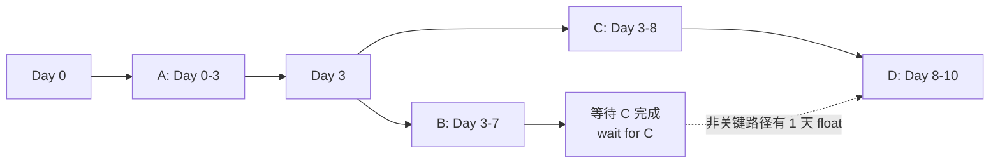
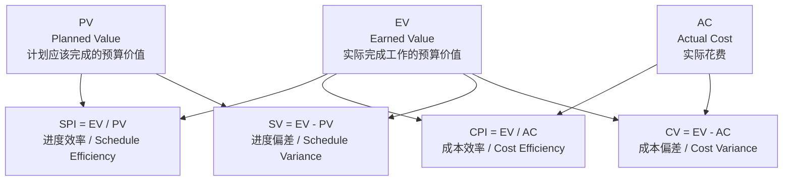
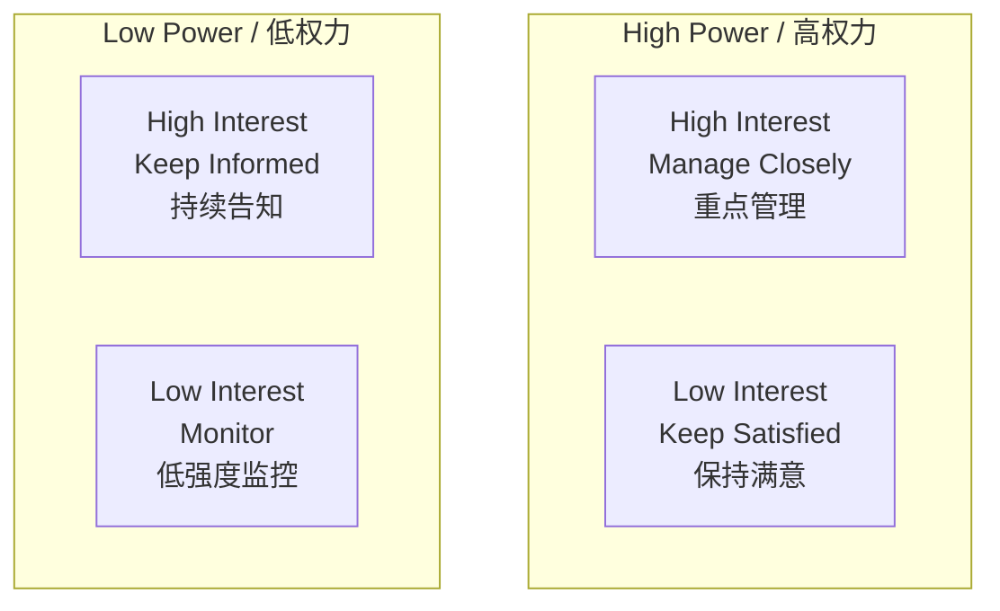
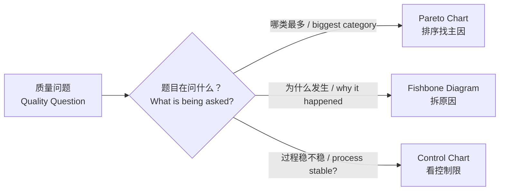

# 画图大章：软件项目管理高频图表专项

这章只整理考试优先级高的图，不整理讲义里出现过的所有视觉元素。
This chapter only organises the diagrams with high exam priority, not every visual element that appears in the lecture slides.

筛选依据有三个：==Lecture 11 Review 明确点名==、==同一图跨多讲反复出现==、==讲义安排过计算或画图活动==。
The selection is based on three signals: explicitly named in the Lecture 11 Review, repeated across lectures, and used in calculation or drawing activities.

复习顺序建议是：==生命周期/过程组 → WBS → Network/CPM/PERT/Gantt → EVM → 风险矩阵 → 干系人矩阵 → 质量三图 → 敏捷图==。
The recommended revision order is: life cycle/process groups → WBS → Network/CPM/PERT/Gantt → EVM → risk matrix → stakeholder matrix → quality diagrams → agile diagrams.

## 0. 考试优先级地图

第一档必须会画、会算、会解释。
The first tier must be drawable, calculable, and explainable.

| 优先级 | 图组 | 你要会到什么程度 | 重点课件 |
| --- | --- | --- | --- |
| 1 | 生命周期 + 过程组图 | 能画、填空、解释 Project Life Cycle、PM Process Groups、SDLC/Waterfall/Agile 的区别 | Lecture 11, Lecture 10 |
| 2 | WBS | 给项目案例，能分层拆出 deliverables 和 work packages；知道 100% Rule | Lecture 3 |
| 3 | Network / PDM + Critical Path + PERT | 给活动、依赖、工期，能画网络图；算 ES/EF/LS/LF、float、关键路径；会 PERT 三点估算 | Lecture 4, Lecture 5 |
| 4 | Gantt Chart | 根据任务和依赖画时间轴、工期、里程碑、依赖箭头 | Lecture 4, Lecture 5 |
| 5 | EVM 挣值管理图/表 | 会算 PV、EV、AC、CV、SV、CPI、SPI、EAC，并判断超支/落后 | Lecture 6 |
| 6 | 风险概率-影响矩阵 | 给风险放入高/中/低优先级区域，并写应对策略 | Lecture 7 |
| 7 | Stakeholder Power-Interest Grid | 把干系人放入四象限，并写管理策略 | Lecture 8 |
| 8 | 质量工具图 | 至少会区分并简单画 Pareto、Fishbone、Control Chart | Lecture 9 |

第二档要会用、会选，但通常不像核心大画图题。
The second tier should be usable and selectable, but is usually less like a core drawing question.

Decision Tree + EMV 要会画分支和算期望货币价值。
For Decision Tree + EMV, know how to draw branches and calculate expected monetary value.

RACI / RAM 要会填 Responsible、Accountable、Consulted、Informed。
For RACI / RAM, know how to fill Responsible, Accountable, Consulted, and Informed.

Scrum Framework、Product Backlog、Burndown Chart 更像敏捷概念题或读图题。
Scrum Framework, Product Backlog, and Burndown Chart are more likely to appear as agile concept or chart-reading questions.

Risk Breakdown Structure、Resource Histogram、OBS 知道用途即可。
For Risk Breakdown Structure, Resource Histogram, and OBS, knowing their purposes is usually enough.

暂时不用大量练画 Monte Carlo、Sensitivity Analysis、Scatter Diagram、Histogram、Run Chart、Check Sheet、Game Payoff Matrix、复杂组织结构图和 Scrum Velocity 图。
For now, do not spend heavy drawing practice on Monte Carlo, Sensitivity Analysis, Scatter Diagram, Histogram, Run Chart, Check Sheet, Game Payoff Matrix, complex organisation charts, or Scrum Velocity charts.

## 1. 生命周期 + 过程组 + SDLC / Waterfall / Agile

这一组是==最高优先级==，因为 Lecture 11 的 Review 明确要求 ==Project lifecycle and phases==、==project management framework== 和 ==management process groups==。
This group has the highest priority because the Lecture 11 Review explicitly requires project lifecycle and phases, the project management framework, and management process groups.

你一定要分清：==Project Life Cycle==、==PM Process Groups==、==SDLC== 不是同一个东西。
You must clearly distinguish that Project Life Cycle, PM Process Groups, and SDLC are not the same thing.

Project Life Cycle 问的是：项目从开始到结束经历哪些大阶段。
The Project Life Cycle asks: what major phases does the project go through from start to finish?

PM Process Groups 问的是：项目经理在项目中做哪些管理工作。
PM Process Groups ask: what management work does the project manager perform during the project?

SDLC 问的是：软件产品采用什么方式被分析、设计、开发、测试和交付。
SDLC asks: how the software product is analysed, designed, developed, tested, and delivered.

| 图 | 它回答的问题 | 必须记住 |
| --- | --- | --- |
| Project Life Cycle | 项目从开始到结束经历哪些阶段？ | 它描述项目整体的阶段性推进 |
| Project Management Process Groups | 管理者在项目中做哪些管理工作？ | Initiating、Planning、Executing、Monitoring and Controlling、Closing |
| SDLC / Waterfall / Agile | 软件产品采用什么开发方式？ | Waterfall 线性且前期规划重；Agile 迭代、增量、频繁反馈 |

项目生命周期可以简化画成下面这样。
The project life cycle can be drawn simply as follows.

启动阶段决定项目是否值得做，以及谁支持这个项目。
The initiation phase decides whether the project is worth doing and who supports it.

规划阶段确定范围、进度、成本、风险、资源和沟通方式。
The planning phase determines scope, schedule, cost, risk, resources, and communication methods.

执行阶段完成实际工作并产生项目交付物。
The execution phase performs the actual work and produces project deliverables.

收尾阶段完成验收、交接、总结和正式关闭。
The closure phase completes acceptance, handover, lessons learned, and formal closure.

项目管理过程组要记成四个顺序节点加一个贯穿节点。
The project management process groups should be memorised as four sequential nodes plus one cross-cutting node.

Initiating 的典型输出是 Approved Project Charter。
The typical output of Initiating is the Approved Project Charter.

Planning 的典型输出是 Approved Project Management Plan。
The typical output of Planning is the Approved Project Management Plan.

Executing 的重点是完成计划中的工作，并协调团队、沟通、质量保证和干系人参与。
The focus of Executing is performing the planned work and coordinating the team, communication, quality assurance, and stakeholder engagement.

Monitoring and Controlling 的重点是把实际表现和计划基准比较，并采取纠偏行动。
The focus of Monitoring and Controlling is comparing actual performance with the plan baseline and taking corrective action.

Closing 的重点是正式验收、移交、总结经验教训和关闭项目。
The focus of Closing is formal acceptance, handover, lessons learned, and project closure.

SDLC 是软件系统开发生命周期，它描述软件产品如何被做出来。
SDLC is the software development life cycle, which describes how the software product is built.

Waterfall 是预测型模型，适合范围清晰、需求稳定、时间成本较可预测的项目。
Waterfall is a predictive model, suitable for projects with clear scope, stable requirements, and relatively predictable time and cost.

Agile 是适应型模型，适合需求高度不确定、需要频繁反馈和迭代交付的项目。
Agile is an adaptive model, suitable for projects with high requirement uncertainty, frequent feedback, and iterative delivery.

考试填空最常见的是把 Monitoring and Controlling 错放成 Executing 之后的一个普通阶段。
The most common fill-in mistake is treating Monitoring and Controlling as a normal phase after Executing.

正确理解是：Monitoring and Controlling 不是只在最后检查，而是贯穿项目并持续比较计划与实际。
The correct understanding is that Monitoring and Controlling is not only a final check; it runs throughout the project and continuously compares plan with actual performance.

## 2. WBS 工作分解结构

==WBS== 是 Work Breakdown Structure，中文是工作分解结构。
WBS stands for Work Breakdown Structure.

WBS 是对项目总范围的==面向交付物的分层分解==。
A WBS is a deliverable-oriented hierarchical decomposition of the total project scope.

WBS 回答的是“项目需要完成哪些工作”，不是“这些工作什么时候做”。
A WBS answers “what work must be completed,” not “when the work will be done.”

Lecture 3 把 WBS 放在 scope baseline 中，并强调 WBS + WBS Dictionary 构成范围基准的重要部分。
Lecture 3 places the WBS in the scope baseline and emphasises that the WBS + WBS Dictionary form an important part of the scope baseline.

最底层叫 ==Work Package==。
The lowest level is called a Work Package.

Work Package 必须可以估成本、排工期、分配资源、监控和控制。
A Work Package must be able to be cost-estimated, scheduled, assigned resources, monitored, and controlled.

WBS 可以按产品/交付物拆，也可以按项目阶段拆，还可以按项目管理过程组拆。
A WBS can be decomposed by products/deliverables, by project phases, or by project management process groups.

考试中最推荐的是按交付物拆，因为这最符合 WBS 的 deliverable-oriented 思想。
In exams, decomposition by deliverables is usually best because it matches the deliverable-oriented idea of a WBS.

==100% Rule== 的意思是：父节点下面的子节点必须覆盖该父节点的全部工作。
The 100% Rule means that the child elements under a parent must cover all work required by that parent.

所有子项加起来必须等于父项的全部范围，不能漏掉题目要求，也不能加入题目没要求的东西。
All child items combined must equal the full scope of the parent: do not omit required work and do not add work not required by the question.

WBS、Gantt、Network、RACI 的区别要背清楚。
The differences among WBS, Gantt, Network, and RACI must be memorised clearly.

| 图或表 | 回答的问题 |
| --- | --- |
| WBS | 做什么？What work will be done? |
| Gantt Chart | 什么时候做、持续多久？When will it be done and how long will it last? |
| Network Diagram | 谁先谁后、有什么依赖？What comes before what and what dependencies exist? |
| RACI / RAM | 谁负责、谁审批、谁咨询、谁知会？Who is responsible, accountable, consulted, and informed? |

考试画 WBS 的步骤固定下来。
Fix the exam steps for drawing a WBS.

第一步，写项目名称作为 Level 1。
Step 1: write the project name as Level 1.

第二步，圈出题目要求交付的主要成果。
Step 2: identify the main deliverables required by the question.

第三步，把主要成果写成 Level 2。
Step 3: write the main deliverables as Level 2 items.

第四步，把每个主要成果继续拆成模块、子功能或工作包。
Step 4: decompose each major deliverable into modules, subfunctions, or work packages.

第五步，检查是否符合 100% Rule。
Step 5: check whether the WBS satisfies the 100% Rule.

第六步，给每个节点编号，例如 1.0、1.1、1.1.1。
Step 6: number each element, such as 1.0, 1.1, and 1.1.1.

一个校园二手书网站的 WBS 可以这样画。
A WBS for a Campus UsedBooks Website can be drawn like this.

## 3. Network / PDM + Critical Path + PERT

这一套==最像综合大题==，通常不是分开考五张图。
This set is the most likely to become an integrated exam question, usually not five isolated diagrams.

完整链条是：==活动表 → PDM/Network Diagram → CPM → PERT → Gantt Chart==。
The full chain is: activity table → PDM/Network Diagram → CPM → PERT → Gantt Chart.

题目通常给活动名称、持续时间、前置依赖和可能的 O/M/P 三点估算。
The question usually gives activity names, durations, predecessors, and possibly O/M/P three-point estimates.

==Network Diagram== 展示活动及其先后顺序。
A Network Diagram shows activities and their sequences.

==PDM== 是 Precedence Diagramming Method，是画项目网络图的一种常用方法。
PDM stands for Precedence Diagramming Method and is a common method for drawing a project network diagram.

PDM 通常用节点表示活动，用箭头表示依赖关系。
PDM usually represents activities as nodes and dependencies as arrows.

PDM 的四种依赖关系要会认。
You must recognise the four dependency types in PDM.

| 依赖 | 中文理解 | 英文理解 |
| --- | --- | --- |
| FS | 前一个完成，后一个才能开始 | Finish-to-Start |
| SS | 前一个开始，后一个才能开始 | Start-to-Start |
| FF | 前一个完成，后一个才能完成 | Finish-to-Finish |
| SF | 前一个开始，后一个才能完成 | Start-to-Finish |

FS 是最常见依赖。
FS is the most common dependency.

SS 和 FF 在并行工作中常见。
SS and FF often appear in parallel work.

SF 很少见，但考试可能用来测试概念。
SF is rare, but exams may use it to test the concept.

Lead 是提前量，表示后续活动可以提前开始。
Lead means an overlap or acceleration where the successor can start earlier.

Lag 是滞后量，表示后续活动必须等待一段时间才能开始。
Lag means a waiting time before the successor can start.

画 PDM 时先列活动，再标依赖，最后检查有没有遗漏开始和结束。
When drawing a PDM, list activities first, mark dependencies, and finally check whether start and finish are missing.

==Critical Path== 是决定项目最早完成时间的一串活动。
The Critical Path is the sequence of activities that determines the earliest project completion time.

关键路径通常是网络图中持续时间最长的路径。
The critical path is usually the longest-duration path in the network diagram.

关键路径上的活动总浮动时间为 0。
Activities on the critical path have zero total float.

如果关键路径上的活动延误，整个项目完工时间通常会延误。
If an activity on the critical path is delayed, the whole project completion time will usually be delayed.

==CPM== 计算有四个核心时间：==ES==、==EF==、==LS==、==LF==。
CPM calculation has four core times: ES, EF, LS, and LF.

ES 是 Earliest Start，最早开始时间。
ES means Earliest Start.

EF 是 Earliest Finish，最早完成时间。
EF means Earliest Finish.

LS 是 Latest Start，最晚开始时间。
LS means Latest Start.

LF 是 Latest Finish，最晚完成时间。
LF means Latest Finish.

Forward Pass 从左到右算 ES 和 EF。
Forward Pass calculates ES and EF from left to right.

Backward Pass 从右到左算 LF 和 LS。
Backward Pass calculates LF and LS from right to left.

常用公式要背熟。
Memorise the common formulas.

| 项目 | 公式 |
| --- | --- |
| EF | ES + Duration |
| LS | LF - Duration |
| Float / Slack | LS - ES 或 LF - EF |
| 多个前置活动的 ES | 取所有前置活动 EF 的最大值 |
| 多个后续活动的 LF | 取所有后续活动 LS 的最小值 |

==PERT== 用三点估算来处理活动工期的不确定性。
PERT uses three-point estimation to handle uncertainty in activity duration.

O 是 Optimistic time，乐观时间。
O means Optimistic time.

M 是 Most likely time，最可能时间。
M means Most likely time.

P 是 Pessimistic time，悲观时间。
P means Pessimistic time.

PERT 期望工期公式是 ==TE = (O + 4M + P) / 6==。
The PERT expected duration formula is TE = (O + 4M + P) / 6.

考试里如果同时给 O、M、P 和依赖关系，先算每个活动的 TE，再用 TE 画网络图和算关键路径。
If the exam gives O, M, P and dependencies together, calculate TE for each activity first, then use TE to draw the network and calculate the critical path.

一个最小例题可以这样处理。
A minimal example can be handled as follows.

| 活动 | 工期 | 前置活动 |
| --- | --- | --- |
| A | 3 | - |
| B | 4 | A |
| C | 5 | A |
| D | 2 | B, C |

网络关系是 A 后分成 B 和 C，B 和 C 都完成后才能做 D。
The network relationship is that A splits into B and C, and D can start only after both B and C finish.

路径 A-B-D 的总工期是 3 + 4 + 2 = 9。
The total duration of path A-B-D is 3 + 4 + 2 = 9.

路径 A-C-D 的总工期是 3 + 5 + 2 = 10。
The total duration of path A-C-D is 3 + 5 + 2 = 10.

因此关键路径是 ==A-C-D==，总工期是 ==10==。
Therefore, the critical path is A-C-D and the total project duration is 10.

这一题里 B 有 1 天 float，因为 B 路径比关键路径短 1 天。
In this question, B has 1 day of float because the B path is 1 day shorter than the critical path.

## 4. Gantt Chart 甘特图

==Gantt Chart== 是把项目活动放到日历时间轴上展示的进度图。
A Gantt Chart is a schedule chart that places project activities on a calendar timeline.

甘特图的横轴是时间，纵轴是活动或任务。
The horizontal axis of a Gantt Chart is time, and the vertical axis is activities or tasks.

每个条形表示一个活动的开始时间、结束时间和持续时间。
Each bar shows an activity’s start time, finish time, and duration.

Lecture 4 和 Lecture 5 都把 Gantt Chart 和 Network Diagram 一起放在制定进度计划的工具中。
Lecture 4 and Lecture 5 place Gantt Chart and Network Diagram together as tools for developing the schedule.

==Network Diagram== 更适合算依赖和关键路径。
A Network Diagram is better for calculating dependencies and the critical path.

==Gantt Chart== 更适合向非技术人员解释项目日程。
A Gantt Chart is better for explaining the project schedule to non-technical people.

甘特图必须认识的元素包括 activity、duration、start date、finish date、milestone、summary task 和 dependency arrow。
The elements you must recognise in a Gantt Chart include activity, duration, start date, finish date, milestone, summary task, and dependency arrow.

手画甘特图的步骤很固定。
The steps for drawing a Gantt Chart by hand are fixed.

第一步，列出活动。
Step 1: list the activities.

第二步，根据 Network Diagram 或活动表确定每个活动的开始时间。
Step 2: determine each activity’s start time based on the Network Diagram or activity table.

第三步，按持续时间画横条。
Step 3: draw bars according to duration.

第四步，标出里程碑。
Step 4: mark milestones.

第五步，用箭头或位置关系表示依赖。
Step 5: show dependencies using arrows or relative positions.

第六步，检查甘特图是否和活动表、网络图一致。
Step 6: check whether the Gantt Chart matches the activity table and network diagram.

沿用前面的 A、B、C、D 例题，甘特图可以这样画。
Using the previous A, B, C, D example, the Gantt Chart can be drawn like this.

A 从第 0 天开始，持续 3 天。
A starts at day 0 and lasts 3 days.

B 和 C 都依赖 A，所以从 A 完成后开始。
B and C both depend on A, so they start after A finishes.

D 同时依赖 B 和 C，所以必须等较晚完成的 C 结束后开始。
D depends on both B and C, so it must wait until the later predecessor C finishes.

甘特图的优点是直观、适合沟通、容易看出日程安排。
The advantages of a Gantt Chart are that it is intuitive, good for communication, and easy to read for schedule arrangement.

甘特图的局限是复杂依赖和关键路径不如 Network Diagram 清楚。
The limitation of a Gantt Chart is that complex dependencies and the critical path are less clear than in a Network Diagram.

## 5. EVM 挣值管理图/表

==EVM== 是 Earned Value Management，中文常译为挣值管理。
EVM stands for Earned Value Management.

EVM 用同一套数字同时判断==成本表现==和==进度表现==。
EVM uses one set of numbers to judge both cost performance and schedule performance.

Lecture 6 明确讲了 EVM，并且 Lecture 11 Review 也点名了 EVM、PV、EV、CPI、SPI。
Lecture 6 explicitly covers EVM, and the Lecture 11 Review also names EVM, PV, EV, CPI, and SPI.

EVM 三个核心数字是 ==PV==、==EV==、==AC==。
The three core EVM values are PV, EV, and AC.

==PV== 是 Planned Value，计划价值，也就是到某时间点按计划应该完成的预算价值。
PV means Planned Value, the budgeted value of the work that should have been completed by a certain time.

==EV== 是 Earned Value，挣值，也就是实际已经完成工作的预算价值。
EV means Earned Value, the budgeted value of the work actually completed.

==AC== 是 Actual Cost，实际成本，也就是完成这些工作实际花的钱。
AC means Actual Cost, the actual money spent to complete the work.

记忆方法是：PV 看计划，EV 看完成，AC 看花费。
The memory rule is: PV looks at the plan, EV looks at completed work, and AC looks at spending.

偏差分析看 CV 和 SV。
Variance analysis uses CV and SV.

==CV = EV - AC==。
CV = EV - AC.

CV 大于 0 表示成本节约，小于 0 表示成本超支。
If CV is greater than 0, the project is under budget; if CV is less than 0, it is over budget.

==SV = EV - PV==。
SV = EV - PV.

SV 大于 0 表示进度超前，小于 0 表示进度落后。
If SV is greater than 0, the project is ahead of schedule; if SV is less than 0, it is behind schedule.

绩效指数看 CPI 和 SPI。
Performance indices use CPI and SPI.

==CPI = EV / AC==。
CPI = EV / AC.

CPI 大于 1 表示成本效率好，小于 1 表示成本效率差。
If CPI is greater than 1, cost efficiency is good; if CPI is less than 1, cost efficiency is poor.

==SPI = EV / PV==。
SPI = EV / PV.

SPI 大于 1 表示进度效率好，小于 1 表示进度效率差。
If SPI is greater than 1, schedule efficiency is good; if SPI is less than 1, schedule efficiency is poor.

BAC 是 Budget at Completion，完工预算。
BAC means Budget at Completion.

EAC 是 Estimate at Completion，完工估算。
EAC means Estimate at Completion.

最常用的 EAC 公式是 ==EAC = BAC / CPI==。
The most common EAC formula is EAC = BAC / CPI.

如果题目强调未来工作按原预算效率完成，也可能使用 EAC = AC + (BAC - EV)。
If the question says future work will follow the original budget rate, EAC = AC + (BAC - EV) may be used.

EVM 三线图一般画 PV、EV、AC 三条线。
An EVM three-line chart usually draws PV, EV, and AC as three lines.

如果 AC 高于 EV，说明实际花费超过已经挣到的预算价值。
If AC is above EV, actual spending is higher than the budgeted value earned.

如果 EV 低于 PV，说明实际完成价值低于计划完成价值。
If EV is below PV, actual earned value is lower than planned value.

一个快速判断模板是：先看 CV 判断超支，再看 SV 判断落后，最后用 CPI/SPI 判断效率。
A quick judgement template is: check CV for cost overrun, check SV for schedule delay, then use CPI/SPI for efficiency.

| 指标 | 公式 | 好情况 | 坏情况 |
| --- | --- | --- | --- |
| CV | EV - AC | > 0 under budget | < 0 over budget |
| SV | EV - PV | > 0 ahead of schedule | < 0 behind schedule |
| CPI | EV / AC | > 1 cost efficient | < 1 cost inefficient |
| SPI | EV / PV | > 1 schedule efficient | < 1 schedule inefficient |

## 6. 风险概率-影响矩阵

==风险概率-影响矩阵==用于把风险按照“发生可能性”和“发生后影响”分级。
The Probability-Impact Matrix classifies risks by likelihood of occurrence and impact if they occur.

Lecture 7 明确讲了 Probability/Impact Matrix，并给了风险优先级分析。
Lecture 7 explicitly covers the Probability/Impact Matrix and risk priority analysis.

矩阵一条轴是 Probability，另一条轴是 Impact。
One axis is Probability, and the other axis is Impact.

Probability 表示风险发生的可能性。
Probability means the likelihood that the risk will occur.

Impact 表示风险发生后对项目目标的影响程度。
Impact means the degree of effect on project objectives if the risk occurs.

风险分数常用 ==Risk Score = Probability × Impact==。
The common risk score is Risk Score = Probability × Impact.

考试可以画成 3x3 矩阵。
In an exam, it can be drawn as a 3x3 matrix.

| Impact / Probability | Low P | Medium P | High P |
| --- | --- | --- | --- |
| High I | Medium | High | High |
| Medium I | Low | Medium | High |
| Low I | Low | Low | Medium |

高概率高影响的风险优先级最高。
Risks with high probability and high impact have the highest priority.

低概率低影响的风险优先级最低。
Risks with low probability and low impact have the lowest priority.

风险应对策略要跟矩阵结果一起写。
Risk response strategies should be written together with the matrix result.

威胁类风险常见策略是 Avoid、Mitigate、Transfer、Accept。
Common strategies for threats are Avoid, Mitigate, Transfer, and Accept.

==Avoid== 是改变计划以消除风险。
Avoid means changing the plan to eliminate the risk.

==Mitigate== 是降低发生概率或影响。
Mitigate means reducing the probability or impact.

==Transfer== 是把风险责任转移给第三方，例如保险或外包合同。
Transfer means shifting risk responsibility to a third party, such as insurance or an outsourcing contract.

==Accept== 是接受风险，并准备应急储备或应急计划。
Accept means accepting the risk and preparing contingency reserve or a contingency plan.

考试答题模板是：先命名风险，再估概率和影响，再放入矩阵，最后给策略。
The exam answer template is: name the risk, estimate probability and impact, place it in the matrix, and then give the response strategy.

## 7. Stakeholder Power-Interest Grid

==Power-Interest Grid== 用权力和兴趣两个维度分析干系人。
The Power-Interest Grid analyses stakeholders using two dimensions: power and interest.

Power 表示干系人影响项目决策或资源的能力。
Power means the stakeholder’s ability to influence project decisions or resources.

Interest 表示干系人对项目结果和过程的关注程度。
Interest means the stakeholder’s level of concern about the project outcome and process.

Lecture 8 明确提到 power/interest grid 可以根据权力和关注程度给干系人分组。
Lecture 8 explicitly states that the power/interest grid groups stakeholders by authority and level of concern.

四个象限必须背下来。
You must memorise the four quadrants.

| 象限 | 管理策略 | 典型含义 |
| --- | --- | --- |
| High Power, High Interest | Manage Closely | 重点管理，频繁沟通 |
| High Power, Low Interest | Keep Satisfied | 让其满意，避免过度打扰 |
| Low Power, High Interest | Keep Informed | 持续告知，保持参与 |
| Low Power, Low Interest | Monitor | 低强度监控 |

==Manage Closely== 适合项目赞助人、关键客户、核心决策者。
Manage Closely is suitable for sponsors, key clients, and core decision makers.

==Keep Satisfied== 适合有权力但不想看太多细节的人。
Keep Satisfied is suitable for people with power who do not want too many details.

==Keep Informed== 适合高度关注但权力不大的用户或团队成员。
Keep Informed is suitable for users or team members with high interest but low power.

==Monitor== 适合权力低、兴趣低的外围人员。
Monitor is suitable for peripheral people with low power and low interest.

Power-Interest Grid 和 Stakeholder Engagement Level 不一样。
The Power-Interest Grid is not the same as Stakeholder Engagement Level.

Power-Interest Grid 关注“怎么管理这个干系人”。
The Power-Interest Grid focuses on “how to manage this stakeholder.”

Stakeholder Engagement Level 关注干系人现在是 unaware、resistant、neutral、supportive 还是 leading。
Stakeholder Engagement Level focuses on whether the stakeholder is unaware, resistant, neutral, supportive, or leading.

考试答题模板是：说明干系人，判断 power 和 interest，放入象限，写管理策略。
The exam answer template is: describe the stakeholder, judge power and interest, place them in the quadrant, and write the management strategy.

## 8. 质量工具图：Pareto、Fishbone、Control Chart

Lecture 9 讲了质量控制工具，Lecture 11 Review 也点名了 cause-and-effect diagram、Pareto/control。
Lecture 9 covers quality control tools, and the Lecture 11 Review also names cause-and-effect diagram and Pareto/control.

考试不一定要求把三种图都完整手画，但一定要会区分什么时候用哪一种。
The exam may not require drawing all three diagrams completely, but you must know when to use each one.

==Pareto Chart== 用来找“少数关键原因”。
A Pareto Chart is used to find the “vital few” causes.

Pareto Chart 通常是按频率或数量从高到低排列的柱状图，并配一条累计百分比曲线。
A Pareto Chart is usually a bar chart sorted from highest to lowest frequency or count, with a cumulative percentage line.

它背后的思想是 80/20 原则。
The idea behind it is the 80/20 principle.

如果题目问“哪类缺陷贡献最大，应该优先解决哪类问题”，优先想到 Pareto Chart。
If the question asks “which defect type contributes the most and should be fixed first,” think of a Pareto Chart first.

==Fishbone Diagram== 也叫 Ishikawa Diagram 或 Cause-and-Effect Diagram。
Fishbone Diagram is also called Ishikawa Diagram or Cause-and-Effect Diagram.

Fishbone Diagram 用来分析问题的潜在原因。
A Fishbone Diagram is used to analyse potential causes of a problem.

鱼头写问题，鱼骨写原因类别，每根骨头下面继续分解具体原因。
The fish head contains the problem, the bones contain cause categories, and each bone is further decomposed into specific causes.

常见原因类别可以是 People、Process、Technology、Environment、Management。
Common cause categories can include People, Process, Technology, Environment, and Management.

如果题目问“为什么出现这个质量问题，可能原因有哪些”，优先想到 Fishbone Diagram。
If the question asks “why did this quality problem occur and what possible causes exist,” think of a Fishbone Diagram first.

==Control Chart== 用来判断过程是否稳定、是否在控制范围内。
A Control Chart is used to judge whether a process is stable and within control limits.

Control Chart 通常有中心线、上控制限和下控制限。
A Control Chart usually has a centre line, an upper control limit, and a lower control limit.

如果数据点超出控制限，或出现异常模式，说明过程可能失控。
If data points exceed control limits or show abnormal patterns, the process may be out of control.

Control Limit 和 Specification Limit 不要混。
Do not confuse Control Limits with Specification Limits.

Control Limit 来自过程数据，用来判断过程稳定性。
Control Limits come from process data and judge process stability.

Specification Limit 来自客户或产品要求，用来判断结果是否满足规格。
Specification Limits come from customer or product requirements and judge whether outputs meet specifications.

三种质量图的选择可以这样背。
The selection among the three quality diagrams can be memorised as follows.

| 问题类型 | 选择 |
| --- | --- |
| 哪类问题最多、先解决哪个？ | Pareto Chart |
| 为什么会发生这个问题？ | Fishbone Diagram |
| 过程是否稳定、是否失控？ | Control Chart |

## 9. 综合题套路

最像大题的一套是活动表 → PDM/Network Diagram → CPM → PERT → Gantt Chart。
The most exam-like integrated set is activity table → PDM/Network Diagram → CPM → PERT → Gantt Chart.

不要把它们当成互不相关的五张图。
Do not treat them as five unrelated diagrams.

如果题目给活动、依赖、工期，你先画 Network Diagram。
If the question gives activities, dependencies, and durations, draw the Network Diagram first.

如果题目给 O、M、P，你先用 PERT 算期望工期。
If the question gives O, M, and P, calculate expected durations using PERT first.

如果题目要求 total project duration，你找最长路径。
If the question asks for total project duration, find the longest path.

如果题目要求 slack 或 float，你做 Forward Pass 和 Backward Pass。
If the question asks for slack or float, perform Forward Pass and Backward Pass.

如果题目要求给管理层展示日程，你把结果转成 Gantt Chart。
If the question asks for a schedule presentation to management, convert the result into a Gantt Chart.

如果题目给 PV、EV、AC，你进入 EVM 模式。
If the question gives PV, EV, and AC, switch into EVM mode.

EVM 先算 CV 和 SV，再算 CPI 和 SPI，最后解释项目是超支、节约、落后还是超前。
For EVM, calculate CV and SV first, then CPI and SPI, and finally explain whether the project is over budget, under budget, behind schedule, or ahead of schedule.

如果题目给风险描述，你进入 Probability-Impact Matrix 模式。
If the question gives risk descriptions, switch into Probability-Impact Matrix mode.

风险题要同时写优先级和应对策略。
Risk questions should include both priority and response strategy.

如果题目给干系人角色，你进入 Power-Interest Grid 模式。
If the question gives stakeholder roles, switch into Power-Interest Grid mode.

干系人题要同时写象限和管理策略。
Stakeholder questions should include both quadrant and management strategy.

如果题目给质量缺陷数据或质量问题，你进入质量工具图模式。
If the question gives quality defect data or a quality problem, switch into quality tool diagram mode.

数据排序找主因用 Pareto，原因分析用 Fishbone，过程稳定性用 Control Chart。
Use Pareto for ranking data to find major causes, Fishbone for cause analysis, and Control Chart for process stability.

## 10. 自测题

### 题 1：WBS

给一个校园二手书网站项目，画出至少三层 WBS，并说明哪个层级是 Work Package。
Given a Campus UsedBooks Website project, draw a WBS with at least three levels and state which level is the Work Package.

答案：Level 1 可以是“校园二手书交易网站项目”；Level 2 可以拆成需求与设计、用户与图书管理、订单支付与交付、质量与上线；Level 3 可以继续拆成需求规格说明书、用户账户管理、在线支付、功能测试等。
Answer: Level 1 can be “Campus UsedBooks Trading Website Project”; Level 2 can be Requirements and Design, User and Book Management, Order/Payment/Fulfilment, and Quality/Release; Level 3 can include Requirements Specification, User Account Management, Online Payment, Functional Testing, and similar items.

最底层、可以被估算成本、安排工期、分配负责人并监控的节点就是 ==Work Package==。
The lowest-level item that can be cost-estimated, scheduled, assigned to an owner, and monitored is the ==Work Package==.

### 题 2：Network Diagram + Critical Path

活动 A 3 天，B 4 天依赖 A，C 5 天依赖 A，D 2 天依赖 B 和 C。画网络图并找关键路径。
Activity A takes 3 days, B takes 4 days and depends on A, C takes 5 days and depends on A, D takes 2 days and depends on B and C. Draw the network diagram and find the critical path.

答案图：
Answer diagram:

路径 A-B-D = 3 + 4 + 2 = 9。
Path A-B-D = 3 + 4 + 2 = 9.

路径 A-C-D = 3 + 5 + 2 = 10。
Path A-C-D = 3 + 5 + 2 = 10.

所以 ==Critical Path 是 A-C-D==，项目总工期是 ==10 天==。
Therefore, the ==Critical Path is A-C-D==, and the total project duration is ==10 days==.

### 题 3：PERT

某活动 O=2、M=5、P=14，计算 PERT 期望工期。
For an activity with O=2, M=5, and P=14, calculate the PERT expected duration.

答案：TE = (O + 4M + P) / 6 = (2 + 4×5 + 14) / 6 = 36 / 6 = ==6 天==。
Answer: TE = (O + 4M + P) / 6 = (2 + 4×5 + 14) / 6 = 36 / 6 = ==6 days==.

### 题 4：EVM

PV=100000，EV=80000，AC=120000，计算 CV、SV、CPI、SPI，并判断项目状态。
Given PV=100000, EV=80000, and AC=120000, calculate CV, SV, CPI, SPI, and judge the project status.

答案：CV = EV - AC = 80000 - 120000 = ==-40000==，说明成本超支。
Answer: CV = EV - AC = 80000 - 120000 = ==-40000==, meaning the project is over budget.

SV = EV - PV = 80000 - 100000 = ==-20000==，说明进度落后。
SV = EV - PV = 80000 - 100000 = ==-20000==, meaning the project is behind schedule.

CPI = EV / AC = 80000 / 120000 = ==0.67==，说明成本效率差。
CPI = EV / AC = 80000 / 120000 = ==0.67==, meaning cost efficiency is poor.

SPI = EV / PV = 80000 / 100000 = ==0.80==，说明进度效率差。
SPI = EV / PV = 80000 / 100000 = ==0.80==, meaning schedule efficiency is poor.

结论：项目==超支且落后==。
Conclusion: the project is ==over budget and behind schedule==.

### 题 5：风险矩阵

一个风险发生概率高、影响高，应该放在矩阵哪里？可以给出哪些应对策略？
If a risk has high probability and high impact, where should it be placed in the matrix? What response strategies can be used?

答案：应该放在 ==High Probability + High Impact== 区域，属于高优先级风险。
Answer: it should be placed in the ==High Probability + High Impact== area, which is a high-priority risk.

可选策略包括 Avoid、Mitigate、Transfer、Accept；考试中通常优先写 Avoid 或 Mitigate，并说明具体动作。
Possible strategies include Avoid, Mitigate, Transfer, and Accept; in exams, Avoid or Mitigate is often the best first answer, with a concrete action.

### 题 6：Power-Interest Grid

校长权力高但兴趣低，学生用户权力低但兴趣高，分别放在哪个 Power-Interest 象限？
If the university president has high power but low interest, and student users have low power but high interest, which Power-Interest quadrants should they be placed in?

答案：校长是 ==High Power + Low Interest==，策略是 ==Keep Satisfied==。
Answer: the university president is ==High Power + Low Interest==, so the strategy is ==Keep Satisfied==.

学生用户是 ==Low Power + High Interest==，策略是 ==Keep Informed==。
Student users are ==Low Power + High Interest==, so the strategy is ==Keep Informed==.

### 题 7：Pareto Chart

如果你有一张缺陷类型和缺陷数量表，应该优先画哪种质量图？
If you have a table of defect types and defect counts, which quality diagram should you draw first?

答案：优先画 ==Pareto Chart==，因为它可以按缺陷数量排序，帮助找出最应该优先解决的少数关键问题。
Answer: draw a ==Pareto Chart== first, because it ranks defect counts and helps identify the vital few problems to fix first.

### 题 8：Fishbone Diagram

如果你要分析“为什么支付功能频繁失败”，应该优先画哪种质量图？
If you need to analyse “why the payment function fails frequently,” which quality diagram should you draw first?

答案：优先画 ==Fishbone Diagram / Cause-and-Effect Diagram==，因为它适合拆解潜在原因，例如接口、网络、测试、人员、流程和第三方服务。
Answer: draw a ==Fishbone Diagram / Cause-and-Effect Diagram== first, because it is suitable for decomposing potential causes such as APIs, network, testing, people, process, and third-party services.

## 11. 考前速记

生命周期看项目经历什么阶段。
The life cycle shows which phases the project goes through.

过程组看项目经理做什么管理工作。
Process groups show what management work the project manager performs.

SDLC 看软件怎么被做出来。
SDLC shows how the software is built.

WBS 拆做什么。
WBS breaks down what to do.

Network Diagram 画谁先谁后。
Network Diagram shows what comes before what.

Critical Path 找最长路径和零浮动活动。
Critical Path identifies the longest path and zero-float activities.

PERT 用 O、M、P 算期望工期。
PERT uses O, M, and P to calculate expected duration.

Gantt Chart 把任务放到时间轴上。
Gantt Chart places tasks on a timeline.

EVM 用 PV、EV、AC 判断成本和进度表现。
EVM uses PV, EV, and AC to judge cost and schedule performance.

风险矩阵用 Probability 和 Impact 排优先级。
The risk matrix prioritises risks using Probability and Impact.

Power-Interest Grid 用权力和兴趣决定干系人管理策略。
The Power-Interest Grid uses power and interest to decide stakeholder management strategy.

Pareto 找最大问题，Fishbone 找原因，Control Chart 看过程是否失控。
Pareto finds the biggest problem, Fishbone finds causes, and Control Chart checks whether the process is out of control.
