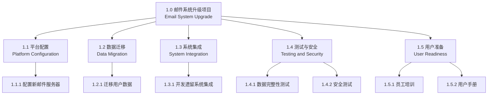
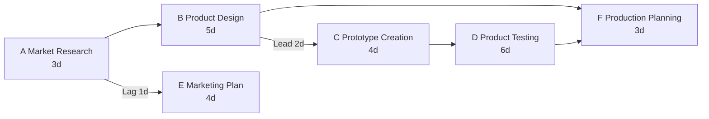
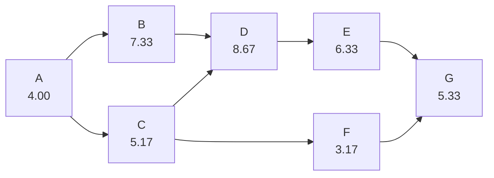
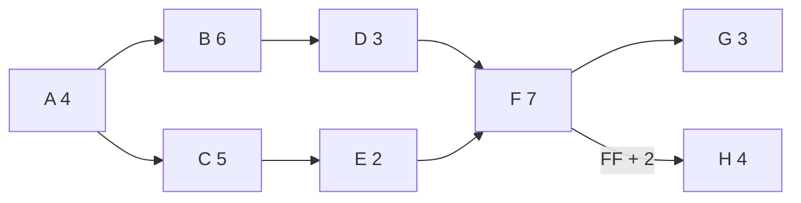

# 课后题与样题：过程与答案

这一章专门整理 Lecture 1-11 PDF 里的 ==Activity==、==Sample Questions==、计算题和案例题。
This chapter collects ==Activities==, ==Sample Questions==, calculation questions, and case questions from Lecture 1-11 PDFs.

每题都给出题目、过程和答案。课堂讨论题没有唯一标准答案，本章给的是考试复习用参考答案。
Each question includes the prompt, process, and answer. Discussion activities do not have one single official answer; this chapter gives revision-oriented model answers.

## Lecture 1：项目与项目管理

### L1-Q1 Activity 1：识别你参与过的最大项目

题目：识别你参与过的最大项目。说明你的角色，并解释它如何满足 unique 和 temporary。
Question: Identify the largest project you have been involved in. Explain your role and how it meets unique and temporary.

过程：
Process:

1. 先说项目名称和背景。
1. State the project name and context.

2. 说明你的角色，例如 developer、tester、analyst、team member。
2. State your role, such as developer, tester, analyst, or team member.

3. 用 ==unique== 说明产出不是重复运营。
3. Use ==unique== to explain that the output is not repetitive operations.

4. 用 ==temporary== 说明它有开始和结束。
4. Use ==temporary== to explain that it has a start and finish.

参考答案：
Model answer:

我参与过一个校园二手书交易网站项目，角色是开发成员。它是 unique，因为项目产出是一个新的交易平台，不是每天重复处理同一种运营任务。它是 temporary，因为项目有启动、需求、开发、测试、上线和收尾，完成交付后项目团队会解散或转入维护。
I participated in a Campus UsedBooks trading website project as a developer. It is unique because the output is a new trading platform, not a repetitive daily operation. It is temporary because it has initiation, requirements, development, testing, deployment, and closure; after delivery, the project team disbands or moves into maintenance.

### L1-Q2 Activity 2：项目为什么会失败

题目：看到项目失败案例后，分析可能问题。
Question: After seeing project failure examples, analyse possible causes.

过程：
Process:

从范围、进度、成本、质量、用户参与、估算、管理支持和外包管理回答。
Answer using scope, schedule, cost, quality, user involvement, estimating, management support, and outsourcing management.

参考答案：
Model answer:

项目可能失败是因为需求不清导致 scope creep，估算不可靠导致进度和成本基准失真，高层支持不足导致资源不到位，用户参与不足导致交付物不符合真实需求，质量管理薄弱导致缺陷累积，外包管理不足导致供应商交付不可控。
The project may fail because unclear requirements cause scope creep, unreliable estimates distort schedule and cost baselines, weak executive support limits resources, low user involvement causes deliverables to miss real needs, weak quality management accumulates defects, and poor outsourcing management makes supplier delivery uncontrollable.

### L1-Q3 Activity 3：有限预算和紧期限下如何做项目

题目：你要开发一个 web app，客户需求很多，但预算有限、期限紧。你会怎么做？
Question: You need to build a web app with extensive requirements, limited budget, and a tight deadline. What would you do?

过程：
Process:

1. 识别三重约束：scope、time、cost、quality。
1. Identify the triple constraints: scope, time, cost, and quality.

2. 和客户一起排优先级，区分 must-have 和 nice-to-have。
2. Prioritise with the customer and separate must-have from nice-to-have.

3. 先交付 MVP 或核心范围。
3. Deliver an MVP or core scope first.

4. 对新增功能走 change control。
4. Use change control for new features.

5. 明确质量底线，不能用质量无限换时间。
5. Define a quality baseline; do not trade unlimited quality for time.

参考答案：
Model answer:

我会先确认核心业务目标和验收标准，把需求分成 must-have、should-have、could-have。对于预算和时间无法支持的功能，建议延期到后续版本。项目计划应包含范围基准、进度基准、成本基准和风险清单。任何新增功能都通过 change request 评估对时间、成本、质量和风险的影响。
I would first confirm the core business objective and acceptance criteria, then classify requirements into must-have, should-have, and could-have. Features not supported by the budget and deadline should be moved to later versions. The project plan should include scope, schedule, cost baselines, and a risk list. Any new feature should go through a change request assessing impact on time, cost, quality, and risk.

### L1-Q4 Activity 4：成功项目经理需要什么

题目：成功的项目经理需要哪些 skills、knowledge、attributes？
Question: What skills, knowledge, and attributes does a successful project manager need?

答案：
Answer:

成功项目经理需要 technical project management knowledge，例如范围、进度、成本、风险和质量管理；还需要 leadership，例如沟通、影响、激励、谈判、冲突解决；还需要 business and strategic management，理解行业、战略目标和业务价值。
A successful project manager needs technical project-management knowledge such as scope, schedule, cost, risk, and quality management; leadership such as communication, influence, motivation, negotiation, and conflict resolution; and business/strategic management, understanding industry, strategic objectives, and business value.

### L1-Q5 Activity 5：Predictive vs Adaptive / Agile

题目：Predictive 和 Adaptive / Agile 各有什么优缺点？什么时候使用？
Question: What are the pros and cons of Predictive and Adaptive / Agile? When should each be used?

| 模型 | 优点 | 缺点 | 适合场景 |
| --- | --- | --- | --- |
| Predictive / Waterfall | 前期计划清楚，文档完整，范围稳定时容易控制 | 反馈晚，变更成本高，工作软件出现晚 | 需求清晰、合规强、技术成熟 |
| Adaptive / Agile | 迭代、反馈快、适应变化 | 需要高参与度和自组织团队，范围边界可能变动 | 需求不确定、用户反馈重要、产品探索性强 |

### L1-Q6 Activity 6：PLC、SDLC、Process Groups 区别

题目：PLC、SDLC、Project Management Process Groups 有什么区别？
Question: What is the difference among PLC, SDLC, and Project Management Process Groups?

答案：
Answer:

==Project Life Cycle== 看项目从开始到结束经历哪些阶段；==SDLC== 看软件产品如何被分析、设计、开发、测试和交付；==Process Groups== 看项目经理在项目中执行哪些管理工作，例如 Initiating、Planning、Executing、Monitoring and Controlling、Closing。
==Project Life Cycle== shows the phases the project goes through from start to finish; ==SDLC== shows how the software product is analysed, designed, developed, tested, and delivered; ==Process Groups== show the management work performed by the project manager, such as Initiating, Planning, Executing, Monitoring and Controlling, and Closing.

## Lecture 2：整合管理、项目选择与启动

### L2-Q1 Activity 1：10000 投资、每年 3000 收益、20% 折现率

题目：项目初始投资 10000，每年产生 3000 现金流，持续 5 年。若折现率为 20%，NPV 是多少？项目是否值得投资？
Question: A project requires an initial investment of 10000 and generates 3000 annually for 5 years. With a 20% discount rate, what is the NPV? Is it worth investing?

过程：
Process:

| 年 | 现金流 | 折现公式 | PV |
| --- | --- | --- | --- |
| 1 | 3000 | 3000 / 1.2 | 2500.00 |
| 2 | 3000 | 3000 / 1.2^2 | 2083.33 |
| 3 | 3000 | 3000 / 1.2^3 | 1736.11 |
| 4 | 3000 | 3000 / 1.2^4 | 1446.76 |
| 5 | 3000 | 3000 / 1.2^5 | 1205.63 |

折现后收益总额 = 8971.83。
Total discounted benefits = 8971.83.

NPV = 8971.83 - 10000 = ==-1028.17==。
NPV = 8971.83 - 10000 = ==-1028.17==.

答案：
Answer:

NPV 小于 0，财务上不值得投资，除非有强战略理由。
NPV is less than 0, so it is not financially worth investing unless there is a strong strategic reason.

### L2-Q2 Activity 2：8% 折现率的 NPV 与 ROI

题目：开发成本 225000，折现率 8%。根据 PDF 表格计算 NPV 和 ROI。
Question: Development cost is 225000 and discount rate is 8%. Calculate NPV and ROI using the PDF table.

PDF 数据：
PDF data:

| Year | Benefits | Operating Costs | Discount Factor |
| --- | --- | --- | --- |
| 1 | 55000 | 5000 | 0.9259 |
| 2 | 60000 | 5000 | 0.8573 |
| 3 | 70000 | 5500 | 0.7938 |
| 4 | 75000 | 5500 | 0.7349 |
| 5 | 80000 | 7000 | 0.6805 |
| 6 | 80000 | 7000 | 0.6301 |
| 7 | 80000 | 7000 | 0.5833 |
| 8 | 80000 | 8000 | 0.5401 |

过程：
Process:

Discounted Benefits = Σ(Benefit × Discount Factor) = ==407766.00==。
Discounted Benefits = Σ(Benefit × Discount Factor) = ==407766.00==.

Discounted Operating Costs = Σ(Operating Cost × Discount Factor) = ==34901.95==。
Discounted Operating Costs = Σ(Operating Cost × Discount Factor) = ==34901.95==.

Total Discounted Costs = Development Cost + Discounted Operating Costs = 225000 + 34901.95 = ==259901.95==。
Total Discounted Costs = Development Cost + Discounted Operating Costs = 225000 + 34901.95 = ==259901.95==.

NPV = 407766.00 - 259901.95 = ==147864.05==。
NPV = 407766.00 - 259901.95 = ==147864.05==.

ROI = NPV / Total Discounted Costs = 147864.05 / 259901.95 = ==56.89%==。
ROI = NPV / Total Discounted Costs = 147864.05 / 259901.95 = ==56.89%==.

答案：
Answer:

NPV 为正且 ROI 约 56.89%，财务上可以接受。
NPV is positive and ROI is about 56.89%, so the project is financially acceptable.

### L2-Q3 Weighted Scoring：三个项目如何选

题目：根据项目是否支持战略、是否有 sponsor、客户支持、工期、NPV 等标准比较 Project 1、2、3。
Question: Compare Project 1, 2, and 3 using criteria such as strategic support, sponsor, customer support, timeline, and NPV.

参考过程：
Model process:

Project 1 有战略目标和高层支持，约 1 年，NPV 可能为正，但复杂度高、估算不稳定。
Project 1 has strategic goals and executive support, about one year, possibly positive NPV, but high complexity and unstable estimates.

Project 2 工期短、风险低，但目前 NPV 为负，战略价值可能较弱。
Project 2 has short duration and low risk, but currently negative NPV and possibly weaker strategic value.

Project 3 战略价值强，有 CIO 和高层支持，NPV 为正，但工期 18 个月、payback 4 年。
Project 3 has strong strategic value, CIO/executive support, and positive NPV, but duration is 18 months and payback is 4 years.

参考答案：
Model answer:

若组织最重视战略转型和长期价值，可优先 Project 3；若组织更重视一年内交付且估算可控，可考虑 Project 1；Project 2 虽短期风险低，但 NPV 为负，除非有非财务战略理由，否则优先级较低。
If the organisation prioritises strategic transformation and long-term value, Project 3 may rank highest; if it prioritises delivery within one year and manageable estimates, Project 1 may be considered; Project 2 has low short-term risk but negative NPV, so it is lower priority unless there is a non-financial strategic reason.

## Lecture 3：范围管理

### L3-Q1 Email System WBS

题目：把邮件系统升级的低层任务分组，形成 WBS。
Question: Group low-level email-system upgrade tasks into a WBS.

原任务：配置新邮件服务器、迁移用户数据、培训员工、开发遗留系统集成、测试数据完整性和安全、准备用户手册。
Original tasks: configure new email server settings, migrate user data, train staff, develop legacy integrations, test data integrity/security, prepare user manuals.

答案图：
Answer diagram:

过程：
Process:

先按交付物分 Level 2，再把具体任务放到对应交付物下，检查 ==100% Rule==。
First group Level 2 by deliverables, then place specific tasks under each deliverable and check the ==100% Rule==.

### L3-Q2 Scope Creep 案例

题目：TechSolutions 的库存系统原范围只有核心库存跟踪、POS 集成、用户培训。6 个月后已落后 10 周，花费 850000，新增 analytics、实时多渠道库存、部门定制报告，但没有正式变更请求。分析为什么失败。
Question: TechSolutions’ inventory system originally included only core tracking, POS integration, and user training. After 6 months it is 10 weeks behind and has spent 850000. New analytics, real-time multi-channel inventory, and custom reports were added without formal change requests. Analyse why it is failing.

答案：
Answer:

失败核心是 ==scope creep==。新增功能不在 approved scope 内，却没有 change request、impact analysis、预算/进度/资源调整，导致团队过载、测试延迟、核心功能未完成、客户不满意。
The core failure is ==scope creep==. New features were outside the approved scope, but there was no change request, impact analysis, or budget/schedule/resource adjustment, causing team overload, testing delay, incomplete core functions, and customer dissatisfaction.

纠正措施：
Corrective actions:

1. 冻结未批准新增范围。
1. Freeze unapproved added scope.

2. 重新确认 scope baseline。
2. Reconfirm the scope baseline.

3. 对新增功能提交 change requests。
3. Submit change requests for added features.

4. 分析对 time、cost、quality、risk 的影响。
4. Analyse impact on time, cost, quality, and risk.

5. 与客户重新排序 must-have / later release。
5. Reprioritise must-have vs later release with the customer.

## Lecture 4：进度管理 Part 1

### L4-Q1 Activity 2：Lead 与 Lag

题目：在线学习平台项目中，Task A 是 UI 开发 4 周；Task B 是后端开发，UI design 批准后才能正式开始，但后端开发者可以在 UI 完成前 2 周设置开发环境；Task C 是 UAT，必须在后端完成 1 周后开始，因为需要数据迁移。说明 lead 和 lag。
Question: In an online learning platform project, Task A is UI development for 4 weeks; Task B is backend development and officially starts after UI approval, but backend developers can set up their environment 2 weeks before UI completion; Task C is UAT and starts 1 week after backend completion due to data migration. Explain lead and lag.

过程：
Process:

Lead 是后续活动相对前置活动提前开始。
Lead means the successor starts earlier relative to the predecessor.

Lag 是后续活动相对前置活动延后开始。
Lag means the successor is delayed relative to the predecessor.

答案：
Answer:

Task B 的环境搭建可对 Task A 使用 ==2-week lead==，因为后端准备工作能在 UI 完成前提前开始。Task C 相对 Task B 使用 ==1-week lag==，因为后端完成后还要等待数据迁移，UAT 不能立刻开始。
Task B environment setup can use a ==2-week lead== relative to Task A because backend preparation can begin before UI completion. Task C uses a ==1-week lag== relative to Task B because data migration is required after backend completion before UAT can start.

### L4-Q2 Activity 3：依赖类型

题目：住宅楼项目中，开工前必须获得政府许可；室内装修通常在 framing 完成后开始但有弹性；水电接入依赖外部 utility company。识别依赖类型。
Question: In an apartment-building project, permits must be obtained before construction; interior finishing usually starts after framing but has flexibility; utility connection depends on an external utility company. Identify dependency types.

答案：
Answer:

政府许可是 ==Mandatory Dependency==，因为没有许可不能合法施工。室内装修在 framing 后开始是 ==Discretionary Dependency==，因为它是项目团队选择的逻辑安排，部分任务可能提前。水电接入是 ==External Dependency==，因为它依赖项目外部 utility company 的时间表。
Government permits are a ==Mandatory Dependency== because construction cannot legally start without them. Interior finishing after framing is a ==Discretionary Dependency== because it is a chosen logic and some tasks may start earlier. Utility connection is an ==External Dependency== because it depends on the external utility company’s schedule.

### L4-Q3 Activity 4：文档与编码

题目：Task A 写新功能代码；Task B 写用户文档。文档应在编码开始时就开始，因为文档团队可以先写结构和背景。A 和 B 是什么关系？和 lead/lag 有什么关系？
Question: Task A writes code for a new feature; Task B writes user documentation. Documentation should start when coding starts because the documentation team can prepare structure and background. What is the relationship between A and B? How does it relate to lead/lag?

答案：
Answer:

A 和 B 是 ==Start-to-Start (SS)== 关系，因为 B 可以在 A 开始后开始。也可以解释为文档工作相对“代码完成”有 lead，因为它不必等代码完成才开始。
A and B have a ==Start-to-Start (SS)== relationship because B can start when A starts. It can also be explained as documentation having lead relative to code completion because it does not wait until coding is finished.

### L4-Q4 Activity 5：PDM 图

题目：根据 Market Research、Product Design、Prototype Creation、Product Testing、Marketing Plan Development、Production Planning 的工期和依赖画 PDM。
Question: Draw a PDM based on the durations and dependencies for Market Research, Product Design, Prototype Creation, Product Testing, Marketing Plan Development, and Production Planning.

答案图：
Answer diagram:

过程：
Process:

A 无前置；B 在 A 完成后开始；C 可在 B 完成前 2 天开始；D 在 C 后；E 在 A 完成 1 天后；F 必须等 B 和 D 都完成。
A has no predecessor; B starts after A; C can start 2 days before B finishes; D follows C; E starts 1 day after A; F waits for both B and D.

### L4-Q5 Week 1 选择题

| 题目 | 答案 | 解释 |
| --- | --- | --- |
| Project initiation group 的结果是什么？ | b. Project Charter | 启动过程组输出项目章程 |
| WBS 可以按什么分解？ | b. By project phase or deliverable | WBS 可按阶段或交付物分解 |
| Project charter 的主要目的？ | a. It authorizes the project manager | 章程正式授权项目经理 |
| 多数项目管理软件使用什么方法建网络图？ | c. Precedence Diagramming | PDM 是常用网络图方法 |
| 团队争论 milestones 和 risks，什么本应帮助避免？ | d. A work breakdown structure | WBS 澄清工作范围，减少混乱 |
| 展示项目 schedule status 给延迟交付负责人，最好用什么？ | a. Gantt Chart | 甘特图直观展示时间状态 |

## Lecture 5：进度管理 Part 2

### L5-Q1 Activity 2：PERT + CPM

题目：A-G 任务给出 O/M/P 和依赖，计算 PERT 期望工期并找关键路径。
Question: Tasks A-G have O/M/P estimates and dependencies. Calculate PERT expected durations and identify the critical path.

PERT 公式：
PERT formula:

==TE = (O + 4M + P) / 6==

| Task | Dependency | O | M | P | TE |
| --- | --- | --- | --- | --- | --- |
| A | None | 2 | 4 | 6 | 4.00 |
| B | A | 5 | 7 | 11 | 7.33 |
| C | A | 3 | 5 | 8 | 5.17 |
| D | B and C | 6 | 8 | 14 | 8.67 |
| E | D | 4 | 6 | 10 | 6.33 |
| F | C | 2 | 3 | 5 | 3.17 |
| G | E and F | 3 | 5 | 9 | 5.33 |

网络图：
Network diagram:

路径计算：
Path calculation:

| 路径 | 工期 |
| --- | --- |
| A-B-D-E-G | 4.00 + 7.33 + 8.67 + 6.33 + 5.33 = 31.66 |
| A-C-D-E-G | 4.00 + 5.17 + 8.67 + 6.33 + 5.33 = 29.50 |
| A-C-F-G | 4.00 + 5.17 + 3.17 + 5.33 = 17.67 |

答案：
Answer:

关键路径是 ==A-B-D-E-G==，项目期望工期约 ==31.66 days==。
The critical path is ==A-B-D-E-G==, and expected project duration is about ==31.66 days==.

## Lecture 6：成本管理

### L6-Q1 Activity 2：EVM

题目：项目 12 个月，BAC = 600000。6 个月后 AC = 360000，EV = 330000，PV = 420000。剩余工作预计比原计划多 10%。计算 CV、SV、CPI、SPI、EAC。
Question: A 12-month project has BAC = 600000. After 6 months, AC = 360000, EV = 330000, PV = 420000. Remaining work is expected to cost 10% more than originally planned. Calculate CV, SV, CPI, SPI, and EAC.

过程：
Process:

CV = EV - AC = 330000 - 360000 = ==-30000==。
CV = EV - AC = 330000 - 360000 = ==-30000==.

SV = EV - PV = 330000 - 420000 = ==-90000==。
SV = EV - PV = 330000 - 420000 = ==-90000==.

CPI = EV / AC = 330000 / 360000 = ==0.92==。
CPI = EV / AC = 330000 / 360000 = ==0.92==.

SPI = EV / PV = 330000 / 420000 = ==0.79==。
SPI = EV / PV = 330000 / 420000 = ==0.79==.

标准 EAC 若假设当前成本效率持续：EAC = BAC / CPI = 600000 / 0.9167 ≈ ==654545==。
Standard EAC if current cost efficiency continues: EAC = BAC / CPI = 600000 / 0.9167 ≈ ==654545==.

若同时纳入“剩余工作比原计划贵 10%”：EAC = AC + 1.10 × (BAC - EV) / CPI = 360000 + 1.10 × 270000 / 0.9167 ≈ ==684000==。
If also applying “remaining work costs 10% more”: EAC = AC + 1.10 × (BAC - EV) / CPI = 360000 + 1.10 × 270000 / 0.9167 ≈ ==684000==.

答案：
Answer:

项目 ==超支== 且 ==落后==。CPI < 1 成本效率差，SPI < 1 进度效率差。考试若只问“当前成本表现持续”，用 EAC ≈ 654545；若明确要求考虑剩余工作 10% 低估，用调整后 EAC ≈ 684000。
The project is ==over budget== and ==behind schedule==. CPI < 1 means poor cost efficiency; SPI < 1 means poor schedule efficiency. If the exam only says current cost performance continues, use EAC ≈ 654545; if it explicitly asks to include the 10% underestimation of remaining work, use adjusted EAC ≈ 684000.

## Lecture 7：风险管理

### L7-Q1 Decision Tree / EMV

题目：如何用 Decision Tree 和 EMV 比较不确定决策？
Question: How do you use Decision Tree and EMV to compare uncertain decisions?

过程：
Process:

1. 画出每个决策分支。
1. Draw each decision branch.

2. 给每个结果标 probability 和 monetary outcome。
2. Label each outcome with probability and monetary outcome.

3. 计算每个结果的 EMV = Probability × Monetary Outcome。
3. Calculate EMV = Probability × Monetary Outcome for each outcome.

4. 分支 EMV 求和，选择 EMV 更高或更符合风险偏好的方案。
4. Sum branch EMVs and choose the option with higher EMV or better fit with risk preference.

答案模板：
Answer template:

如果方案 A 有 60% 概率收益 100000，40% 概率损失 30000，则 EMV = 0.6×100000 + 0.4×(-30000) = ==48000==。
If option A has a 60% chance of gaining 100000 and a 40% chance of losing 30000, EMV = 0.6×100000 + 0.4×(-30000) = ==48000==.

### L7-Q2 Monte Carlo Simulation

题目：一个项目有 R&D、Prototype、Testing、Final Production Preparation 四个阶段，持续时间服从不同正态分布。用 Monte Carlo 估计 330 天内完成概率。说明过程。
Question: A project has R&D, Prototype, Testing, and Final Production Preparation phases with normally distributed durations. Use Monte Carlo to estimate probability of completion within 330 days. Explain the process.

过程：
Process:

1. 为每个阶段定义分布：R&D mean 120 sd 20；Prototype mean 90 sd 15；Testing mean 60 sd 10；Final Prep mean 30 sd 5。
1. Define distributions for each phase: R&D mean 120 sd 20; Prototype mean 90 sd 15; Testing mean 60 sd 10; Final Prep mean 30 sd 5.

2. 每次模拟从每个分布随机抽一个持续时间。
2. In each simulation, randomly sample a duration from each distribution.

3. 把四个阶段相加得到项目总工期。
3. Add the four durations to get total project duration.

4. 重复 100 到 1000 次或更多。
4. Repeat 100 to 1000 times or more.

5. 统计总工期 ≤ 330 的比例。
5. Count the proportion of simulations where total duration ≤ 330.

答案：
Answer:

这个题不要求手算精确概率，重点是说明 Monte Carlo 用大量随机模拟得到完成日期的概率分布。
This question does not require hand-calculating the exact probability; the key is explaining that Monte Carlo uses many random simulations to obtain a probability distribution of completion dates.

## Lecture 8：HR、干系人与沟通

### L8-Q1 Communication Model Activity

题目：把 SAP 项目沟通场景匹配到 Message、Medium、Encode、Noise、Receiver、Feedback。
Question: Match the SAP project communication scenario to Message, Medium, Encode, Noise, Receiver, and Feedback.

| 场景 | 答案 | Explanation |
| --- | --- | --- |
| 1. 你把风险想法写成 note | Encode | 把想法转成文字 |
| 2. 你把 note 发给 sponsor | Message | 发送的内容是 message |
| 3. 用 email 发送 | Medium | email 是沟通媒介 |
| 4. sponsor 收到 message | Receiver | sponsor 是接收方 |
| 5. sponsor 不懂 acronyms 和 terms | Noise | 术语造成理解干扰 |
| 6. sponsor 回复说不理解 | Feedback | 接收方反馈理解问题 |

答案总结：
Answer summary:

沟通模型不是背名词，而是识别信息如何被编码、通过媒介发送、被接收和解码，以及 noise 如何破坏理解。
The communication model is not just memorising terms; it identifies how information is encoded, sent through a medium, received and decoded, and how noise damages understanding.

## Lecture 9：采购与质量

### L9-Q1 Activity 1：EHR Vendor Selection

题目：医疗机构选择 EHR 系统供应商。Vendor X 功能高级但实施时间长；Vendor Y 便宜易用但缺少高级分析；Vendor Z 功能和成本居中但过去客服有问题。项目有 HIPAA、隐私、安全、预算和 1 年上线约束。如何选择？
Question: A healthcare organisation selects an EHR vendor. Vendor X has advanced analytics but longer implementation; Vendor Y is cost-effective and user-friendly but lacks advanced analytics; Vendor Z is balanced but has past customer-support issues. The project has HIPAA, privacy, security, budget, and 1-year go-live constraints. How should you select?

过程：
Process:

1. 先定义硬性门槛：HIPAA、data privacy、security、1 年上线。
1. Define must-pass criteria first: HIPAA, data privacy, security, and 1-year go-live.

2. 用 weighted scoring 比较功能、成本、实施时间、合规、安全、支持、风险。
2. Use weighted scoring for functionality, cost, implementation time, compliance, security, support, and risk.

3. 对每个 vendor 做风险评估和合同约束。
3. Perform risk assessment and contract controls for each vendor.

参考答案：
Model answer:

不能只选功能最强或价格最低。医疗场景下合规、安全和按期上线是门槛。若 Vendor X 无法在一年内上线，风险高；Vendor Y 成本低但缺分析功能，若高级分析不是 must-have 可作为候选；Vendor Z 功能成本均衡但客服历史差，需要合同中加入 SLA、支持响应时间和 penalty。最终应使用 weighted scoring + risk response + contract clauses 选择。
Do not choose only by strongest features or lowest price. In healthcare, compliance, security, and on-time go-live are threshold criteria. If Vendor X cannot go live within one year, risk is high; Vendor Y is low-cost but lacks analytics, and may be acceptable if advanced analytics is not must-have; Vendor Z is balanced but has support risk, so the contract should include SLA, response time, and penalties. Final selection should use weighted scoring + risk response + contract clauses.

### L9-Q2 Activity 2：AI Chatbot Quality Case

题目：银行 AI chatbot 发布前 184/200 正确。发布后 500 次对话中 60 个错误答案、25 个不一致答案、15 个潜在不公平回答。60 个错误中 48 个出现在长、多部分问题。后续模型更新让响应速度提升 20%，但错误率从 8% 升到 12%。回答 7 个问题。
Question: A bank AI chatbot answered 184/200 test questions correctly before release. After deployment, 500 conversations had 60 incorrect answers, 25 inconsistent answers, and 15 potentially unfair responses. 48/60 incorrect answers occurred on long multi-part questions. A later model update improved response time by 20% but increased incorrect answer rate from 8% to 12%. Answer seven questions.

| 问题 | 答案 |
| --- | --- |
| 1. Classify issues | Incorrect/inconsistent answers = functionality and accuracy; slow/fast response = performance; long multi-part failures = data problem; worse after update = model problem; unfair responses = validity/trustworthiness |
| 2. Most serious issue | Potentially unfair responses, because finance AI can harm users and create compliance/fairness risk |
| 3. Evidence of data problem | 48/60 errors occur on long multi-part questions, suggesting training/knowledge data lacks complex-question coverage |
| 4. Evidence of model problem | After model update, incorrect rate rises from 8% to 12%, suggesting regression |
| 5. Trade-off | Speed improved but accuracy declined |
| 6. AI trustworthiness issue | Potentially unfair responses |
| 7. Long-term process model | Maturity Model / CMMI |

## Lecture 10：Agile 与博弈视角

### L10-Q1 Agile 判断题

题目：Agile 是否意味着不需要文档、不需要计划、不需要项目管理？
Question: Does Agile mean no documentation, no planning, and no project management?

答案：
Answer:

不是。Agile Manifesto 是“更重视 working software、customer collaboration、responding to change”，不是完全否定 documentation、planning 和 process。Agile 仍然需要 backlog、sprint planning、review、retrospective、优先级和质量控制。
No. The Agile Manifesto values working software, customer collaboration, and responding to change more, but it does not completely reject documentation, planning, and process. Agile still needs backlog, sprint planning, review, retrospective, prioritisation, and quality control.

### L10-Q2 Scrum Artifacts

题目：Product Backlog、Sprint Backlog、Burndown Chart、Velocity Chart 各有什么作用？
Question: What are Product Backlog, Sprint Backlog, Burndown Chart, and Velocity Chart used for?

| Artifact | 答案 |
| --- | --- |
| Product Backlog | 全产品范围的优先级列表 |
| Sprint Backlog | 当前 sprint 要完成的工作 |
| Burndown Chart | 展示剩余工作随时间下降 |
| Velocity Chart | 展示团队每轮迭代通常能完成多少工作 |

### L10-Q3 Game Theory 应用题

题目：为什么 requirements prioritization 可以看成 strategic problem？
Question: Why can requirements prioritisation be viewed as a strategic problem?

答案：
Answer:

不同干系人有不同 payoff：用户想要功能，开发团队关心可实现性，管理层关心成本和战略价值。如果每方只推动自己偏好的需求，项目可能失衡。Game-theoretic thinking 可以帮助识别 players、strategies、incentives 和 payoff，从而设计更好的优先级规则。
Different stakeholders have different payoffs: users want features, developers care about feasibility, and management cares about cost and strategic value. If each party only pushes preferred requirements, the project may become unbalanced. Game-theoretic thinking helps identify players, strategies, incentives, and payoffs, supporting better prioritisation rules.

## Lecture 11：期末样题

### L11-Q1 选择题：Foundation 完成后 15 天安装设备

题目：设备安装可以在设备基础完成 15 天后开始，这是什么依赖？
Question: Equipment installation can start 15 days after equipment foundation is completed. What dependency is this?

答案：==Finish-to-start with a 15-day lag==。
Answer: ==Finish-to-start with a 15-day lag==.

解释：基础完成后安装才能开始，是 FS；还要等 15 天，是 lag。
Explanation: installation starts after foundation finishes, so it is FS; the 15-day wait is lag.

### L11-Q2 选择题：Forecast project completion cost

题目：Sponsor 要求预测项目完工成本，最好用什么指标？
Question: The sponsor asks for a forecast for cost at completion. What metric is best?

答案：==EAC and VAC==。
Answer: ==EAC and VAC==.

解释：EAC 是完工估算，VAC 是完工偏差。
Explanation: EAC estimates cost at completion, and VAC gives variance at completion.

### L11-Q3 选择题：CPI = 0.89

题目：CPI = 0.89 表示什么？
Question: What does CPI = 0.89 mean?

答案：==Your project is getting 89 cents out of each dollar spent==。
Answer: ==Your project is getting 89 cents out of each dollar spent==.

解释：CPI = EV / AC，低于 1 表示成本效率差。
Explanation: CPI = EV / AC; below 1 means poor cost efficiency.

### L11-Q4 选择题：8-10 个月估算

题目：项目经理根据三个相似项目经验估出 8-10 个月，用的是什么估算？
Question: The project manager estimates 8-10 months based on three similar projects. What technique is used?

答案：==Analogous estimating==。
Answer: ==Analogous estimating==.

### L11-Q5 选择题：买保险应对风暴

题目：Tom 为冬季风暴可能造成损害买保险，这是哪种风险应对？
Question: Tom buys insurance against possible storm damage. What risk response is this?

答案：==Transfer==。
Answer: ==Transfer==.

解释：保险把财务风险转移给第三方。
Explanation: insurance transfers financial risk to a third party.

### L11-Q6 选择题：哪种合同对 supplier 风险最低

题目：哪个合同对供应商风险最低？
Question: Which contract has the least risk for the supplier?

答案：==Cost plus percentage of costs==。
Answer: ==Cost plus percentage of costs==.

解释：成本越高卖方可获得越多，因此买方最不喜欢，供应商风险低。
Explanation: higher cost can increase seller payment, so buyers dislike it most and supplier risk is low.

### L11-Q7 选择题：不能改网络图但有额外人力

题目：项目时间非常紧，网络图不能再改，但有额外人力，最好做什么？
Question: The project is time-critical, the network diagram cannot be changed, but extra human resources are available. What is best?

答案：==Crashing==。
Answer: ==Crashing==.

解释：Crashing 是增加资源压缩关键路径工期；Fast tracking 是改并行关系，但题目说网络图不能改。
Explanation: Crashing adds resources to shorten critical-path duration; Fast tracking changes parallel relationships, but the question says the network diagram cannot be changed.

### L11-Q8 EVM 计算题

题目：BAC = 200000，5 个月后 AC = 110000，EV = 100000，PV = 120000。计算 CV、SV、CPI、SPI、EAC，并解释。
Question: BAC = 200000. After 5 months, AC = 110000, EV = 100000, PV = 120000. Calculate CV, SV, CPI, SPI, EAC, and interpret.

过程：
Process:

CV = EV - AC = 100000 - 110000 = ==-10000==。
CV = EV - AC = 100000 - 110000 = ==-10000==.

SV = EV - PV = 100000 - 120000 = ==-20000==。
SV = EV - PV = 100000 - 120000 = ==-20000==.

CPI = EV / AC = 100000 / 110000 = ==0.91==。
CPI = EV / AC = 100000 / 110000 = ==0.91==.

SPI = EV / PV = 100000 / 120000 = ==0.83==。
SPI = EV / PV = 100000 / 120000 = ==0.83==.

EAC = BAC / CPI = 200000 / 0.9091 ≈ ==220000==。
EAC = BAC / CPI = 200000 / 0.9091 ≈ ==220000==.

答案：
Answer:

项目成本超支 10000，进度落后 20000；成本效率和进度效率都低于 1。若未来成本效率维持当前水平，预计完工成本约 220000，高于 BAC 200000。
The project is 10000 over budget and 20000 behind schedule; both cost and schedule efficiency are below 1. If future cost efficiency remains the same, estimated completion cost is about 220000, above BAC 200000.

### L11-Q9 网络图 + Slack 计算题

题目：根据活动表画网络图，算关键路径、项目最早完成时间和 slack。依赖包含 FS 和 FF lag。
Question: Draw the network diagram, calculate critical path, earliest completion time, and slack. Dependencies include FS and FF lag.

| Activity | Duration | Dependency |
| --- | --- | --- |
| A | 4 | none |
| B | 6 | A FS |
| C | 5 | A FS |
| D | 3 | B FS |
| E | 2 | C FS |
| F | 7 | D, E FS |
| G | 3 | F FS |
| H | 4 | F FF + 2 |

网络图：
Network diagram:

Forward pass：
Forward pass:

| Activity | ES | EF |
| --- | --- | --- |
| A | 0 | 4 |
| B | 4 | 10 |
| C | 4 | 9 |
| D | 10 | 13 |
| E | 9 | 11 |
| F | 13 | 20 |
| G | 20 | 23 |
| H | 18 | 22 |

H 的 FF + 2 表示 H 最早完成时间 = F 完成 20 + 2 = 22；H 工期 4，所以 ES = 18。
H’s FF + 2 means H earliest finish = F finish 20 + 2 = 22; H duration is 4, so ES = 18.

Backward pass 和 slack：
Backward pass and slack:

| Activity | LS | LF | Slack |
| --- | --- | --- | --- |
| A | 0 | 4 | 0 |
| B | 4 | 10 | 0 |
| C | 6 | 11 | 2 |
| D | 10 | 13 | 0 |
| E | 11 | 13 | 2 |
| F | 13 | 20 | 0 |
| G | 20 | 23 | 0 |
| H | 19 | 23 | 1 |

答案：
Answer:

关键路径是 ==A-B-D-F-G==，项目最早完成时间是 ==23 days==。
The critical path is ==A-B-D-F-G==, and earliest project completion time is ==23 days==.

### L11-Q10 如果 C 多花 5 天

题目：如果 Activity C 比计划多花 5 天，会怎样？
Question: What happens if Activity C takes 5 days longer than planned?

过程：
Process:

C 原本 5 天，变成 10 天。C：ES 4，EF 14。E：14-16。F 必须等 D 和 E，所以 F 从 16 开始，到 23。G：23-26。
C was 5 days and becomes 10 days. C: ES 4, EF 14. E: 14-16. F must wait for D and E, so F starts at 16 and finishes at 23. G: 23-26.

答案：
Answer:

项目完成时间从 23 天变成 ==26 天==，延误 3 天。新的关键路径变成 ==A-C-E-F-G==。
Project completion changes from 23 days to ==26 days==, a 3-day delay. The new critical path becomes ==A-C-E-F-G==.

## 最后速记

NPV 题：先折现，再求 NPV 和 ROI。
NPV questions: discount first, then calculate NPV and ROI.

WBS 题：按交付物分层，检查 100% Rule。
WBS questions: decompose by deliverables and check the 100% Rule.

Network 题：先画依赖，再 forward pass / backward pass。
Network questions: draw dependencies first, then do forward pass / backward pass.

EVM 题：PV 看计划，EV 看完成，AC 看花费。
EVM questions: PV looks at plan, EV at completed work, AC at spending.

风险题：先判断 risk / issue，再选矩阵、EMV 或 response strategy。
Risk questions: first identify risk vs issue, then choose matrix, EMV, or response strategy.

质量题：数据排序用 Pareto，原因分析用 Fishbone，过程稳定性用 Control Chart，频次记录用 Check Sheet。
Quality questions: use Pareto for ranking data, Fishbone for cause analysis, Control Chart for process stability, and Check Sheet for frequency recording.
