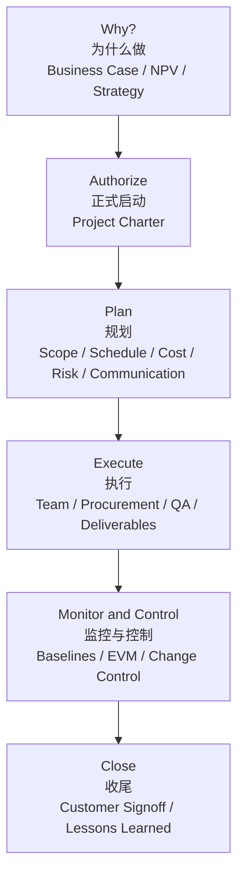
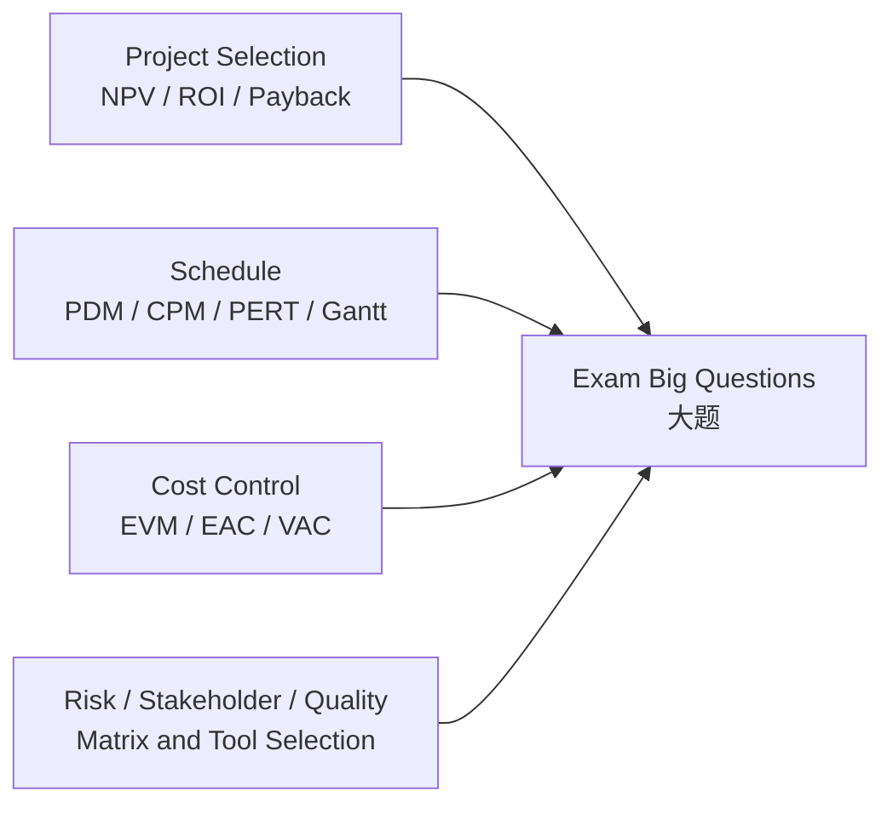

# 最后总复习：框架与高频词

这章不是第 12 讲，而是整门 ==Software Project Management / 软件项目管理== 的考前总地图。
This chapter is not Lecture 12; it is the final exam map for ==Software Project Management / 软件项目管理==.

你要带走的不是零散术语，而是一条主线：==怎样把一个软件/IT 项目从商业想法，管理到可验收交付，并在过程中控制范围、时间、成本、质量、风险和人==。
What you should take away is not scattered terms, but one main thread: ==how to manage a software/IT project from a business idea to accepted delivery while controlling scope, time, cost, quality, risk, and people==.

## 1. 这门课一句话

软件项目管理学的是：==不是怎么写代码，而是怎么让软件项目被正确选择、正式启动、合理计划、有效执行、持续控制、最终收尾==。
Software Project Management studies: ==not how to code, but how software projects are selected, initiated, planned, executed, controlled, and closed==.

代码只是交付物的一部分。
Code is only part of the deliverable.

这门课真正关注的是项目目标、资源、约束、风险、沟通、干系人、合同和质量。
The real focus is project objectives, resources, constraints, risks, communication, stakeholders, contracts, and quality.

## 2. 自上到下的大框架

第一层问题是 ==Why should we do this project?==。
The first-level question is ==Why should we do this project?==.

所以 Lecture 2 学 Business Case、NPV、ROI、Payback 和 Weighted Scoring Model。
That is why Lecture 2 covers Business Case, NPV, ROI, Payback, and Weighted Scoring Model.

第二层问题是 ==Who authorises it and what is the high-level direction?==。
The second-level question is ==Who authorises it and what is the high-level direction?==.

所以要有 Project Charter、Sponsor、Project Manager 和 Stakeholder Register。
That is why we need the Project Charter, Sponsor, Project Manager, and Stakeholder Register.

第三层问题是 ==How will we do it?==。
The third-level question is ==How will we do it?==.

所以要做 PMP、Scope Baseline、Schedule Baseline、Cost Baseline、Risk Plan、Communication Plan。
That is why we create the PMP, Scope Baseline, Schedule Baseline, Cost Baseline, Risk Plan, and Communication Plan.

第四层问题是 ==Are we still on track?==。
The fourth-level question is ==Are we still on track?==.

所以要用 EVM、status/progress reports、risk monitoring、change control 和 CCB。
That is why we use EVM, status/progress reports, risk monitoring, change control, and the CCB.

第五层问题是 ==Can we formally finish and learn?==。
The fifth-level question is ==Can we formally finish and learn?==.

所以收尾要 Customer Signoff、Product Transition、Contract Closure、Lessons Learned。
That is why closure needs Customer Signoff, Product Transition, Contract Closure, and Lessons Learned.

## 3. 五大过程组是骨架

==Process Groups / 过程组== 是整门课最重要的骨架。
==Process Groups== are the most important skeleton of the course.

| Process Group | 中文 | 它解决的问题 | 代表输出 |
| --- | --- | --- | --- |
| Initiating | 启动 | 是否正式开始？谁授权？ | Project Charter, Stakeholder Register |
| Planning | 规划 | 怎么做？基准是什么？ | Project Management Plan, baselines |
| Executing | 执行 | 按计划产出交付物 | Deliverables, work performance information |
| Monitoring and Controlling | 监控与控制 | 实际和计划是否偏离？ | Change requests, performance reports |
| Closing | 收尾 | 是否正式验收和结束？ | Customer signoff, completion report, lessons learned |

Monitoring and Controlling 不是最后一个普通阶段，而是贯穿项目。
Monitoring and Controlling is not a normal final phase; it runs throughout the project.

## 4. 十大知识领域是内容

过程组告诉你“项目管理工作何时发生”。
Process Groups tell you “when project-management work happens.”

知识领域告诉你“项目经理具体管什么”。
Knowledge Areas tell you “what the project manager manages.”

| Knowledge Area | 中文 | 本课核心 |
| --- | --- | --- |
| Integration Management | 整合管理 | Charter, PMP, Change Control, CCB |
| Scope Management | 范围管理 | Requirements, Scope Statement, WBS, Scope Creep |
| Schedule / Time Management | 进度管理 | Activity List, PDM, Gantt, CPM, PERT |
| Cost Management | 成本管理 | Estimates, Budget, Cost Baseline, EVM |
| Quality Management | 质量管理 | QA, QC, Testing, quality tools |
| Resource / HR Management | 资源/人力管理 | RACI, Tuckman, motivation, conflict |
| Communications Management | 沟通管理 | Communication Plan, channels, reports |
| Risk Management | 风险管理 | Risk Register, Matrix, EMV, responses |
| Procurement Management | 采购管理 | Make-or-Buy, contracts, RFP/RFQ |
| Stakeholder Management | 干系人管理 | Stakeholder Register, engagement, Power-Interest Grid |

这门课不是按知识领域孤立背，而是把它们都整合进一个项目生命周期。
Do not memorise knowledge areas in isolation; integrate them into one project life cycle.

## 5. 11 讲到底学了什么

| Lecture | 中文主题 | 这讲真正学到什么 |
| --- | --- | --- |
| Lecture 1 | 项目与项目管理 | 什么是 project，为什么需要 PM，PLC/SDLC/过程组 |
| Lecture 2 | 整合、选择、启动 | 项目为什么值得做，如何 charter，如何控制变更 |
| Lecture 3 | 范围管理 | 如何把需求变成 scope baseline 和 WBS |
| Lecture 4 | 进度 Part 1 | 如何从 WBS 变成活动、依赖、PDM、Gantt |
| Lecture 5 | 进度 Part 2 | 如何算 critical path、slack、PERT |
| Lecture 6 | 成本管理 | 如何估算、预算、形成 cost baseline，用 EVM 控制 |
| Lecture 7 | 风险管理 | 如何识别、分析、应对、监控 risk |
| Lecture 8 | HR、干系人与沟通 | 如何管人、责任、冲突、沟通和 stakeholder |
| Lecture 9 | 采购与质量 | 如何外包/签合同，如何 QA/QC 和质量改进 |
| Lecture 10 | Agile 与博弈视角 | Waterfall vs Agile，Scrum，战略互动 |
| Lecture 11 | 执行、收尾、总复习 | 执行和收尾怎么做，考试地图是什么 |

## 6. 怎么用本站复习

建议先用本章建立全局框架，再按薄弱点跳转。
Use this chapter to build the global framework first, then jump to weak areas.

1. 先看本章：把 ==Process Groups==、==Knowledge Areas==、高频词和公式连成一张地图。
1. Start with this chapter: connect ==Process Groups==, ==Knowledge Areas==, high-frequency terms, and formulas into one map.

2. 大题和课后题去 [课后题与样题：过程与答案](chapter:pm-exercises)，重点看题目、过程、答案三件事。
2. For big questions and after-class questions, go to [Exercises and Sample Questions](chapter:pm-exercises), focusing on prompt, process, and answer.

3. 画图题去 [画图大章：高频图表专项](chapter:pm-drawing)，重点练 WBS、Network/CPM/PERT/Gantt、EVM、风险矩阵和干系人矩阵。
3. For diagram questions, go to [High-Frequency Diagrams](chapter:pm-drawing), focusing on WBS, Network/CPM/PERT/Gantt, EVM, risk matrix, and stakeholder matrix.

4. 概念不稳再回具体讲义：[Lecture 2](chapter:pm-l02) 看项目选择与启动，[Lecture 3](chapter:pm-l03) 看 WBS，[Lecture 4](chapter:pm-l04) 和 [Lecture 5](chapter:pm-l05) 看进度计算，[Lecture 6](chapter:pm-l06) 看 EVM，[Lecture 7](chapter:pm-l07) 看风险，[Lecture 8](chapter:pm-l08) 看人和沟通，[Lecture 9](chapter:pm-l09) 看采购与质量，[Lecture 10](chapter:pm-l10) 看 Agile。
4. If concepts are weak, return to specific lectures: [Lecture 2](chapter:pm-l02) for selection and initiation, [Lecture 3](chapter:pm-l03) for WBS, [Lecture 4](chapter:pm-l04) and [Lecture 5](chapter:pm-l05) for schedule calculation, [Lecture 6](chapter:pm-l06) for EVM, [Lecture 7](chapter:pm-l07) for risk, [Lecture 8](chapter:pm-l08) for people and communication, [Lecture 9](chapter:pm-l09) for procurement and quality, and [Lecture 10](chapter:pm-l10) for Agile.

## 7. 三类大题地图

Lecture 11 明确暗示，最大头是分析和计算。
Lecture 11 clearly indicates that analysis and calculation are the biggest part.

NPV 题看项目值不值得做。
NPV questions ask whether the project is worth doing.

CPM/PERT 题看项目什么时候能完成。
CPM/PERT questions ask when the project can finish.

EVM 题看项目现在是否超支或落后，以及未来可能花多少钱。
EVM questions ask whether the project is over budget or behind schedule, and how much it may cost at completion.

风险/干系人/质量题看你会不会选工具和解释管理策略。
Risk/stakeholder/quality questions ask whether you can select tools and explain management strategies.

## 8. 必须掌握的高频英文词汇

下面这些词不是“看懂就行”，而是考试中必须能用英文识别、用中文解释、在题目里判断。
The following terms are not just “recognise only”; you must identify them in English, explain them in Chinese, and apply them in questions.

### A. Core Framework

| English | 中文 | 必须掌握的意思 |
| --- | --- | --- |
| Project | 项目 | 临时性工作，创造独特产品/服务/结果 |
| Project Management | 项目管理 | 用知识、技能、工具和技术满足项目要求 |
| Project Manager | 项目经理 | 整合资源、沟通协调、控制变更、推动交付 |
| Stakeholder | 干系人 | 影响项目、被项目影响或认为自己被影响的人/组织 |
| Deliverable | 交付物 | 可验证的产品、结果或服务能力 |
| Milestone | 里程碑 | 无持续时间的重要事件或节点 |
| Project Life Cycle | 项目生命周期 | 项目从开始到结束的阶段 |
| SDLC | 软件开发生命周期 | 软件产品如何被分析、设计、开发、测试、交付 |
| Process Groups | 过程组 | 启动、规划、执行、监控与控制、收尾 |
| Knowledge Areas | 知识领域 | 项目经理要管理的内容领域 |

### B. Integration and Selection

| English | 中文 | 必须掌握的意思 |
| --- | --- | --- |
| Business Case | 商业论证 | 说明项目为什么值得做 |
| Project Charter | 项目章程 | 正式承认项目并授权项目经理 |
| Sponsor | 项目赞助人 | 提供资源、支持和高层授权的人 |
| NPV / Net Present Value | 净现值 | 折现收益减折现成本 |
| ROI / Return on Investment | 投资回报率 | NPV / total discounted costs |
| Payback Period | 回收期 | 收回投资所需时间 |
| Weighted Scoring Model | 加权评分模型 | 用多个标准和权重选择项目 |
| Project Management Plan / PMP | 项目管理计划 | 整合所有子计划和基准 |
| Baseline | 基准 | 已批准的范围/进度/成本计划，用于比较实际表现 |
| Change Request | 变更请求 | 对范围、时间、成本等进行修改的正式请求 |
| Change Control Board / CCB | 变更控制委员会 | 审批或拒绝重要变更 |
| Integrated Change Control | 整合变更控制 | 统一审查和管理项目变更 |

### C. Scope

| English | 中文 | 必须掌握的意思 |
| --- | --- | --- |
| Requirement | 需求 | 干系人需要产品具备的条件或能力 |
| Requirement Specification | 需求规格说明 | 清楚、可验证地记录需求 |
| Requirement Traceability Matrix / RTM | 需求追踪矩阵 | 把需求和来源、设计、测试、验收联系起来 |
| Scope Statement | 范围说明书 | 说明 in scope、out of scope、交付物、约束和验收标准 |
| WBS / Work Breakdown Structure | 工作分解结构 | 面向交付物的层级分解 |
| Work Package | 工作包 | WBS 最底层，可估算、排期、分配和控制 |
| WBS Dictionary | WBS 字典 | 解释每个 WBS item 的详细信息 |
| 100% Rule | 100% 规则 | 子项总和必须覆盖父项全部工作 |
| Scope Baseline | 范围基准 | Scope Statement + WBS + WBS Dictionary |
| Scope Creep | 范围蔓延 | 未经控制的范围扩大 |
| Validate Scope | 验证范围 | 客户/干系人正式接受交付物 |
| Control Scope | 控制范围 | 监控范围并管理范围变更 |

### D. Schedule

| English | 中文 | 必须掌握的意思 |
| --- | --- | --- |
| Activity List | 活动清单 | 可排期的具体工作活动 |
| Dependency | 依赖关系 | 活动之间的逻辑先后关系 |
| Lead | 提前量 | 后续活动可以提前开始 |
| Lag | 滞后量 | 后续活动必须等待一段时间 |
| PDM / Precedence Diagramming Method | 前导图法 | 节点表示活动，箭头表示依赖 |
| Network Diagram | 网络图 | 展示活动顺序和依赖 |
| Gantt Chart | 甘特图 | 把活动放到时间轴上 |
| Critical Path | 关键路径 | 决定项目最早完成时间的最长路径 |
| ES / Earliest Start | 最早开始 | 活动最早能开始的时间 |
| EF / Earliest Finish | 最早完成 | 活动最早能完成的时间 |
| LS / Latest Start | 最晚开始 | 不延误项目时最晚能开始 |
| LF / Latest Finish | 最晚完成 | 不延误项目时最晚能完成 |
| Slack / Float | 浮动时间 | 活动可延误而不影响项目完成的时间 |
| Forward Pass | 正推 | 从左到右算 ES/EF |
| Backward Pass | 逆推 | 从右到左算 LS/LF |
| PERT | 计划评审技术 | 用 O、M、P 三点估算期望工期 |
| Crashing | 赶工 | 增加资源缩短工期，通常增加成本 |
| Fast Tracking | 快速跟进 | 并行原本顺序活动，通常增加返工风险 |

### E. Cost and EVM

| English | 中文 | 必须掌握的意思 |
| --- | --- | --- |
| Fixed Cost | 固定成本 | 基本不随工作量变化 |
| Variable Cost | 可变成本 | 随工作量、工时或材料变化 |
| Direct Cost | 直接成本 | 可直接归属于项目或交付物 |
| Indirect Cost | 间接成本 | 不能直接归属于单个交付物 |
| Sunk Cost | 沉没成本 | 已花掉且无法收回的钱 |
| Contingency Reserve | 应急储备 | 用于 known unknowns |
| Management Reserve | 管理储备 | 用于 unknown unknowns |
| Cost Baseline | 成本基准 | 已批准、按时间分布的预算，通常不含管理储备 |
| BAC / Budget at Completion | 完工预算 | 项目总预算 |
| PV / Planned Value | 计划价值 | 按计划应完成工作的预算价值 |
| EV / Earned Value | 挣值 | 实际已完成工作的预算价值 |
| AC / Actual Cost | 实际成本 | 实际花费 |
| CV / Cost Variance | 成本偏差 | EV - AC |
| SV / Schedule Variance | 进度偏差 | EV - PV |
| CPI / Cost Performance Index | 成本绩效指数 | EV / AC |
| SPI / Schedule Performance Index | 进度绩效指数 | EV / PV |
| EAC / Estimate at Completion | 完工估算 | 预计最终总成本 |
| VAC / Variance at Completion | 完工偏差 | BAC - EAC |

### F. Risk

| English | 中文 | 必须掌握的意思 |
| --- | --- | --- |
| Risk | 风险 | 会影响目标的不确定事件或条件 |
| Threat | 威胁 | 负面风险 |
| Opportunity | 机会 | 正面风险 |
| Risk Register | 风险登记册 | 记录风险、owner、trigger、response 等 |
| Risk Owner | 风险责任人 | 负责跟踪和应对某风险的人 |
| Trigger | 触发器/征兆 | 风险将发生或已发生的信号 |
| Probability | 概率 | 风险发生可能性 |
| Impact | 影响 | 风险发生后的影响程度 |
| Probability-Impact Matrix | 概率-影响矩阵 | 用概率和影响排序风险 |
| Qualitative Risk Analysis | 定性风险分析 | 用概率/影响等排序优先级 |
| Quantitative Risk Analysis | 定量风险分析 | 用金额、概率、日期等数值分析 |
| Decision Tree | 决策树 | 在不确定结果下比较决策 |
| EMV / Expected Monetary Value | 期望货币价值 | Probability × Monetary Outcome |
| Monte Carlo Simulation | 蒙特卡洛模拟 | 多次随机模拟得到结果分布 |
| Sensitivity Analysis | 敏感性分析 | 看变量变化如何影响结果 |
| Avoid | 规避 | 消除威胁 |
| Mitigate | 减轻 | 降低威胁概率或影响 |
| Transfer | 转移 | 把风险责任转给第三方 |
| Accept | 接受 | 接受风险存在 |
| Exploit | 开拓 | 确保机会发生 |
| Enhance | 增强 | 提高机会概率或收益 |
| Share | 分享 | 与更有能力一方共同实现机会 |
| Contingency Plan | 应急计划 | 风险发生时执行的预案 |
| Fallback Plan | 后备计划 | 应急计划不足时的第二方案 |
| Residual Risk | 残余风险 | 应对后仍残留的风险 |
| Secondary Risk | 次生风险 | 应对措施产生的新风险 |

### G. People, Stakeholders, Communication

| English | 中文 | 必须掌握的意思 |
| --- | --- | --- |
| OBS / Organisational Breakdown Structure | 组织分解结构 | 谁来做工作 |
| RAM / Responsibility Assignment Matrix | 责任分配矩阵 | 把 WBS 工作和人员对应 |
| RACI | 责任矩阵 | Responsible, Accountable, Consulted, Informed |
| Resource Histogram | 资源直方图 | 展示资源需求随时间变化 |
| Resource Loading | 资源负载 | 资源被安排工作的强度 |
| Overallocation | 过度分配 | 资源被安排超过可用能力 |
| Resource Leveling | 资源平衡 | 调整任务缓解资源冲突 |
| Tuckman Model | 塔克曼团队发展模型 | Forming, Storming, Norming, Performing, Adjourning |
| Conflict Management | 冲突管理 | Confrontation, Collaboration, Compromise 等 |
| Communication Plan | 沟通计划 | 谁需要什么信息、何时、如何传递 |
| Communication Channels | 沟通渠道数 | n(n - 1) / 2 |
| Encode | 编码 | 把想法转成信息 |
| Decode | 解码 | 接收方解释信息 |
| Noise | 噪音 | 干扰理解的因素 |
| Feedback | 反馈 | 接收方回应 |
| Status Report | 状态报告 | 看现在状态 |
| Progress Report | 进度报告 | 看过去一段时间完成了什么 |
| Forecast | 预测报告 | 看未来可能怎样 |
| Power-Interest Grid | 权力-兴趣矩阵 | 用权力和兴趣决定干系人管理策略 |
| Manage Closely | 重点管理 | 高权力高兴趣 |
| Keep Satisfied | 保持满意 | 高权力低兴趣 |
| Keep Informed | 持续告知 | 低权力高兴趣 |
| Monitor | 监控 | 低权力低兴趣 |

### H. Procurement, Quality, Agile

| English | 中文 | 必须掌握的意思 |
| --- | --- | --- |
| Procurement | 采购 | 从组织外部获取产品或服务 |
| Outsourcing | 外包 | 把内部可能做的工作交给外部 |
| Make-or-Buy Analysis | 自制或外购分析 | 比较内部做和外部买 |
| Fixed Price Contract | 固定总价合同 | 范围清楚时使用，买方风险低 |
| Cost Reimbursable Contract | 成本补偿合同 | 买方支付允许成本和费用 |
| Time and Materials / T&M | 工料合同 | 固定价和成本补偿的混合 |
| SOW / Statement of Work | 工作说明书 | 说明采购工作内容 |
| RFP / Request for Proposal | 建议书请求 | 需要供应商提交方案 |
| RFQ / Request for Quote | 报价请求 | 规格清楚，主要要报价 |
| Quality Assurance / QA | 质量保证 | 关注过程，预防和改进 |
| Quality Control / QC | 质量控制 | 关注交付物检查和缺陷 |
| Benchmarking | 标杆对比 | 和其他项目/产品比较 |
| Quality Audit | 质量审计 | 审查质量管理活动 |
| Pareto Chart | 帕累托图 | 找最多/最重要的问题类别 |
| Fishbone Diagram | 鱼骨图 | 找问题原因 |
| Control Chart | 控制图 | 看过程是否稳定 |
| Check Sheet | 检查表 | 记录缺陷频次 |
| Six Sigma | 六西格玛 | 每百万机会不超过 3.4 缺陷 |
| DMAIC | 定义-测量-分析-改进-控制 | Six Sigma 改进流程 |
| Waterfall | 瀑布模型 | 线性、前期规划重 |
| Agile | 敏捷 | 迭代、增量、频繁反馈 |
| Scrum | 敏捷框架 | roles, artifacts, events |
| Product Backlog | 产品待办列表 | 全产品优先级列表 |
| Sprint Backlog | Sprint 待办列表 | 当前迭代要做的工作 |
| Burndown Chart | 燃尽图 | 剩余工作随时间下降 |
| Velocity Chart | 速度图 | 每轮迭代完成工作量 |
| Product Owner | 产品负责人 | 管理价值和 backlog 优先级 |
| Scrum Master | Scrum 促进者 | 移除障碍，保护 Scrum 流程 |

## 9. 必背公式

| Formula | 中文用途 |
| --- | --- |
| PV = Future Amount / (1 + r)^n | 折现到现值 |
| NPV = total discounted benefits - total discounted costs | 判断项目财务价值 |
| ROI = NPV / total discounted costs | 投资回报率 |
| Communication Channels = n(n - 1) / 2 | 沟通渠道数 |
| TE = (O + 4M + P) / 6 | PERT 期望工期 |
| EF = ES + Duration | 正推最早完成 |
| LS = LF - Duration | 逆推最晚开始 |
| Slack = LS - ES = LF - EF | 浮动时间 |
| CV = EV - AC | 成本偏差 |
| SV = EV - PV | 进度偏差 |
| CPI = EV / AC | 成本效率 |
| SPI = EV / PV | 进度效率 |
| EAC = BAC / CPI | 完工估算常用公式 |
| VAC = BAC - EAC | 完工偏差 |
| EMV = Probability × Monetary Outcome | 期望货币价值 |

## 10. 考试答题总套路

如果题目问 ==project selection==，先想 Business Case、NPV、ROI、Payback、Weighted Scoring。
If the question asks ==project selection==, think Business Case, NPV, ROI, Payback, and Weighted Scoring.

如果题目问 ==what work is included==，先想 Scope Statement、WBS、Scope Baseline、Scope Creep。
If the question asks ==what work is included==, think Scope Statement, WBS, Scope Baseline, and Scope Creep.

如果题目问 ==when will it finish==，先想 Activity List、PDM、Critical Path、PERT、Gantt。
If the question asks ==when it will finish==, think Activity List, PDM, Critical Path, PERT, and Gantt.

如果题目问 ==are we over budget or behind schedule==，先想 EVM。
If the question asks ==whether we are over budget or behind schedule==, think EVM.

如果题目问 ==what could go wrong or better==，先想 Risk Register、Matrix、EMV、Risk Response。
If the question asks ==what could go wrong or better==, think Risk Register, Matrix, EMV, and Risk Response.

如果题目问 ==who should know or do what==，先想 RACI、Stakeholder Register、Communication Plan。
If the question asks ==who should know or do what==, think RACI, Stakeholder Register, and Communication Plan.

如果题目问 ==buy from outside or contract==，先想 Make-or-Buy、SOW、RFP/RFQ、Contract Type。
If the question asks ==buy from outside or contract==, think Make-or-Buy, SOW, RFP/RFQ, and Contract Type.

如果题目问 ==quality issue==，先判断是 QA、QC、Testing、Pareto、Fishbone、Control Chart。
If the question asks ==quality issue==, identify QA, QC, Testing, Pareto, Fishbone, or Control Chart.

## 11. 最后自测

### 题 1：这门课到底学什么？

用一句话解释 Software Project Management 学的是什么。
Explain in one sentence what Software Project Management studies.

答案：它学的是如何把软件/IT 项目从商业想法管理到正式交付，并在过程中控制范围、进度、成本、质量、风险、采购、沟通、团队和干系人。
Answer: It studies how to manage a software/IT project from business idea to formal delivery while controlling scope, schedule, cost, quality, risk, procurement, communication, team, and stakeholders.

### 题 2：WBS、Gantt、Network、RACI 区别

这四个分别回答什么问题？
What question does each answer?

答案：WBS 回答做什么；Gantt 回答什么时候做；Network 回答谁先谁后；RACI 回答谁负责、谁审批、谁咨询、谁知会。
Answer: WBS answers what work is done; Gantt answers when it is done; Network answers what comes before what; RACI answers who is Responsible, Accountable, Consulted, and Informed.

### 题 3：EVM 三个核心数

PV、EV、AC 分别看什么？
What do PV, EV, and AC each look at?

答案：PV 看计划，EV 看实际完成的预算价值，AC 看实际花费。
Answer: PV looks at the plan, EV looks at the budgeted value of completed work, and AC looks at actual spending.

### 题 4：风险应对

买保险属于 Avoid、Mitigate、Transfer、Accept 哪个？
Is buying insurance Avoid, Mitigate, Transfer, or Accept?

答案：Transfer，因为把财务风险转移给保险公司。
Answer: Transfer, because financial risk is shifted to the insurance company.

### 题 5：Agile 误区

Agile 是否等于没有计划、没有文档？
Does Agile mean no planning and no documentation?

答案：不是。Agile 是更重视 working software、customer collaboration、responding to change，但仍然需要 backlog、planning、review、quality control 和必要文档。
Answer: No. Agile values working software, customer collaboration, and responding to change more, but it still needs backlog, planning, review, quality control, and necessary documentation.
