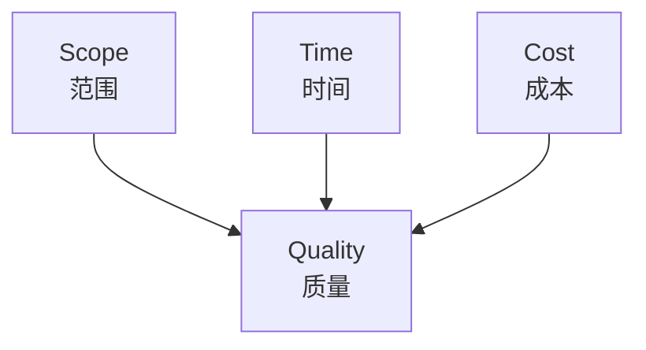
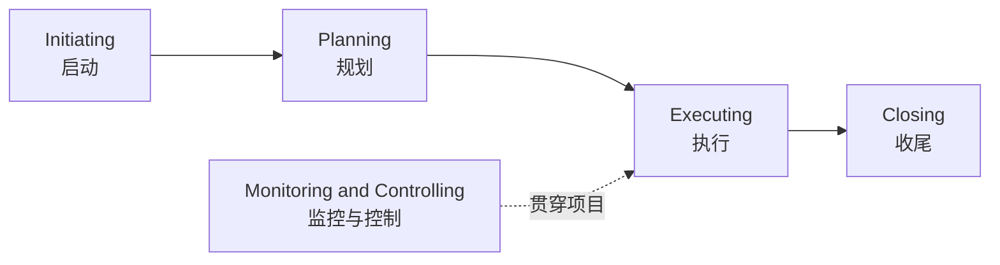

# Lecture 1：项目与项目管理

这一讲是整门课的地基：先分清什么是项目，什么是日常运营，再把项目成功、三重约束、干系人、项目经理角色、知识领域、生命周期和过程组串起来。
This lecture is the foundation of the unit: distinguish projects from operations, then connect project success, triple constraints, stakeholders, the project manager role, knowledge areas, life cycles, and process groups.

## 1. Project 的定义

==Project== 是为了创造独特产品、服务或结果而进行的临时性工作。
A ==Project== is a temporary endeavour undertaken to create a unique product, service, or result.

这里有两个关键词：==temporary== 和 ==unique==。
There are two keywords: ==temporary== and ==unique==.

Temporary 不表示项目时间很短，而表示项目有明确开始和结束。
Temporary does not mean the project is short; it means the project has a defined start and finish.

Unique 表示项目产出不是完全重复的日常运营结果。
Unique means the project output is not a fully repetitive operational result.

| 对比 | Project Activity | Normal Operation |
| --- | --- | --- |
| 时间 | 有开始和结束 | 持续进行 |
| 产出 | 独特 | 重复、标准化 |
| 风险 | 较高、不确定 | 较熟悉、可预测 |
| 管理重点 | Project Management | Process / Operations Management |

例如开发一个校园二手书网站是项目，因为它有启动、规划、开发、测试、上线和收尾。
For example, developing a Campus UsedBooks Website is a project because it has initiation, planning, development, testing, deployment, and closure.

而每天维护已经上线的网站、处理常规客服和日常服务器巡检，更接近日常运营。
Daily maintenance of an already deployed website, routine customer support, and regular server checks are closer to normal operations.

## 2. Project Success 与 Failure

传统成功标准是按承诺交付范围、按时完成、控制在预算内。
The traditional success criteria are delivering the promised scope, finishing on time, and staying within budget.

更有效的成功衡量还要看客户是否满意。
A more effective success measure also asks whether the customer is satisfied.

项目失败常见原因包括超预算、进度落后、外包问题和质量问题。
Common reasons for project failure include budget overrun, schedule delay, outsourcing problems, and quality problems.

课件列出的成功因素要当成简答题素材。
The success factors listed in the slides should be treated as short-answer material.

| 成功因素 | 考试解释 |
| --- | --- |
| Executive support | 高层支持能提供资源、优先级和组织背书 |
| User involvement | 用户参与能减少需求误解 |
| Experienced managers | 有经验的经理更能识别风险和协调冲突 |
| Clear business objectives | 商业目标清楚，项目才不容易偏航 |
| Minimized scope | 范围越可控，越容易按时按预算交付 |
| Reliable estimates | 可靠估算支撑进度和成本计划 |
| Proper planning | 计划让范围、时间、成本、质量、风险有基准 |

## 3. Triple Constraints

==Triple Constraints== 指项目中的范围、时间、成本之间互相制约，同时影响质量。
==Triple Constraints== refer to the interdependence among scope, time, and cost, which together affect quality.

如果客户想增加很多功能，但预算和截止日期不变，质量风险就会上升。
If the client adds many features while budget and deadline remain unchanged, quality risk increases.

如果截止日期固定，通常需要减少范围、增加资源，或接受质量/风险代价。
If the deadline is fixed, the team usually needs to reduce scope, add resources, or accept quality/risk trade-offs.

考试回答约束题时不要只说“加人”，还要说明加人会增加沟通成本和协调风险。
In exam answers, do not only say “add people”; explain that adding people may increase communication cost and coordination risk.

## 4. Project Management 的定义

==Project Management== 是把知识、技能、工具和技术应用到项目活动中，以满足项目要求。
==Project Management== is the application of knowledge, skills, tools, and techniques to project activities to meet project requirements.

它不是单纯写代码，也不是单纯做计划表。
It is not merely coding, and it is not merely making a schedule.

它的作用是提高项目成功概率、平衡约束、识别失败项目并及时恢复或终止。
Its role is to improve the likelihood of success, balance constraints, identify failing projects, and recover or terminate them in time.

在组织层面，项目管理还能优化资源使用，让组织更有效竞争。
At the organisational level, project management also optimises resource use and helps the organisation compete more effectively.

## 5. Stakeholders 与 Project Manager

==Stakeholders== 是会影响项目、被项目影响，或认为自己会被项目影响的人或组织。
==Stakeholders== are people or organisations that affect the project, are affected by it, or perceive themselves to be affected.

典型干系人包括客户、用户、项目赞助人、项目经理、团队成员、供应商、监管方和组织高层。
Typical stakeholders include customers, users, sponsors, project managers, team members, suppliers, regulators, and senior management.

项目经理不是“最大的程序员”，而是整合资源、协调人员、控制变化、沟通信息和推进目标的人。
The project manager is not “the biggest programmer”; they integrate resources, coordinate people, control changes, communicate information, and drive objectives.

项目经理需要三类能力：项目管理知识、业务/行业知识、领导与沟通能力。
The project manager needs three types of expertise: project-management knowledge, business/industry knowledge, and leadership/communication ability.

## 6. Project、Program、Portfolio

==Project== 是单个临时工作。
A ==Project== is one temporary endeavour.

==Program== 是一组相互关联、需要协调管理的项目。
A ==Program== is a group of related projects managed in a coordinated way.

==Portfolio== 是为了实现战略目标而组合管理的项目、项目集和其他工作。
A ==Portfolio== is a collection of projects, programs, and other work managed to achieve strategic objectives.

| 层级 | 关注点 | 例子 |
| --- | --- | --- |
| Project | 交付一个具体结果 | 开发二手书交易网站 |
| Program | 协调多个相关项目 | 校园数字服务升级计划 |
| Portfolio | 选择和排序投资组合 | 大学 IT 战略项目组合 |

## 7. Life Cycle、SDLC 与 Process Groups

==Project Life Cycle== 回答项目从开始到结束经历哪些阶段。
==Project Life Cycle== answers what phases the project goes through from start to finish.

==SDLC== 回答软件产品如何被分析、设计、开发、测试和交付。
==SDLC== answers how the software product is analysed, designed, developed, tested, and delivered.

==Project Management Process Groups== 回答项目经理在项目中做哪些管理工作。
==Project Management Process Groups== answer what management work the project manager performs.

这三个概念极容易混，详细图和对比见 [画图大章：高频图表专项](chapter:pm-drawing)。
These three concepts are easily confused; see [Drawing Chapter: High-Frequency Diagrams](chapter:pm-drawing) for detailed diagrams and comparison.

## 8. 五大过程组

五大过程组是 Initiating、Planning、Executing、Monitoring and Controlling、Closing。
The five process groups are Initiating, Planning, Executing, Monitoring and Controlling, and Closing.

Initiating 的代表输出是 Approved Project Charter。
The representative output of Initiating is the Approved Project Charter.

Planning 的代表输出是 Approved Project Management Plan。
The representative output of Planning is the Approved Project Management Plan.

Executing 负责完成计划中的工作并产生交付物。
Executing performs the planned work and produces deliverables.

Monitoring and Controlling 比较实际表现与基准，并提出纠偏或变更。
Monitoring and Controlling compares actual performance with baselines and proposes corrective actions or changes.

Closing 完成验收、交接和经验教训总结。
Closing completes acceptance, transition, and lessons learned.

## 9. 十大知识领域

Lecture 1 把你带入项目管理知识框架，后面每讲基本对应一个或多个知识领域。
Lecture 1 introduces the project-management knowledge framework; later lectures mostly correspond to one or more knowledge areas.

| 知识领域 | 后续重点 |
| --- | --- |
| Integration | 项目章程、项目管理计划、变更控制 |
| Scope | 需求、范围说明书、WBS、范围控制 |
| Schedule / Time | 活动、依赖、网络图、关键路径、PERT、甘特图 |
| Cost | 成本估算、预算、EVM |
| Quality | QA、QC、质量工具 |
| Resource / HR | 团队、RACI、资源负载、冲突管理 |
| Communications | 沟通计划、报告、渠道 |
| Risk | 风险识别、矩阵、EMV、应对 |
| Procurement | 外包、合同、供应商选择 |
| Stakeholder | 干系人识别、参与和管理策略 |

## 10. 考试抓手

如果题目问“这个是不是项目”，你必须检查 temporary 和 unique。
If the question asks whether something is a project, check temporary and unique.

如果题目问“项目为什么失败”，优先从范围、时间、成本、质量、用户参与、估算和高层支持回答。
If the question asks why a project failed, answer using scope, time, cost, quality, user involvement, estimates, and executive support.

如果题目问“项目经理做什么”，不要写成技术负责人，要写成整合、沟通、协调、控制和交付。
If the question asks what a project manager does, do not write only technical leadership; write integration, communication, coordination, control, and delivery.

## 11. 自测题

### 题 1：项目 vs 运营

每天处理网站客服工单是不是项目？开发一个新的客服工单系统是不是项目？为什么？
Is handling website support tickets every day a project? Is developing a new support-ticket system a project? Why?

答案：每天处理工单更像运营，因为它重复、持续；开发新系统是项目，因为它临时且产出独特结果。
Answer: handling tickets every day is more like operations because it is repetitive and ongoing; developing a new system is a project because it is temporary and creates a unique result.

### 题 2：三重约束

客户要求增加功能，但截止日期和预算不变，会发生什么管理问题？
The client asks for more features while deadline and budget remain unchanged. What management issue occurs?

答案：范围增加会挤压时间和成本，并提高质量风险；项目经理应进行范围评估、变更控制和优先级协商。
Answer: increased scope pressures time and cost and raises quality risk; the project manager should assess scope, use change control, and negotiate priorities.

### 题 3：过程组

Monitoring and Controlling 是不是 Executing 后面的一个阶段？
Is Monitoring and Controlling a phase after Executing?

答案：不是。它贯穿项目，用于比较实际与计划、控制范围/进度/成本/风险并处理变更。
Answer: no. It runs throughout the project to compare actuals with plans, control scope/schedule/cost/risk, and handle changes.
