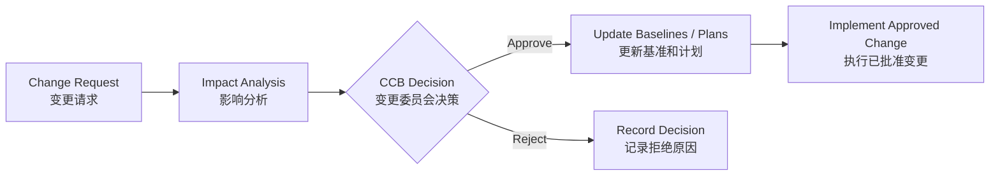

# Lecture 2：整合管理、项目选择与启动

这一讲把项目从“想法”推进到“正式授权”：先选择项目，再形成 Project Charter，然后进入 Project Management Plan、执行、监控、变更控制和收尾。
This lecture moves a project from an idea to formal authorisation: select the project, create the Project Charter, then connect to the Project Management Plan, execution, monitoring, change control, and closure.

## 1. Integration Management 是什么

==Project Integration Management== 的核心是协调所有知识领域，让项目作为一个整体运转。
==Project Integration Management== coordinates all knowledge areas so the project works as an integrated whole.

它不是软件模块之间的 technical integration。
It is not technical integration among software modules.

项目经理要把范围、时间、成本、质量、资源、沟通、风险、采购和干系人管理统一起来。
The project manager integrates scope, schedule, cost, quality, resources, communications, risk, procurement, and stakeholders.

| 过程组 | Integration Process | 主要输出 |
| --- | --- | --- |
| Initiating | Develop Project Charter | Project Charter |
| Planning | Develop Project Management Plan | Project Management Plan |
| Executing | Direct and Manage Project Work | Deliverables, Work Performance Information, Change Requests |
| Monitoring and Controlling | Monitor/Control Project Work; Integrated Change Control | Change Requests, Status Updates |
| Closing | Close Project/Phase | Product Transition, Closure Documents |

## 2. Project Initiation

启动项目的核心任务是识别干系人并制定项目章程。
The core tasks in initiation are identifying stakeholders and developing the project charter.

==Project Charter== 是正式承认项目存在、授权项目经理使用组织资源的文件。
The ==Project Charter== formally recognises the project and authorises the project manager to use organisational resources.

它通常在项目开始时创建，由关键干系人批准并签署。
It is usually created at the beginning of the project and approved/signed by key stakeholders.

Project Charter 常见内容包括项目目标、商业理由、高层范围、主要风险、里程碑预算、项目经理权限和关键干系人。
Typical Project Charter contents include objectives, business justification, high-level scope, major risks, milestone budget, project-manager authority, and key stakeholders.

## 3. Business Case

==Business Case== 是创建项目章程的重要依据。
The ==Business Case== is a key input for creating the Project Charter.

它说明为什么这个项目值得做，可能来自市场需求、组织需要、客户请求、技术机会或法规要求。
It explains why the project is worth doing and may come from market demand, organisational need, customer request, technology opportunity, or regulation.

Business Case 还会设定项目边界，防止“好像什么都想做”。
The Business Case also sets project boundaries so the project does not try to do everything.

## 4. 项目选择：NPV、ROI、Payback

Lecture 2 明确把财务分析作为项目选择方法：==NPV==、==ROI==、==Payback==。
Lecture 2 explicitly uses financial analysis for project selection: ==NPV==, ==ROI==, and ==Payback==.

==Present Value (PV)== 把未来的收益或成本折算成今天的钱。
==Present Value (PV)== converts future benefits or costs into today’s dollars.

==Discount Rate== 是折现率，用来表达未来的钱在今天价值更低。
==Discount Rate== is the rate used to reflect that future money is worth less today.

未来金额的现值公式是 PV = Future Amount / (1 + discount rate)^n。
The present value formula is PV = Future Amount / (1 + discount rate)^n.

==Net Present Value (NPV)== 是把所有折现后的收益和成本合并后的净值。
==Net Present Value (NPV)== is the net value after combining all discounted benefits and costs.

```text
NPV = total discounted benefits - total discounted costs
ROI = NPV / total discounted costs
```

| NPV 结果 | 含义 | 决策 |
| --- | --- | --- |
| NPV > 0 | 为组织增加价值 | 可以接受 |
| NPV < 0 | 为组织减少价值 | 通常拒绝 |
| NPV = 0 | 不增不减 | 看战略、风险等其他标准 |

==Payback Period== 是收回投资所需时间。
==Payback Period== is the time required to recover the investment.

Payback 越短，现金回收越快，但它不一定代表长期价值最高。
Shorter payback means faster cash recovery, but not necessarily the highest long-term value.

## 5. Lecture 2 原 PDF 例子：五年现金流

课件例子：项目初始投资 10000，每年产生 3000 现金流，持续 5 年。
Slide example: an initial investment of 10000 generates 3000 cash inflow annually for 5 years.

不折现时总现金流是 15000，看起来净收益为 5000。
Without discounting, total inflow is 15000, so the net benefit seems to be 5000.

但如果折现率很高，例如 20%，未来每年 3000 的现值会明显下降。
But if the discount rate is high, such as 20%, the present value of each future 3000 falls substantially.

考试启发：不能只看名义现金流，要看 discounted cash flow。
Exam lesson: do not only look at nominal cash flows; use discounted cash flows.

## 6. Weighted Scoring Model

==Weighted Scoring Model== 用多个标准系统选择项目。
The ==Weighted Scoring Model== systematically selects projects using multiple criteria.

步骤是：确定标准，给每个标准分配权重，给项目打分，分数乘权重后求和。
The steps are: identify criteria, assign weights, score each project, multiply scores by weights, and sum the weighted scores.

| 标准示例 | 权重 |
| --- | --- |
| Supports key business objectives | 25% |
| Strong internal sponsor | 15% |
| Strong customer support | 10% |
| One year or less implementation | 20% |
| Positive NPV | 30% |

这个模型适合把财务指标和战略因素一起考虑。
This model is useful when financial indicators and strategic factors must be considered together.

NPV 为负的项目不一定永远不能做；如果战略价值很高，也可能通过加权模型被考虑。
A project with negative NPV is not always impossible; if strategic value is high, it may still be considered through weighted scoring.

## 7. Organizational Structure

组织结构会影响项目经理权力、资源获取和沟通路线。
Organisational structure affects project-manager authority, resource access, and communication paths.

| 结构 | 特点 | 项目经理权力 |
| --- | --- | --- |
| Functional | 人员按职能部门归属 | 弱 |
| Projectized | 人员围绕项目组织 | 强 |
| Matrix | 职能和项目双重管理 | 弱/平衡/强不等 |

Functional 结构下成员主要听职能经理安排，项目经理协调难度较高。
In a functional structure, members mainly report to functional managers, so the project manager may find coordination harder.

Projectized 结构下项目经理更容易调配资源，但项目结束后人员归属可能需要处理。
In a projectized structure, the project manager can allocate resources more easily, but staff assignment after project closure must be handled.

Matrix 结构最容易考“一个人向两个老板汇报”的冲突。
Matrix structures often test the issue of one person reporting to two bosses.

## 8. Stakeholder Register

==Stakeholder Register== 是启动阶段的重要输出之一。
The ==Stakeholder Register== is an important output of initiation.

它记录干系人姓名、角色、联系方式、影响力、兴趣、需求、期望和管理策略。
It records stakeholder names, roles, contact information, influence, interest, needs, expectations, and management strategy.

干系人分析的图表可参考 [画图大章：高频图表专项](chapter:pm-drawing) 中的 Power-Interest Grid。
For stakeholder-analysis diagrams, see the Power-Interest Grid in [Drawing Chapter: High-Frequency Diagrams](chapter:pm-drawing).

## 9. Project Management Plan

==Project Management Plan (PMP)== 是所有子计划和基准的整合文件。
The ==Project Management Plan (PMP)== integrates subsidiary plans and baselines.

它不是只有一张甘特图。
It is not just a Gantt Chart.

PMP 可以包括 Scope Baseline、Schedule Baseline、Cost Baseline、质量计划、资源计划、沟通计划、风险计划、采购计划和干系人计划。
The PMP can include the Scope Baseline, Schedule Baseline, Cost Baseline, quality plan, resource plan, communication plan, risk plan, procurement plan, and stakeholder plan.

Scope Baseline 里有 WBS、WBS Dictionary 和范围说明。
The Scope Baseline includes the WBS, WBS Dictionary, and scope statement.

Schedule Baseline 里可以有 Gantt Chart 和 Network Diagram。
The Schedule Baseline can include a Gantt Chart and Network Diagram.

## 10. Integrated Change Control

项目计划不是不能改，而是不能随便改。
The project plan can change, but it must not change casually.

==Integrated Change Control== 是审查、批准、拒绝和管理变更请求的过程。
==Integrated Change Control== is the process of reviewing, approving, rejecting, and managing change requests.

==Change Control Board (CCB)== 负责评估和授权重要变更。
The ==Change Control Board (CCB)== evaluates and authorises significant changes.



考试易错点：没有批准的变更不能直接执行，即使客户口头说“很简单”。
Exam trap: an unapproved change must not be implemented directly, even if the customer says verbally that it is “simple.”

## 11. Version Control 与 Configuration

Lecture 2 还提到 change control 和 version control system 的关系。
Lecture 2 also mentions the relationship between change control and version control systems.

Version Control 记录文件、代码、配置项的版本，帮助团队知道“现在批准的是哪一版”。
Version control records versions of documents, code, and configuration items, helping the team know which version is approved.

Change Control 决定是否允许变更；Version Control 保证变更被正确记录。
Change control decides whether a change is allowed; version control ensures the change is recorded correctly.

## 12. 自测题

### 题 1：NPV

NPV > 0、NPV < 0、NPV = 0 分别表示什么？
What do NPV > 0, NPV < 0, and NPV = 0 mean?

答案：NPV > 0 表示增加价值，可考虑接受；NPV < 0 表示减少价值，通常拒绝；NPV = 0 表示财务上不增不减，需要看战略等其他因素。
Answer: NPV > 0 adds value and may be accepted; NPV < 0 subtracts value and is usually rejected; NPV = 0 is financially neutral and should be judged using other factors such as strategy.

### 题 2：Project Charter

Project Charter 最关键的作用是什么？
What is the key role of the Project Charter?

答案：正式承认项目存在，并授权项目经理使用组织资源。
Answer: it formally recognises the project and authorises the project manager to use organisational resources.

### 题 3：变更控制

客户临时要求增加功能，项目团队是否可以马上做？
If the customer suddenly asks for a new feature, can the team implement it immediately?

答案：不能。应提交 Change Request，分析对范围、时间、成本、质量和风险的影响，再由 CCB 或授权人批准。
Answer: no. A Change Request should be submitted, impacts on scope, time, cost, quality, and risk analysed, and then approved by the CCB or authorised person.
