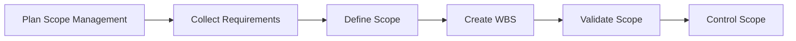
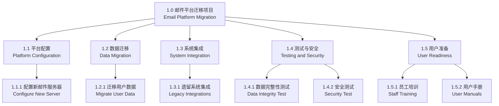

# Lecture 3：范围管理

这一讲回答“项目到底做什么、不做什么”。它从范围管理计划开始，经过需求收集、范围定义和 WBS，最后到范围验证与范围控制。
This lecture answers “what the project does and does not do.” It starts with scope planning, moves through requirements collection, scope definition and WBS, and ends with scope validation and control.

## 1. Scope Management 的主线

==Scope Management== 的目标是确保项目包含完成目标所需的全部工作，而且只包含这些工作。
==Scope Management== ensures the project includes all work required to complete the objectives, and only that work.

Plan Scope Management 规定如何定义范围、创建 WBS、验证交付物和控制范围变更。
Plan Scope Management defines how scope will be defined, WBS created, deliverables validated, and scope changes controlled.

Collect Requirements 收集并记录干系人的需求。
Collect Requirements gathers and documents stakeholder requirements.

Define Scope 把需求整理成明确的项目范围说明。
Define Scope turns requirements into a clear project scope statement.

Create WBS 把范围分解成可管理的交付物和工作包。
Create WBS decomposes scope into manageable deliverables and work packages.

Validate Scope 是获得客户或干系人对交付物的正式接受。
Validate Scope obtains formal acceptance of deliverables from the customer or stakeholders.

Control Scope 是监控范围状态并控制范围变更。
Control Scope monitors scope status and controls scope changes.

## 2. Scope Management Plan

==Scope Management Plan== 是 PMP 的子计划。
The ==Scope Management Plan== is a subsidiary plan of the PMP.

它说明项目团队将如何准备范围说明书、创建 WBS、维护 WBS Dictionary、验证完成的交付物以及处理范围变更。
It explains how the team will prepare the scope statement, create the WBS, maintain the WBS Dictionary, validate completed deliverables, and handle scope changes.

如果范围管理计划不清楚，后面很容易出现 scope creep。
If the scope management plan is unclear, scope creep becomes likely.

## 3. Collect Requirements

==Requirement== 是干系人对产品、服务或结果的条件或能力要求。
A ==Requirement== is a stakeholder condition or capability required from the product, service, or result.

需求可以来自客户、最终用户、业务部门、法规、安全要求、性能目标和运维要求。
Requirements can come from customers, end users, business departments, regulations, security needs, performance goals, and operations needs.

Requirement Specification 要把需求写得清楚、可验证、可追踪。
Requirement Specification should make requirements clear, verifiable, and traceable.

模糊需求如“系统要好用”不能直接用于验收。
Vague requirements such as “the system should be easy to use” cannot be directly used for acceptance.

更好的写法是“新用户应能在 2 分钟内完成注册，且错误提示应指出缺失字段”。
A better version is “a new user should complete registration within 2 minutes, and error messages should identify missing fields.”

## 4. Requirement Traceability Matrix

==Requirement Traceability Matrix (RTM)== 把需求和来源、设计、开发、测试、验收联系起来。
The ==Requirement Traceability Matrix (RTM)== links requirements to sources, design, development, testing, and acceptance.

RTM 的作用是防止需求丢失，也防止做了没人要求的功能。
The RTM prevents requirements from being lost and prevents building features nobody asked for.

| Requirement | Source | Deliverable | Test / Acceptance |
| --- | --- | --- | --- |
| 用户能发布二手书 | 学生用户访谈 | Book Listing Module | 发布图书成功并可搜索 |
| 系统支持校园自提 | 业务规则 | Fulfilment Module | 订单可选择 pickup |

## 5. Define Scope

==Project Scope Statement== 是对项目范围、主要交付物、假设、约束和验收标准的详细说明。
The ==Project Scope Statement== details project scope, major deliverables, assumptions, constraints, and acceptance criteria.

Project Charter 是高层授权文件，Scope Statement 更详细。
The Project Charter is a high-level authorisation document; the Scope Statement is more detailed.

Scope Statement 应该说明 in scope 和 out of scope。
The Scope Statement should state what is in scope and out of scope.

例如二手书网站 in scope 可以包括注册、发布图书、搜索、下单、支付、自提；out of scope 可以是不做社交聊天、不做跨校配送。
For a used-book website, in scope may include registration, listing books, search, order, payment, and pickup; out of scope may include no social chat and no cross-campus delivery.

## 6. WBS

==WBS== 是 Lecture 3 最重要的图表之一。
==WBS== is one of the most important diagrams in Lecture 3.

WBS 是面向交付物的分层分解，不是简单任务清单。
A WBS is a deliverable-oriented hierarchical decomposition, not a simple task list.

WBS、100% Rule、Work Package 和 WBS Dictionary 已经在 [画图大章：高频图表专项](chapter:pm-drawing) 详细讲过，本章只强调和 Scope Management 的关系。
WBS, the 100% Rule, Work Package, and WBS Dictionary are explained in detail in [Drawing Chapter: High-Frequency Diagrams](chapter:pm-drawing); this chapter focuses on their relationship with Scope Management.

==Scope Baseline = Approved Scope Statement + WBS + WBS Dictionary==。
==Scope Baseline = Approved Scope Statement + WBS + WBS Dictionary==.

WBS Dictionary 解释每个 WBS item 的详细信息，例如描述、负责人、估算、验收标准、依赖和资源。
The WBS Dictionary describes each WBS item, including description, owner, estimate, acceptance criteria, dependencies, and resources.

## 7. Lecture 3 原 PDF 活动：邮件系统迁移 WBS

课件活动给出 6 个任务：配置新邮件服务器、迁移用户数据、培训员工、开发遗留系统集成、测试数据完整性和安全、准备用户手册。
The slide activity gives six tasks: configure new email server settings, migrate user data, train staff, develop legacy integrations, test data integrity and security, and prepare user manuals.

一个更像 WBS 的分组可以这样做。
A more WBS-like grouping can be done as follows.

注意：WBS 的父节点要代表交付物或工作成果，而不是按“张三做什么、李四做什么”拆。
Note: WBS parent nodes should represent deliverables or work results, not “what Zhang does” and “what Li does.”

## 8. Validate Scope vs Control Quality

==Validate Scope== 是客户/干系人正式接受交付物。
==Validate Scope== is formal acceptance of deliverables by the customer/stakeholders.

==Control Quality== 是项目团队检查交付物是否符合质量要求。
==Control Quality== is the project team checking whether deliverables meet quality requirements.

简单记：Validate Scope 看“客户接不接受”，Control Quality 看“质量合不合格”。
Memory rule: Validate Scope asks “will the customer accept it?”; Control Quality asks “does it meet quality requirements?”

## 9. Control Scope 与 Scope Creep

==Scope Creep== 是未经控制的范围扩大。
==Scope Creep== is uncontrolled expansion of project scope.

Scope Creep 常来自需求变更没有经过评估、客户口头加功能、团队主动加“顺手功能”。
Scope creep often comes from unevaluated requirement changes, verbal customer feature requests, or the team adding “nice-to-have” features.

Control Scope 需要把实际范围和 Scope Baseline 比较，并通过 Integrated Change Control 管理变更。
Control Scope compares actual scope with the Scope Baseline and manages changes through Integrated Change Control.

## 10. Predictive 与 Adaptive 中的 Scope

Predictive / Waterfall 中，收集需求、定义范围和创建 WBS 通常更靠前、更正式。
In Predictive / Waterfall projects, collecting requirements, defining scope, and creating the WBS are usually earlier and more formal.

Adaptive / Agile 中，范围会随迭代逐步细化，但仍然需要 backlog、优先级和变更控制。
In Adaptive / Agile projects, scope is progressively elaborated through iterations, but backlog, prioritisation, and change control are still needed.

敏捷不是“没有范围管理”。
Agile does not mean “no scope management.”

## 11. 自测题

### 题 1：Scope Baseline

Scope Baseline 由什么组成？
What does the Scope Baseline consist of?

答案：Approved Scope Statement、WBS、WBS Dictionary。
Answer: Approved Scope Statement, WBS, and WBS Dictionary.

### 题 2：Validate Scope

Validate Scope 和 Control Quality 的区别是什么？
What is the difference between Validate Scope and Control Quality?

答案：Validate Scope 是客户或干系人正式接受交付物；Control Quality 是项目团队检查交付物是否符合质量标准。
Answer: Validate Scope is formal acceptance by the customer/stakeholders; Control Quality is checking whether deliverables meet quality standards.

### 题 3：Scope Creep

客户口头要求增加一个聊天功能，团队觉得很简单就加了。这是什么问题？
A customer verbally asks for a chat feature, and the team adds it because it seems simple. What problem is this?

答案：这是 Scope Creep。应该提交变更请求，评估对范围、进度、成本、质量和风险的影响。
Answer: this is Scope Creep. A change request should be submitted and impacts on scope, schedule, cost, quality, and risk assessed.
