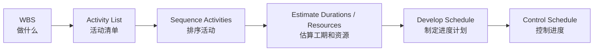
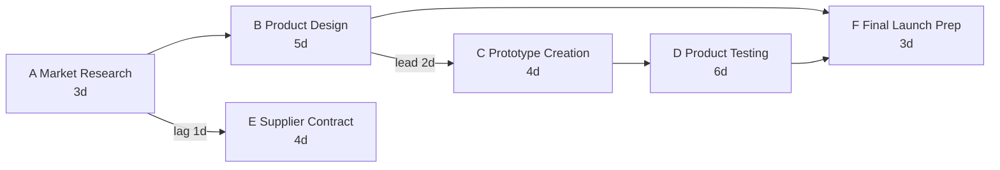

# Lecture 4：进度管理 Part 1

Lecture 4 是进度管理的前半段：从 WBS 拿到活动，再定义活动、排序活动、理解依赖、lead/lag、PDM、网络图、Gantt Chart 和进度开发。
Lecture 4 is the first half of schedule management: move from WBS to activities, then define activities, sequence them, understand dependencies, lead/lag, PDM, network diagrams, Gantt Charts, and schedule development.

## 1. Time / Schedule Management 主线

进度管理的目标是把“做什么”转成“按什么顺序、花多久、什么时候做”。
The goal of schedule management is to turn “what to do” into “in what order, how long it takes, and when it happens.”

WBS 解决范围问题，Schedule 解决时间问题。
WBS solves the scope problem; the schedule solves the time problem.

详细网络图、CPM、PERT、Gantt 的综合画法见 [画图大章：高频图表专项](chapter:pm-drawing)。
For integrated Network Diagram, CPM, PERT, and Gantt drawing, see [Drawing Chapter: High-Frequency Diagrams](chapter:pm-drawing).

## 2. Plan Schedule Management

==Schedule Management Plan== 规定如何定义活动、排序活动、估算资源和工期、制定进度表以及控制进度。
The ==Schedule Management Plan== defines how activities will be defined, sequenced, resourced, duration-estimated, scheduled, and controlled.

它还会规定进度单位、估算精度、更新频率、绩效衡量规则和变更控制方法。
It can also define schedule units, estimate accuracy, update frequency, performance measurement rules, and change-control methods.

## 3. Define Activities

==Define Activities== 是把 WBS 中的工作包进一步拆成可排期的活动。
==Define Activities== decomposes WBS work packages into schedulable activities.

WBS item 更偏交付物，Activity 更偏动作。
A WBS item is more deliverable-oriented, while an activity is more action-oriented.

| WBS Item | Activity Example |
| --- | --- |
| User Account Module | Design registration form |
| User Account Module | Implement login API |
| User Account Module | Test password reset |

课件提醒：简单场景下 Activity List 可能直接使用 WBS，但真实项目中活动通常会比 WBS 更细。
The slides note that in simple cases the activity list may directly use the WBS, but in real projects activities are often more detailed than WBS items.

## 4. Sequencing Activities

==Sequence Activities== 是确定活动之间的先后关系。
==Sequence Activities== determines logical relationships among activities.

排序活动的输出通常包括 Network Diagram 或 PERT Chart。
The output of sequencing activities often includes a Network Diagram or PERT Chart.

活动排序不是凭感觉，而是根据技术依赖、资源限制、外部约束和管理选择。
Sequencing is not based on intuition; it depends on technical dependencies, resource limits, external constraints, and management choices.

## 5. 四类 Task Dependencies

PDM 里的四类依赖要会认。
You must recognise the four PDM dependency types.

| 依赖 | 含义 | 例子 |
| --- | --- | --- |
| FS | Finish-to-Start，前一个完成后后一个开始 | 设计完成后开始开发 |
| SS | Start-to-Start，前一个开始后后一个开始 | 开始开发后可以开始准备测试用例 |
| FF | Finish-to-Finish，前一个完成后后一个才能完成 | 文档审核完成后发布说明才能完成 |
| SF | Start-to-Finish，前一个开始后后一个才能完成 | 新系统上线后旧系统支持才能结束 |

FS 最常见，SF 最少见。
FS is the most common; SF is the least common.

## 6. Lead 与 Lag

==Lead== 是提前量，让后续活动可以在前置活动完成前开始。
==Lead== is an overlap that allows a successor to start before the predecessor finishes.

==Lag== 是等待时间，让后续活动必须在前置活动完成后再等一段时间。
==Lag== is waiting time that delays the successor after the predecessor finishes.

例如 Activity C 可以在 Activity B 完成前 2 天开始，这是 lead 2 days。
For example, if Activity C can start 2 days before Activity B finishes, that is a 2-day lead.

例如 Activity E 必须在 Activity A 完成 1 天后才开始，这是 lag 1 day。
For example, if Activity E must start 1 day after Activity A finishes, that is a 1-day lag.

考试易错：lead 会压缩时间，lag 会拉长时间。
Exam trap: lead compresses time; lag extends time.

## 7. Network Diagram 与 PDM

==Network Diagram== 展示活动和依赖。
==Network Diagram== shows activities and dependencies.

==Precedence Diagramming Method (PDM)== 常用节点表示活动、箭头表示依赖。
==Precedence Diagramming Method (PDM)== usually uses nodes for activities and arrows for dependencies.

画图时要检查三件事：有没有所有活动、有没有所有依赖、有没有开始和结束。
When drawing, check three things: all activities, all dependencies, and a start and finish.

## 8. Lecture 4 原 PDF Activity 5：产品开发例子

PDF 活动给出一组活动、工期和依赖。
The PDF activity gives activities, durations, and dependencies.

| 活动 | 工期 | 依赖 |
| --- | --- | --- |
| A: Market Research | 3 days | None |
| B: Product Design | 5 days | after A |
| C: Prototype Creation | 4 days | can start 2 days before B completed |
| D: Product Testing | 6 days | after C |
| E: Supplier Contract | 4 days | starts 1 day after A completed |
| F: Final Launch Prep | 3 days | after B and D |

可以画成简化 PDM。
It can be drawn as a simplified PDM.

解释时要说明 C 与 B 有 overlap，因为 C 可以在 B 完成前 2 天开始。
When explaining, state that C overlaps with B because C can start 2 days before B finishes.

E 不是 A 完成后立刻开始，而是 A 完成 1 天后开始。
E does not start immediately after A finishes; it starts 1 day after A finishes.

## 9. Gantt Chart

==Gantt Chart== 把活动放在时间轴上，适合沟通进度。
==Gantt Chart== places activities on a timeline and is useful for communicating the schedule.

它包含活动、持续时间、开始结束、里程碑、summary task 和依赖箭头。
It includes activities, durations, start/finish dates, milestones, summary tasks, and dependency arrows.

Network Diagram 更适合分析依赖和关键路径；Gantt Chart 更适合给非技术干系人看。
Network Diagrams are better for dependency and critical-path analysis; Gantt Charts are better for non-technical stakeholders.

## 10. Schedule Development 工具

Develop Schedule 会综合活动清单、依赖、资源、工期估算和约束，形成可执行进度计划。
Develop Schedule integrates activity lists, dependencies, resources, duration estimates, and constraints into an executable schedule.

常用工具包括 Network Diagram、Gantt Chart、Critical Path Analysis 和 PERT Analysis。
Common tools include Network Diagram, Gantt Chart, Critical Path Analysis, and PERT Analysis.

Lecture 4 只是引入 Critical Path，Lecture 5 会正式计算 ES/EF/LS/LF 和 slack。
Lecture 4 introduces Critical Path; Lecture 5 formally calculates ES/EF/LS/LF and slack.

## 11. 自测题

### 题 1：WBS 和 Activity List

WBS 和 Activity List 的区别是什么？
What is the difference between WBS and Activity List?

答案：WBS 是面向交付物的范围分解，回答做什么；Activity List 是可排期的具体活动，回答要执行哪些动作。
Answer: WBS is deliverable-oriented scope decomposition answering what to produce; Activity List contains schedulable activities answering what actions to perform.

### 题 2：Lead / Lag

“C 可以在 B 完成前 2 天开始”是 lead 还是 lag？
“C can start 2 days before B finishes” is lead or lag?

答案：Lead。它让后续活动提前开始，压缩总时间。
Answer: Lead. It allows the successor to start earlier and compresses total time.

### 题 3：Network vs Gantt

给管理层展示日程，优先用 Network Diagram 还是 Gantt Chart？
For presenting the schedule to management, should you prefer a Network Diagram or a Gantt Chart?

答案：通常用 Gantt Chart，因为它直观展示时间轴；Network Diagram 更适合技术性地分析依赖和关键路径。
Answer: usually use a Gantt Chart because it intuitively shows the timeline; a Network Diagram is better for technical dependency and critical-path analysis.
