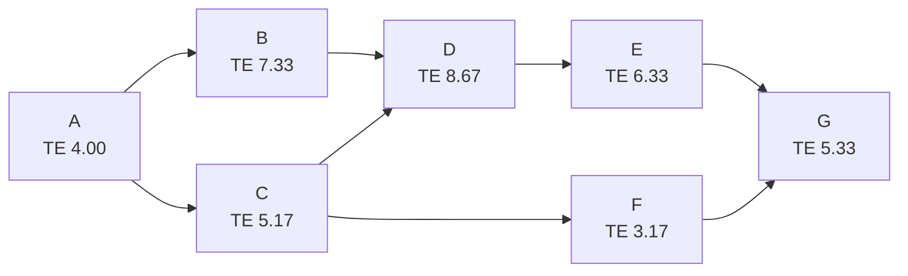

# Lecture 5：进度管理 Part 2

Lecture 5 是进度管理的计算核心：Critical Path、Forward Pass、Backward Pass、Slack/Float、Critical Chain 和 PERT。
Lecture 5 is the calculation core of schedule management: Critical Path, Forward Pass, Backward Pass, Slack/Float, Critical Chain, and PERT.

## 1. Develop Schedule 复盘

制定进度计划会用到 Network Diagram、Gantt Chart、Critical Path Analysis 和 PERT Analysis。
Developing the schedule uses Network Diagrams, Gantt Charts, Critical Path Analysis, and PERT Analysis.

这部分和 [画图大章：高频图表专项](chapter:pm-drawing) 的 Network/CPM/PERT/Gantt 是同一套综合题。
This section is the same integrated Network/CPM/PERT/Gantt question set as in [Drawing Chapter: High-Frequency Diagrams](chapter:pm-drawing).

## 2. Critical Path

==Critical Path== 是决定项目最早完工时间的一串活动。
==Critical Path== is the sequence of activities that determines the earliest completion time of the project.

它通常是网络图中总工期最长的路径。
It is usually the longest-duration path in the network diagram.

关键路径上的活动 slack/float 通常为 0。
Activities on the critical path usually have zero slack/float.

关键路径活动延误，项目总体完工时间通常也会延误。
If a critical-path activity is delayed, the overall project completion date is usually delayed.

## 3. ES、EF、LS、LF

==ES== 是 Earliest Start，活动最早可以开始的时间。
==ES== is Earliest Start, the earliest time an activity can start.

==EF== 是 Earliest Finish，活动最早可以完成的时间。
==EF== is Earliest Finish, the earliest time an activity can finish.

==LS== 是 Latest Start，活动不延误项目前提下最晚可以开始的时间。
==LS== is Latest Start, the latest time an activity can start without delaying the project.

==LF== 是 Latest Finish，活动不延误项目前提下最晚可以完成的时间。
==LF== is Latest Finish, the latest time an activity can finish without delaying the project.

| 项目 | 公式 |
| --- | --- |
| EF | ES + Duration |
| LS | LF - Duration |
| Slack / Float | LS - ES 或 LF - EF |

多个前置活动时，后续活动的 ES 取所有前置活动 EF 的最大值。
With multiple predecessors, the successor’s ES is the maximum EF among predecessors.

多个后续活动时，前置活动的 LF 取所有后续活动 LS 的最小值。
With multiple successors, the predecessor’s LF is the minimum LS among successors.

## 4. Forward Pass

==Forward Pass== 从左到右计算 ES 和 EF。
==Forward Pass== calculates ES and EF from left to right.

起点活动通常 ES = 0。
The starting activity usually has ES = 0.

每个活动 EF = ES + Duration。
For each activity, EF = ES + Duration.

如果某活动有多个前置活动，它必须等最晚完成的前置活动完成。
If an activity has multiple predecessors, it must wait for the latest-finishing predecessor.

## 5. Backward Pass

==Backward Pass== 从右到左计算 LF 和 LS。
==Backward Pass== calculates LF and LS from right to left.

终点活动的 LF 通常等于项目总工期。
The final activity’s LF usually equals the total project duration.

每个活动 LS = LF - Duration。
For each activity, LS = LF - Duration.

如果某活动有多个后续活动，它必须满足最早要开始的后续活动。
If an activity has multiple successors, it must satisfy the successor that needs to start earliest.

## 6. Slack / Float

==Slack== 或 ==Float== 表示活动可以延误而不影响项目总工期的时间。
==Slack== or ==Float== is the amount of time an activity can be delayed without delaying the total project duration.

Slack = 0 的活动通常在 Critical Path 上。
Activities with Slack = 0 are usually on the Critical Path.

Free Slack 关注不影响直接后续活动；Total Slack 关注不影响整个项目完成。
Free Slack focuses on not delaying immediate successors; Total Slack focuses on not delaying the whole project.

## 7. Critical Path Analysis 步骤

Lecture 5 给出关键路径分析步骤。
Lecture 5 gives the steps for critical path analysis.

1. Activity specification。
1. Activity specification.

2. Activity sequence establishment。
2. Activity sequence establishment.

3. Network diagram。
3. Network diagram.

4. Estimates for each activity。
4. Estimates for each activity.

5. ES、EF、LS、LF through forward/backward pass。
5. ES, EF, LS, LF through forward/backward pass.

6. Slack based on ES、EF、LS、LF。
6. Slack based on ES, EF, LS, LF.

7. Path identification。
7. Path identification.

## 8. Shortening a Project Schedule

压缩进度时通常先看关键路径。
When shortening a project schedule, look at the critical path first.

缩短非关键路径活动不一定能缩短项目总工期。
Shortening a non-critical activity may not shorten the total project duration.

常见方法包括 crashing 和 fast tracking。
Common methods include crashing and fast tracking.

==Crashing== 是增加资源来缩短工期，通常会增加成本。
==Crashing== adds resources to shorten duration, usually increasing cost.

==Fast Tracking== 是把原本顺序执行的活动并行执行，通常会增加返工风险。
==Fast Tracking== runs activities in parallel that were originally sequential, usually increasing rework risk.

## 9. Critical Chain 与 Buffers

==Critical Chain Scheduling== 在关键路径基础上进一步考虑资源约束。
==Critical Chain Scheduling== extends critical path scheduling by considering resource constraints.

它关注资源瓶颈、任务切换和缓冲区。
It focuses on resource bottlenecks, task switching, and buffers.

==Project Buffer== 放在项目末尾保护整体完工日期。
==Project Buffer== is placed at the end of the project to protect the overall completion date.

==Feeding Buffer== 放在非关键链进入关键链的位置，保护关键链不被支线延误影响。
==Feeding Buffer== is placed where a non-critical chain feeds into the critical chain, protecting it from delays.

## 10. PERT

==PERT== 是用三点估算处理工期不确定性的网络分析技术。
==PERT== is a network-analysis technique that uses three-point estimation to handle duration uncertainty.

O 是 Optimistic，M 是 Most Likely，P 是 Pessimistic。
O is Optimistic, M is Most Likely, and P is Pessimistic.

PERT 公式是 ==TE = (O + 4M + P) / 6==。
The PERT formula is ==TE = (O + 4M + P) / 6==.

## 11. Lecture 5 原 PDF Activity 2：PERT 例题

PDF 给出 A-G 的 O/M/P 和依赖。
The PDF gives O/M/P estimates and dependencies for A-G.

| Task | Dependency | O | M | P | TE |
| --- | --- | --- | --- | --- | --- |
| A | None | 2 | 4 | 6 | 4.00 |
| B | A | 5 | 7 | 11 | 7.33 |
| C | A | 3 | 5 | 8 | 5.17 |
| D | B and C | 6 | 8 | 14 | 8.67 |
| E | D | 4 | 6 | 10 | 6.33 |
| F | C | 2 | 3 | 5 | 3.17 |
| G | E and F | 3 | 5 | 9 | 5.33 |

网络关系如下。
The network relationship is as follows.

主要路径：
Main paths:

| 路径 | 工期 |
| --- | --- |
| A-B-D-E-G | 4.00 + 7.33 + 8.67 + 6.33 + 5.33 = 31.66 |
| A-C-D-E-G | 4.00 + 5.17 + 8.67 + 6.33 + 5.33 = 29.50 |
| A-C-F-G | 4.00 + 5.17 + 3.17 + 5.33 = 17.67 |

因此关键路径是 ==A-B-D-E-G==，项目期望工期约 ==31.66 天==。
Therefore, the critical path is ==A-B-D-E-G==, and the expected project duration is about ==31.66 days==.

## 12. Control Schedule

==Control Schedule== 是监控进度状态、更新进度预测、管理进度基准变更。
==Control Schedule== monitors schedule status, updates schedule forecasts, and manages changes to the schedule baseline.

如果实际进度落后，要判断是否影响关键路径。
If actual progress is behind, determine whether the critical path is affected.

如果影响关键路径，要考虑纠偏措施、变更请求或重新规划。
If the critical path is affected, consider corrective actions, change requests, or replanning.

## 13. 自测题

### 题 1：关键路径

为什么关键路径通常是最长路径？
Why is the critical path usually the longest path?

答案：因为项目必须等所有路径完成才能结束，最长路径决定最早完工时间。
Answer: because the project cannot finish until all paths finish, and the longest path determines the earliest completion time.

### 题 2：Slack

Slack = 0 通常说明什么？
What does Slack = 0 usually indicate?

答案：该活动通常在关键路径上，延误会直接影响项目总工期。
Answer: the activity is usually on the critical path, and delay will directly affect the total project duration.

### 题 3：PERT

O=3，M=6，P=15，TE 是多少？
If O=3, M=6, and P=15, what is TE?

答案：TE = (3 + 4×6 + 15) / 6 = 42 / 6 = ==7==。
Answer: TE = (3 + 4×6 + 15) / 6 = 42 / 6 = ==7==.
