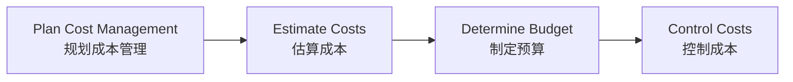
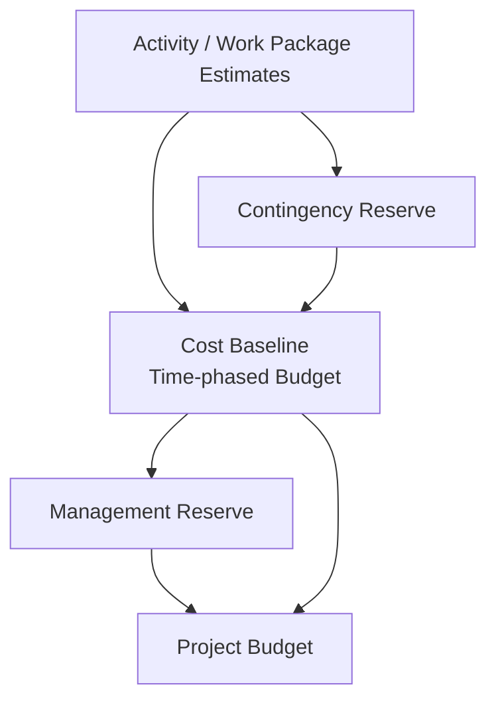

# Lecture 6：成本管理

Lecture 6 的核心是把项目从“估个大概多少钱”推进到“如何估算、预算、形成成本基准，并用 EVM 控制成本和进度表现”。
The core of Lecture 6 is moving from “roughly how much will it cost” to estimating, budgeting, forming the cost baseline, and using EVM to control cost and schedule performance.

## 1. Cost、Revenue、Profit

==Cost== 是为实现目标而消耗的资源，通常用货币衡量。
==Cost== is the resources expended to achieve a goal, usually measured in money.

==Revenue== 是组织从正常经营活动中获得的收入。
==Revenue== is income earned from normal business activities.

==Profit / Net Benefit = Revenue - Cost==。
==Profit / Net Benefit = Revenue - Cost==.

这组概念和 Lecture 2 的 NPV、ROI、Payback 是连在一起的。
These concepts connect directly to Lecture 2’s NPV, ROI, and Payback.

## 2. 成本分类

Lecture 6 重点区分多组成本。
Lecture 6 distinguishes several cost categories.

| 成本类型 | 中文解释 | English explanation |
| --- | --- | --- |
| Fixed Cost | 基本不随工作量变化，如一次性安装费、场地租赁 | Cost that remains largely unchanged, such as setup or rental fees |
| Variable Cost | 随工作量、工时或材料变化，如按小时测试工资 | Cost that changes with workload, labour hours, or materials |
| Tangible Cost/Benefit | 可以直接用金额衡量 | Can be directly measured in money |
| Intangible Cost/Benefit | 很难直接换算成金额 | Difficult to translate directly into money |
| Direct Cost | 可直接归属于某项目或交付物 | Directly attributable to a project or deliverable |
| Indirect Cost | 不能直接归属于单个交付物，但项目会间接产生 | Incurred indirectly and not assigned to one specific deliverable |
| Sunk Cost | 已经花掉且无法收回的钱 | Money already spent and unrecoverable |

==Sunk Cost== 最容易考判断题：已经花掉的钱不应该影响继续/停止项目的理性决策。
==Sunk Cost== is a common judgement-question trap: money already spent should not drive the rational continue/stop decision.

## 3. Reserve：Contingency 与 Management

==Reserve== 是为了未来不确定性而加入估算中的额外资金。
==Reserve== is extra funding included in estimates to deal with future uncertainty.

==Contingency Reserve== 用于 known unknowns，即已识别但发生概率或影响不确定的风险。
==Contingency Reserve== is for known unknowns: identified risks with uncertain probability or impact.

==Management Reserve== 用于 unknown unknowns，即目前无法识别或预测的事件。
==Management Reserve== is for unknown unknowns: events that cannot currently be identified or predicted.

考试易错：Cost Baseline 通常包含 Contingency Reserve，但不包含 Management Reserve。
Exam trap: the Cost Baseline usually includes Contingency Reserve but excludes Management Reserve.

## 4. Cost Management 四个过程

==Plan Cost Management== 规定成本如何估算、预算、监控和控制。
==Plan Cost Management== defines how costs will be estimated, budgeted, monitored, and controlled.

==Estimate Costs== 估算完成项目所需资源成本。
==Estimate Costs== estimates the cost of resources required to complete the project.

==Determine Budget== 把各项估算汇总成项目预算与 Cost Baseline。
==Determine Budget== aggregates estimates into the project budget and Cost Baseline.

==Control Costs== 监控实际支出、分析偏差并控制预算变更。
==Control Costs== monitors actual expenditure, analyses variance, and controls budget changes.

## 5. Cost Management Plan

==Cost Management Plan== 是 PMP 的子计划，规定成本如何被规划、记录和控制。
The ==Cost Management Plan== is a subsidiary plan of the PMP that defines how costs are planned, recorded, and controlled.

它可以包含计量单位、精度、控制阈值、报告格式、估算方法和 EVM 使用规则。
It can include units of measure, precision, control thresholds, reporting formats, estimating methods, and EVM rules.

## 6. 三种估算精度

| 估算 | 使用阶段 | 特点 |
| --- | --- | --- |
| ROM | 最早期 | 粗略，用于可行性和方向判断 |
| Budgetary Estimate | 预算分配 | 中等精度，常用于组织预算 |
| Definitive Estimate | 决策/采购 | 较准确，用于正式承诺 |

==ROM== 是 Rough Order of Magnitude，越早越粗。
==ROM== is Rough Order of Magnitude; early estimates are rougher.

==Definitive Estimate== 更准确，但需要更多范围、活动、资源和市场信息。
==Definitive Estimate== is more accurate but needs more scope, activity, resource, and market information.

## 7. 成本估算方法

==Analogous Estimating== 用历史相似项目估算当前项目，速度快但精度有限。
==Analogous Estimating== uses similar historical projects to estimate the current project; it is fast but less precise.

==Parametric Estimating== 用可量化参数和数学关系估算，例如每页文档成本、每功能点成本。
==Parametric Estimating== uses measurable parameters and mathematical relationships, such as cost per page or cost per function point.

==Bottom-up Estimating== 先估每个工作包或活动，再向上汇总，通常更准但更费时间。
==Bottom-up Estimating== estimates each work package or activity first and aggregates upward; it is often more accurate but more time-consuming.

==Activity-Based Costing== 更细地把成本归到具体活动。
==Activity-Based Costing== assigns costs more precisely to specific activities.

WBS 层级估算适合早期，活动层级估算适合活动和资源明确之后。
WBS-level estimation suits early stages; activity-level estimation suits later stages when activities and resources are clear.

## 8. IT 成本估算常见问题

IT 项目估算常常偏低。
IT-project estimates are often too low.

原因包括估算太快、估算经验不足、人类天然低估倾向、需求不清、新技术未经验证、业务流程未经验证。
Reasons include estimates produced too quickly, lack of estimating experience, natural underestimation, unclear requirements, untested technologies, and untested business processes.

考试回答“为什么 IT 项目超支”时，不要只说“程序员慢”，要从需求、技术、经验、估算方法和风险储备回答。
When answering why IT projects overrun, do not only say “developers are slow”; answer using requirements, technology, experience, estimating method, and reserves.

## 9. Cost Baseline、Project Budget、Funding Requirements

==Cost Baseline== 是已批准、按时间分布的项目预算，通常不含 Management Reserve。
==Cost Baseline== is the approved time-phased project budget, usually excluding Management Reserve.

==Project Budget = Cost Baseline + Management Reserve==。
==Project Budget = Cost Baseline + Management Reserve==.

==Funding Requirements== 指项目不同阶段需要获得的资金。
==Funding Requirements== specify when funding is needed across project stages.

## 10. EVM

==EVM== 是 Lecture 6 的计算核心。
==EVM== is the calculation core of Lecture 6.

PV、EV、AC、CV、SV、CPI、SPI、EAC 已经在 [画图大章：高频图表专项](chapter:pm-drawing) 详细整理。
PV, EV, AC, CV, SV, CPI, SPI, and EAC are explained in detail in [Drawing Chapter: High-Frequency Diagrams](chapter:pm-drawing).

这里补充 Lecture 6 的理解重点。
Here are the additional understanding points from Lecture 6.

PV 看计划，EV 看完成，AC 看花费。
PV looks at the plan, EV looks at completed work, and AC looks at spending.

CV 和 CPI 判断成本，SV 和 SPI 判断进度。
CV and CPI judge cost; SV and SPI judge schedule.

EVM 的价值是把进度和成本放在同一套预算价值语言中比较。
The value of EVM is comparing schedule and cost using the same budget-value language.

## 11. Lecture 6 原 PDF 活动提醒

PDF 的 EVM 活动里有一个重要考试习惯：如果题干直接给出 PV，应优先使用题干给出的 PV。
The PDF’s EVM activity gives an important exam habit: if the question directly gives PV, use the PV given in the question first.

即使你根据季度比例推导出另一个 PV，也不要擅自覆盖题干明确数值。
Even if you derive another PV from quarterly percentages, do not override a value explicitly given in the question.

## 12. 自测题

### 题 1：Reserve

Contingency Reserve 和 Management Reserve 的区别是什么？
What is the difference between Contingency Reserve and Management Reserve?

答案：Contingency Reserve 用于已识别风险 known unknowns；Management Reserve 用于未知未知 unknown unknowns，通常不含在 Cost Baseline 中。
Answer: Contingency Reserve is for identified risks or known unknowns; Management Reserve is for unknown unknowns and is usually excluded from the Cost Baseline.

### 题 2：估算方法

如果你把每个工作包成本估出来再汇总，这是什么估算方法？
If you estimate each work package and then aggregate upward, what estimating method is this?

答案：Bottom-up Estimating。
Answer: Bottom-up Estimating.

### 题 3：预算关系

Project Budget 和 Cost Baseline 的关系是什么？
What is the relationship between Project Budget and Cost Baseline?

答案：Project Budget = Cost Baseline + Management Reserve。
Answer: Project Budget = Cost Baseline + Management Reserve.
