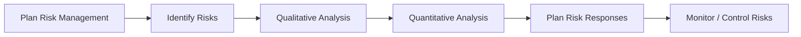

# Lecture 7：风险管理

Lecture 7 的重点是识别、分析、应对和监控风险。风险不只是坏事，也可能是机会。
Lecture 7 focuses on identifying, analysing, responding to, and monitoring risks. Risk is not only negative; it can also be an opportunity.

## 1. Risk、Threat、Opportunity

==Risk== 是会影响项目目标的不确定事件或条件。
==Risk== is an uncertain event or condition that affects project objectives.

==Negative Risk== 是 Threat，会阻碍项目目标实现。
==Negative Risk== is a Threat that can obstruct project objectives.

==Positive Risk== 是 Opportunity，可能带来额外收益、成本节省或更快交付。
==Positive Risk== is an Opportunity that may bring extra benefits, cost savings, or faster delivery.

考试易错：Risk 不等于 problem。Risk 是不确定；problem/issue 是已经发生。
Exam trap: Risk is not the same as a problem. A risk is uncertain; a problem/issue has already occurred.

## 2. Risk Tolerance、Utility 与态度

==Risk Tolerance== 是组织或个人愿意接受的最大偏差程度。
==Risk Tolerance== is the maximum deviation an organisation or person is willing to accept.

==Risk Utility== 表示某个潜在收益带来的主观满意程度。
==Risk Utility== represents the subjective satisfaction gained from a potential payoff.

| 风险态度 | 特点 |
| --- | --- |
| Risk-Averse | 偏好确定收益，即使期望收益低 |
| Risk-Seeking | 愿意承担波动追求高回报 |
| Risk-Neutral | 主要按 EMV 做选择 |

## 3. Known Risk 与 Unknown Risk

==Known Risks== 是团队已经识别和分析过的风险，可以主动管理。
==Known Risks== are risks already identified and analysed, so they can be proactively managed.

==Unknown Risks== 是尚未识别和分析的风险，不能直接针对性管理。
==Unknown Risks== are risks not yet identified or analysed, so they cannot be directly managed in a targeted way.

Known risks 可以放入 Risk Register，并配 owner、trigger 和 response。
Known risks can be placed in the Risk Register with owner, trigger, and response.

Unknown risks 主要靠 Management Reserve 和组织韧性处理。
Unknown risks are mainly handled through Management Reserve and organisational resilience.

## 4. 风险管理过程

==Plan Risk Management== 定义方法、责任、预算、分类和评分规则。
==Plan Risk Management== defines methodology, responsibilities, budget, categories, and scoring rules.

==Identify Risks== 找出可能伤害或增强项目结果的事件。
==Identify Risks== identifies events that may harm or enhance project outcomes.

==Qualitative Analysis== 用概率和影响排序风险优先级。
==Qualitative Analysis== prioritises risks using probability and impact.

==Quantitative Analysis== 把高优先级风险转化为金额、概率或日期等数值。
==Quantitative Analysis== converts high-priority risks into numerical values such as money, probability, or dates.

==Plan Risk Responses== 为风险安排具体行动。
==Plan Risk Responses== assigns concrete actions to risks.

==Monitor/Control Risks== 跟踪风险、触发器、应对计划和新增风险。
==Monitor/Control Risks== tracks risks, triggers, response plans, and newly emerging risks.

## 5. Risk Management Plan

Risk Management Plan 不是风险清单，而是规定“如何管理风险”的计划。
The Risk Management Plan is not the risk list; it defines how risks will be managed.

它可包含方法、角色责任、预算、时间安排、风险类别、概率影响定义、矩阵规则和报告格式。
It can include methodology, roles and responsibilities, budget, timing, risk categories, probability/impact definitions, matrix rules, and reporting format.

## 6. Risk Breakdown Structure

==Risk Breakdown Structure (RBS)== 是按层级整理潜在风险类别的结构。
==Risk Breakdown Structure (RBS)== is a hierarchical structure for organising potential risk categories.

常见第一层可以是 Technical、Business、Organisational、External、Project Management。
Common first-level categories include Technical, Business, Organisational, External, and Project Management.

RBS 用来提醒团队不要只盯技术风险，也要看商业、组织、外部和管理风险。
RBS reminds the team not to focus only on technical risks, but also business, organisational, external, and management risks.

## 7. 风险识别方法

| 方法 | 解释 |
| --- | --- |
| Brainstorming | 团队集中提出风险 |
| Delphi Technique | 专家匿名、多轮判断，逐渐收敛共识 |
| Interviewing | 访谈项目成员、客户、专家、供应商 |
| SWOT | 用 Strengths、Weaknesses、Opportunities、Threats 识别内外部条件 |
| Assumption and Constraint Analysis | 检查假设是否错误、不完整或不现实 |
| Fishbone / Flowchart | 找风险根因或流程易错点 |

## 8. Risk Register

==Risk Register== 是风险识别过程最重要的输出。
==Risk Register== is the most important output of risk identification.

它通常记录 risk description、category、root cause、probability、impact、owner、trigger、response、status。
It usually records risk description, category, root cause, probability, impact, owner, trigger, response, and status.

==Trigger== 是风险可能已经发生或即将发生的症状。
==Trigger== is a symptom indicating that a risk may have occurred or may be about to occur.

## 9. Qualitative Risk Analysis

定性分析通常使用 Probability-Impact Matrix。
Qualitative analysis usually uses the Probability-Impact Matrix.

风险矩阵已在 [画图大章：高频图表专项](chapter:pm-drawing) 详细讲过。
The risk matrix is explained in detail in [Drawing Chapter: High-Frequency Diagrams](chapter:pm-drawing).

核心公式可记为 ==Risk Score = Probability × Impact==。
The core formula can be remembered as ==Risk Score = Probability × Impact==.

## 10. Quantitative Risk Analysis

==Decision Tree== 用于在不确定结果下比较不同决策路径。
==Decision Tree== compares alternative decision paths under uncertain outcomes.

==EMV = Probability × Monetary Outcome==。
==EMV = Probability × Monetary Outcome==.

如果一个分支有多个结果，要把每个结果的 EMV 相加。
If a branch has multiple outcomes, sum the EMV of each outcome.

==Monte Carlo Simulation== 会反复随机抽取输入变量，模拟很多次项目结果。
==Monte Carlo Simulation== repeatedly samples input variables and simulates project outcomes many times.

==Sensitivity Analysis== 检查某个变量变化时，结果会如何变化。
==Sensitivity Analysis== examines how an outcome changes when one variable changes.

## 11. Risk Responses

威胁应对：Avoid、Mitigate、Transfer、Accept。
Threat responses are Avoid, Mitigate, Transfer, and Accept.

机会应对：Exploit、Enhance、Share、Accept。
Opportunity responses are Exploit, Enhance, Share, and Accept.

| Opportunity Response | 含义 |
| --- | --- |
| Exploit | 主动确保机会一定发生 |
| Enhance | 提高机会概率或收益影响 |
| Share | 与更有能力实现机会的一方共同拥有机会 |
| Accept | 承认机会但不主动投入资源 |

## 12. Contingency、Fallback、Residual、Secondary

==Contingency Plan== 是风险发生时立即执行的预先行动。
==Contingency Plan== is a predefined action executed when a risk occurs.

==Fallback Plan== 是 Contingency Plan 效果不足时的第二方案。
==Fallback Plan== is the second plan used if the Contingency Plan is insufficient.

==Residual Risk== 是实施应对后仍残留的风险。
==Residual Risk== is the risk that remains after a response has been implemented.

==Secondary Risk== 是因实施风险应对而产生的新风险。
==Secondary Risk== is a new risk created by implementing a risk response.

## 13. 自测题

### 题 1：Risk vs Issue

“服务器已经宕机”是 risk 还是 issue？
“The server has already crashed” is a risk or an issue?

答案：Issue，因为它已经发生；risk 是尚未确定发生的不确定事件。
Answer: Issue, because it has already occurred; a risk is an uncertain event that has not definitely occurred.

### 题 2：EMV

某机会有 30% 概率带来 10000 收益，EMV 是多少？
An opportunity has a 30% chance of producing 10000 benefit. What is the EMV?

答案：EMV = 0.3 × 10000 = ==3000==。
Answer: EMV = 0.3 × 10000 = ==3000==.

### 题 3：Secondary Risk

为了降低供应商延误风险，你换了供应商，但新供应商质量不稳定。这是什么风险？
To reduce supplier-delay risk, you change supplier, but the new supplier has unstable quality. What risk is this?

答案：Secondary Risk，因为它是风险应对措施引发的新风险。
Answer: Secondary Risk, because it is a new risk created by the response action.
