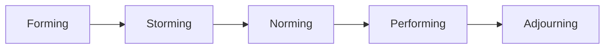
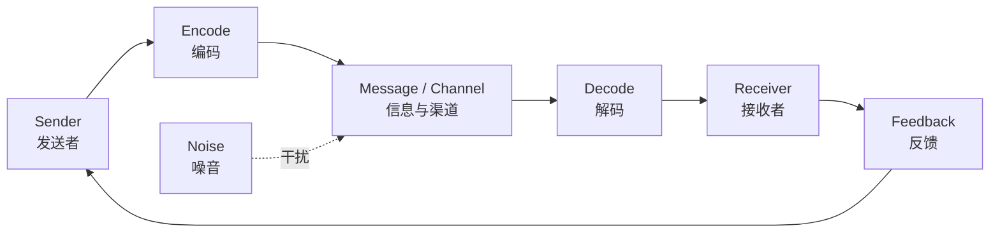

# Lecture 8：HR、Stakeholder 与 Communication Management

Lecture 8 把人、干系人和沟通放在一起。考试常把 RACI、资源冲突、团队发展、冲突处理、沟通渠道和 Power-Interest Grid 混合考。
Lecture 8 combines people, stakeholders, and communication. Exams often mix RACI, resource conflicts, team development, conflict handling, communication channels, and the Power-Interest Grid.

## 1. WBS、OBS、RAM 与 RACI

==WBS== 回答“要做什么工作”。
==WBS== answers “what work needs to be done.”

==OBS==，Organisational Breakdown Structure，回答“组织中谁来做这些工作”。
==OBS==, the Organisational Breakdown Structure, answers “who in the organisation will do this work.”

==RAM==，Responsibility Assignment Matrix，把 WBS 的工作和 OBS 中的人或部门对应起来。
==RAM==, the Responsibility Assignment Matrix, maps WBS work to people or departments in the OBS.

==RACI== 是 RAM 的一种更明确表达方式。
==RACI== is a more explicit form of RAM.

| 字母 | 含义 | 解释 |
| --- | --- | --- |
| R | Responsible | 实际做事的人 |
| A | Accountable | 最终负责和批准的人，通常每项工作只应一个 |
| C | Consulted | 被咨询的人，双向沟通 |
| I | Informed | 被告知的人，单向沟通 |

考试易错：Responsible 可以多个，Accountable 通常一个。
Exam trap: there can be multiple Responsible people, but usually one Accountable person.

## 2. Staffing Management Plan 与 Resource Histogram

==Staffing Management Plan== 说明人员何时加入项目、何时退出项目。
==Staffing Management Plan== specifies when people join and leave the project.

==Resource Histogram== 用柱状图展示一段时间内资源需求数量。
==Resource Histogram== uses bars to show the quantity of resources needed over time.

Resource Histogram 适合发现某段时间人手是否过多或不足。
Resource Histograms help identify whether staffing is too high or too low during a period.

## 3. Resource Loading、Overallocation、Leveling

==Resource Loading== 用于理解项目对个人和组织资源的需求强度。
==Resource Loading== helps understand the intensity of project demand on people and organisational resources.

==Overallocation== 表示某个人或资源在同一时期被安排的工作超过可用能力。
==Overallocation== means a person or resource has been assigned more work than available capacity during the same period.

==Resource Leveling== 通过延后、调整或重新安排任务来缓解资源冲突。
==Resource Leveling== relieves resource conflicts by delaying, adjusting, or rescheduling tasks.

Resource Leveling 可能导致项目工期变长。
Resource Leveling may extend the project duration.

## 4. Tuckman 团队发展五阶段

| 阶段 | 中文解释 | English explanation |
| --- | --- | --- |
| Forming | 团队刚组建，成员谨慎、依赖领导 | Members are cautious and depend on leadership |
| Storming | 出现冲突、竞争、抵触或参与不足 | Conflict, competition, resistance, or low participation appears |
| Norming | 开始互相支持，形成协作关系 | Members support each other and form working norms |
| Performing | 团队成熟，高效解决问题和交付 | Team is mature and delivers efficiently |
| Adjourning | 项目结束，团队解散或转移 | Project ends and the team disbands or transitions |

## 5. Motivation 理论

==Intrinsic Motivation== 来自任务本身的兴趣、成就感和学习感。
==Intrinsic Motivation== comes from interest in the task itself, achievement, and learning.

==Extrinsic Motivation== 来自奖金、晋升、认可或避免惩罚。
==Extrinsic Motivation== comes from rewards, promotion, recognition, or avoiding punishment.

Maslow 需求层次从低到高通常是 physiological、safety、social、esteem、self-actualisation。
Maslow’s hierarchy usually moves from physiological, safety, social, esteem, to self-actualisation.

Herzberg 区分 Motivators 和 Hygiene Factors。
Herzberg distinguishes Motivators and Hygiene Factors.

==Motivators== 真正提高满意度，如成就、认可、责任、成长、晋升。
==Motivators== genuinely increase satisfaction, such as achievement, recognition, responsibility, growth, and advancement.

==Hygiene Factors== 缺失会导致不满，如工资、监督方式、工作环境。
==Hygiene Factors== cause dissatisfaction when absent, such as salary, supervision, and work environment.

McGregor 的 ==Theory X== 假设员工讨厌工作，需要强控制。
McGregor’s ==Theory X== assumes workers dislike work and need strong control.

==Theory Y== 假设员工可以把工作视为自然活动，并愿意承担责任和成长。
==Theory Y== assumes people can view work as natural and may accept responsibility and growth.

## 6. Conflict Management

Lecture 8 和 Lecture 11 都强调冲突处理。
Both Lecture 8 and Lecture 11 emphasise conflict management.

| 方法 | 解释 | 适合场景 |
| --- | --- | --- |
| Confrontation / Problem-solving | 直接面对问题，基于事实找方案 | 任务重要、需要高质量解决 |
| Collaboration | 共同创造更优方案 | 双方目标都重要 |
| Compromise | 双方各让一步 | 时间有限，需要可接受方案 |
| Smoothing | 强调共同点、弱化分歧 | 关系更重要 |
| Forcing | 用权力强制决定 | 紧急、重大、必须立即执行 |
| Withdrawal | 暂时回避 | 问题不重要或情绪过高 |

讲义倾向认为 Confrontation / Problem-solving 最有效，Withdrawal 最不理想。
The lecture tends to treat Confrontation / Problem-solving as most effective and Withdrawal as least desirable.

## 7. Stakeholder Engagement

Stakeholder Management Plan 应记录当前参与度、目标参与度、干系人关系、沟通需求和对应管理策略。
The Stakeholder Management Plan records current engagement, desired engagement, stakeholder relationships, communication needs, and management strategies.

==Issue Log== 用于记录、追踪和解决需要处理的问题。
==Issue Log== records, tracks, and resolves issues requiring attention.

Power-Interest Grid 已在 [画图大章：高频图表专项](chapter:pm-drawing) 详细整理。
The Power-Interest Grid is explained in detail in [Drawing Chapter: High-Frequency Diagrams](chapter:pm-drawing).

## 8. Communication Management

==Plan Communications== 确定谁需要什么信息、何时需要、用什么方式传递。
==Plan Communications== determines who needs what information, when, and by what method.

==Manage Communications== 创建和分发正式、非正式、书面和口头信息。
==Manage Communications== creates and distributes formal, informal, written, and verbal information.

==Control Communications== 检查信息流是否有效，并调整计划。
==Control Communications== checks whether information flow is effective and adjusts the plan.

Communications Management Plan 可以包括干系人信息需求、格式、频率、渠道、责任人、升级路径和保密要求。
The Communications Management Plan can include stakeholder information needs, format, frequency, channels, owner, escalation path, and confidentiality requirements.

## 9. Communication Channels

沟通渠道数量公式是 ==n(n - 1) / 2==。
The communication-channel formula is ==n(n - 1) / 2==.

如果团队有 5 个人，沟通渠道数是 5×4/2 = 10。
If the team has 5 people, channels = 5×4/2 = 10.

如果新增 1 人变成 6 人，渠道数是 6×5/2 = 15。
If one person is added and the team becomes 6 people, channels = 6×5/2 = 15.

所以加人会显著增加沟通复杂度。
Therefore, adding people significantly increases communication complexity.

## 10. Communication Model

==Encode== 是把想法转成语言、文字、图表或符号。
==Encode== means converting an idea into words, writing, diagrams, or symbols.

==Decode== 是接收方解释信息。
==Decode== is the receiver interpreting the information.

==Noise== 是任何造成理解偏差的因素，如术语、语言差异、文化差异、模糊表达或技术故障。
==Noise== is anything causing misunderstanding, such as jargon, language differences, cultural differences, unclear wording, or technical failure.

## 11. 自测题

### 题 1：RACI

RACI 中 A 和 R 的区别是什么？
What is the difference between A and R in RACI?

答案：R 是实际执行者，A 是最终负责和批准者；R 可以多个，A 通常一个。
Answer: R performs the work; A is ultimately accountable and approves it. There may be multiple R, but usually one A.

### 题 2：沟通渠道

8 个人有多少沟通渠道？
How many communication channels are there for 8 people?

答案：8×7/2 = ==28==。
Answer: 8×7/2 = ==28==.

### 题 3：冲突处理

任务很重要，关系也重要，最优先考虑哪类冲突处理？
If both task and relationship are important, which conflict method should be considered first?

答案：Confrontation / Problem-solving 或 Collaboration。
Answer: Confrontation / Problem-solving or Collaboration.
