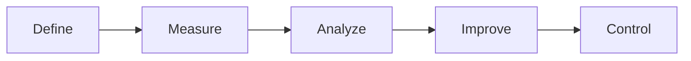

# Lecture 9：采购与质量管理

Lecture 9 分成两条线：Procurement Management 解决“从外部买什么、怎么签合同、怎么选供应商”；Quality Management 解决“怎样定义、保证和控制质量”。
Lecture 9 has two threads: Procurement Management addresses what to buy externally, how to contract, and how to select sellers; Quality Management addresses how to define, assure, and control quality.

## 1. Procurement、Outsourcing、Purchasing

==Procurement== 是从执行组织外部获取项目所需商品或服务。
==Procurement== is acquiring goods or services needed by the project from outside the performing organisation.

==Outsourcing== 更强调把原本内部可能做的工作交给外部。
==Outsourcing== emphasises transferring work that could have been done internally to an external party.

==Purchasing== 更强调采购动作本身。
==Purchasing== emphasises the purchasing transaction itself.

## 2. Plan Procurements 与 Make-or-Buy

==Plan Procurements== 决定采购什么、如何采购、何时采购。
==Plan Procurements== decides what to procure, how to procure it, and when to procure it.

==Make-or-Buy Analysis== 比较内部完成成本和外包成本。
==Make-or-Buy Analysis== compares the cost of internal delivery with outsourcing cost.

决策不只看价格，还要看能力、时间、质量、风险、保密、战略控制和供应商依赖。
The decision considers not only price but also capability, time, quality, risk, confidentiality, strategic control, and supplier dependency.

## 3. Contract Types 与风险分配

合同类型决定买方和卖方如何分担成本风险。
Contract type determines how buyer and seller share cost risk.

### Fixed Price

==Fixed Price== 用于范围明确、需求稳定的产品或服务。
==Fixed Price== is used for products or services with clear scope and stable requirements.

FFP，Firm Fixed Price，对买方风险最低。
FFP, Firm Fixed Price, gives the buyer the lowest risk.

FPI，Fixed Price Incentive Fee，在固定价格基础上增加激励。
FPI, Fixed Price Incentive Fee, adds incentives on top of fixed price.

FP-EPA，Fixed Price with Economic Price Adjustment，允许因通胀等预定义经济条件调整价格。
FP-EPA, Fixed Price with Economic Price Adjustment, allows price adjustment for predefined economic conditions such as inflation.

### Cost Reimbursable

==Cost Reimbursable== 是买方支付卖方实际允许成本，再附加费用或奖励。
==Cost Reimbursable== means the buyer pays the seller’s allowable actual costs plus a fee or reward.

CPAF 根据主观绩效标准给奖。
CPAF awards a fee based on subjective performance criteria.

CPIF 按预先确定的成本/绩效公式激励。
CPIF uses predetermined cost/performance incentives.

CPFF 是实际允许成本加固定费用。
CPFF is allowable actual costs plus a fixed fee.

CPPC 成本越高卖方收益可能越高，因此买方最不喜欢。
CPPC may increase seller payment when cost rises, so buyers dislike it most.

### Time and Materials

==T&M== 是 Fixed Price 和 Cost Reimbursable 的混合。
==T&M== is a hybrid of Fixed Price and Cost Reimbursable.

适合范围不完全明确但需要快速获取外部人员或服务的场景。
It suits cases where scope is not fully clear but external labour or services are needed quickly.

## 4. SOW、RFP、RFQ

==SOW==，Statement of Work，说明采购需要完成的工作。
==SOW==, Statement of Work, describes the work required for the procurement.

==RFP==，Request for Proposal，用于需求存在多种实现方案时，邀请供应商提交方案。
==RFP==, Request for Proposal, is used when multiple solution approaches are possible and suppliers submit proposals.

==RFQ==，Request for Quote，用于买方规格明确、主要需要价格报价时。
==RFQ==, Request for Quote, is used when the buyer has clear specifications and mainly needs pricing.

## 5. Seller Selection

供应商选择不只比最低价。
Seller selection is not only choosing the lowest price.

常见标准包括价格、技术能力、相关经验、交付时间、质量体系、风险、售后支持和合同条款。
Common criteria include price, technical capability, relevant experience, delivery time, quality system, risk, support, and contract terms.

Lecture 11 复习的 Conduct Procurements 流程是：准备文件和标准、发布采购信息、供应商会议、接收报价/提案、选择供应商、签合同。
The Conduct Procurements flow reviewed in Lecture 11 is: prepare documents and criteria, advertise, supplier conference, receive quotes/proposals, select source, and contract.

## 6. Cost of Quality

==Cost of Quality = Conformance Cost + Non-conformance Cost==。
==Cost of Quality = Conformance Cost + Non-conformance Cost==.

==Conformance Cost== 是为了把产品做对而投入的成本。
==Conformance Cost== is the cost spent to build the product correctly.

例如培训、过程改进、测试、审查、质量计划。
Examples include training, process improvement, testing, review, and quality planning.

==Non-conformance Cost== 是没有满足质量要求后付出的代价。
==Non-conformance Cost== is the cost incurred when quality requirements are not met.

例如返工、缺陷修复、客户投诉、保修、声誉损失。
Examples include rework, defect fixing, customer complaints, warranty, and reputation loss.

## 7. Design of Experiments 与 IT 质量维度

==Design of Experiments== 的思路是找出最影响质量的变量，再设计过程控制这些变量。
==Design of Experiments== identifies variables that most affect quality and then designs processes to control them.

IT 质量维度包括 Functionality、Features、System Output、Performance、Reliability、Maintainability。
IT quality dimensions include Functionality, Features, System Output, Performance, Reliability, and Maintainability.

| 维度 | 解释 |
| --- | --- |
| Functionality | 系统是否完成预期功能 |
| Features | 是否有吸引用户的特殊功能 |
| System Output | 页面、报告、结果是否符合要求 |
| Performance | 是否足够快和稳定 |
| Reliability | 正常条件下能否持续按预期工作 |
| Maintainability | 是否容易维护和修改 |

## 8. QA、QC、Testing

==Quality Assurance (QA)== 关注质量过程是否合适，强调预防和过程改进。
==Quality Assurance (QA)== focuses on whether quality processes are appropriate, emphasising prevention and process improvement.

==Quality Control (QC)== 关注具体交付物是否符合质量标准，强调检查和发现缺陷。
==Quality Control (QC)== focuses on whether specific deliverables meet quality standards, emphasising inspection and defect detection.

==Benchmarking== 把当前项目实践或产品特征与其他项目或产品比较。
==Benchmarking== compares current project practices or product characteristics with other projects or products.

==Quality Audit== 对质量管理活动进行结构化审查，发现经验教训和改进机会。
==Quality Audit== is a structured review of quality-management activities to identify lessons learned and improvement opportunities.

Testing 类型包括 Unit Testing、Integration Testing、System Testing、User Acceptance Testing。
Testing types include Unit Testing, Integration Testing, System Testing, and User Acceptance Testing.

==UAT== 是由用户或业务方确认系统是否满足业务需求。
==UAT== is where users or business representatives confirm whether the system meets business needs.

## 9. Quality Control Tools

Pareto、Fishbone、Control Chart 已在 [画图大章：高频图表专项](chapter:pm-drawing) 详细整理。
Pareto, Fishbone, and Control Chart are explained in detail in [Drawing Chapter: High-Frequency Diagrams](chapter:pm-drawing).

其他 QC 工具也要会选。
You should also be able to select other QC tools.

| 工具 | 用途 |
| --- | --- |
| Flowchart | 展示流程逻辑和信息流，找流程易错点 |
| Scatter Diagram | 展示两个变量是否可能相关 |
| Check Sheet | 结构化记录缺陷次数和类别 |
| Histogram | 展示数据频率分布 |
| Run Chart | 展示指标随时间趋势，通常没有控制限 |

## 10. Statistical Sampling

==Statistical Sampling== 是从总体中抽取部分样本进行检查。
==Statistical Sampling== is selecting part of a population for inspection.

Simple Random Sampling 是随机抽样。
Simple Random Sampling selects units randomly.

Stratified Random Sampling 是先按类别分层，再从每层随机抽取。
Stratified Random Sampling first divides the population into groups, then samples randomly from each group.

## 11. Six Sigma、DMAIC、CMMI

==Six Sigma== 的目标是每百万个机会中不超过 3.4 个缺陷。
==Six Sigma== targets no more than 3.4 defects per million opportunities.

==DMAIC== 是 Define、Measure、Analyze、Improve、Control。
==DMAIC== is Define, Measure, Analyze, Improve, Control.

==Six 9s of Quality== 表示 99.9999% 可用性。
==Six 9s of Quality== means 99.9999% availability.

==CMMI== 是五级过程成熟度框架，重点是持续改进过程能力和绩效。
==CMMI== is a five-level process-maturity framework focused on continuously improving process capability and performance.

## 12. PDF Activity：AI Chatbot Quality Case

银行 AI 客服更新后响应速度提升 20%，但错误率从 8% 上升到 12%。
After a bank AI chatbot update, response speed improves by 20%, but error rate rises from 8% to 12%.

Functionality 问题：错误答案和不一致答案说明核心问答功能不稳定。
Functionality issue: incorrect and inconsistent answers show the core Q&A function is unstable.

Performance 改善：响应速度提高 20%。
Performance improvement: response speed improved by 20%.

Accuracy 下降：错误率从 8% 到 12%。
Accuracy declined: error rate rose from 8% to 12%.

Data Problem 证据：80% 错误集中在长、多部分问题，说明训练或知识数据缺少复杂问题覆盖。
Evidence of a Data Problem: 80% of errors concentrate on long, multi-part questions, suggesting insufficient complex-question coverage.

Model Problem 证据：模型更新后错误率上升，说明可能出现模型回归。
Evidence of a Model Problem: error rate increased after the model update, suggesting possible model regression.

Trade-off 是速度提升和准确率下降之间的权衡。
The trade-off is between improved speed and reduced accuracy.

## 13. 自测题

### 题 1：RFP vs RFQ

需求有多种实现方案，想让供应商提交方案，应发 RFP 还是 RFQ？
If requirements have multiple possible solutions and suppliers should submit proposals, should you issue an RFP or RFQ?

答案：RFP。
Answer: RFP.

### 题 2：QA vs QC

Quality Audit 属于更偏 QA 还是 QC？
Is Quality Audit closer to QA or QC?

答案：QA，因为它审查质量管理过程并寻找改进机会。
Answer: QA, because it reviews quality-management processes and identifies improvement opportunities.

### 题 3：质量工具

想记录每类缺陷出现次数，应使用什么工具？
Which tool should be used to record how often each defect type occurs?

答案：Check Sheet。
Answer: Check Sheet.
