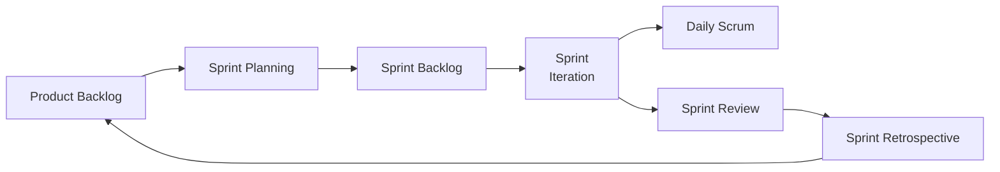

# Lecture 10：Agile 与博弈视角

Lecture 10 先补 Agile/Scrum，再引入 Game-Theoretic Approach。考试上 Agile/Scrum 更像概念题和读图题，Game Theory 更像理解型简答或应用题。
Lecture 10 first covers Agile/Scrum and then introduces the Game-Theoretic Approach. In exams, Agile/Scrum is more likely concept/chart reading, while Game Theory is more likely understanding or application.

## 1. SDLC Models：Predictive、Adaptive、Agile

==Predictive / Waterfall== 适合范围清晰、时间成本较可预测的项目。
==Predictive / Waterfall== suits projects where scope is clear and time/cost are relatively predictable.

它通常每个阶段执行一次，前期会花大量精力澄清需求。
It usually performs each phase once and spends substantial early effort clarifying requirements.

缺点是工作软件可能很晚才出现。
The weakness is that working software may not appear for a long time.

==Adaptive Software Development== 是适应型方法，强调迭代和增量。
==Adaptive Software Development== is adaptive, iterative, and incremental.

==Agile== 强调开发团队和业务专家密切协作，并通过频繁反馈适应变化。
==Agile== emphasises close collaboration between the development team and business experts, using frequent feedback to adapt to change.

## 2. Waterfall vs Agile

| Waterfall | Agile |
| --- | --- |
| Linear sequential life cycle | Iterative method |
| Upfront planning and detailed documentation | Planning at each iteration |
| Good for clear objectives | Good for changing customer requirements |
| Project-focused | Product and customer-focused |
| Close project-manager involvement | Small high-functioning team involvement |

Waterfall 不是错，Agile 也不是万能。
Waterfall is not wrong, and Agile is not magic.

范围稳定、合规要求强、需求清楚时，Waterfall 可能合适。
When scope is stable, compliance is strong, and requirements are clear, Waterfall may be suitable.

需求变化快、用户反馈重要、产品需要持续学习时，Agile 更合适。
When requirements change quickly, user feedback matters, and the product requires continuous learning, Agile is more suitable.

## 3. Agile Manifesto Values

Agile Manifesto 四组价值要会解释。
You should be able to explain the four Agile Manifesto values.

| Agile 更重视 | 相对于 |
| --- | --- |
| Individuals and interactions | processes and tools |
| Working software | comprehensive documentation |
| Customer collaboration | contract negotiation |
| Responding to change | following a plan |

这不是说右边没价值，而是左边更有价值。
This does not mean the right side has no value; it means the left side is valued more.

## 4. Agile Methodologies

Agile 方法包括 Scrum、Lean Software Development、Kanban、XP、Crystal、DSDM、FDD。
Agile methodologies include Scrum, Lean Software Development, Kanban, XP, Crystal, DSDM, and FDD.

本讲重点是 Scrum。
This lecture focuses on Scrum.

## 5. Scrum 的本质

==Scrum== 是一种 Agile 方法，强调经验过程、迭代增量、团队协作和快速反馈。
==Scrum== is an Agile method emphasising empirical process, iterative/incremental delivery, teamwork, and fast feedback.

Scrum 用来控制需求冲突和不确定性，提高沟通和协作，保护团队免受干扰。
Scrum controls conflicting interests and uncertainty, improves communication and cooperation, and protects the team from disruptions.

## 6. Scrum Artifacts

==User Story== 从用户视角描述功能。
==User Story== describes a feature from the user’s perspective.

模板是：As a ___, I want ___, so that ___。
The template is: As a ___, I want ___, so that ___.

例如：As an online shopper, I want a basket, so that I can put items before finalising my purchase。
Example: As an online shopper, I want a basket, so that I can put items before finalising my purchase.

==Product Backlog== 是按优先级排序的功能、bug、技术工作和知识获取列表。
==Product Backlog== is a prioritised list of features, bugs, technical work, and knowledge acquisition.

==Sprint Backlog== 是某个 sprint 内要实现的待办列表。
==Sprint Backlog== is the to-do list for a specific sprint.

==Burndown Chart== 展示剩余工作随时间减少的趋势。
==Burndown Chart== shows remaining work decreasing over time.

==Velocity Chart== 展示团队每个迭代通常能完成多少任务或 story points。
==Velocity Chart== shows how much work the team usually completes per iteration.

## 7. Scrum Process

==Sprint Planning== 在 sprint 开始前进行，确定 Sprint Goal 和 Sprint Backlog。
==Sprint Planning== occurs before the sprint and determines the Sprint Goal and Sprint Backlog.

==Sprint== 是一个迭代周期，通常约一个月或更短，目标是增加产品功能。
==Sprint== is an iteration, usually about one month or less, aimed at increasing product functionality.

==Daily Scrum== 是每天 15 分钟左右的短会。
==Daily Scrum== is a short daily meeting, around 15 minutes.

团队成员通常回答昨天做了什么、今天做什么、有什么阻碍。
Team members usually answer what they did yesterday, what they will do today, and what impediments exist.

==Sprint Review== 展示增量并收集反馈。
==Sprint Review== demonstrates the increment and collects feedback.

==Sprint Retrospective== 反思团队过程，改进下一轮 sprint。
==Sprint Retrospective== reflects on the team process and improves the next sprint.

## 8. Scrum Roles

==Product Owner== 负责产品价值、需求优先级和 Product Backlog。
==Product Owner== is responsible for product value, requirement priority, and the Product Backlog.

==Scrum Master== 服务团队、移除障碍、保护 Scrum 流程。
==Scrum Master== serves the team, removes impediments, and protects the Scrum process.

==Scrum Team / Development Team== 自组织完成产品增量。
==Scrum Team / Development Team== self-organises to deliver product increments.

考试易错：Scrum Master 不是传统意义上的项目经理，也不是团队老板。
Exam trap: the Scrum Master is not a traditional project manager and not the team’s boss.

## 9. Scrum 与过程组

Scrum 不是脱离项目管理过程组。
Scrum is not separate from project-management process groups.

Sprint Planning 对应规划，Sprint 执行对应执行，Daily Scrum 和指标跟踪对应监控，Review/Retrospective 对应反馈与改进。
Sprint Planning maps to planning, Sprint execution maps to executing, Daily Scrum and metrics map to monitoring, and Review/Retrospective map to feedback and improvement.

## 10. Game Theory 基础

==Game Theory== 研究多个理性参与者在相互影响下如何选择策略。
==Game Theory== studies how multiple rational players choose strategies when their outcomes affect each other.

一个 game 通常包括 players、strategies、payoffs、rules、information。
A game usually includes players, strategies, payoffs, rules, and information.

==Payoff== 是某个策略组合给参与者带来的收益或损失。
==Payoff== is the gain or loss a player receives from a strategy combination.

项目管理里很多问题不是单人优化，而是战略互动。
Many project-management problems are not single-person optimisation but strategic interaction.

## 11. Game Theory 与项目管理

Stakeholder alignment often is a coordination problem。
Stakeholder alignment is often a coordination problem.

Technical debt is an incentive problem。
Technical debt is an incentive problem.

Requirements prioritisation can be a strategic problem。
Requirements prioritisation can be a strategic problem.

Resource allocation can look like a common-pool game。
Resource allocation can look like a common-pool game.

Cybersecurity and incident response can be attacker/defender games。
Cybersecurity and incident response can be attacker/defender games.

## 12. Game Theory 的强项与限制

强项：它能帮助你明确参与者、策略、激励和可能结果。
Strength: it helps clarify players, strategies, incentives, and possible outcomes.

限制：真实项目中的人不一定完全理性，payoff 也不一定能准确量化。
Limit: people in real projects are not always fully rational, and payoffs may not be accurately measurable.

所以它适合支持思考，不适合机械替代管理判断。
Therefore, it supports thinking but should not mechanically replace management judgement.

## 13. IT Project Management Trends

Lecture 10 最后提到趋势：AI reshaping project work、hybrid delivery、distributed teams、trustworthy AI delivery、skills expanding、data-driven management。
Lecture 10 ends with trends: AI reshaping project work, hybrid delivery, distributed teams, trustworthy AI delivery, expanding skills, and data-driven management.

AI 项目特别需要考虑 fairness、accuracy、explainability、privacy、security 和 compliance。
AI projects especially need to consider fairness, accuracy, explainability, privacy, security, and compliance.

## 14. 自测题

### 题 1：Agile Manifesto

Agile 是否完全不要文档？
Does Agile completely reject documentation?

答案：不是。Agile 更重视 working software over comprehensive documentation，但右边仍然有价值。
Answer: no. Agile values working software over comprehensive documentation, but the right side still has value.

### 题 2：Product Owner

谁主要负责 Product Backlog 的优先级？
Who is mainly responsible for Product Backlog priority?

答案：Product Owner。
Answer: Product Owner.

### 题 3：Game Theory

为什么技术债可以看成 incentive problem？
Why can technical debt be viewed as an incentive problem?

答案：团队可能因短期交付压力选择快速但脆弱的方案，短期 payoff 高，长期维护成本由未来承担。
Answer: the team may choose quick but fragile solutions because short-term payoff is high, while long-term maintenance cost is paid later.
