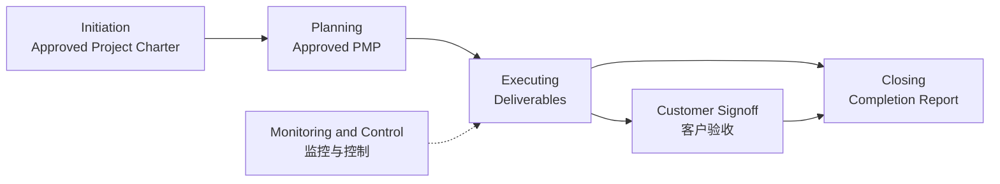
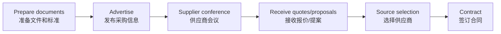
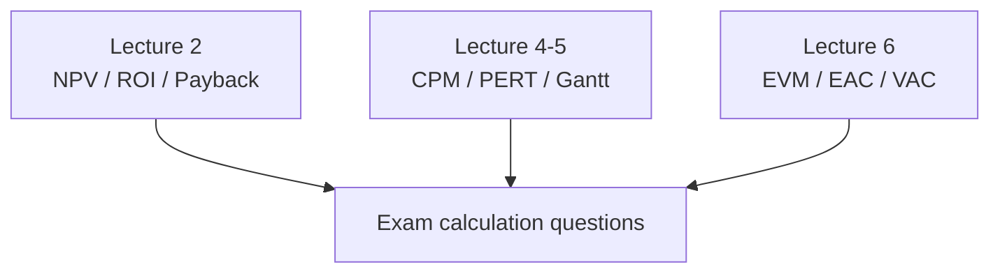

# Lecture 11：执行、收尾与全课程复习

Lecture 11 一共 37 页，前 14 页是 Execution + Closure 的新内容和整合复习，第 15 页以后是全课程考试地图。
Lecture 11 has 37 pages: the first 14 cover Execution + Closure content and consolidation, while pages after 15 provide a whole-course exam map.

## 1. 五大过程组总图

Lecture 11 再次使用五大过程组图：Initiation → Planning → Executing → Closing，同时 Monitoring and Controlling 横跨执行阶段。
Lecture 11 again uses the five-process-group diagram: Initiation → Planning → Executing → Closing, with Monitoring and Controlling spanning execution.

关键节点：Initiation 后得到 Approved Project Charter；Planning 后得到 Approved Project Management Plan；Closing 前获得 Customer Signoff；最后形成 Completion Report。
Key milestones: after Initiation, an Approved Project Charter; after Planning, an Approved Project Management Plan; before Closing, Customer Signoff; and finally a Completion Report.

## 2. Project Execution Group

PMP 被批准后，项目进入执行阶段。
After the PMP is approved, the project enters the execution stage.

PMP 协调所有计划文件，并指导项目执行与控制。
The PMP coordinates all planning documents and guides project execution and control.

项目的大部分时间和预算通常花在 Executing。
Most project time and budget are usually spent in Executing.

执行不是“只写代码”，还包括团队、采购、质量、沟通和干系人管理。
Execution is not “only coding”; it includes team, procurement, quality, communication, and stakeholder management.

## 3. Acquire、Develop、Manage Team

执行阶段要补齐或分配项目人员，并确认团队技能。
During execution, the team must acquire or assign people and confirm team skills.

==Project Skills Matrix== 记录谁会什么、谁能负责哪类工作。
==Project Skills Matrix== records who knows what and who can handle which work.

团队能力不只是单人技术能力，还包括协作能力。
Team capability is not only individual technical skill; it also includes collaboration.

## 4. Tuckman 与 Conflict Management

Lecture 11 再复习 Tuckman 五阶段：Forming、Storming、Norming、Performing、Adjourning。
Lecture 11 reviews the Tuckman stages: Forming, Storming, Norming, Performing, Adjourning.

也复习六种冲突处理：Confrontation、Collaboration、Compromise、Smoothing、Forcing、Withdrawal。
It also reviews six conflict approaches: Confrontation, Collaboration, Compromise, Smoothing, Forcing, and Withdrawal.

Confronting / Problem-solving 通常最有效，Withdrawal 通常最不理想。
Confronting / Problem-solving is usually most effective, while Withdrawal is usually least desirable.

## 5. Conduct Procurements

Lecture 11 给出采购执行六步流程。
Lecture 11 provides a six-step procurement-execution flow.

这部分对应 Lecture 9 的 Procurement Management。
This section corresponds to Lecture 9 Procurement Management.

## 6. Quality Assurance

Lecture 11 的 QA 定义是为满足项目质量要求而进行的活动。
Lecture 11 defines QA as activities undertaken to satisfy project quality requirements.

==Benchmarking== 是把本项目实践或产品特征与其他项目/产品比较。
==Benchmarking== compares this project’s practices or product characteristics with other projects/products.

==Quality Audit== 是系统审查质量管理活动，找出经验教训并改善当前或未来项目表现。
==Quality Audit== is a structured review of quality-management activities to identify lessons learned and improve current or future project performance.

QA 不是只找 bug，而是改进质量管理过程。
QA is not merely finding bugs; it improves quality-management processes.

## 7. Direct and Manage Project Work

这个过程确保团队执行 PMP 中规定的工作。
This process ensures the team performs the work specified in the PMP.

主要输入包括 Approved Project Management Plan 和 Approved Change Requests。
Main inputs include the Approved Project Management Plan and Approved Change Requests.

常用工具包括 Expert Judgment 和软件系统，例如 MS Project。
Typical tools include Expert Judgment and software systems such as MS Project.

主要输出包括 Deliverables、Project Execution Information 和 Plan Updates。
Main outputs include Deliverables, Project Execution Information, and Plan Updates.

重点：==没有批准的 Change Request，不能直接执行==。
Key point: ==an unapproved Change Request must not be implemented directly==.

## 8. Communication Reports

Lecture 11 区分三类报告。
Lecture 11 distinguishes three report types.

| 报告 | 看什么 |
| --- | --- |
| Project Status Report | 现在项目处于什么状态 |
| Project Progress Report | 某一时期完成了什么 |
| Project Forecast | 根据过去数据预测未来 |

一句话记忆：Status 看现在，Progress 看过去一段时间，Forecast 看未来。
Memory rule: Status looks at now, Progress looks at a recent period, and Forecast looks ahead.

## 9. Monitor and Control

==Project Baseline== 是已批准的项目计划，用来与实际表现比较。
==Project Baseline== is the approved project plan used to compare actual performance.

计划不会永远不变，范围、时间、成本、质量和风险都可能变化。
Plans do not remain unchanged forever; scope, time, cost, quality, and risk can all change.

因此需要 Change Control 和 CCB。
Therefore, Change Control and the CCB are required.

这部分对应 Integration Management 里的 Integrated Change Control。
This section corresponds to Integrated Change Control within Integration Management.

## 10. Project Closure

==Project Closure== 的核心是获得最终产品或服务的 Stakeholder / Customer Acceptance。
==Project Closure== centres on obtaining Stakeholder / Customer Acceptance of the final product or service.

收尾还要更新 Organisational Process Assets。
Closure also updates Organisational Process Assets.

典型内容包括 Project Files 和 Lessons-Learned Report。
Typical contents include Project Files and Lessons-Learned Report.

如果项目采购过产品或服务，还要正式关闭合同。
If the project procured products or services, contracts must also be formally closed.

即使项目提前停止或取消，也仍然要记录 Lessons Learned。
Even if a project stops early or is cancelled, Lessons Learned must still be documented.

## 11. 考试结构与明确重点

Lecture 11 明确说考试重点包括：==NPV==、==CPM==、==EVM==、五大过程组和十大知识领域。
Lecture 11 explicitly states that exam priorities include ==NPV==, ==CPM==, ==EVM==, the five process groups, and the ten knowledge areas.

考试结构：20 道选择题 40 分；3 道简答题 12 分；2 道分析/计算题 48 分。
Exam structure: 20 multiple-choice questions worth 40 marks; 3 short-answer questions worth 12 marks; 2 analytical/calculation questions worth 48 marks.

计算/分析题占 48/100，是最大头。
Analytical/calculation questions account for 48/100, the largest component.

## 12. 十大知识领域总复习

| 知识领域 | 必须回忆的关键词 |
| --- | --- |
| Integration | Charter, PMP, Change Control, NPV, ROI, Payback, Weighted Scoring |
| Scope | Requirements, Scope Statement, WBS, Validate Scope, Control Scope |
| Schedule | Activity List, PDM, Network, Gantt, CPM, PERT, Control Schedule |
| Cost | Estimates, Budget, Cost Baseline, EVM |
| Quality | QA, QC, Testing, Pareto, Fishbone, Control Chart |
| HR / Resource | Tuckman, RACI, Resource Histogram, Leveling, Conflict |
| Communication | Plan, Reports, Channels, Communication Model |
| Risk | Register, Matrix, EMV, Monte Carlo, Responses |
| Procurement | Make-or-Buy, Contract Types, RFP/RFQ, Seller Selection |
| Stakeholder | Register, Engagement, Power-Interest Grid |

## 13. 全课程计算大题地图

NPV 题重点是折现和项目选择。
NPV questions focus on discounting and project selection.

CPM/PERT 题重点是网络图、关键路径、ES/EF/LS/LF、Slack 和期望工期。
CPM/PERT questions focus on network diagrams, critical path, ES/EF/LS/LF, Slack, and expected duration.

EVM 题重点是 PV、EV、AC、CV、SV、CPI、SPI、EAC、VAC。
EVM questions focus on PV, EV, AC, CV, SV, CPI, SPI, EAC, and VAC.

## 14. 复习跳转

图表和计算综合题集中复习见 [画图大章：高频图表专项](chapter:pm-drawing)。
For concentrated diagram and calculation review, see [Drawing Chapter: High-Frequency Diagrams](chapter:pm-drawing).

Scope/WBS 回看 Lecture 3。
Review Scope/WBS in Lecture 3.

Schedule/CPM/PERT 回看 Lecture 4-5。
Review Schedule/CPM/PERT in Lectures 4-5.

Cost/EVM 回看 Lecture 6。
Review Cost/EVM in Lecture 6.

Risk 回看 Lecture 7。
Review Risk in Lecture 7.

HR/Communication/Stakeholder 回看 Lecture 8。
Review HR/Communication/Stakeholder in Lecture 8.

Procurement/Quality 回看 Lecture 9。
Review Procurement/Quality in Lecture 9.

Agile/Scrum 回看 Lecture 10。
Review Agile/Scrum in Lecture 10.

## 15. 自测题

### 题 1：Closure

项目被提前取消，还需要 lessons learned 吗？
If a project is cancelled early, are lessons learned still needed?

答案：需要。即使提前停止，也应记录经验教训并更新组织过程资产。
Answer: yes. Even if stopped early, lessons learned should be documented and organisational process assets updated.

### 题 2：Reports

Status Report、Progress Report、Forecast 分别看什么？
What do Status Report, Progress Report, and Forecast focus on?

答案：Status 看现在状态，Progress 看过去一段时间完成了什么，Forecast 看未来可能怎样。
Answer: Status looks at the current condition, Progress looks at what was completed during a recent period, and Forecast looks at what may happen next.

### 题 3：考试重点

Lecture 11 明确点名的三类计算重点是什么？
What three calculation priorities are explicitly highlighted by Lecture 11?

答案：NPV、CPM/PERT、EVM。
Answer: NPV, CPM/PERT, and EVM.
