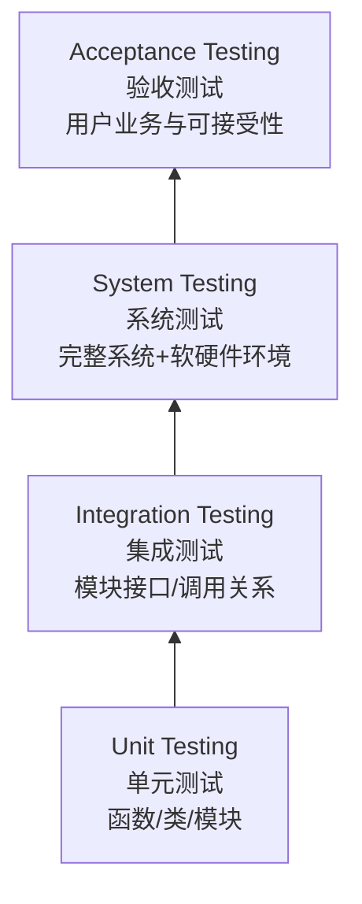
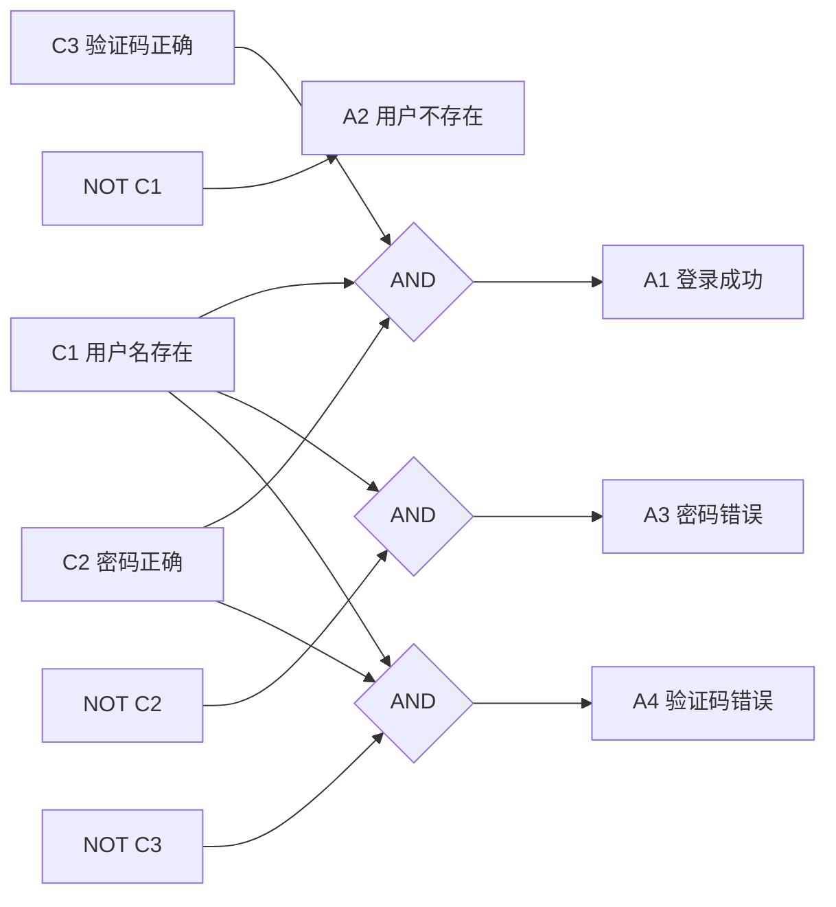
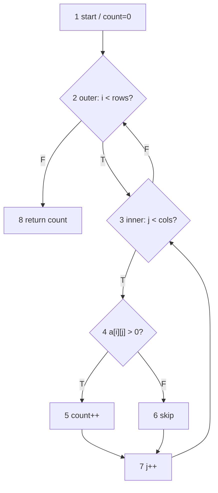
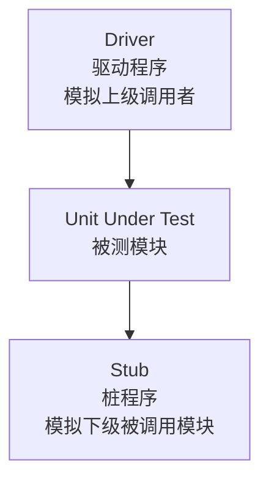
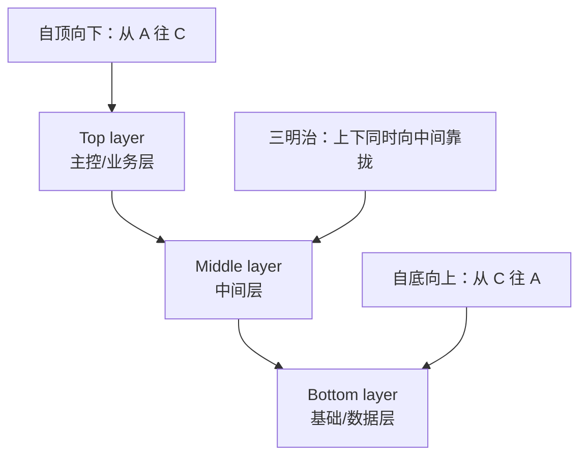
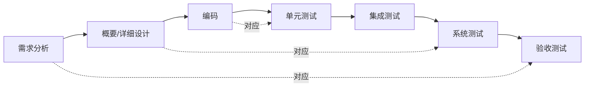
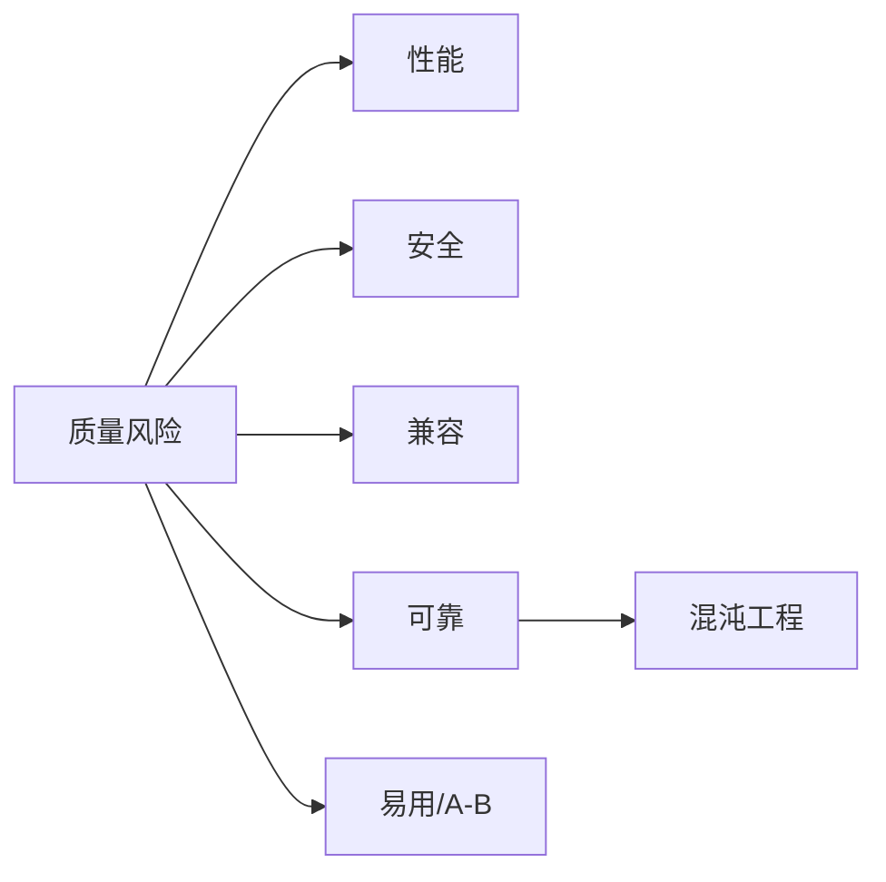
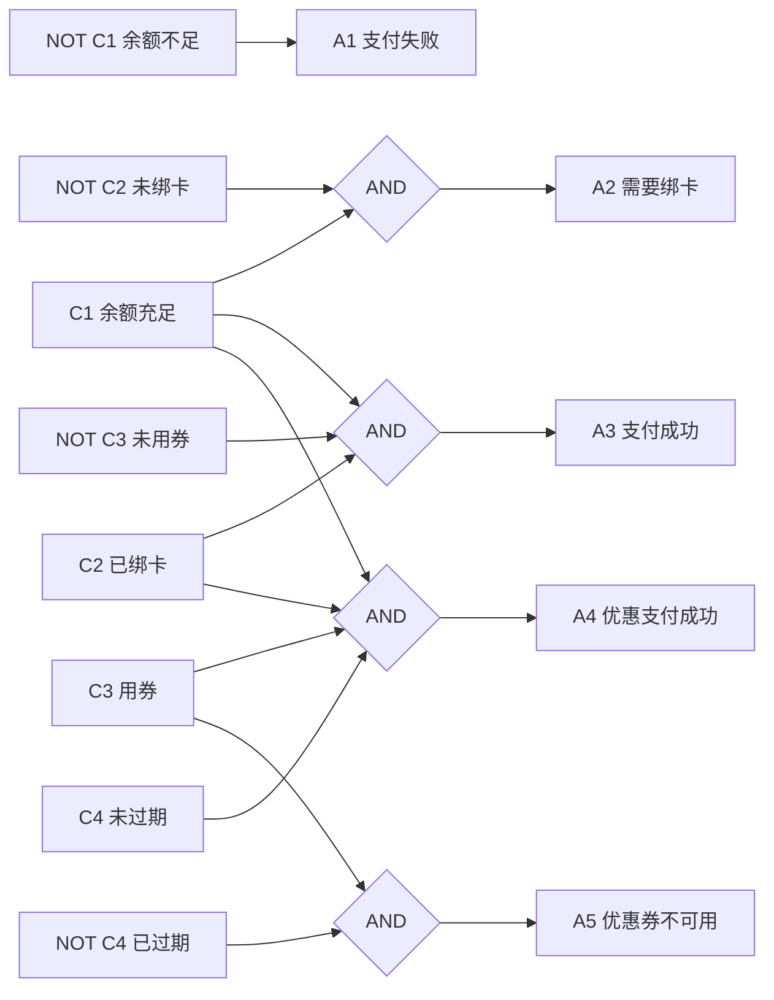
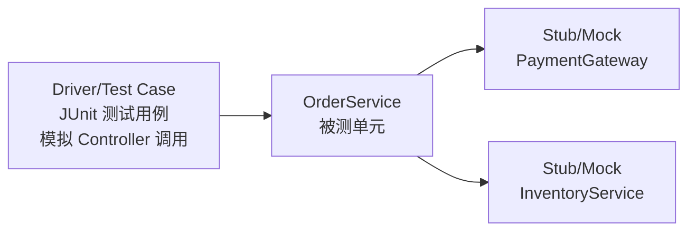

# 软件测试大题专项：问答、画图、画表与综合题

本章是对 PPT、现有复习资料和 `2025软件测试考试.txt` 的再整理，专门面向期末大题。目标不是“看懂”，而是考场上能直接写：==定义、步骤、图、表、测试用例、覆盖说明、公式和解析==。

## 0. 考情与答题优先级

2025 考情里，大题结构非常明确：

| 题型 | 分值倾向 | 高频内容 | 必须输出 |
| --- | --- | --- | --- |
| 简答题 | 约 60 分 | 逻辑覆盖、因果图、驱动/桩、基本路径、等价类 | 定义 + 区别 + 步骤 + 小表 |
| 综合题 | 约 20 分 | 黑盒测试用例设计 | 等价类/边界/判定表 + 测试用例表 + 解释 |

优先级从高到低：

1. ==第4章软件测试方法==：等价类、边界值、判定表、因果图、逻辑覆盖、基本路径。
2. ==第5章单元/集成测试==：驱动程序、桩程序、自顶向下、自底向上、三明治集成。
3. ==第2章基本概念==：测试分类、测试层次、静态/动态、黑盒/白盒、质量/缺陷/Test Oracle。
4. ==第3章流程规范==：V 模型、W 模型、TMap、TMM/TPI、测试左移/右移。
5. ==第6/7章技术题==：系统测试、接口/UI 自动化、回归测试、精准测试、性能/安全/兼容/可靠/混沌/A/B。

一句话策略：

> 看到“规格/输入/输出”先黑盒；看到“代码/路径/条件”先白盒；看到“模块上下游”先驱动和桩；看到“开发阶段对应测试阶段”先 V/W 模型；看到“流程管理/成熟度”先 TMap/TMM/TPI。

## 1. 必背简答：软件测试是什么，为什么测试不能证明没有缺陷？

### 题目

简述软件测试的定义、目的，并说明为什么测试不能证明程序没有缺陷。

### 答案

软件测试是从通常无限大的输入域中选择有限的测试用例，对软件的行为进行动态验证或静态评估，以发现缺陷、评估质量，并判断软件是否满足需求。Software testing selects finite test cases from a usually infinite execution domain to evaluate whether the software behaves as expected.

测试目的可以从三个角度写：

| 角度 | 答题要点 |
| --- | --- |
| 质量角度 | 发现缺陷，评估软件是否满足明示和隐含需求 |
| 风险角度 | 揭示潜在质量风险，降低发布风险 |
| 经济角度 | 越早发现缺陷，修复成本越低，测试投入应小于缺陷损失 |

测试不能证明程序没有缺陷，原因是：

1. 输入域通常非常大甚至无限，测试只能选择有限样本。
2. 程序路径数量可能因分支和循环爆炸，无法穷尽所有路径。
3. 错误代码被执行后不一定导致错误状态，错误状态也不一定表现为可观察失败。
4. 测试能证明“存在缺陷”，但不能证明“完全无缺陷”。

### 解析

这题来自第 1 章主线。考场回答时不要只写“测试是找 bug”，最好补上质量、风险、经济三个视角。高分句是：

> Testing can reveal the presence of defects, but cannot prove their absence.

## 2. 必背简答：软件质量、软件缺陷与 Test Oracle

### 题目

解释软件质量、软件缺陷和测试预言 Test Oracle 的含义，并说明三者之间的关系。

### 答案

| 概念 | 含义 | 考试关键词 |
| --- | --- | --- |
| 软件质量 Quality | 软件满足明示和隐含需求的能力和特性 | 内部质量、外部质量、使用质量 |
| 软件缺陷 Defect | 软件未满足需求、出现不应出现行为、实现多余功能或用户体验不佳 | 质量的对立面 |
| Test Oracle 测试预言 | 判断实际输出是否正确的依据或机制 | 需求规格、模型、启发式、一致性 |

三者关系：

1. 质量是目标，缺陷是对质量要求的违背。
2. 测试通过执行或评审收集实际结果。
3. Test Oracle 将实际结果与应有结果比较，帮助判断是否存在缺陷。

### 解析

PPT 中强调：缺陷不仅是“程序崩溃”，也包括未实现需求、实现了不该有的功能、用户体验差。考试问“如何判断是不是缺陷”时，核心就是 Test Oracle。

## 3. 必背画图：软件测试四个层次

### 题目

画出软件测试的四个层次，并说明每个层次的对象、目标和常用方法。

### 答案



| 层次 | 测试对象 | 主要目标 | 常用方法 | 常见缺陷 |
| --- | --- | --- | --- | --- |
| 单元测试 | 函数、类、模块 | 验证最小单元功能与内部逻辑 | 白盒、边界、Mock、驱动/桩 | 算法、边界、局部数据、异常处理 |
| 集成测试 | 模块之间接口 | 发现接口和协作问题 | 自顶向下、自底向上、三明治、大棒 | 参数不匹配、数据丢失、调用顺序错误 |
| 系统测试 | 完整系统 | 验证系统满足规格说明 | 黑盒、场景、接口/UI 自动化、非功能测试 | 功能、环境、性能、安全、兼容问题 |
| 验收测试 | 面向用户业务 | 判断用户是否接受 | Alpha/Beta、业务流程、UAT | 业务不匹配、可用性、用户接受度问题 |

### 解析

第 2 章 PPT 明确给出四层：单元、集成、系统、验收。易错点：

- 单元测试通常以程序员为主，常用白盒。
- 系统测试通常在集成测试后，面向完整系统，常用黑盒。
- 验收测试的标准更接近用户业务和可接受性。

## 4. 必背简答：静态/动态、黑盒/白盒、手工/自动化、脚本/探索

### 题目

比较软件测试的几组基本分类：静态测试与动态测试、黑盒测试与白盒测试、手工测试与自动化测试、脚本式测试与探索式测试。

### 答案

| 分类 | A | B | 区别 |
| --- | --- | --- | --- |
| 是否执行程序 | 静态测试 Static | 动态测试 Dynamic | 静态不运行程序，通过评审/扫描/静态分析发现问题；动态运行程序观察行为 |
| 是否看内部结构 | 黑盒 Black-box | 白盒 White-box | 黑盒基于规格和输入输出；白盒基于代码结构、路径和覆盖 |
| 执行方式 | 手工测试 Manual | 自动化测试 Automated | 手工依赖人执行和判断；自动化适合重复、回归、接口/单元等场景 |
| 是否预先脚本化 | 脚本式 Scripted | 探索式 Exploratory | 脚本式按预设用例执行；探索式边学习边设计边执行 |

### 解析

这题像选择题，也可能变简答。答题时每组写“划分依据 + 各自含义 + 适用场景”。

## 5. 高频大题：等价类划分是什么？有效等价类和无效等价类是什么？

### 题目

解释等价类划分法，说明有效等价类和无效等价类，并用“用户年龄 18-60 才能注册”为例设计测试用例。

### 答案

等价类划分法是将输入域划分为若干组，在同一组中程序应表现出相同或相似行为，因此可以选取代表值进行测试。Equivalence partitioning divides the input domain into classes whose members are expected to behave similarly.

| 类型 | 含义 | 年龄例子 |
| --- | --- | --- |
| 有效等价类 | 满足规格说明、应被系统接受的输入集合 | `18 <= age <= 60` |
| 无效等价类 | 不满足规格说明、应被系统拒绝或报错的输入集合 | `age < 18`，`age > 60`，非数字，空值 |

测试用例表：

| 用例 | 输入 age | 预期输出 | 覆盖点 |
| --- | --- | --- | --- |
| TC1 | 30 | 注册成功 | 有效等价类 |
| TC2 | 17 | 提示年龄不满足 | 下方无效等价类 |
| TC3 | 61 | 提示年龄不满足 | 上方无效等价类 |
| TC4 | 空 | 提示年龄不能为空 | 空值无效 |
| TC5 | `abc` | 提示格式错误 | 类型无效 |

### 解析

等价类题的高分点：

1. 不是只写一个有效类，还要写无效类。
2. 每个无效类通常至少一个用例。
3. 如果输入有边界，应结合边界值分析补 `17/18/19`、`59/60/61`。

## 6. 高频综合题：黑盒测试用例表怎么写？

### 题目

某电商满减规则如下：

- 订单金额 `amount` 必须为整数，范围 `0-10000`。
- 普通用户订单满 `200` 减 `20`。
- 会员用户订单满 `100` 减 `15`。
- 如果使用优惠券 `coupon=true`，再减 `10`，但优惠券只能在订单金额 `>=50` 时使用。
- 若输入非法，输出“输入非法”。

请用等价类、边界值和判定表思想设计测试用例。

### 答案

**1. 输入与规则识别**

| 输入 | 取值 | 说明 |
| --- | --- | --- |
| amount | `0-10000` 整数 | 需要边界值 |
| userType | 普通/会员 | 影响满减门槛 |
| coupon | true/false | 影响额外减免，且有金额限制 |

**2. 等价类与边界**

| 项 | 有效类 | 无效类/边界 |
| --- | --- | --- |
| amount | `0 <= amount <= 10000` | `-1`、`10001`、非整数、空 |
| 普通满减 | `<200`、`>=200` | 边界 `199/200` |
| 会员满减 | `<100`、`>=100` | 边界 `99/100` |
| 优惠券 | `coupon=false`；`coupon=true 且 amount>=50` | `coupon=true 且 amount<50` |

**3. 简化判定表**

| 条件/动作 | R1 | R2 | R3 | R4 | R5 | R6 |
| --- | --- | --- | --- | --- | --- | --- |
| 输入合法 | N | Y | Y | Y | Y | Y |
| 会员 | - | N | N | Y | Y | Y |
| 满足对应满减 | - | N | Y | N | Y | Y |
| coupon=true 且 amount>=50 | - | N | N | N | N | Y |
| 输出输入非法 | X |  |  |  |  |  |
| 无满减 |  | X |  | X |  |  |
| 普通满减 20 |  |  | X |  |  |  |
| 会员满减 15 |  |  |  |  | X | X |
| 优惠券再减 10 |  |  |  |  |  | X |

**4. 测试用例表**

| ID | amount | userType | coupon | 预期结果 | 覆盖点 |
| --- | --- | --- | --- | --- | --- |
| TC1 | -1 | 普通 | false | 输入非法 | amount 下界外 |
| TC2 | 10001 | 普通 | false | 输入非法 | amount 上界外 |
| TC3 | 199 | 普通 | false | 不满减 | 普通门槛下边界 |
| TC4 | 200 | 普通 | false | 减 20 | 普通门槛边界 |
| TC5 | 99 | 会员 | false | 不满减 | 会员门槛下边界 |
| TC6 | 100 | 会员 | false | 减 15 | 会员门槛边界 |
| TC7 | 49 | 会员 | true | 优惠券不可用/输入不满足优惠券规则 | coupon 金额边界下 |
| TC8 | 50 | 会员 | true | 减 10，不触发会员满减 | coupon 金额边界 |
| TC9 | 100 | 会员 | true | 减 15 再减 10 | 会员满减 + 优惠券 |
| TC10 | 200 | 普通 | true | 减 20 再减 10 | 普通满减 + 优惠券 |

### 解析

黑盒综合题不要只“凑 5 个输入”。标准输出是：

1. 先写方法选择：范围用边界值，分类用等价类，多条件用判定表。
2. 再写表格：输入、预期输出、覆盖点。
3. 最后解释为什么覆盖了合法/非法/边界/组合规则。

## 7. 高频画图：因果图如何转判定表？

### 题目

某登录系统规则如下：

- `C1`：用户名存在。
- `C2`：密码正确。
- `C3`：验证码正确。
- 若 `C1 AND C2 AND C3`，则 `A1` 登录成功。
- 若 `NOT C1`，则 `A2` 提示用户不存在。
- 若 `C1 AND NOT C2`，则 `A3` 提示密码错误。
- 若 `C1 AND C2 AND NOT C3`，则 `A4` 提示验证码错误。

要求画因果图，并转化为判定表和用例表。

### 答案

**1. 因果图**



**2. 判定表**

| 条件/动作 | R1 | R2 | R3 | R4 |
| --- | --- | --- | --- | --- |
| C1 用户名存在 | Y | N | Y | Y |
| C2 密码正确 | Y | - | N | Y |
| C3 验证码正确 | Y | - | - | N |
| A1 登录成功 | X |  |  |  |
| A2 用户不存在 |  | X |  |  |
| A3 密码错误 |  |  | X |  |
| A4 验证码错误 |  |  |  | X |

**3. 测试用例**

| ID | 用户名存在 | 密码正确 | 验证码正确 | 预期输出 |
| --- | --- | --- | --- | --- |
| TC1 | 是 | 是 | 是 | 登录成功 |
| TC2 | 否 | 任意 | 任意 | 用户不存在 |
| TC3 | 是 | 否 | 任意 | 密码错误 |
| TC4 | 是 | 是 | 否 | 验证码错误 |

### 解析

因果图题的固定步骤：

1. 找原因：输入条件。
2. 找结果：输出动作。
3. 写逻辑：AND、OR、NOT。
4. 写约束：互斥、唯一、要求、屏蔽等。
5. 转判定表。
6. 每一列规则变成一个测试用例。

## 8. 高频简答：逻辑覆盖的定义与强弱关系

### 题目

解释判定覆盖、条件覆盖、判定-条件覆盖、条件组合覆盖，并说明覆盖强弱关系。

### 答案

| 覆盖类型 | 英文 | 定义 | 例子关注点 |
| --- | --- | --- | --- |
| 判定覆盖 | Decision coverage | 每个判定结果至少取一次 T 和 F | `if (...)` 整体真假 |
| 条件覆盖 | Condition coverage | 每个基本条件至少取一次 T 和 F | `a>0`、`b>0` 各自真假 |
| 判定-条件覆盖 | Decision-condition coverage | 同时满足判定覆盖和条件覆盖 | 判定真假 + 条件真假 |
| 条件组合覆盖 | Multiple-condition coverage | 每个判定中基本条件的所有组合至少覆盖一次 | 两个条件要覆盖 TT/TF/FT/FF |

强弱关系：

| 关系 | 说明 |
| --- | --- |
| 条件组合覆盖通常强于判定-条件覆盖 | 因为它要求所有条件组合 |
| 判定-条件覆盖强于单纯判定覆盖或单纯条件覆盖 | 同时要求两类目标 |
| 条件覆盖不一定推出判定覆盖 | 条件都取过 T/F，不代表整个判定取过 T/F |
| 判定覆盖不一定推出条件覆盖 | 判定取过 T/F，不代表每个条件都取过 T/F |

### 解析

考试 txt 明确点名“逻辑覆盖、条件覆盖、逻辑-条件覆盖、条件组合覆盖的定义和覆盖率排名”。这里“逻辑-条件覆盖”通常按 ==判定-条件覆盖== 理解。

## 9. 高频大题：设计判定-条件覆盖与条件组合覆盖用例

### 题目

对如下判定设计测试用例：

```text
if ((x > 0 && y > 0) || z == 1)
```

要求：

1. 设计满足判定-条件覆盖的用例。
2. 设计满足条件组合覆盖的用例。
3. 比较二者差异。

### 答案

基本条件：

| 条件 | 含义 |
| --- | --- |
| C1 | `x > 0` |
| C2 | `y > 0` |
| C3 | `z == 1` |
| D | `(C1 && C2) || C3` |

**1. 判定-条件覆盖**

| 用例 | x | y | z | C1 | C2 | C3 | D |
| --- | --- | --- | --- | --- | --- | --- | --- |
| TC1 | 1 | 1 | 0 | T | T | F | T |
| TC2 | -1 | -1 | 0 | F | F | F | F |
| TC3 | -1 | 1 | 1 | F | T | T | T |

覆盖说明：

- D 有 T/F：TC1/TC3 为 T，TC2 为 F。
- C1 有 T/F：TC1 为 T，TC2/TC3 为 F。
- C2 有 T/F：TC1/TC3 为 T，TC2 为 F。
- C3 有 T/F：TC3 为 T，TC1/TC2 为 F。

**2. 条件组合覆盖**

3 个基本条件理论上有 `2^3 = 8` 种组合：

| 用例 | C1 | C2 | C3 | 示例输入 | D |
| --- | --- | --- | --- | --- | --- |
| TC1 | T | T | T | `x=1,y=1,z=1` | T |
| TC2 | T | T | F | `x=1,y=1,z=0` | T |
| TC3 | T | F | T | `x=1,y=-1,z=1` | T |
| TC4 | T | F | F | `x=1,y=-1,z=0` | F |
| TC5 | F | T | T | `x=-1,y=1,z=1` | T |
| TC6 | F | T | F | `x=-1,y=1,z=0` | F |
| TC7 | F | F | T | `x=-1,y=-1,z=1` | T |
| TC8 | F | F | F | `x=-1,y=-1,z=0` | F |

**3. 差异**

判定-条件覆盖用例更少，但不保证所有条件组合都测到。条件组合覆盖更强，但用例数量随条件数指数增长，`n` 个条件最多需要 `2^n` 种组合。

### 解析

这题是白盒逻辑覆盖中最像大题的部分。答题时必须写条件取值表，否则老师很难判断你是否覆盖。

## 10. 高频画图计算：两重 for 循环的控制流图与基本路径

### 题目

给定伪代码：

```js
function countPositive(a) {
  let count = 0;
  for (let i = 0; i < a.length; i++) {
    for (let j = 0; j < a[i].length; j++) {
      if (a[i][j] > 0) {
        count++;
      }
    }
  }
  return count;
}
```

要求：

1. 画控制流图。
2. 计算圈复杂度。
3. 列出基本路径基的覆盖思路。
4. 设计测试用例。

### 答案

**1. 控制流图**



**2. 圈复杂度**

判定节点有 3 个：外层循环、内层循环、`if`。

`V(G) = P + 1 = 3 + 1 = 4`

如果题目要求用边和节点：

> 对单入口单出口控制流图，常用 `V(G)=E-N+2`。实际考试可以先画图，再数边 E 和节点 N。结构化程序也可用判定节点数 + 1 交叉验证。

**3. 基本路径覆盖思路**

| 路径类型 | 说明 |
| --- | --- |
| P1 | 外层循环 0 次，直接返回 |
| P2 | 外层进入，内层循环 0 次 |
| P3 | 内层进入，`if` 为真，执行 `count++` |
| P4 | 内层进入，`if` 为假，不执行 `count++` |

**4. 测试用例**

| 用例 | 输入 a | 预期输出 | 覆盖点 |
| --- | --- | --- | --- |
| TC1 | `[]` | `0` | 外层循环 0 次 |
| TC2 | `[[]]` | `0` | 外层进入、内层 0 次 |
| TC3 | `[[1]]` | `1` | 内层进入、if 为真 |
| TC4 | `[[-1]]` | `0` | 内层进入、if 为假 |
| TC5 | `[[1,-1],[2]]` | `2` | 两重循环多次迭代 |

### 解析

考试 txt 明确说“两重 for 循环的白盒测试，要画控制图，写基本路径基，基本路径数量公式”。答题别只写公式，要有：

1. 控制流图。
2. `V(G)` 计算。
3. 基本路径/路径类型。
4. 每条路径对应测试输入和预期输出。

## 11. 高频简答：驱动程序与桩程序

### 题目

什么是驱动程序和桩程序？它们分别在什么情况下使用？请画图说明。

### 答案



| 概念 | 英文 | 含义 | 何时使用 |
| --- | --- | --- | --- |
| 驱动程序 | Driver | 模拟被测模块的上级模块，调用被测模块并传入测试数据 | 上层模块尚未完成；自底向上集成 |
| 桩程序 | Stub | 模拟被测模块调用的下层模块，返回受控结果 | 下层模块尚未完成；自顶向下集成 |

高分表述：

> 驱动程序用于“叫被测模块干活”，桩程序用于“假装被被测模块调用”。二者都用于隔离被测单元，使测试不依赖尚未完成或不稳定的上下游模块。

### 解析

考试 txt 明确点名“驱动程序与桩程序是什么”。最常见混淆是把二者方向写反：

- Driver 在上面，调用被测模块。
- Stub 在下面，被被测模块调用。

## 12. 高频简答/画图：集成测试策略

### 题目

比较大棒集成、自顶向下集成、自底向上集成和三明治集成。

### 答案

| 策略 | 做法 | 需要什么 | 优点 | 缺点 |
| --- | --- | --- | --- | --- |
| 大棒集成 Big-bang | 所有模块一次性集成后测试 | 无特殊桩/驱动设计 | 简单 | 难定位错误，不推荐大系统 |
| 自顶向下 Top-down | 从主控/上层模块开始，逐步替换桩 | 需要桩 Stub | 早验证主流程和高层逻辑 | 底层模块测试较晚，桩较多 |
| 自底向上 Bottom-up | 从底层模块开始，逐步向上集成 | 需要驱动 Driver | 早验证基础模块 | 高层业务流程验证较晚 |
| 三明治 Sandwich | 上层自顶向下，下层自底向上，中间汇合 | 需要部分桩/驱动 | 综合两者优点 | 计划和协调更复杂 |



### 解析

如果题目问“哪种方法需要桩/驱动”：

- 自顶向下：真实上层先有，下层没好，所以用桩模拟下层。
- 自底向上：真实底层先有，上层没好，所以用驱动调用底层。

## 13. 高频简答：V 模型、W 模型与测试左移/右移

### 题目

说明 V 模型、W 模型、测试左移和测试右移。

### 答案

**1. V 模型**



V 模型强调开发阶段和测试阶段的对应关系：需求对应验收测试，设计对应系统/集成测试，编码对应单元测试。

**2. W 模型**

W 模型强调测试和开发同步进行，不是等代码写完才测试。需求、设计、编码阶段都可以进行评审、测试设计和测试准备。

**3. 测试左移 Shift-left**

测试左移指测试活动更早介入需求、设计、编码阶段，通过需求评审、设计评审、静态分析、单元测试等尽早发现问题。

**4. 测试右移 Shift-right**

测试右移指上线后继续通过监控、灰度发布、A/B 测试、生产验证、混沌工程等方式发现真实环境中的质量风险。

### 解析

第 3 章 PPT 对 V/W/TMap 比较多，选择题可能考，简答题可以这样背：

- V 模型：强调“阶段对应”。
- W 模型：强调“测试和开发同步”。
- 左移：早发现、早修复。
- 右移：上线后持续验证。

## 14. 高频简答：TMap、TMM/TMMi 与 TPI

### 题目

解释 TMap、TMM/TMMi 和 TPI 的含义，并说明它们的区别。

### 答案

| 模型/方法 | 核心含义 | 关键词 | 考试定位 |
| --- | --- | --- | --- |
| TMap | Test Management Approach，结构化、风险驱动的测试管理方法 | 生命周期、组织融合、基础设施和工具、可用技术 | 如何组织和执行测试 |
| TMM/TMMi | 测试成熟度模型，借鉴 CMM/CMMI 思想 | 成熟度等级、过程能力 | 测试过程成熟到什么程度 |
| TPI | Test Process Improvement，测试过程改进模型 | 关键域、检查点、成熟度矩阵 | 测试过程哪里需要改进 |

TMap 生命周期可写：

| 阶段 | 重点 |
| --- | --- |
| 计划和控制 | 确定范围、策略、风险、资源，并持续监控调整 |
| 准备 | 评审测试依据，准备测试设计基础 |
| 说明/规格说明 | 设计测试用例、测试脚本、测试数据 |
| 执行 | 执行测试，记录缺陷，回归验证 |
| 完成 | 总结评估，沉淀测试资产 |
| 基础设施 | 测试环境、工具、缺陷管理、自动化框架等并行支持 |

### 解析

`2025软件测试考试.txt` 说选择题偏 TMap、W 模型、TMM。虽然偏选择，但简答也要会一句话区分：

> TMap 讲怎么测，TMM/TMMi 讲过程成熟度，TPI 讲如何改进测试过程。

## 15. 高频简答：系统测试、接口测试、UI 自动化、回归测试、精准测试

### 题目

说明系统测试的目标，并比较接口测试、UI 自动化测试、回归测试和精准测试。

### 答案

系统测试是在完成集成测试后，把待测软件与硬件、网络、数据、支撑软件、第三方软件等结合起来，验证完整系统是否满足需求规格说明书。

| 内容 | 含义 | 重点 |
| --- | --- | --- |
| 系统功能测试 | 从用户角度验证完整业务功能 | 功能、界面、数据、逻辑、接口 |
| 接口测试 | 通过 HTTP/REST/SOAP 等接口发送请求并验证响应 | 状态码、参数、鉴权、错误码、数据一致性 |
| UI 自动化 | 模拟用户操作界面 | 适合稳定核心流程，维护成本较高 |
| 回归测试 | 修改后重新验证已有功能未被破坏 | 自动化价值高 |
| 精准测试 | 基于代码变更、覆盖数据、依赖关系选择受影响用例 | 降低回归测试成本 |

### 解析

第 6 章可能不太出复杂大题，但可以出“系统测试流程/接口测试设计/回归测试与精准测试区别”的简答。

## 16. 高频简答：性能、安全、兼容、可靠、混沌、A/B 测试

### 题目

说明专项测试中性能测试、安全性测试、兼容性测试、可靠性测试、混沌工程和 A/B 测试的核心关注点。

### 答案

| 专项测试 | 核心问题 | 关键词 |
| --- | --- | --- |
| 性能测试 | 系统在特定负载下是否满足性能指标 | RPS、并发连接数、响应时间、吞吐量、资源使用率、压力测试 |
| 安全性测试 | 系统能否抵抗攻击、保护数据和权限 | STRIDE、SQL 注入、XSS、CSRF、OWASP Top 10、渗透测试 |
| 兼容性测试 | 软件与硬件、系统、浏览器、数据版本是否兼容 | 向前兼容、向后兼容、组合测试、Pairwise |
| 可靠性测试 | 系统在规定条件和时间内持续正确运行 | 故障率、稳定性、恢复能力 |
| 混沌工程 | 主动注入故障验证系统韧性 | 稳态假设、故障注入、爆炸半径、可观察性 |
| A/B 测试 | 将用户分流到不同版本，用数据比较方案优劣 | 桶、层、实验、流量、互斥、正交 |

### 解析

第 7 章内容多，但考试大题更可能问“比较/说明/流程”。如果被要求画图，可画：



## 17. 压轴综合题 1：黑盒测试完整答题

### 题目

某图书借阅系统规则如下：

- 用户类型：学生、教师。
- 借阅天数 `days` 为整数，范围 `1-60`。
- 学生最多借 30 天，教师最多借 60 天。
- 若 `days` 超过对应上限，输出“借阅天数超限”。
- 若用户有欠费 `debt=true`，输出“请先缴清欠费”，不允许借阅。
- 其他情况输出“借阅成功”。

请设计黑盒测试用例，并说明设计依据。

### 答案

方法选择：

- `days` 有范围和上下限，所以用边界值分析。
- 用户类型、欠费状态属于等价类。
- 欠费、用户类型、天数共同决定输出，所以用判定表。

判定表：

| 条件/动作 | R1 | R2 | R3 | R4 |
| --- | --- | --- | --- | --- |
| 输入合法 | N | Y | Y | Y |
| 欠费 | - | Y | N | N |
| 超过对应上限 | - | - | Y | N |
| 输入非法 | X |  |  |  |
| 请先缴清欠费 |  | X |  |  |
| 借阅天数超限 |  |  | X |  |
| 借阅成功 |  |  |  | X |

测试用例：

| ID | 用户类型 | days | debt | 预期输出 | 覆盖点 |
| --- | --- | --- | --- | --- | --- |
| TC1 | 学生 | 0 | false | 输入非法 | days 下界外 |
| TC2 | 教师 | 61 | false | 输入非法 | days 上界外 |
| TC3 | 学生 | 1 | false | 借阅成功 | 全局下边界 |
| TC4 | 学生 | 30 | false | 借阅成功 | 学生上限边界 |
| TC5 | 学生 | 31 | false | 借阅天数超限 | 学生上限外 |
| TC6 | 教师 | 60 | false | 借阅成功 | 教师上限边界 |
| TC7 | 教师 | 60 | true | 请先缴清欠费 | 欠费优先级 |
| TC8 | 教师 | 31 | false | 借阅成功 | 教师不同于学生 |

### 解析

这题照着综合题模板写即可：先解释方法，再给规则表，最后给用例表。TC7 专门覆盖“欠费优先级”，防止只根据天数判断。

## 18. 压轴综合题 2：白盒基本路径完整答题

### 题目

给定伪代码：

```js
function discount(member, amount, coupon) {
  let d = 0;
  if (member) {
    d += 10;
  }
  if (amount >= 200) {
    d += 20;
  }
  if (coupon && amount >= 50) {
    d += 5;
  }
  return d;
}
```

要求计算圈复杂度、列出基本路径，并设计测试用例。

### 答案

判定节点：

| 判定 | 内容 |
| --- | --- |
| D1 | `member` |
| D2 | `amount >= 200` |
| D3 | `coupon && amount >= 50` |

圈复杂度：

`V(G)=P+1=3+1=4`

基本路径与用例：

| 路径类型 | 输入 | 预期输出 | 覆盖点 |
| --- | --- | --- | --- |
| P1 | `member=false, amount=0, coupon=false` | `0` | 三个判定均不触发 |
| P2 | `member=true, amount=0, coupon=false` | `10` | D1 为真 |
| P3 | `member=false, amount=200, coupon=false` | `20` | D2 为真 |
| P4 | `member=false, amount=50, coupon=true` | `5` | D3 为真 |
| P5 | `member=true, amount=200, coupon=true` | `35` | 全部触发，补充组合路径 |

### 解析

基本路径数量至少是 4，但补充 P5 可以覆盖组合业务路径。考试中如果题目要求“基本路径基”，至少列 4 条独立路径；如果要求“充分测试”，可额外补组合路径。

## 19. 压轴综合题 3：因果图 + 冲突约束

### 题目

某支付系统规则：

- `C1`：余额充足。
- `C2`：银行卡已绑定。
- `C3`：使用优惠券。
- `C4`：优惠券未过期。
- 若余额不足，输出 `A1` 支付失败。
- 若余额充足但银行卡未绑定，输出 `A2` 需要绑定银行卡。
- 若余额充足、银行卡已绑定、未使用优惠券，输出 `A3` 支付成功。
- 若余额充足、银行卡已绑定、使用优惠券且优惠券未过期，输出 `A4` 优惠支付成功。
- 若使用优惠券但已过期，输出 `A5` 优惠券不可用。

请画因果图并设计用例。

### 答案



测试用例：

| ID | C1 | C2 | C3 | C4 | 预期 |
| --- | --- | --- | --- | --- | --- |
| TC1 | N | - | - | - | 支付失败 |
| TC2 | Y | N | - | - | 需要绑定银行卡 |
| TC3 | Y | Y | N | - | 支付成功 |
| TC4 | Y | Y | Y | Y | 优惠支付成功 |
| TC5 | Y | Y | Y | N | 优惠券不可用 |

### 解析

这类题要注意 `-` 的含义：该条件对该规则无影响。比如余额不足时，是否绑卡、是否用券都不影响“支付失败”。

## 20. 压轴综合题 4：单元与集成测试方案设计

### 题目

某订单系统由 `OrderController -> OrderService -> PaymentGateway/InventoryService` 构成。现在 `OrderService` 已完成，Controller、PaymentGateway 和 InventoryService 尚不稳定。请说明如何对 `OrderService` 做单元测试，并说明后续如何做集成测试。

### 答案

单元测试设计：



| 组件 | 做法 |
| --- | --- |
| Driver | 用 JUnit 测试用例模拟上层 Controller 调用 |
| Stub/Mock | 用桩或 Mock 模拟 PaymentGateway、InventoryService 的返回 |
| 测试内容 | 正常下单、库存不足、支付失败、异常处理、边界金额 |
| 通过标准 | 功能符合设计、接口调用正确、覆盖率达到要求 |

后续集成测试：

| 阶段 | 做法 |
| --- | --- |
| 与 PaymentGateway 集成 | 替换支付 Mock，验证支付接口参数、返回值、失败处理 |
| 与 InventoryService 集成 | 替换库存 Mock，验证库存扣减和回滚 |
| 与 Controller 集成 | 验证请求参数、鉴权、响应格式 |
| 系统测试 | 完整业务流程：创建订单、支付、扣库存、取消、退款 |

### 解析

这题综合第 5 章。核心句：

> 对单元测试，未完成或不稳定的上游用 Driver 模拟，下游用 Stub/Mock 模拟；进入集成测试后，逐步用真实模块替换模拟模块，重点发现接口和协作问题。

## 21. 考前大题万能框架

| 题目关键词 | 先写什么 | 再写什么 | 最后写什么 |
| --- | --- | --- | --- |
| 输入范围、合法/非法 | 等价类 | 边界值 | 用例表 |
| 多条件决定输出 | 条件/动作 | 判定表/因果图 | 每列一个用例 |
| 给代码、问覆盖 | 判定/条件 | 覆盖表 | 用例和预期输出 |
| 给代码、问路径 | 控制流图 | `V(G)` | 基本路径和输入 |
| 问驱动/桩 | 定义 | 方向图 | 使用场景 |
| 问测试层次 | 四层图 | 对象/目标/方法 | 缺陷类型 |
| 问流程模型 | V/W 图 | 特点 | 左移/右移 |
| 问专项测试 | 定义 | 指标/风险 | 工具/流程 |

最后背这一句：

> 黑盒大题要有“规格 -> 类/边界/规则 -> 用例表”；白盒大题要有“代码 -> 图/条件 -> 覆盖目标 -> 用例表”；流程技术题要有“定义 -> 区别 -> 图/表 -> 场景”。
