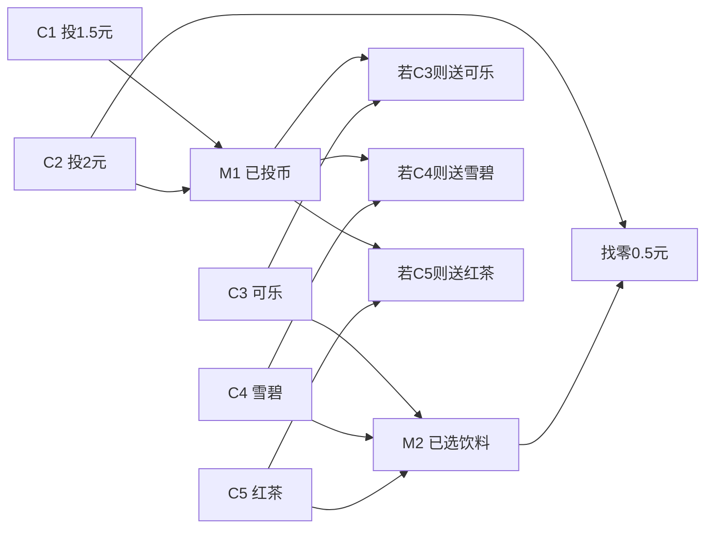

# 第4章专项题库：软件测试方法

本章题库只覆盖第 4 章“软件测试方法”。题目按小部分拆开，每个小部分固定包含 ==2 道问答题 + 5 道选择题==。答案直接给出，方便考前背诵。

说明：

- 标注“PPT 原题/改编”的题来自课件中的例题、课堂练习或课堂思考题。
- 题型偏向期末：简答、画表、画图、设计测试用例、覆盖分析和计算题。
- 第 4 章最容易考大题的是：==边界值分析、等价类划分、判定表、因果图、逻辑覆盖、基本路径==。

## 0. 第4章总览题

### 问答题 0-1：第4章有哪些主要测试方法？各自适合什么题型？

答案：

| 方法 | 适合题型 | 关键输出 |
| --- | --- | --- |
| Ad-hoc / ALAC / 错误推测 | 简答、选择 | 方法定义、适用场景 |
| 边界值分析 | 大题、测试用例表 | 边界值、边界附近值、用例表 |
| 等价类划分 | 大题、简答 | 有效/无效等价类、代表值 |
| 判定表 | 大题、画表 | 条件桩、动作桩、规则、用例 |
| 因果图 | 大题、画图画表 | 原因、结果、约束、判定表 |
| Pairwise / 正交试验 | 选择、简答 | 组合缩减、两两覆盖 |
| 控制流图 / DD 路径图 | 白盒大题基础 | 节点、边、路径 |
| 节点/边/路径覆盖 | 简答、选择 | 覆盖定义和强弱 |
| 逻辑覆盖 | 高频大题 | 判定覆盖、条件覆盖、判定-条件覆盖、条件组合覆盖 |
| 基本路径测试 | 高频大题 | 控制图、圈复杂度、基本路径基 |
| 数据流测试 | 简答、选择 | 定义、使用、定义-清除路径 |
| 变异测试 | 选择、简答 | 变体、击杀、变异评分 |
| 符号执行 | 选择、简答 | 路径条件、约束求解、自动生成输入 |

### 问答题 0-2：黑盒测试和白盒测试在第4章中的主线区别是什么？

答案：

黑盒测试从 ==规格说明和输入输出关系== 出发，不关心代码内部结构，典型方法是边界值分析、等价类划分、判定表、因果图、Pairwise 和正交试验。它更适合系统功能测试、验收测试和综合用例设计题。

白盒测试从 ==代码结构和执行路径== 出发，关心控制流、条件、路径、数据定义和使用，典型方法是控制流图、节点/边/路径覆盖、逻辑覆盖、基本路径和数据流测试。它更适合覆盖率分析、控制流图、基本路径和逻辑覆盖设计题。

English summary: black-box testing is specification-based; white-box testing is code-structure-based.

### 选择题 0-1

问题：下面哪一组方法主要属于黑盒测试？

A. 节点覆盖、边覆盖、路径覆盖  
B. 边界值分析、等价类划分、判定表、因果图  
C. 基本路径测试、数据流测试、MC/DC  
D. 变异测试、符号执行、DD 路径图  

答案：B。

解析：边界值、等价类、判定表、因果图都基于规格说明和输入输出关系，主要属于黑盒测试。

### 选择题 0-2

问题：下面哪一项最能概括白盒测试？

A. 只根据用户界面随便点击  
B. 不需要执行程序  
C. 基于源代码结构设计测试用例并度量覆盖率  
D. 只检查需求文档是否完整  

答案：C。

解析：白盒测试又称结构性测试或覆盖测试，基于程序内部结构设计测试用例。

### 选择题 0-3

问题：第4章最容易出大题的黑盒方法组合是？

A. Ad-hoc、ALAC、错误推测  
B. 边界值分析、等价类划分、判定表、因果图  
C. Pairwise、正交试验、符号执行  
D. 变异测试、数据流测试、静态分析  

答案：B。

解析：这四类方法最容易要求画表、写用例、解释设计过程。

### 选择题 0-4

问题：第4章最容易出白盒计算/画图大题的是？

A. TMap  
B. 基本路径测试  
C. A/B 测试  
D. 安装测试  

答案：B。

解析：基本路径测试常要求画控制流图、计算圈复杂度并列出基本路径基。

### 选择题 0-5

问题：关于“100% 覆盖率”的说法正确的是？

A. 100% 覆盖率证明程序没有错误  
B. 100% 覆盖率只能说明达到某覆盖标准，不能证明程序正确  
C. 100% 覆盖率只用于黑盒测试  
D. 100% 覆盖率说明所有输入都测试过  

答案：B。

解析：覆盖率是充分性线索，不是正确性证明。

## 1. 基于直觉和经验的方法

### 问答题 1-1：Ad-hoc、ALAC、错误推测法分别是什么？适合什么场景？

答案：

| 方法 | 定义 | 适合场景 | 风险 |
| --- | --- | --- | --- |
| Ad-hoc testing | 测试人员根据经验和直觉灵活测试 | 时间紧、需要快速探索、测试人员熟悉业务 | 可重复性差，覆盖难说明 |
| ALAC / Act-like-a-customer | 像真实客户一样使用系统 | 常用功能、主流程、预算低时优先测高频路径 | 可能忽略低频但高风险功能 |
| Error guessing | 根据经验猜测容易出错位置并针对性测试 | 旧版本缺陷、边界、空值、日期、异常输入 | 依赖测试人员经验 |

考试答题可以写：这三类方法都不是严格覆盖型方法，而是经验驱动方法，优点是快速、灵活，缺点是系统性和可度量性较弱。

### 问答题 1-2：为什么 ALAC 方法和 Pareto 80/20 规律有关？

答案：

ALAC 的思想是像客户一样使用产品。大量用户时间往往集中在少数常用功能上，根据 Pareto 80/20 规律，可能有 20% 的功能承担 80% 的使用量，也可能有大量缺陷集中在常用功能中。因此在测试时间和预算有限时，优先测试高频主流程可以较快发现对用户影响最大的缺陷。

这不代表低频功能不重要。某些低频功能如支付退款、权限管理、数据删除、安全设置虽然使用少，但风险很高，仍需要基于风险补充测试。

### 选择题 1-1

问题：ALAC 的含义是？

A. Always Look At Code  
B. Act Like A Customer  
C. Automatic Logic And Coverage  
D. Advanced Load Analysis Case  

答案：B。

解析：ALAC 是 Act-like-a-customer，强调像客户一样使用产品。

### 选择题 1-2

问题：错误推测法最依赖什么？

A. 测试人员经验和对缺陷模式的熟悉程度  
B. 编译器自动生成测试用例  
C. 正交表  
D. 圈复杂度公式  

答案：A。

解析：错误推测法基于经验和直觉推测潜在错误。

### 选择题 1-3

问题：下面哪一项最适合用错误推测法补充测试？

A. 输入为空、日期为 2 月 29 日、数组越界  
B. 所有路径线性无关性证明  
C. 计算圈复杂度  
D. 画 DD 路径图  

答案：A。

解析：空值、特殊日期、越界都是典型易错模式。

### 选择题 1-4

问题：关于 Ad-hoc 测试，正确的是？

A. 完全不需要测试人员经验  
B. 适合严格证明覆盖率  
C. 灵活但可重复性和覆盖说明较弱  
D. 只能用于白盒测试  

答案：C。

解析：Ad-hoc 的优势是灵活，短板是系统性和可重复性。

### 选择题 1-5

问题：预算很低、时间很紧时，优先测试用户最常使用的 20% 功能，这最符合哪种思想？

A. ALAC  
B. MC/DC  
C. 数据流测试  
D. 变异测试  

答案：A。

解析：ALAC 结合用户行为和 80/20 规律，优先高频路径。

## 2. 边界值分析法

### 问答题 2-1（PPT 原题/改编）：机器人佣金问题如何做普通边界值测试？

问题：

某商店销售机器人，机器人包含主控模块、通信模块、执行模块。每月三个模块销量范围分别为主控 `[1,80]`、通信 `[1,90]`、执行 `[1,100]`，价格分别为 90、60、50。佣金按销售额分段计算：`<=1000` 部分 10%，`>1000 且 <=2400` 部分 15%，`>2400` 部分 20%。请给出普通边界值测试思路和用例表。

答案：

普通边界值测试遵循单缺陷假设：每次只让一个输入变量取边界或边界附近值，其他变量取正常值。这里可取正常值：

- 主控正常值：40。
- 通信正常值：45。
- 执行正常值：50。

每个变量取 `min, min+1, max-1, max`，再加全正常值。PPT 表中选取了 13 个典型普通边界用例：

| ID | 主控 | 通信 | 执行 | 覆盖点 | 预期说明 |
| --- | --- | --- | --- | --- | --- |
| TC1 | 40 | 45 | 50 | 全正常 | 应正常计算佣金 |
| TC2 | 1 | 45 | 50 | 主控下界 | 合法边界 |
| TC3 | 2 | 45 | 50 | 主控下界附近 | 合法边界附近 |
| TC4 | 79 | 45 | 50 | 主控上界附近 | 合法边界附近 |
| TC5 | 80 | 45 | 50 | 主控上界 | 合法边界 |
| TC6 | 40 | 1 | 50 | 通信下界 | 合法边界 |
| TC7 | 40 | 2 | 50 | 通信下界附近 | 合法边界附近 |
| TC8 | 40 | 89 | 50 | 通信上界附近 | 合法边界附近 |
| TC9 | 40 | 90 | 50 | 通信上界 | 合法边界 |
| TC10 | 40 | 45 | 1 | 执行下界 | 合法边界 |
| TC11 | 40 | 45 | 2 | 执行下界附近 | 合法边界附近 |
| TC12 | 40 | 45 | 99 | 执行上界附近 | 合法边界附近 |
| TC13 | 40 | 45 | 100 | 执行上界 | 合法边界 |

还要补充一个关键说明：只按三个输入的销量边界测试还不够，因为佣金规则本身还有销售额边界 `1000` 和 `2400`。所以应再补充能让销售额落在 `1000`、`1000` 附近、`2400`、`2400` 附近的测试用例。

### 问答题 2-2（PPT 原题/改编）：保险费计算题如何结合边界值和判定表？

问题：

保险费 = 基础价 `1000 * 年龄因子 - 优惠`。年龄范围 `[2,80]`。如果过去一年就医次数超过对应年龄段门限，则无法得到优惠；如果就医次数超过 8 次则拒绝投保。年龄段如下：

| 年龄范围 | 年龄因子 | 就医次数门限 | 优惠 |
| --- | --- | --- | --- |
| `[2,12]` | 1.5 | 4 | 100 |
| `(12,25]` | 0.8 | 2 | 150 |
| `(25,45]` | 1.0 | 4 | 200 |
| `(45,65]` | 1.2 | 4 | 150 |
| `(65,80]` | 2.0 | 6 | 100 |

请给出边界值分析思路和应补充的规则表。

答案：

边界值：

| 变量 | 关键边界 |
| --- | --- |
| 年龄 | 2, 12, 13, 25, 26, 45, 46, 65, 66, 80，以及非法 1, 81 |
| 就医次数 | 0, 1, 2, 3, 4, 5, 6, 7, 8，以及非法/拒保边界 9 |

仅取年龄全局最小、最大和就医次数全局最小、最大是不够的，因为年龄段内部还有业务边界，优惠门限也随年龄段变化。

判定规则表：

| 规则 | 年龄段 | 就医次数 | 年龄因子 | 优惠 | 预期 |
| --- | --- | --- | --- | --- | --- |
| R1 | `[2,12]` | `0-4` | 1.5 | 100 | 可投保，有优惠 |
| R2 | `[2,12]` | `5-8` | 1.5 | 0 | 可投保，无优惠 |
| R3 | `(12,25]` | `0-2` | 0.8 | 150 | 可投保，有优惠 |
| R4 | `(12,25]` | `3-8` | 0.8 | 0 | 可投保，无优惠 |
| R5 | `(25,45]` | `0-4` | 1.0 | 200 | 可投保，有优惠 |
| R6 | `(25,45]` | `5-8` | 1.0 | 0 | 可投保，无优惠 |
| R7 | `(45,65]` | `0-4` | 1.2 | 150 | 可投保，有优惠 |
| R8 | `(45,65]` | `5-8` | 1.2 | 0 | 可投保，无优惠 |
| R9 | `(65,80]` | `0-6` | 2.0 | 100 | 可投保，有优惠 |
| R10 | `(65,80]` | `7-8` | 2.0 | 0 | 可投保，无优惠 |
| R11 | `[2,80]` | `>8` | - | - | 拒绝投保 |
| R12 | `<2 or >80` | 任意 | - | - | 年龄非法 |

### 选择题 2-1

问题：边界值分析法的基本依据是？

A. 所有错误都发生在代码注释里  
B. 很多错误发生在输入范围边界或边界附近  
C. 只要随机输入就能发现所有错误  
D. 只有白盒测试需要边界  

答案：B。

解析：边界值分析就是针对边界和边界附近值设计测试。

### 选择题 2-2

问题：对输入范围 `[a,b]`，健壮性边界值测试通常会考虑哪些值？

A. 只考虑 a 和 b  
B. 只考虑中间值  
C. `a-`, `a`, `a+`, `nom`, `b-`, `b`, `b+`  
D. 所有整数  

答案：C。

解析：健壮性测试考虑有效边界和无效边界。

### 选择题 2-3

问题：普通边界值测试的常见用例数公式是？

A. `4n + 1`  
B. `6n + 1`  
C. `5^n`  
D. `7^n`  

答案：A。

解析：普通边界值测试对每个变量取 4 个边界相关有效值，其他变量取正常值，再加一个全正常值。

### 选择题 2-4

问题：最坏情况测试和普通边界值测试的关键区别是？

A. 最坏情况测试不需要边界值  
B. 最坏情况测试考虑多个变量同时取边界组合  
C. 普通边界值测试考虑无效输入，最坏情况不考虑  
D. 二者完全相同  

答案：B。

解析：最坏情况测试基于多缺陷假设，考虑边界组合。

### 选择题 2-5

问题：如果输入有 3 个变量，普通边界值测试常见用例数为？

A. 7  
B. 13  
C. 15  
D. 125  

答案：B。

解析：`4n + 1 = 4*3 + 1 = 13`。

## 3. 等价类划分法

### 问答题 3-1（PPT 原题/改编）：三角形问题如何划分等价类并设计测试用例？

问题：

输入三个整数 `a,b,c`，范围均为 `[1,100]`，判断是否构成等边三角形、非等边但等腰三角形、非等腰三角形或不构成三角形。请划分等价类并给出测试用例。

答案：

第一层按输入范围划分：

| 变量 | 有效等价类 | 无效等价类 |
| --- | --- | --- |
| a | `1<=a<=100` | `a<1`, `a>100` |
| b | `1<=b<=100` | `b<1`, `b>100` |
| c | `1<=c<=100` | `c<1`, `c>100` |

第二层按输出域细分：

| 输出类 | 条件 | 代表用例 | 预期 |
| --- | --- | --- | --- |
| 等边 | `a=b=c` 且合法 | `50,50,50` | 等边三角形 |
| 等腰 1 | `a=b!=c` 且构成三角形 | `50,50,60` | 等腰三角形 |
| 等腰 2 | `b=c!=a` 且构成三角形 | `60,50,50` | 等腰三角形 |
| 等腰 3 | `a=c!=b` 且构成三角形 | `50,60,50` | 等腰三角形 |
| 普通三角形 | 三边互不相等且满足三角形不等式 | `30,40,50` | 普通三角形 |
| 非三角形 | 不满足三角形不等式 | `1,2,3` 或 `2,2,4` | 不构成三角形 |
| a 无效低 | `a<1` | `0,50,50` | a 不在有效范围 |
| a 无效高 | `a>100` | `101,50,50` | a 不在有效范围 |
| b 无效低 | `b<1` | `50,0,50` | b 不在有效范围 |
| b 无效高 | `b>100` | `50,101,50` | b 不在有效范围 |
| c 无效低 | `c<1` | `50,50,0` | c 不在有效范围 |
| c 无效高 | `c>100` | `50,50,101` | c 不在有效范围 |

关键说明：只测试 `50,50,50` 不能代表所有合法三角形，因为合法三角形还包含等腰、普通和非三角形边界情形。等价类应根据程序实际处理逻辑继续细分。

### 问答题 3-2（PPT 原题/改编）：注册程序如何用等价类设计用例？

问题：

注册程序包含用户名、密码、确认密码、验证码。条件如下：

- C1：用户名长度在 `[4,18]`。
- C2：用户名以字母开头。
- C3：用户名只包含字母、数字、下划线。
- C4：密码长度在 `[6,16]`。
- C5：确认密码与密码相同。
- C6：验证码正确。

请给出等价类和测试用例。

答案：

等价类：

| 条件 | 有效等价类 | 无效等价类 |
| --- | --- | --- |
| C1 | 用户名长度 4-18 | 长度 <4 或 >18 |
| C2 | 字母开头 | 非字母开头 |
| C3 | 只含字母、数字、下划线 | 含非法字符 |
| C4 | 密码长度 6-16 | 长度 <6 或 >16 |
| C5 | 确认密码等于密码 | 不相等 |
| C6 | 验证码正确 | 验证码错误 |

弱健壮测试用例表：

| ID | 用户名 | 密码 | 确认密码 | 验证码 | 预期 |
| --- | --- | --- | --- | --- | --- |
| TC1 | `Abcd_123` | `123456` | `123456` | `test` | 注册成功 |
| TC2 | `abc` | `123456` | `123456` | `test` | 注册失败，用户名太短 |
| TC3 | `A123456789012345678` | `123456` | `123456` | `test` | 注册失败，用户名太长 |
| TC4 | `1234abc` | `123456` | `123456` | `test` | 注册失败，非字母开头 |
| TC5 | `A@123` | `123456` | `123456` | `test` | 注册失败，用户名含非法字符 |
| TC6 | `Abcd_123` | `1234` | `1234` | `test` | 注册失败，密码太短 |
| TC7 | `Abcd_123` | `12345678901234567` | `12345678901234567` | `test` | 注册失败，密码太长 |
| TC8 | `Abcd_123` | `123456` | `654321` | `test` | 注册失败，确认密码不一致 |
| TC9 | `Abcd_123` | `123456` | `123456` | `tttt` | 注册失败，验证码错误 |

### 选择题 3-1

问题：等价类划分法的核心思想是？

A. 对输入域进行分类，每类选代表值测试  
B. 只测试最大值  
C. 只测试代码分支  
D. 只测试性能指标  

答案：A。

解析：等价类划分通过代表值减少测试数量。

### 选择题 3-2

问题：有效等价类的含义是？

A. 对规格说明合理、有意义的输入集合  
B. 一定会导致程序崩溃的输入集合  
C. 不需要测试的输入集合  
D. 只包含边界外数据的集合  

答案：A。

解析：有效等价类用于检验正常功能和性能。

### 选择题 3-3

问题：无效等价类主要用于检查？

A. 程序是否能正确处理非法或异常输入  
B. 程序是否达到 100% 路径覆盖  
C. 程序是否使用了继承  
D. 程序是否安装成功  

答案：A。

解析：无效等价类考察错误处理和健壮性。

### 选择题 3-4

问题：强一般等价类测试的特点是？

A. 只考虑有效等价类，并覆盖所有有效类组合  
B. 只考虑无效等价类  
C. 只要求每个类出现一次，不管组合  
D. 覆盖所有无效类组合  

答案：A。

解析：强表示覆盖组合，一般表示只考虑有效类。

### 选择题 3-5

问题：如果某个已划分等价类内部的元素在程序中处理方式不同，应当怎么办？

A. 不管它，仍只选一个值  
B. 删除该等价类  
C. 继续细分为更小的等价类  
D. 改用圈复杂度公式  

答案：C。

解析：等价类要求类内行为相似；处理方式不同就要细分。

## 4. 判定表方法

### 问答题 4-1（PPT 原题/改编）：打印机问题如何构造并优化判定表？

问题：

打印机有三个条件：驱动程序是否正确、是否有纸、是否有墨粉。动作包括打印内容、提示驱动程序不对、提示没有纸张、提示没有墨粉。请构造优化判定表并给出用例。

答案：

条件：

- C1：驱动程序是否正确。
- C2：是否有纸。
- C3：是否有墨粉。

动作：

- A1：打印内容。
- A2：提示驱动程序不对。
- A3：提示没有纸张。
- A4：提示没有墨粉。

优化判定表：

| 规则 | C1 驱动正确 | C2 有纸 | C3 有墨 | A1 打印 | A2 驱动错 | A3 无纸 | A4 无墨 |
| --- | --- | --- | --- | --- | --- | --- | --- |
| R1 | 1 | 1 | 1 | 1 | 0 | 0 | 0 |
| R2 | 0 | 1 | 1 | 0 | 1 | 0 | 0 |
| R3 | - | 1 | 0 | 0 | 0 | 0 | 1 |
| R4 | - | 0 | - | 0 | 0 | 1 | 0 |

测试用例：

| ID | 驱动正确 | 有纸 | 有墨 | 预期 |
| --- | --- | --- | --- | --- |
| TC1 | 是 | 是 | 是 | 打印内容 |
| TC2 | 否 | 是 | 是 | 提示驱动程序不对 |
| TC3 | 是/否 | 是 | 否 | 提示没有墨粉 |
| TC4 | 是/否 | 否 | 是/否 | 提示没有纸张 |

注意：`-` 表示该条件对当前规则的动作没有影响，但合并后必须检查是否产生“不一致判定表”，即输入有重叠但输出不同。

### 问答题 4-2（PPT 原题/改编）：NextDate 问题为什么不能只用简单三条件判定表？

问题：

NextDate 输入 year、month、day，输出下一天日期。输入范围为 year、month、day 的合法范围。为什么只用 “year 是否合法、month 是否合法、day 是否合法” 的判定表不够？应如何改进？

答案：

只判断 `year`、`month`、`day` 是否处于粗略范围太粗，因为不同月份天数不同，2 月还受闰年影响。例如：

- `2000-02-29` 合法，下一天是 `2000-03-01`。
- `2001-02-29` 非法。
- `2000-04-31` 非法。
- `2000-08-31` 合法，下一天是 `2000-09-01`。

改进方法：

| 抽象条件 | 分类 |
| --- | --- |
| 年份 | 闰年 Y1、非闰年 Y2、非法年份 |
| 月份 | 30 天月份 M1、31 天月份 M2、2 月 M3、非法月份 |
| 日期 | 1-28 日 D1、29 日 D2、30 日 D3、31 日 D4、非法日期 |

再根据组合确定动作：

- 普通日期：day + 1。
- 月末：进入下月 1 日。
- 年末：进入下一年 1 月 1 日。
- 非法日期：提示输入非法。

### 选择题 4-1

问题：判定表最适合哪类问题？

A. 多个条件组合决定多个动作  
B. 只需要测单个变量边界  
C. 只需要计算圈复杂度  
D. 只需要静态代码扫描  

答案：A。

解析：判定表用于条件组合与动作之间的映射。

### 选择题 4-2

问题：判定表中“条件桩”表示？

A. 所有输入条件  
B. 所有输出动作  
C. 某条规则下条件取值  
D. 具体测试数据  

答案：A。

解析：条件桩列出所有条件名称。

### 选择题 4-3

问题：判定表中 `-` 通常表示？

A. 条件非法  
B. 条件对当前动作无影响，don't care  
C. 测试失败  
D. 必须取 0  

答案：B。

解析：`-` 表示该条件取 0 或 1 不影响当前规则。

### 选择题 4-4

问题：不一致判定表指的是？

A. 条件过多  
B. 动作过少  
C. 两列规则输入有重叠但输出不同  
D. 所有条件都是二值  

答案：C。

解析：输入重叠却对应不同动作，会导致规则矛盾。

### 选择题 4-5

问题：判定表每一列规则通常应转化为？

A. 一个或一组测试用例  
B. 一个变量定义节点  
C. 一个圈复杂度公式  
D. 一个变异算子  

答案：A。

解析：判定表法最终要从规则生成测试用例。

## 5. 因果图法

### 问答题 5-1（PPT 原题/改编）：自动售货机如何画因果图并转测试用例？

问题：

饮料单价 1.5 元。投入 1.5 元并按“可乐/雪碧/红茶”按钮，送出对应饮料；投入 2 元并选择饮料，送出饮料并找零 0.5 元。请给出原因、结果、约束、因果逻辑和测试用例。

答案：

原因：

| 编号 | 原因 |
| --- | --- |
| C1 | 投入 1.5 元 |
| C2 | 投入 2 元 |
| C3 | 按可乐 |
| C4 | 按雪碧 |
| C5 | 按红茶 |

结果：

| 编号 | 结果 |
| --- | --- |
| E1 | 送出可乐 |
| E2 | 送出雪碧 |
| E3 | 送出红茶 |
| E4 | 找零 0.5 元 |

中间状态：

- M1：已投币 = C1 OR C2。
- M2：已选饮料 = C3 OR C4 OR C5。

约束：

- C1 和 C2 互斥且有且仅有一个成立。
- C3、C4、C5 互斥且有且仅有一个成立。

因果逻辑：



测试用例：

| ID | 投币 | 选择 | 预期 |
| --- | --- | --- | --- |
| TC1 | 1.5 元 | 可乐 | 送出可乐，不找零 |
| TC2 | 1.5 元 | 雪碧 | 送出雪碧，不找零 |
| TC3 | 1.5 元 | 红茶 | 送出红茶，不找零 |
| TC4 | 2 元 | 可乐 | 送出可乐，找零 0.5 元 |
| TC5 | 2 元 | 雪碧 | 送出雪碧，找零 0.5 元 |
| TC6 | 2 元 | 红茶 | 送出红茶，找零 0.5 元 |

如果要测异常，还可补充未投币按按钮、投币后不选饮料、同时按多个按钮、非法金额等。

### 问答题 5-2：因果图法答题模板是什么？

答案：

因果图大题按固定模板答：

1. 从规格说明中找原因，也就是输入条件或触发事件。
2. 找结果，也就是系统输出、提示、动作或状态变化。
3. 给原因和结果编号。
4. 写逻辑关系：恒等、非、或、与。
5. 写约束：互斥、包含、唯一、要求、屏蔽。
6. 画因果图。
7. 把因果图转成判定表。
8. 把判定表每列规则转成测试用例。

如果考试时间紧，可以至少给出原因/结果表、约束说明、判定表和用例表；图画得简洁但逻辑要对。

### 选择题 5-1

问题：因果图法中的“原因”通常对应？

A. 输入条件或触发事件  
B. 圈复杂度  
C. 测试报告编号  
D. 代码行号  

答案：A。

解析：原因是导致结果发生的输入条件或事件。

### 选择题 5-2

问题：因果图法最终通常要转成什么来生成测试用例？

A. 判定表  
B. 甘特图  
C. 燃尽图  
D. 类图  

答案：A。

解析：因果图 -> 判定表 -> 测试用例。

### 选择题 5-3

问题：“三个按钮最多只能按一个”属于哪类约束？

A. 互斥约束  
B. 包含约束  
C. 路径覆盖  
D. 变量定义  

答案：A。

解析：多个条件不能同时成立，属于互斥。

### 选择题 5-4

问题：因果图法最适合处理？

A. 输入条件之间有逻辑关系且共同影响输出的场景  
B. 单个变量取值范围边界  
C. 内存泄漏定位  
D. 数据库索引优化  

答案：A。

解析：因果图强调输入原因和输出结果之间的逻辑关系。

### 选择题 5-5

问题：下面哪一项不是因果图基本逻辑关系？

A. 与  
B. 或  
C. 非  
D. 圈复杂度  

答案：D。

解析：圈复杂度属于基本路径测试，不是因果图基本关系。

## 6. Pairwise 与正交试验法

### 问答题 6-1（PPT 原题/改编）：三个属性 A/B/C 各 3 个取值，如何构造 Pairwise 用例？

问题：

属性 A、B、C 各有 3 个取值：`A1,A2,A3`，`B1,B2,B3`，`C1,C2,C3`。全组合有 27 种。请给出满足 pairwise 的 9 个用例。

答案：

满足 pairwise 的用例集合如下：

| ID | A | B | C |
| --- | --- | --- | --- |
| TC1 | A1 | B1 | C1 |
| TC2 | A1 | B2 | C2 |
| TC3 | A1 | B3 | C3 |
| TC4 | A2 | B1 | C2 |
| TC5 | A2 | B2 | C3 |
| TC6 | A2 | B3 | C1 |
| TC7 | A3 | B1 | C3 |
| TC8 | A3 | B2 | C1 |
| TC9 | A3 | B3 | C2 |

解释：这 9 个用例能覆盖任意两个属性之间所有取值组合。例如 A-B 的 9 种组合全部出现，A-C 和 B-C 的组合也全部出现。它比全组合 27 个用例更少，但仍保持较好的组合覆盖能力。

### 问答题 6-2：Pairwise 和正交试验法的共同点与区别是什么？

答案：

共同点：

- 都用于处理组合爆炸问题。
- 都从大量潜在用例中选择较少且有代表性的组合。
- 都适合多参数、多取值场景。

区别：

| 对比项 | Pairwise | 正交试验法 |
| --- | --- | --- |
| 核心目标 | 覆盖所有两两参数取值组合 | 利用正交表均衡安排实验 |
| 关注 | 任意两个因素交互 | 因素和水平的均衡代表性 |
| 输出 | 两两覆盖用例集 | 正交表映射出的用例集 |
| 工具依赖 | 常用工具生成，支持约束 | 需要选择合适正交表 |

### 选择题 6-1

问题：Pairwise 方法要求覆盖什么？

A. 所有单个参数取值  
B. 所有两个参数取值组合  
C. 所有完整参数组合  
D. 所有代码路径  

答案：B。

解析：Pairwise 即两两组合覆盖。

### 选择题 6-2

问题：Pairwise 方法主要解决什么问题？

A. 组合爆炸导致全组合测试不可行  
B. 代码无法编译  
C. 内存泄漏  
D. 测试报告格式混乱  

答案：A。

解析：多参数全组合数量巨大，Pairwise 用较少用例覆盖两两组合。

### 选择题 6-3

问题：三个属性各 3 个取值，全组合数是多少？

A. 6  
B. 9  
C. 27  
D. 81  

答案：C。

解析：`3*3*3=27`。

### 选择题 6-4

问题：Pairwise 的局限是？

A. 可能漏掉需要三个或更多因素共同触发的错误  
B. 无法减少用例数量  
C. 不能用于黑盒测试  
D. 必然覆盖所有路径  

答案：A。

解析：Pairwise 只保证两两组合，不保证三因素及以上组合。

### 选择题 6-5

问题：正交试验法设计用例前通常需要先确定？

A. 输入因素、每个因素的水平以及正交表  
B. 圈复杂度  
C. 变异评分  
D. DD 路径向量  

答案：A。

解析：正交试验法依赖因素、水平和正交表。

## 7. 控制流图与 DD 路径图

### 问答题 7-1：什么是控制流图？为什么图中存在路径不等于实际可执行？

答案：

控制流图 CFG 是用图表示程序执行流的结构：节点表示语句或语句块，边表示可能的控制转移。它能把程序分支、循环和跳转抽象成图上的路径，便于做节点覆盖、边覆盖、路径覆盖和基本路径分析。

但是图中存在路径不等于实际可执行，因为路径可行性还受变量取值、条件之间逻辑关系和数据约束影响。例如：

```text
if (x > 10) {
  ...
}
if (x < 0) {
  ...
}
```

控制流图可能看起来可以连续经过两个 true 分支，但实际同一个 x 不可能同时满足 `x>10` 和 `x<0`。所以控制流路径需要结合路径条件判断是否可行。

### 问答题 7-2：什么是 DD 路径？DD 路径图有什么作用？

答案：

DD 路径是 decision-to-decision path，即从入口节点或判定节点出发，到下一个判定节点或出口节点结束，中间不再包含其他判定节点的一段路径。

DD 路径图把控制流图中连续的串行语句压缩为一个节点，使图更简洁。它的作用：

- 降低控制流图复杂度。
- 更方便做路径覆盖和基本路径测试。
- 避免把无分支的连续语句逐句画得过细。
- 让分支结构更清楚。

### 选择题 7-1

问题：控制流图中的节点通常表示？

A. 程序语句或语句块  
B. 测试人员姓名  
C. 项目预算  
D. 数据库表数量  

答案：A。

解析：CFG 节点表示语句或基本块，边表示执行流。

### 选择题 7-2

问题：控制流图中的边表示？

A. 执行流转移  
B. 代码注释  
C. 测试环境  
D. 缺陷严重级别  

答案：A。

解析：边连接可能的执行顺序。

### 选择题 7-3

问题：DD 路径图的主要作用是？

A. 压缩连续无分支语句，使控制结构更简洁  
B. 替代需求文档  
C. 生成所有输入数据  
D. 计算销售佣金  

答案：A。

解析：DD 路径图将连续串行节点合并。

### 选择题 7-4

问题：以下哪一项最可能导致控制流图路径不可行？

A. 路径条件互相矛盾  
B. 节点太少  
C. 变量名太短  
D. 测试报告没有封面  

答案：A。

解析：路径可行性取决于是否存在输入满足路径条件。

### 选择题 7-5

问题：DD 路径中的中间部分不能包含什么？

A. 判定节点  
B. 普通语句  
C. 顺序执行语句  
D. 赋值语句  

答案：A。

解析：DD 路径从判定到判定，中间不含其他判定。

## 8. 基于程序图的覆盖

### 问答题 8-1：节点覆盖、边覆盖、路径覆盖分别是什么？强弱关系如何？

答案：

| 覆盖标准 | 定义 | 强弱 |
| --- | --- | --- |
| 节点覆盖 | 每个节点至少执行一次 | 较弱 |
| 边覆盖/分支覆盖 | 每条边至少执行一次 | 强于节点覆盖 |
| 路径覆盖 | 每条路径至少执行一次 | 最强但通常不可行 |

强弱关系：


路径覆盖蕴含边覆盖，边覆盖蕴含节点覆盖。但反过来不成立：节点都执行过，不代表每条边都执行过；每条边都执行过，也不代表所有路径组合都执行过。

### 问答题 8-2（PPT 思考题改编）：为什么边覆盖仍可能遗漏错误？

答案：

边覆盖要求每条边至少走一次，但可能只覆盖部分路径组合。若一个程序有两个独立分支，每个分支都有 true/false 两条边，则边覆盖可以用两个用例覆盖所有边：

- 用例 1：第一个分支 true，第二个分支 true。
- 用例 2：第一个分支 false，第二个分支 false。

这样虽然每条边都出现过，但没有测试：

- true -> false。
- false -> true。

如果错误只在这种组合路径上触发，边覆盖会遗漏。因此路径覆盖更强，但循环会导致路径数爆炸，实际中常用基本路径测试折中。

### 选择题 8-1

问题：以下覆盖标准中通常最弱的是？

A. 节点覆盖  
B. 边覆盖  
C. 路径覆盖  
D. 条件组合覆盖  

答案：A。

解析：节点覆盖只要求节点至少执行一次。

### 选择题 8-2

问题：边覆盖又常称为？

A. 分支覆盖  
B. 变异覆盖  
C. 数据定义覆盖  
D. 正交覆盖  

答案：A。

解析：边覆盖要求分支边都执行，常与分支覆盖对应。

### 选择题 8-3

问题：路径覆盖在实际中常不现实的主要原因是？

A. 循环可能导致路径数量无限或极大  
B. 不能画图  
C. 不需要测试数据  
D. 只能用于黑盒测试  

答案：A。

解析：循环和组合分支会导致路径爆炸。

### 选择题 8-4

问题：边覆盖一定蕴含节点覆盖吗？

A. 通常是，因为经过边必经过相关节点  
B. 否，边覆盖和节点覆盖完全无关  
C. 只有在黑盒测试中成立  
D. 只在没有 if 时成立  

答案：A。

解析：覆盖所有边通常会经过边连接的节点，因此强于节点覆盖。

### 选择题 8-5

问题：节点覆盖达到 100%，说明什么？

A. 所有节点至少执行一次  
B. 所有路径都执行过  
C. 程序没有错误  
D. 所有条件组合都执行过  

答案：A。

解析：100% 节点覆盖只说明节点层面的覆盖满足。

## 9. 逻辑覆盖

### 问答题 9-1（PPT 原题/改编）：判定覆盖、条件覆盖、判定-条件覆盖、条件组合覆盖如何定义和比较？

答案：

定义：

| 覆盖 | 定义 |
| --- | --- |
| 判定覆盖 / 分支覆盖 | 每个判定整体结果 true 和 false 至少各出现一次 |
| 条件覆盖 | 每个基本条件 true 和 false 至少各出现一次 |
| 判定-条件覆盖 | 同时满足判定覆盖和条件覆盖 |
| 条件组合覆盖 | 每个判定中所有条件取值组合都至少出现一次 |

比较：

- 判定覆盖和条件覆盖互不蕴含。
- 判定-条件覆盖强于判定覆盖和条件覆盖。
- 条件组合覆盖强于判定-条件覆盖。

考试不能写成“判定覆盖 < 条件覆盖”。这是错的，因为两者互不蕴含。

### 问答题 9-2（PPT 原题/改编）：为两个判定设计判定-条件覆盖和条件组合覆盖用例。

问题：

有两个判定：

```text
D1 = (x > 0) && (y < 10)
D2 = (x == 2) && (z > 6)
```

请设计判定-条件覆盖和条件组合覆盖测试用例。

答案：

条件：

- C1：`x > 0`
- C2：`y < 10`
- C3：`x == 2`
- C4：`z > 6`

判定-条件覆盖：

| 用例 | x | y | z | C1 | C2 | D1 | C3 | C4 | D2 |
| --- | --- | --- | --- | --- | --- | --- | --- | --- | --- |
| TC1 | 2 | 5 | 8 | T | T | T | T | T | T |
| TC2 | -1 | 12 | 5 | F | F | F | F | F | F |

说明：每个条件都取过 T/F，每个判定也取过 T/F。

条件组合覆盖：

| 用例 | x | y | z | C1 | C2 | D1 | C3 | C4 | D2 |
| --- | --- | --- | --- | --- | --- | --- | --- | --- | --- |
| TC1 | 2 | 5 | 8 | T | T | T | T | T | T |
| TC2 | 2 | 12 | 5 | T | F | F | T | F | F |
| TC3 | -1 | 5 | 8 | F | T | F | F | T | F |
| TC4 | -1 | 12 | 5 | F | F | F | F | F | F |

说明：对每个二条件判定，`TT, TF, FT, FF` 四种组合都出现。

### 选择题 9-1

问题：判定覆盖要求？

A. 每个判定的 true 和 false 结果都至少出现一次  
B. 每个变量都被赋值两次  
C. 每个路径都执行一次  
D. 每个输入都取最大值  

答案：A。

解析：判定覆盖又称分支覆盖。

### 选择题 9-2

问题：条件覆盖要求？

A. 每个基本条件 true 和 false 都至少出现一次  
B. 每个判定只取 true  
C. 每条路径都无环  
D. 每个变体都被击杀  

答案：A。

解析：条件覆盖关注不可再分的条件。

### 选择题 9-3

问题：判定覆盖和条件覆盖的关系是？

A. 判定覆盖一定蕴含条件覆盖  
B. 条件覆盖一定蕴含判定覆盖  
C. 二者互不蕴含  
D. 二者完全相同  

答案：C。

解析：课件专门给了反例，二者互不蕴含。

### 选择题 9-4

问题：条件组合覆盖对一个含 3 个独立条件的判定，理论上需要覆盖多少种条件组合？

A. 3  
B. 4  
C. 6  
D. 8  

答案：D。

解析：`2^3=8`。

### 选择题 9-5

问题：MC/DC 的关键要求是？

A. 每个条件都能独立影响判定结果  
B. 只覆盖一个节点  
C. 只测试非法输入  
D. 只执行所有语句一次  

答案：A。

解析：MC/DC 要找成对用例，其他条件不变，目标条件变化并导致判定结果变化。

## 10. 基本路径测试

### 问答题 10-1（PPT 原题/改编）：给定图 E=9、N=6，如何计算圈复杂度并列基本路径基？

问题：

某 DD 路径图有 6 个节点、9 条边，单入口单出口，不是强连通图。课件示例中的基本路径基包括 `a->c->f`、`a->d->c->f` 等。请计算圈复杂度并给出一组基本路径基。

答案：

圈复杂度：

```text
V(G) = E - N + 2 = 9 - 6 + 2 = 5
```

因此基本路径基中应有 5 条线性无关路径。

一组基本路径基：

| 编号 | 基本路径 |
| --- | --- |
| P1 | `a -> c -> f` |
| P2 | `a -> d -> c -> f` |
| P3 | `a -> b -> e -> f` |
| P4 | `a -> b -> e -> b -> e -> f` |
| P5 | `a -> b -> e -> a -> c -> f` |

说明：基本路径基不唯一，只要路径向量线性无关，并且能组合出图中的其他路径，数量等于圈复杂度即可。

### 问答题 10-2（PPT/考情改编）：两重 for 循环的基本路径题怎么答？

答案：

答题步骤：

1. 把入口、外层 for 条件、内层 for 条件、循环体、内层更新、外层更新、出口画成控制流图节点。
2. 给每个判定画 true 和 false 两条边。
3. 统计节点数 N 和边数 E。
4. 用 `V(G)=E-N+2` 计算基本路径数量。
5. 列基本路径基，至少覆盖：
   - 外层循环 0 次。
   - 外层进入、内层 0 次。
   - 外层进入、内层 1 次。
   - 内层循环回边。
   - 外层循环回边。

示例框架：

| 路径 | 含义 |
| --- | --- |
| P1 | 外层条件 false，直接退出 |
| P2 | 外层 true，内层 false，然后外层更新再退出 |
| P3 | 外层 true，内层 true，执行一次内层体，然后退出内层和外层 |
| P4 | 外层 true，内层 true，内层回边至少一次 |
| P5 | 外层 true，完成内层后外层回边至少一次 |

最终路径数必须以题目给定图的 E、N 或判定节点数为准，不要死背“两重循环一定 5 条”。

### 选择题 10-1

问题：单入口单出口控制流图常用圈复杂度公式是？

A. `V(G)=E-N+2`  
B. `V(G)=E+N+2`  
C. `V(G)=N-E+2`  
D. `V(G)=2^N`  

答案：A。

解析：基本路径测试常用公式 `E-N+2`。

### 选择题 10-2

问题：圈复杂度度量的是？

A. 基本路径基中的路径数目  
B. 测试人员人数  
C. 等价类数量  
D. 页面数量  

答案：A。

解析：圈复杂度给出线性无关路径数量。

### 选择题 10-3

问题：基本路径基的特点是？

A. 路径向量彼此线性无关  
B. 必须包含所有可能循环次数  
C. 只能有一组唯一答案  
D. 只适用于黑盒测试  

答案：A。

解析：基本路径基不唯一，但要求线性无关并能表示其他路径。

### 选择题 10-4

问题：若某图 E=12、N=9，单入口单出口，则圈复杂度为？

A. 1  
B. 3  
C. 5  
D. 21  

答案：C。

解析：`12-9+2=5`。

### 选择题 10-5

问题：结构化程序中，如果有 4 个二分支判定节点，圈复杂度通常可估算为？

A. 4  
B. 5  
C. 8  
D. 16  

答案：B。

解析：常用等价公式是“判定节点数 + 1”。

## 11. 数据流测试

### 问答题 11-1：数据定义、数据使用、p-use、c-use、定义-清除路径分别是什么？

答案：

| 概念 | 定义 | 例子 |
| --- | --- | --- |
| 数据定义 Definition | 变量获得或改变值 | 声明、初始化、赋值、scanf、参数实例化 |
| 数据使用 Use | 变量值被读取 | 表达式、参数、条件、printf、return |
| p-use | 谓词使用，变量用于判定条件 | `if (x > 0)` |
| c-use | 计算使用，变量用于计算或输出 | `y = x + 1`, `return x` |
| 定义-使用路径 | 从某变量定义到同变量使用的路径 | `x=1` 到 `print(x)` |
| 定义-清除路径 | 定义到使用之间没有重新定义该变量 | `x=1 -> if -> print(x)`，中间没有 `x=...` |

数据流测试关注变量生命周期，能发现定义后不用、未定义就用、使用前重复定义、未初始化读取等问题。

### 问答题 11-2（PPT 原题/改编）：全定义、全使用、全定义-使用覆盖有什么区别？

答案：

| 覆盖标准 | 要求 | 强弱 |
| --- | --- | --- |
| 全定义 All-defs | 每个变量的每个定义至少到达某个使用 | 较弱 |
| 全使用 All-uses | 每个定义到每个可达使用至少覆盖一条定义-清除路径 | 更强 |
| 全定义-使用 All-du-paths | 对每个定义-使用对，覆盖所有无环或只绕环一次的定义-清除路径 | 最强 |

区别举例：

如果变量 `x` 在节点 a 定义，在 d 和 e 使用：

- 全定义：只要覆盖 a 到 d 或 a 到 e 中一条即可。
- 全使用：a 到 d、a 到 e 都要覆盖至少一条定义-清除路径。
- 全定义-使用：如果 a 到 d 有多条无环定义-清除路径，这些路径都要覆盖。

### 选择题 11-1

问题：下面哪一项属于变量定义？

A. `x = 5`  
B. `print(x)`  
C. `if (x > 0)`  
D. `return x`  

答案：A。

解析：赋值左侧变量被定义。

### 选择题 11-2

问题：`if (x > 0)` 中的 x 属于？

A. p-use  
B. c-use  
C. 变体  
D. 正交表  

答案：A。

解析：变量用于谓词判断，属于谓词使用。

### 选择题 11-3

问题：定义-清除路径要求？

A. 从定义到使用之间没有再次定义同一变量  
B. 路径上不能有任何节点  
C. 只能包含非法输入  
D. 必须击杀变体  

答案：A。

解析：definition-clear 表示中间没有重新定义该变量。

### 选择题 11-4

问题：哪种数据流覆盖通常最强？

A. 全定义覆盖  
B. 全使用覆盖  
C. 全定义-使用路径覆盖  
D. 节点覆盖  

答案：C。

解析：全定义-使用路径覆盖要求覆盖更多定义-使用路径。

### 选择题 11-5

问题：数据流测试主要从什么角度设计测试？

A. 变量的定义和使用  
B. 用户满意度  
C. 页面颜色  
D. 项目预算  

答案：A。

解析：数据流测试关注 def-use。

## 12. 变异测试

### 问答题 12-1：什么是变异测试？变体、击杀、等价变体、变异评分分别是什么？

答案：

变异测试通过对原程序注入微小错误，生成变体程序，再运行测试用例，看测试用例能否发现这些错误，从而评估测试用例有效性。

| 概念 | 定义 |
| --- | --- |
| Mutant / 变体 | 原程序经过变异算子改写得到的程序 |
| Kill / 击杀 | 某测试用例使原程序和变体输出不同 |
| Equivalent mutant / 等价变体 | 与原程序行为等价，任何测试用例无法区分 |
| Mutation score / 变异评分 | 被击杀变体数 / 非等价变体数 |

公式：

```text
变异评分 = killed mutants / (total mutants - equivalent mutants)
```

### 问答题 12-2：强变异测试和弱变异测试有什么区别？

答案：

击杀变体通常需要三个条件：

1. 测试路径经过变异语句。
2. 变异语句造成程序内部状态差异。
3. 内部状态差异传播到外部可见输出。

| 类型 | 要求 |
| --- | --- |
| 强变异测试 | 满足三条，外部输出不同 |
| 弱变异测试 | 只要求前两条，即内部状态已经不同 |

强变异更接近真实测试失败，但成本更高；弱变异更容易检测内部差异，成本较低。

### 选择题 12-1

问题：变异测试主要用于评估？

A. 测试用例发现人为注入小错误的能力  
B. 用户界面颜色  
C. 项目进度  
D. 数据库容量  

答案：A。

解析：变异测试度量测试用例有效性。

### 选择题 12-2

问题：如果某测试用例使原程序和变体输出不同，则称该变体？

A. 被击杀  
B. 被安装  
C. 被部署  
D. 被压缩  

答案：A。

解析：输出不同表示 mutant killed。

### 选择题 12-3

问题：等价变体指？

A. 与原程序行为等价，测试用例无法区分  
B. 一定会崩溃的变体  
C. 没有编译的变体  
D. 只包含注释的变体  

答案：A。

解析：等价变体不能被测试用例击杀，应从分母中排除。

### 选择题 12-4

问题：变异算子的目的通常是？

A. 模拟程序员可能犯的简单错误  
B. 生成项目计划  
C. 删除测试报告  
D. 增加用户数量  

答案：A。

解析：变异算子如替换操作符、替换关系符、删除语句等。

### 选择题 12-5

问题：若总变体 100 个，等价变体 10 个，被击杀 72 个，变异评分为？

A. 0.72  
B. 0.80  
C. 0.90  
D. 0.10  

答案：B。

解析：`72 / (100-10) = 72/90 = 0.8`。

## 13. 基于约束的测试与符号执行

### 问答题 13-1（PPT 原题/改编）：路径 `A->B->C->B->C->B->D->F` 的符号执行结果为什么可由 `y=2` 满足？

问题：

课件示例中，路径 `A->B->C->B->C->B->D->F` 经过两次循环后退出。路径条件为：

```text
abs(y) != 0
abs(y) - 1 != 0
abs(y) - 2 = 0
y >= 0
```

为什么 `y=2` 可以满足？

答案：

逐项代入 `y=2`：

| 条件 | 代入结果 | 是否满足 |
| --- | --- | --- |
| `abs(y) != 0` | `abs(2)=2 != 0` | 满足 |
| `abs(y)-1 != 0` | `2-1=1 != 0` | 满足 |
| `abs(y)-2 = 0` | `2-2=0` | 满足 |
| `y >= 0` | `2>=0` | 满足 |

所以路径条件可满足，该路径实际可行。符号执行的关键就是把路径转化为逻辑约束，再用约束求解器判断是否存在输入。

### 问答题 13-2：动态符号执行（concolic execution）的步骤是什么？

答案：

动态符号执行结合 concrete execution 和 symbolic execution。

步骤：

1. 随机生成一个具体输入。
2. 执行程序并记录实际路径。
3. 收集路径条件。
4. 选择一个条件取反，形成新约束。
5. 用约束求解器求解新输入。
6. 用新输入执行程序，探索新路径。
7. 重复直到覆盖目标路径或无法生成新路径。

价值：相比手工构造输入，动态符号执行能系统地探索分支，并自动生成能到达目标路径的测试用例。

### 选择题 13-1

问题：基于约束的测试通常包括哪三个步骤？

A. 约束生成、约束求解、测试用例生成  
B. 编码、部署、运维  
C. 安装、卸载、重启  
D. 需求、预算、排期  

答案：A。

解析：这是课件给出的核心流程。

### 选择题 13-2

问题：符号执行把输入看作？

A. 符号变量  
B. 固定字符串  
C. 项目成员  
D. 数据库表  

答案：A。

解析：符号执行不实例化具体输入，而用符号表达式执行。

### 选择题 13-3

问题：路径条件不可满足说明？

A. 控制流图上该路径实际不可行  
B. 程序一定正确  
C. 测试报告已完成  
D. 所有输入都合法  

答案：A。

解析：无输入能满足路径条件，该路径不可执行。

### 选择题 13-4

问题：SMT 求解器在符号执行中的作用是？

A. 判断路径约束是否可满足并生成输入  
B. 画 UI 原型  
C. 压缩图片  
D. 统计用户满意度  

答案：A。

解析：SMT 求解器处理带理论的可满足性问题。

### 选择题 13-5

问题：Concolic execution 指的是？

A. 具体执行与符号执行结合  
B. 只做手工测试  
C. 只做性能压测  
D. 只做文档评审  

答案：A。

解析：Concolic = concrete + symbolic。

## 14. 第4章综合大题模板

### 问答题 14-1：如果期末给一个业务规则题，要求设计黑盒测试用例，标准答题步骤是什么？

答案：

这类题通常考 ==等价类划分 + 边界值分析 + 判定表/因果图== 的综合使用。标准答案不要只写几个输入值，要写出设计依据。

答题步骤：

1. 写出输入条件、输出结果和业务规则。
2. 划分有效等价类和无效等价类。
3. 找边界值和边界附近值。
4. 如果多条件组合影响输出，画判定表或因果图。
5. 写测试用例表。

标准表格：

| ID | 输入 | 预期输出 | 覆盖方法 | 覆盖点 |
| --- | --- | --- | --- | --- |
| TC1 | 正常合法输入 | 正常结果 | 有效等价类 | 主流程 |
| TC2 | 下边界 | 正常/错误提示 | 边界值 | min |
| TC3 | 上边界 | 正常/错误提示 | 边界值 | max |
| TC4 | 非法输入 | 错误提示 | 无效等价类 | 异常 |
| TC5 | 条件组合 | 对应动作 | 判定表/因果图 | 规则 |

得分点：

- 有范围就一定写边界。
- 有合法/非法分类就一定写等价类。
- 有多个条件共同决定结果就一定画判定表或因果图。
- 用例表必须写“输入 + 预期输出 + 覆盖点”，只写输入通常不够完整。

### 问答题 14-2：如果期末给一段代码，要求做白盒覆盖或基本路径测试，标准答题步骤是什么？

答案：

白盒综合题通常有两类：一类是逻辑覆盖，一类是基本路径测试。答题时先识别题目要的是哪一种。

逻辑覆盖题步骤：

1. 标出判定和基本条件。
2. 写每个条件的 T/F。
3. 根据题目要求构造测试用例：
   - 判定覆盖：每个判定 T/F。
   - 条件覆盖：每个条件 T/F。
   - 判定-条件覆盖：二者同时满足。
   - 条件组合覆盖：每个判定内所有组合。
4. 用表格列出输入、条件取值、判定取值。

基本路径题步骤：

1. 根据代码画控制流图或 DD 路径图。
2. 统计节点数 N 和边数 E。
3. 计算 `V(G)=E-N+2`。
4. 列出 `V(G)` 条基本路径。
5. 为每条路径给测试输入。

标准覆盖表：

| 用例 | 输入 | 条件取值 | 判定结果 | 覆盖路径/覆盖点 |
| --- | --- | --- | --- | --- |
| TC1 | 能走主路径的输入 | C1=T,C2=F | D1=T | 主流程 |
| TC2 | 能走异常路径的输入 | C1=F,C2=T | D1=F | 分支/异常 |
| TC3 | 能走循环 0 次/1 次/多次的输入 | 按题填写 | 按题填写 | 循环边界 |

得分点：

- `V(G)` 的结果不仅是数字，还表示至少需要多少条独立路径。
- 如果题目给代码，最好先画图再列路径。
- 如果某路径条件不可满足，要说明该路径不可行，不能硬凑输入。

### 选择题 14-1

问题：黑盒综合大题中，若题目同时出现“输入范围”和“多个条件决定输出”，最合理的组合方法是？

A. 边界值分析 + 判定表/因果图  
B. 只做语句覆盖  
C. 只做压力测试  
D. 只检查代码注释  

答案：A。

解析：输入范围对应边界值，多条件组合对应判定表或因果图。

### 选择题 14-2

问题：一个完整的测试用例表至少应包含？

A. 输入、预期输出、覆盖点/设计依据  
B. 只有测试人员姓名  
C. 只有代码行号  
D. 只有系统截图  

答案：A。

解析：考试中只写输入值往往不够，需要说明预期结果和覆盖依据。

### 选择题 14-3

问题：基本路径测试中，`V(G)=E-N+2` 的含义是？

A. 圈复杂度，也可表示独立路径数量的下界  
B. 软件价格  
C. 测试人员数量  
D. 缺陷严重程度  

答案：A。

解析：圈复杂度用于估计控制结构复杂度和基本路径集合规模。

### 选择题 14-4

问题：逻辑覆盖大题中，设计用例前最应该先做什么？

A. 找出判定和基本条件  
B. 先写项目总结  
C. 删除所有分支  
D. 只运行一次程序  

答案：A。

解析：逻辑覆盖围绕判定和条件取值展开，不先识别条件就无法设计覆盖用例。

### 选择题 14-5

问题：如果题目中的某条控制流图路径无任何输入能满足，对应说法正确的是？

A. 该路径不可行，应说明路径条件不可满足  
B. 必须随便编一个输入  
C. 说明所有测试都失败  
D. 说明程序没有分支  

答案：A。

解析：白盒测试中要区分图上路径和实际可执行路径。

## 15. 第4章最后速背

### 问答题 15-1：看到题目关键词时，如何快速判断应该使用哪种测试方法？

答案：

| 如果题目出现 | 优先想到 |
| --- | --- |
| 输入范围、边界、最大最小 | 边界值分析 |
| 合法/非法输入、分类 | 等价类划分 |
| 多条件组合决定动作 | 判定表 |
| 原因、结果、逻辑关系、约束 | 因果图 |
| 参数很多、组合爆炸 | Pairwise / 正交 |
| 源代码、分支、路径 | 白盒覆盖 |
| 判定和条件 | 逻辑覆盖 |
| 画控制图、算路径数 | 基本路径 |
| 变量定义和使用 | 数据流测试 |
| 变体、击杀、变异评分 | 变异测试 |
| 路径条件、求解器、自动生成输入 | 符号执行 |

速记：

- 黑盒大题先看规格：范围、分类、条件组合。
- 白盒大题先看代码：分支、路径、变量定义和使用。
- 画表题多半是等价类、边界值、判定表。
- 画图题多半是因果图、控制流图、DD 路径图。
- 计算题多半是基本路径 `V(G)` 或变异评分。

### 问答题 15-2：第4章考前必须背下来的公式、关系和易错点有哪些？

答案：

必背公式：

| 内容 | 公式/结论 |
| --- | --- |
| 基本路径圈复杂度 | `V(G)=E-N+2` |
| 基本路径圈复杂度另一形式 | `V(G)=P+1`，P 为判定节点数 |
| 变异评分 | killed mutants / non-equivalent mutants |
| 普通边界值用例数 | 单缺陷假设下常见为 `4n+1` |
| 健壮边界值用例数 | 常见为 `6n+1` |

必背覆盖强弱关系：

| 关系 | 说明 |
| --- | --- |
| 路径覆盖 > 边覆盖 > 节点覆盖 | 覆盖越强，用例通常越多 |
| 条件组合覆盖强于条件覆盖 | 因为覆盖每个条件组合 |
| 判定-条件覆盖不等于条件组合覆盖 | 它只要求每个判定和每个条件都取 T/F，不要求所有组合 |
| 100% 覆盖不等于无缺陷 | 覆盖率只能说明被执行，不能证明程序正确 |

易错点：

1. 等价类要分有效和无效，不能只写合法输入。
2. 边界值要测边界点和边界附近点，不能只测中间值。
3. 判定表规则不能遗漏不可能组合和合并规则。
4. 因果图要先写原因、结果和约束，再转判定表。
5. 基本路径题列路径后还要给测试输入。

### 选择题 15-1

问题：题目出现“账号长度 6 到 18 位”，最先想到的方法是？

A. 边界值分析  
B. 变异测试  
C. 数据流测试  
D. 符号执行  

答案：A。

解析：明确范围和上下界时优先使用边界值分析。

### 选择题 15-2

问题：题目出现“会员等级、是否满减、是否有优惠券共同决定折扣”，最先想到的方法是？

A. 判定表或因果图  
B. 节点覆盖  
C. 基本路径测试  
D. 变异测试  

答案：A。

解析：多个条件组合决定动作，是判定表和因果图的典型场景。

### 选择题 15-3

问题：下面哪一组覆盖强弱关系正确？

A. 路径覆盖强于边覆盖，边覆盖强于节点覆盖  
B. 节点覆盖强于路径覆盖  
C. 条件覆盖必然强于条件组合覆盖  
D. 判定覆盖等于路径覆盖  

答案：A。

解析：路径覆盖要求最强，节点覆盖通常最弱。

### 选择题 15-4

问题：`V(G)=P+1` 中的 P 通常表示？

A. 判定节点数  
B. 项目人数  
C. 变体数量  
D. 测试环境数量  

答案：A。

解析：圈复杂度可用判定节点数加 1 计算。

### 选择题 15-5

问题：关于“100% 覆盖率”的说法正确的是？

A. 只能说明覆盖目标被执行过，不能证明没有缺陷  
B. 一定说明软件完全正确  
C. 等于用户满意  
D. 等于不需要黑盒测试  

答案：A。

解析：覆盖率是测试充分性的一个指标，不是正确性证明。
