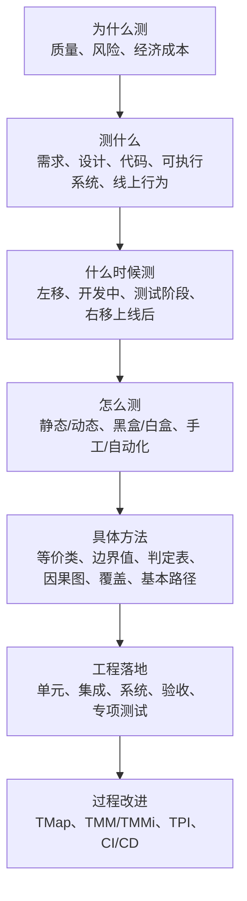
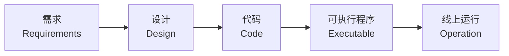
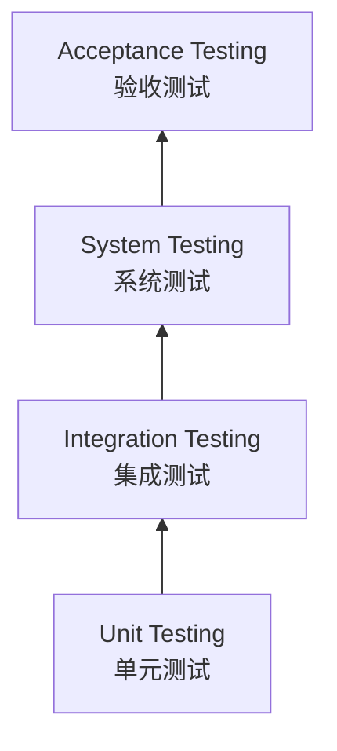
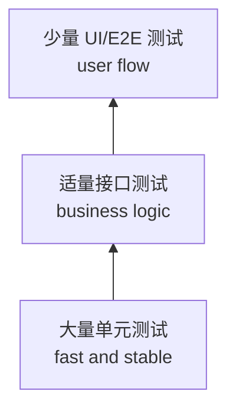
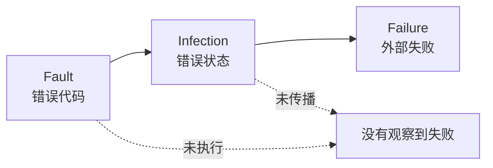
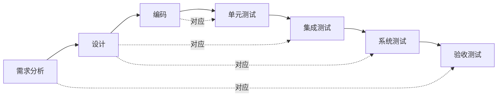
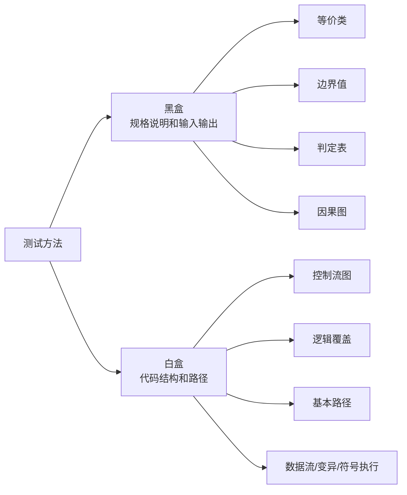
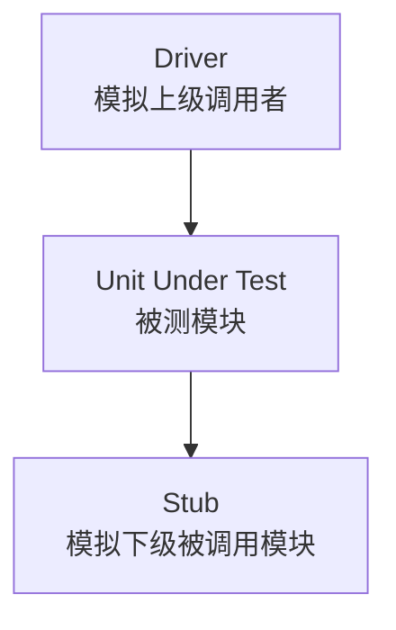

# 软件测试总复习：全课程框架与层级

本章按 PPT 1-7 章和 `2025软件测试考试.txt` 重新整理，目标是让你考前先建立整门课的“地图”：==这门课学了什么、软件测试有哪些层级、每类题该用什么方法、哪些内容最可能考大题==。

更细的大题训练看：[软件测试大题专项](chapter:test-big-questions)。第 4 章细题库看：[第4章专项题库](chapter:test-exercises-ch04)。

## 0. 考前先看这张总表

| 优先级 | 内容 | 你要会到什么程度 | 对应章节 |
| --- | --- | --- | --- |
| S | 第 4 章测试方法 | 会写定义、画因果图/控制流图、写判定表/用例表、算圈复杂度 | [第4章](chapter:test-l04) |
| S | 大题专项模板 | 会套黑盒综合题、逻辑覆盖题、基本路径题、驱动/桩题 | [大题专项](chapter:test-big-questions) |
| A | 第 5 章单元与集成 | 驱动程序、桩程序、Mock/Stub、自顶向下/自底向上/三明治 | [第5章](chapter:test-l05) |
| A | 第 2 章基本概念 | 质量、缺陷、Test Oracle、测试分类、四个测试层次 | [第2章](chapter:test-l02) |
| A | 第 3 章流程规范 | V/W 模型、TMap、TMM/TMMi、TPI、左移/右移 | [第3章](chapter:test-l03) |
| B | 第 6 章系统测试 | 系统测试、接口测试、UI 自动化、回归测试、精准测试 | [第6章](chapter:test-l06) |
| B | 第 7 章专项测试 | 性能、安全、兼容、可靠、混沌工程、A/B 测试 | [第7章](chapter:test-l07) |
| C | 第 1 章引论 | 测试必要性、定义、测试与调试、QA 与 Testing | [第1章](chapter:test-l01) |

一句话记忆：

> 这门课不是只学“怎么点软件找 bug”，而是学 ==为什么测、测什么、什么时候测、用什么方法测、怎么组织测试、怎么评估质量风险==。

## 1. 这门课到底学了什么？

PPT 开头说教材分三篇：==软件测试的原理与方法、软件测试技术、软件测试项目实践==。本课程主要讲 PPT 1-7 章，可以拆成四条主线：

| 主线 | 学什么 | 典型考点 |
| --- | --- | --- |
| 原理 | 测试为什么必要，测试能证明什么，质量和缺陷是什么 | 测试不能证明无缺陷、Fault/Infection/Failure、质量/风险/经济视角 |
| 概念 | 测试如何分类，测试有哪些层次和对象 | 静态/动态、黑盒/白盒、手工/自动化、单元/集成/系统/验收 |
| 方法 | 如何根据规格或代码设计测试用例 | 等价类、边界值、判定表、因果图、逻辑覆盖、基本路径 |
| 工程 | 测试如何在项目中组织、自动化和持续改进 | V/W、TMap、TMM/TPI、单元/集成、系统测试、专项测试 |

整门课的核心能力可以压成 5 个动词：

| 动词 | 含义 | 考场表现 |
| --- | --- | --- |
| 识别 | 识别输入、输出、条件、动作、路径、风险 | 题干拆解 |
| 划分 | 划分等价类、边界、层次、测试对象 | 表格 |
| 覆盖 | 说明覆盖了哪些类、边界、条件、路径 | 覆盖表 |
| 验证 | 写预期输出，用 Test Oracle 判断通过/失败 | 测试用例表 |
| 评估 | 评估质量风险、充分性、成本和改进方向 | 简答题 |

## 2. 软件测试全景图

如果题目问“软件测试的工作范畴”，不要只写执行测试。完整测试活动包括：

| 阶段 | 做什么 | 输出 |
| --- | --- | --- |
| 测试分析 | 分析需求、风险、测试对象和测试依据 | 测试项、风险列表 |
| 测试策略 | 决定测试层次、方法、工具、优先级 | 测试策略 |
| 测试计划 | 安排人员、进度、环境、资源、里程碑 | 测试计划 |
| 测试设计 | 设计用例、数据、脚本、覆盖目标 | 测试用例/脚本 |
| 测试执行 | 执行用例，记录实际结果 | 测试日志、缺陷报告 |
| 测试评估 | 判断是否充分、风险是否可接受 | 测试总结、质量报告 |

## 3. 1-7 章总览

| 章节 | PPT 主线 | 最该背的内容 | 常见题型 |
| --- | --- | --- | --- |
| 第 1 章 引论 | 为什么测试、什么是测试、测试与开发关系 | 测试必要性、测试定义、测试不能证明无缺陷、测试 vs 调试、QA vs Testing | 简答/选择 |
| 第 2 章 基本概念 | 质量、缺陷、分类、层次、V&V | ISO 25010、缺陷判断准则、Test Oracle、四个测试层次、静态/动态、黑盒/白盒 | 选择/简答 |
| 第 3 章 流程和规范 | 测试过程、模型、改进与标准 | 左移/右移、W 模型、TMap、敏捷测试、TMM/TMMi、TPI | 选择/简答 |
| 第 4 章 测试方法 | 黑盒、白盒、变异、符号执行 | 等价类、边界值、判定表、因果图、逻辑覆盖、基本路径 | 大题核心 |
| 第 5 章 单元与集成 | 最小单元、替身、集成策略 | Driver、Stub、Mock、单元测试任务、自顶向下、自底向上、三明治 | 简答/画图 |
| 第 6 章 系统测试 | 完整系统和功能自动化 | 系统测试定义、接口测试、UI 自动化、回归测试、精准测试 | 简答/选择 |
| 第 7 章 专项测试 | 非功能和专项质量属性 | 性能、安全、兼容、可靠、混沌工程、A/B 测试 | 选择/简答 |

考试排序可以这样抓：

1. 第 4 章是大题发动机。
2. 第 5 章补驱动/桩和集成策略。
3. 第 2/3 章负责概念、分类和流程模型。
4. 第 6/7 章负责系统级和专项测试的概念题。
5. 第 1 章负责开篇定义和思想题。

## 4. 软件测试的五个层级

这里的“层级”不是只有单元、集成、系统、验收。复习时至少要掌握五种层级。

### 4.1 软件工件层级

软件测试不等于程序测试。软件工件从早到晚包括：

| 工件 | 怎么测 | 类型 |
| --- | --- | --- |
| 需求 | 需求评审，检查正确性、完整性、一致性、可测试性 | 静态测试 |
| 设计 | 架构/接口/数据/可测试性评审 | 静态测试 |
| 代码 | 代码评审、静态分析、覆盖测试、单元测试 | 静态 + 动态 |
| 可执行系统 | 功能、接口、UI、系统、验收、专项测试 | 动态测试 |
| 线上运行 | 监控、灰度、A/B、混沌、真实流量分析 | 测试右移 |

### 4.2 测试对象层级

这是最常见的“四层测试”：

| 层次 | 对象 | 目标 | 常用方法 |
| --- | --- | --- | --- |
| 单元测试 | 函数、类、模块 | 验证最小设计单元 | 白盒、边界、Mock、Stub、Driver |
| 集成测试 | 模块接口和协作 | 发现接口、参数、调用顺序、数据流问题 | 自顶向下、自底向上、三明治 |
| 系统测试 | 完整系统和环境 | 验证系统满足需求规格 | 黑盒、场景、接口/UI 自动化、非功能测试 |
| 验收测试 | 用户业务和可接受性 | 判断用户是否接受 | UAT、Alpha、Beta、业务场景 |

### 4.3 测试活动层级

| 层级 | 关键词 | 例子 |
| --- | --- | --- |
| 计划层 | 范围、风险、资源、进度 | 测试计划、TMap |
| 设计层 | 用例、数据、覆盖目标 | 等价类表、判定表 |
| 执行层 | 执行、记录、缺陷 | 执行用例、提交 bug |
| 评估层 | 质量、充分性、风险 | 测试报告、发布建议 |
| 改进层 | 成熟度、复盘、优化 | TMM/TPI、自动化改进 |

### 4.4 自动化测试层级

| 层级 | 优点 | 风险 |
| --- | --- | --- |
| 单元自动化 | 快、便宜、稳定，ROI 高 | 不代表完整业务通过 |
| 接口自动化 | 覆盖业务逻辑，维护成本中等 | 需要接口稳定和数据准备 |
| UI 自动化 | 最接近用户真实操作 | 脆弱、慢、维护成本高 |

### 4.5 质量属性层级

ISO 25010 的质量属性和测试类型对应：

| 质量属性 | 关注点 | 对应测试 |
| --- | --- | --- |
| 功能适应性 | 是否实现正确功能 | 功能测试、验收测试 |
| 性能效率 | 响应时间、吞吐量、资源利用率 | 性能测试 |
| 兼容性 | 平台、系统、浏览器、数据格式 | 兼容性测试 |
| 易用性 | 用户是否容易理解和操作 | 可用性测试、A/B 测试 |
| 可靠性 | 长时间稳定运行和恢复能力 | 可靠性、容错、混沌工程 |
| 安全性 | 保密性、完整性、可用性 | 安全功能、漏洞、渗透测试 |
| 可维护性 | 易分析、易修改、易测试 | 静态分析、代码评审 |
| 可移植性 | 能否迁移到其他环境 | 安装、部署、移植测试 |

## 5. 测试分类矩阵

| 划分维度 | A | B | 考试区分 |
| --- | --- | --- | --- |
| 是否执行程序 | 静态测试 | 动态测试 | 静态不运行程序，动态运行程序观察行为 |
| 是否看内部结构 | 黑盒测试 | 白盒测试 | 黑盒看规格和输入输出，白盒看代码结构和路径 |
| 执行方式 | 手工测试 | 自动化测试 | 自动化适合重复、回归、接口和单元 |
| 设计方式 | 脚本式测试 | 探索式测试 | 脚本式按预设用例，探索式边学边测 |
| 测试态度 | 主动测试 | 被动测试 | 主动输入驱动系统，被动监控真实运行数据 |
| 测试目标 | 功能测试 | 非功能/专项测试 | 功能看做什么，专项看做得多快、多稳、多安全 |

看到题目后先判断属于哪一类：

| 题干关键词 | 优先想到 |
| --- | --- |
| 输入范围、合法/非法、边界 | 等价类 + 边界值 |
| 多个条件决定多个动作 | 判定表 + 因果图 |
| 代码、if、while、for、路径 | 白盒覆盖 + 基本路径 |
| 每个条件真假、组合真假 | 逻辑覆盖 |
| 模块尚未完成、上下游依赖 | Driver + Stub |
| 开发阶段对应测试阶段 | V 模型 / W 模型 |
| 测试过程管理、风险驱动 | TMap |
| 成熟度等级、过程改进 | TMM/TMMi / TPI |
| 完整环境、接口、UI、回归 | 系统测试 |
| 响应时间、吞吐量、漏洞、兼容 | 专项测试 |

## 6. 第 1 章总复习：测试思想

### 6.1 为什么必须进行软件测试

软件规模越来越大，软件缺陷会造成质量风险、经济损失和安全事故。PPT 中的 Disney 兼容性、Pentium FDIV、Boeing 737 MAX、Ariane 5、Zune、Therac-25 都说明：==软件缺陷不是小 bug，可能造成严重后果==。

答题模板：

> 软件测试的必要性来自软件系统规模和复杂度增加、软件总可能存在缺陷、缺陷会造成质量风险和经济损失，甚至在安全关键系统中造成生命财产损失。测试可以发现缺陷、评估质量、降低发布风险，并且越早发现缺陷，修复成本越低。

### 6.2 测试不能证明没有缺陷

必背句：

> Testing can reveal the presence of defects, but cannot prove their absence.

原因：

1. 输入域巨大甚至无限。
2. 路径数量会因为分支、循环、并发爆炸。
3. 错误代码可能没执行。
4. 错误状态可能没传播成外部可观察失败。
5. 有限测试通过只能增强信心，不能证明所有场景都正确。

### 6.3 测试 vs 调试

| 对比 | 测试 Testing | 调试 Debugging |
| --- | --- | --- |
| 目标 | 发现缺陷、暴露失败、评估质量 | 定位根因并修复 |
| 问题 | 有没有错 | 为什么错、怎么改 |
| 输出 | 缺陷报告、测试结果 | 修复代码、根因说明 |
| 人员 | 测试/开发/用户代表 | 通常开发 |

### 6.4 QA vs Testing

| 对比 | QA | Testing |
| --- | --- | --- |
| 性质 | 管理性、过程性 | 技术性、产品验证性 |
| 关注 | 过程是否能生产质量 | 产品是否满足需求 |
| 活动 | 审计、流程评审、质量计划 | 设计用例、执行测试、报告缺陷 |
| 目标 | 预防缺陷 | 发现缺陷、评估质量 |

## 7. 第 2 章总复习：质量、缺陷、分类和层次

### 7.1 质量与缺陷

| 概念 | 定义 | 记忆 |
| --- | --- | --- |
| 软件质量 | 满足明示和隐含需求的能力 | 质量是目标 |
| 软件缺陷 | 对需求、质量或用户合理期待的违背 | 缺陷是质量的对立面 |
| Test Oracle | 判断实际输出是否正确的依据 | 没有 Oracle 就难判定通过 |

缺陷判断准则：

1. 未实现需求说明书要求的功能。
2. 出现需求说明书指明不应出现的错误。
3. 实现了需求说明书未提到的功能。
4. 未实现需求说明书虽未明确提到但应该实现的功能。
5. 用户体验差、运行慢、难理解、难使用。

### 7.2 内部质量、外部质量、使用质量

| 类型 | 谁能感知 | 例子 |
| --- | --- | --- |
| 内部质量 | 开发者/维护者 | 代码规范、复杂度、耦合度、可维护性 |
| 外部质量 | 测试者/用户 | 正确性、可靠性、性能、易用性 |
| 使用质量 | 真实用户 | 任务完成率、满意度、效率、安全感 |

PPT 重点：工期紧时外部质量可能被迫妥协，但内部质量不能轻易妥协，因为内部质量差会长期推高维护和测试成本。

### 7.3 V&V

| 概念 | 英文问法 | 中文含义 |
| --- | --- | --- |
| Verification | Are we building the product right? | 是否正确地构造产品，是否符合规格说明 |
| Validation | Are we building the right product? | 是否构造了用户真正需要的产品 |

一句话：Verification 偏“按规格做对”，Validation 偏“做的是不是用户要的”。

### 7.4 四个测试层次的高频区别

| 层次 | 主要缺陷 | 典型人员 | 依据 |
| --- | --- | --- | --- |
| 单元测试 | 算法、边界、局部数据、异常处理 | 开发为主 | 详细设计/代码 |
| 集成测试 | 接口参数、数据传递、调用顺序 | 开发+测试 | 概要设计/接口 |
| 系统测试 | 功能、环境、性能、安全、兼容 | 测试为主 | 需求规格说明 |
| 验收测试 | 业务不匹配、用户不接受 | 用户/客户代表 | 合同/用户需求 |

## 8. 第 3 章总复习：流程、模型和改进

### 8.1 左移和右移

| 概念 | 移动方向 | 典型活动 | 目的 |
| --- | --- | --- | --- |
| 测试左移 | 向需求、设计、编码早期移动 | 需求评审、设计评审、静态分析、单元测试 | 早发现、低成本 |
| 测试右移 | 向上线后和真实环境延伸 | 灰度、监控、A/B、混沌工程、真实流量分析 | 真实反馈、持续质量 |

### 8.2 V 模型和 W 模型

| 模型 | 核心 | 易考点 |
| --- | --- | --- |
| V 模型 | 开发阶段与测试阶段相对应 | 需求对应验收，设计对应系统/集成，编码对应单元 |
| W 模型 | 测试与开发同步进行 | 需求、设计、编码阶段都可以测试，强调测试左移 |

### 8.3 TMap、TMM/TMMi、TPI

| 名称 | 解决的问题 | 关键词 |
| --- | --- | --- |
| TMap | 测试怎么组织和执行 | 结构化、风险驱动、生命周期、O/I/T |
| TMM/TMMi | 测试过程成熟到什么程度 | 成熟度等级、过程能力 |
| TPI | 测试过程哪里需要改进 | 关键域、检查点、成熟度矩阵 |

TMap 生命周期：

| 阶段 | 内容 |
| --- | --- |
| 计划和控制 | 范围、风险、策略、估算、监控 |
| 准备 | 评审测试依据和可测试性 |
| 说明/规格说明 | 设计测试用例、脚本、数据 |
| 执行 | 执行测试、记录差异、提交缺陷 |
| 完成 | 总结、归档、复用测试资产 |
| 基础设施 | 环境、工具、工作场所并行支持 |

TMap 三大基石：

| 缩写 | 含义 |
| --- | --- |
| O | Organization integration，组织融合 |
| I | Infrastructure and tools，基础设施和工具 |
| T | Techniques，可用技术 |

## 9. 第 4 章总复习：测试方法是考试核心

第 4 章可以分成黑盒和白盒两大块。

### 9.1 黑盒测试方法

| 方法 | 适用题干 | 输出形式 |
| --- | --- | --- |
| 等价类划分 | 有合法/非法输入类别 | 有效/无效等价类表 |
| 边界值分析 | 有范围、上下限、阈值 | 边界点和附近值 |
| 判定表 | 多条件决定多动作 | 条件/动作/规则表 |
| 因果图 | 输入原因和输出结果有逻辑关系 | 因果图 -> 判定表 -> 用例 |
| Pairwise/正交 | 多因素多水平组合爆炸 | 两两覆盖用例集 |

黑盒大题答题顺序：

1. 读规格，列输入、输出、约束、业务规则。
2. 对输入范围做等价类和边界值。
3. 对多条件规则做判定表或因果图。
4. 写测试用例表：ID、输入、预期输出、覆盖点。
5. 写解释：覆盖了合法、非法、边界、组合和异常。

### 9.2 等价类划分

| 概念 | 含义 |
| --- | --- |
| 有效等价类 | 满足规格说明、应被系统接受的输入集合 |
| 无效等价类 | 不满足规格说明、应被拒绝或报错的输入集合 |
| 弱一般 | 只考虑有效类，每类至少覆盖一次 |
| 弱健壮 | 有效类和无效类都至少覆盖一次 |
| 强一般 | 有效类所有组合 |
| 强健壮 | 有效类和无效类所有组合 |

必背句：

> 等价类划分是把输入域按规格说明划分为若干行为等价的数据集合，并从每个集合选代表值作为测试用例。

### 9.3 边界值分析

如果输入范围是 `[a,b]`，常取：

| 类别 | 值 |
| --- | --- |
| 略小于下界 | `a-1` |
| 下界 | `a` |
| 略大于下界 | `a+1` |
| 正常值 | `nom` |
| 略小于上界 | `b-1` |
| 上界 | `b` |
| 略大于上界 | `b+1` |

公式：

| 类型 | 公式 |
| --- | --- |
| 普通边界值 | `4n + 1` |
| 健壮边界值 | `6n + 1` |
| 最坏情况 | `5^n` |
| 健壮最坏情况 | `7^n` |

### 9.4 判定表与因果图

判定表结构：

| 部分 | 含义 |
| --- | --- |
| 条件桩 | 所有输入条件 |
| 动作桩 | 所有输出动作 |
| 条件项 | 每条规则下条件取值 |
| 动作项 | 每条规则下动作是否发生 |
| 规则 | 一列条件项 + 一列动作项 |

因果图步骤：

1. 找原因 C：输入条件。
2. 找结果 A：输出动作。
3. 标逻辑关系：AND、OR、NOT。
4. 标约束：互斥、唯一、要求、屏蔽。
5. 画因果图。
6. 转判定表。
7. 每列规则转测试用例。

### 9.5 白盒测试方法

| 方法 | 核心 | 常见输出 |
| --- | --- | --- |
| 语句覆盖 | 每条语句至少执行一次 | 覆盖说明 |
| 判定覆盖 | 每个判定 T/F 至少一次 | 判定真假表 |
| 条件覆盖 | 每个基本条件 T/F 至少一次 | 条件真假表 |
| 判定-条件覆盖 | 判定和条件都满足 T/F | 综合覆盖表 |
| 条件组合覆盖 | 每个判定内条件组合都覆盖 | 组合表 |
| 基本路径测试 | 用圈复杂度确定独立路径数 | CFG、V(G)、路径基 |
| 数据流测试 | 关注变量定义和使用 | def-use 路径 |

逻辑覆盖关系：

| 覆盖 | 强弱说明 |
| --- | --- |
| 条件组合覆盖 | 通常最强，要求所有条件组合 |
| 判定-条件覆盖 | 同时满足判定覆盖和条件覆盖 |
| 判定覆盖 | 只要求整体判定真假 |
| 条件覆盖 | 只要求每个基本条件真假 |

注意：判定覆盖和条件覆盖之间一般不能简单互推。

### 9.6 基本路径测试

必背公式：

| 公式 | 含义 |
| --- | --- |
| `V(G)=E-N+2` | 单入口单出口控制流图常用公式 |
| `V(G)=P+1` | P 为判定节点数 |
| 基本路径数量 | 等于圈复杂度 |

答题流程：

1. 根据代码画控制流图 CFG 或 DD 路径图。
2. 标出判定节点、边和节点。
3. 计算 `V(G)`。
4. 列出与 `V(G)` 数量一致的基本路径基。
5. 为每条路径设计输入和预期输出。

## 10. 第 5 章总复习：单元测试与集成测试

### 10.1 单元测试测什么

| 任务 | 关注 |
| --- | --- |
| 独立执行路径测试 | 语句、分支、路径是否按预期执行 |
| 局部数据结构测试 | 内部数据、类型、边界、默认值 |
| 模块接口测试 | 参数个数、类型、量纲、返回值 |
| 边界条件测试 | 合法边界、非法边界、空输入 |
| 容错测试 | 异常、错误提示、恢复能力 |
| 内存分析 | 泄漏、越界、释放后使用 |

### 10.2 Driver 与 Stub

| 概念 | 定义 | 使用场景 |
| --- | --- | --- |
| Driver 驱动程序 | 模拟上级模块，调用被测模块 | 上层未完成，自底向上集成 |
| Stub 桩程序 | 模拟下级模块，被被测模块调用 | 下层未完成，自顶向下集成 |

高分句：

> Driver 在上面调用被测模块，Stub 在下面假装被被测模块调用。

### 10.3 集成测试策略

| 策略 | 做法 | 优点 | 缺点 |
| --- | --- | --- | --- |
| 大棒集成 | 全部模块一次性集成 | 简单 | 难定位错误 |
| 自顶向下 | 从上层主控模块向下集成 | 早验证主流程 | 需要较多 Stub |
| 自底向上 | 从底层基础模块向上集成 | 早验证底层能力 | 需要较多 Driver |
| 三明治 | 上层向下、底层向上，中间汇合 | 综合两者优点 | 计划复杂 |

## 11. 第 6 章总复习：系统测试

系统测试是在完成集成测试之后，将软件、硬件、网络、数据、支撑软件、第三方软件等放在完整环境中测试，验证系统满足需求规格。

### 11.1 系统功能测试

| 对象 | 检查点 |
| --- | --- |
| 功能 | 是否按需求完成业务 |
| UI | 菜单、按钮、页面、提示是否正确 |
| 数据 | 输入、输出、保存、读取、格式是否正确 |
| 逻辑 | 状态流转和业务规则是否正确 |
| 接口 | 请求、响应、错误码、协议是否正确 |

### 11.2 接口测试

接口测试不是只看“能不能调通”，还要验证业务规则。

| 检查项 | 内容 |
| --- | --- |
| 请求 | URL、方法、Header、Token、Cookie |
| 参数 | 必填、可选、边界、非法值、类型 |
| 响应 | 状态码、字段、数据类型、错误信息 |
| 业务 | 数据一致性、权限、幂等性、重复提交 |

### 11.3 回归测试与精准测试

| 概念 | 含义 |
| --- | --- |
| 回归测试 | 修改后重新验证已有功能未被破坏 |
| 精准测试 | 基于代码变更、覆盖数据和依赖关系选择受影响用例 |

精准测试流程：

1. 比较新旧代码差异。
2. 定位受影响代码和功能。
3. 根据代码与用例映射选择测试用例。
4. 执行必要回归测试，减少无效执行。

## 12. 第 7 章总复习：专项测试

| 专项测试 | 定义/目标 | 高频关键词 |
| --- | --- | --- |
| 性能测试 | 在特定负载下验证性能指标并发现瓶颈 | 响应时间、吞吐量、TPS、并发、JMeter |
| 安全性测试 | 验证系统保护资产并抵抗攻击 | CIA、STRIDE、漏洞、Fuzz、渗透测试 |
| 兼容性测试 | 验证系统与硬件、软件、平台、数据兼容 | 向前兼容、向后兼容、组合测试 |
| 可靠性测试 | 规定条件和时间内持续正确运行 | 故障率、容错、恢复、故障注入 |
| 混沌工程 | 主动注入故障验证系统韧性 | 稳态假设、爆炸半径、可观察性 |
| A/B 测试 | 用实验分流比较不同版本效果 | 流量、桶、层、实验、统计显著 |

### 12.1 性能测试指标

| 指标 | 含义 |
| --- | --- |
| Response time | 响应时间 |
| Throughput | 吞吐量 |
| TPS | 每秒事务数 |
| Concurrent users | 并发用户数 |
| Resource utilization | CPU、内存、磁盘、网络资源利用率 |
| Baseline | 性能基线 |

### 12.2 安全测试核心

CIA：

| 字母 | 含义 |
| --- | --- |
| C | Confidentiality，保密性 |
| I | Integrity，完整性 |
| A | Availability，可用性 |

STRIDE：

| 字母 | 威胁 |
| --- | --- |
| S | Spoofing，假冒 |
| T | Tampering，篡改 |
| R | Repudiation，抵赖 |
| I | Information disclosure，信息泄露 |
| D | Denial of Service，拒绝服务 |
| E | Elevation of Privilege，权限提升 |

## 13. 大题与画图题总模板

### 13.1 黑盒综合题模板

题干出现“输入范围、业务规则、多条件输出”时这样答：

1. **说明方法**：范围用边界值，分类用等价类，多条件用判定表/因果图。
2. **列输入条件**：每个输入的合法范围、非法范围和特殊值。
3. **列规则表**：条件、动作、规则列。
4. **写用例表**：ID、输入、预期输出、覆盖点。
5. **解释充分性**：覆盖有效/无效、边界、组合、异常。

用例表格式：

| ID | 输入 | 预期输出 | 覆盖点 | 说明 |
| --- | --- | --- | --- | --- |
| TC1 | 合法普通值 | 正常结果 | 有效等价类 | 主流程 |
| TC2 | 下界外 | 报错 | 无效等价类 | 健壮性 |
| TC3 | 下界 | 正常/临界结果 | 边界值 | 边界覆盖 |
| TC4 | 多条件组合 | 对应动作 | 判定表规则 | 组合覆盖 |

### 13.2 因果图题模板

| 步骤 | 写什么 |
| --- | --- |
| 1 | 列原因 C1、C2、C3 |
| 2 | 列结果 A1、A2、A3 |
| 3 | 写逻辑关系：AND、OR、NOT |
| 4 | 写约束：互斥、唯一、要求、屏蔽 |
| 5 | 画因果图 |
| 6 | 转判定表 |
| 7 | 每列规则写一个测试用例 |

### 13.3 逻辑覆盖题模板

| 步骤 | 写什么 |
| --- | --- |
| 1 | 拆基本条件 C1、C2、C3 |
| 2 | 写整体判定 D |
| 3 | 根据题目要求选择覆盖标准 |
| 4 | 画条件取值表 |
| 5 | 给输入值和预期 D |
| 6 | 写覆盖说明 |

覆盖标准定义：

| 覆盖 | 定义 |
| --- | --- |
| 判定覆盖 | 每个判定结果 T/F 至少一次 |
| 条件覆盖 | 每个基本条件 T/F 至少一次 |
| 判定-条件覆盖 | 同时满足判定覆盖和条件覆盖 |
| 条件组合覆盖 | 每个判定中基本条件的所有组合至少一次 |

### 13.4 基本路径题模板

| 步骤 | 写什么 |
| --- | --- |
| 1 | 根据代码画控制流图 |
| 2 | 标判定节点和边 |
| 3 | 算 `V(G)=E-N+2` 或 `V(G)=P+1` |
| 4 | 列基本路径基 |
| 5 | 每条路径配测试输入 |
| 6 | 写预期输出和覆盖说明 |

### 13.5 驱动/桩题模板

| 问法 | 答法 |
| --- | --- |
| 什么是驱动程序 | 模拟上级调用者，调用被测模块并传入数据 |
| 什么是桩程序 | 模拟下级被调用模块，向被测模块返回受控结果 |
| 什么时候用 Driver | 上层模块未完成，自底向上测试 |
| 什么时候用 Stub | 下层模块未完成，自顶向下测试 |
| 怎么画图 | Driver -> 被测模块 -> Stub |

## 14. 公式与速背表

| 内容 | 公式/结论 |
| --- | --- |
| 普通边界值测试用例数 | `4n + 1` |
| 健壮边界值测试用例数 | `6n + 1` |
| 最坏情况测试用例数 | `5^n` |
| 健壮最坏情况测试用例数 | `7^n` |
| 条件组合数 | `2^n`，n 为基本条件数 |
| 圈复杂度 | `V(G)=E-N+2` |
| 圈复杂度另一形式 | `V(G)=P+1`，P 为判定节点数 |
| 基本路径数量 | 等于圈复杂度 |
| TMap | Test Management Approach |
| TMM/TMMi | Testing Maturity Model / integration |
| TPI | Test Process Improvement |
| SBTM | Session-Based Test Management |
| TDD | Test-Driven Development |

## 15. 考前 30 分钟怎么扫

按这个顺序背：

1. 背 [大题专项](chapter:test-big-questions) 第 5-14 节：等价类、黑盒表、因果图、逻辑覆盖、基本路径、驱动/桩、V/W、TMap。
2. 背本章第 4 节：五个层级，尤其四个测试层次。
3. 背本章第 9 节：黑盒/白盒方法总表。
4. 背本章第 13 节：大题模板。
5. 最后背本章第 14 节：公式和缩写。

## 16. 最后压缩版

如果只能背一页，就背下面这些：

| 题目类型 | 立即写 |
| --- | --- |
| “软件测试是什么” | 发现缺陷、评估质量、验证需求、降低风险；不能证明无缺陷 |
| “质量/缺陷/Oracle” | 质量是满足需求，缺陷是违背质量，Oracle 判断实际输出是否正确 |
| “测试层次” | 单元、集成、系统、验收 |
| “分类” | 静态/动态、黑盒/白盒、手工/自动化、脚本/探索 |
| “黑盒综合” | 等价类 + 边界值 + 判定表/因果图 + 用例表 |
| “逻辑覆盖” | 判定覆盖、条件覆盖、判定-条件覆盖、条件组合覆盖 |
| “基本路径” | 画 CFG，算 `V(G)=E-N+2=P+1`，列路径和用例 |
| “Driver/Stub” | Driver 在上模拟调用者，Stub 在下模拟被调用者 |
| “V/W 模型” | V 强调阶段对应，W 强调测试开发同步 |
| “TMap/TMM/TPI” | TMap 讲怎么测，TMM 讲成熟度，TPI 讲怎么改进 |
| “系统测试” | 完整系统和环境中验证需求 |
| “专项测试” | 性能、安全、兼容、可靠、混沌、A/B |

最后一句：

> 黑盒看规格，白盒看代码；单元看模块，集成看接口，系统看完整环境，验收看用户接受；流程题讲左移右移和 TMap，改进题讲 TMM/TPI。
