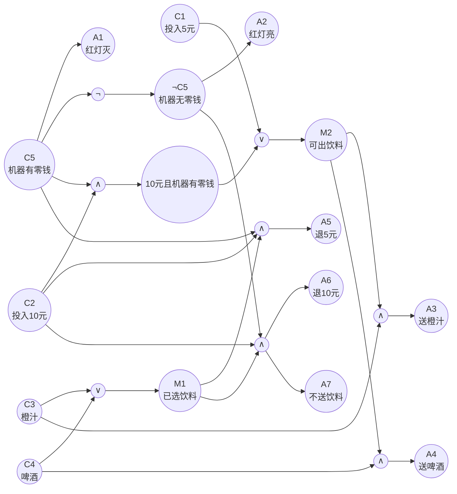
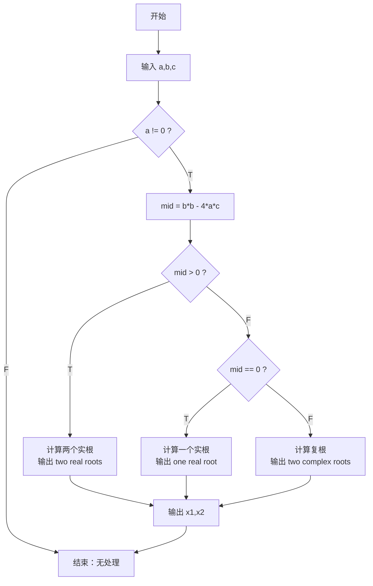
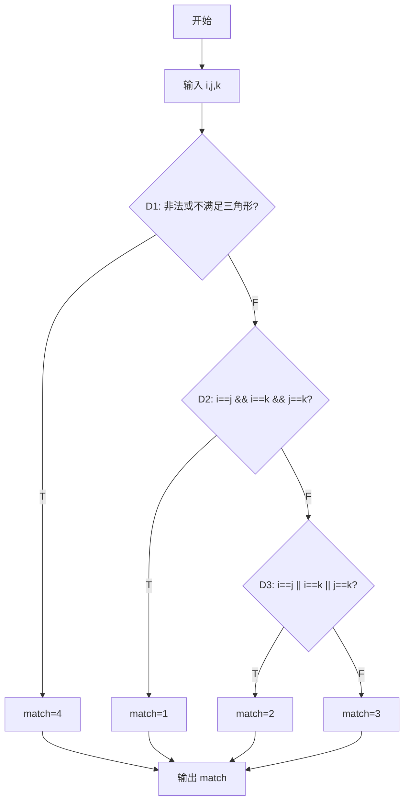
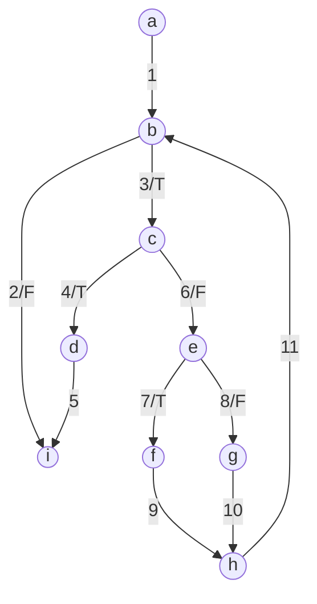
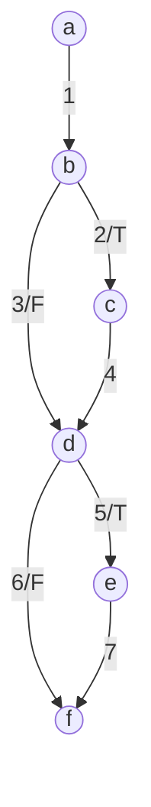
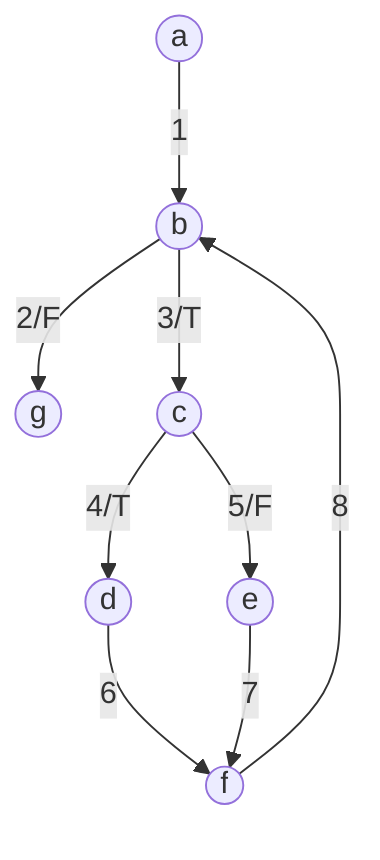

# 软件测试作业题详解：等价类、边界值、因果图、黑盒、覆盖、基本路径与白盒综合

本章来自 `作业.docx`，把核心作业题整理成可直接提交/复习的答案，并补充两道白盒覆盖综合大题。重点不是只给测试用例，而是写清楚：==为什么这样划分、覆盖了什么、预期输出是什么、如果考试/作业要求解释该怎么写==。

相关复习章节：

- [第4章：软件测试方法](chapter:test-l04)
- [第4章专项题库：软件测试方法](chapter:test-exercises-ch04)
- [软件测试大题专项：问答、画图、画表](chapter:test-big-questions)

## 0. 作业总览

| 作业 | 题目 | 方法 | 最终应交内容 |
| --- | --- | --- | --- |
| 作业 1 | 人寿保险保费计算程序 | 等价类划分 | 有效/无效等价类 + 测试用例表 |
| 作业 2 | 两个 1-100 整数加法器 | 边界值分析 | 边界值列表 + 边界测试用例 |
| 作业 3 | 饮料自动售货机 | 因果图 + 判定表 | 原因/结果 + 因果图 + 判定表 + 用例 |
| 作业 4 | 登录窗口、找零程序 | 黑盒测试 | 等价类 + 边界值/决策表 + 用例 |
| 作业 5 | 方程程序、三角形程序 | 覆盖测试 | 流程图 + 语句/分支/条件/组合覆盖用例 |
| 作业 6 | `Test(i_count, i_flag)` | 基本路径测试 | DD 路径图 + 圈复杂度 + 基本路径 + 用例 |
| 作业 7 | 白盒覆盖综合题 1 | 程序图覆盖 + 逻辑覆盖 | CFG/DD 图 + 节点/边/路径覆盖 + 判定/条件/C-DC/MC-DC/条件组合 |
| 作业 8 | 白盒覆盖综合题 2 | 基本路径 + 数据流覆盖 | DD 图 + 圈复杂度 + 基本路径 + 定义/使用/定义-清除路径 + 用例 |

---

## 作业 1：保险公司人寿保险保费计算程序的等价类测试

### 1.1 题目还原

某保险公司人寿保险的保费计算方式为：

```text
保费 = 投保额 * 保险费率
```

费率由点数决定：

| 条件 | 点数规则 |
| --- | --- |
| 年龄 20-39 | 6 点 |
| 年龄 40-59 | 4 点 |
| 其他年龄 | 2 点 |
| 性别 M | 4 点 |
| 性别 F | 3 点 |
| 已婚 | 3 点 |
| 未婚 | 5 点 |
| 抚养人数 | 1 人扣 0.5 点，最多扣 3 点 |

费率规则：

| 总点数 | 保险费率 |
| --- | --- |
| `> 10` | `0.6%` |
| `<= 10` | `0.1%` |

假设投保额是 1 万元，设计等价类测试用例。

### 1.2 分析思路

这个题的输入变量有 4 个：

1. 年龄 `age`
2. 性别 `gender`
3. 婚姻状况 `marriage`
4. 抚养人数 `dependents`

输出是：

1. 点数 `score`
2. 费率 `rate`
3. 保费 `premium`

因为投保额固定为 10000 元，所以：

```text
score = 年龄点数 + 性别点数 + 婚姻点数 - min(抚养人数 * 0.5, 3)

如果 score > 10:
  rate = 0.6%
  premium = 10000 * 0.006 = 60 元

如果 score <= 10:
  rate = 0.1%
  premium = 10000 * 0.001 = 10 元
```

### 1.3 等价类划分

**有效等价类**

| 输入 | 等价类编号 | 等价类 | 代表值 |
| --- | --- | --- | --- |
| 年龄 | A1 | `20 <= age <= 39` | 25 |
| 年龄 | A2 | `40 <= age <= 59` | 45 |
| 年龄 | A3 | 其他年龄，如 `<20` 或 `>=60` | 18、65 |
| 性别 | G1 | M | M |
| 性别 | G2 | F | F |
| 婚姻 | M1 | 已婚 | 已婚 |
| 婚姻 | M2 | 未婚 | 未婚 |
| 抚养人数 | D1 | 0 人 | 0 |
| 抚养人数 | D2 | 1-5 人，未达到扣分上限 | 2 |
| 抚养人数 | D3 | 6 人及以上，达到最多扣 3 点 | 6 |
| 点数结果 | S1 | `score > 10` | 11、15 |
| 点数结果 | S2 | `score <= 10` | 10、8 |

**无效等价类**

| 输入 | 无效等价类 | 预期处理 |
| --- | --- | --- |
| 年龄 | 负数、空值、非数字 | 提示年龄非法 |
| 性别 | 非 M/F | 提示性别非法 |
| 婚姻 | 非已婚/未婚 | 提示婚姻状态非法 |
| 抚养人数 | 负数、非整数、空值 | 提示抚养人数非法 |

如果老师只要求“等价类测试”，有效等价类是核心；如果要求健壮性，必须补无效等价类。

### 1.4 测试用例表

| ID | age | gender | marriage | dependents | 点数计算 | 预期费率 | 预期保费 | 覆盖点 |
| --- | --- | --- | --- | --- | --- | --- | --- | --- |
| TC1 | 20 | M | 未婚 | 0 | `6+4+5-0=15` | 0.6% | 60 | 年龄 20 下边界、M、未婚、无抚养、`>10` |
| TC2 | 39 | F | 已婚 | 0 | `6+3+3-0=12` | 0.6% | 60 | 年龄 39 上边界、F、已婚、`>10` |
| TC3 | 40 | F | 已婚 | 0 | `4+3+3-0=10` | 0.1% | 10 | 年龄 40 下边界、点数等于 10 |
| TC4 | 59 | M | 已婚 | 6 | `4+4+3-3=8` | 0.1% | 10 | 年龄 59 上边界、抚养人数扣分封顶 |
| TC5 | 60 | M | 未婚 | 0 | `2+4+5-0=11` | 0.6% | 60 | 其他年龄 `>=60`、`>10` |
| TC6 | 18 | F | 未婚 | 2 | `2+3+5-1=9` | 0.1% | 10 | 其他年龄 `<20`、抚养人数未封顶 |
| TC7 | 25 | M | 已婚 | 6 | `6+4+3-3=10` | 0.1% | 10 | 20-39、扣分封顶、点数边界 10 |
| TC8 | -1 | M | 未婚 | 0 | 输入非法 | - | - | 年龄无效类 |
| TC9 | 25 | X | 未婚 | 0 | 输入非法 | - | - | 性别无效类 |
| TC10 | 25 | M | 离异 | 0 | 输入非法 | - | - | 婚姻状态无效类 |
| TC11 | 25 | M | 未婚 | -1 | 输入非法 | - | - | 抚养人数无效类 |

### 1.5 解析

这道题最容易漏掉两个点：

1. 抚养人数不是直接分类成“有/无”，因为它存在 ==最多扣 3 点== 的上限，所以要分成 `0`、`1-5`、`>=6`。
2. 费率不是直接由年龄、性别、婚姻决定，而是由总点数决定，所以必须覆盖 `score > 10` 和 `score <= 10`，尤其要测 `score = 10` 这个边界。

---

## 作业 2：加法器程序的边界值分析

### 2.1 题目还原

测试加法器程序，计算两个 `1-100` 之间整数的和。要求综合考虑边界值方法，列出边界，再给出测试用例。

### 2.2 输入与边界

输入变量：

| 变量 | 合法范围 | 正常值 |
| --- | --- | --- |
| x | `1 <= x <= 100`，整数 | 50 |
| y | `1 <= y <= 100`，整数 | 50 |

边界值：

| 类型 | 值 |
| --- | --- |
| 下界外 | 0 |
| 下界 | 1 |
| 下界内侧 | 2 |
| 正常值 | 50 |
| 上界内侧 | 99 |
| 上界 | 100 |
| 上界外 | 101 |

如果按普通边界值测试，只取 `1,2,99,100` 加正常值；如果按健壮边界值测试，还要取 `0,101`。作业说“综合考虑边界值方法”，建议直接给健壮边界值集合。

### 2.3 测试用例表

单缺陷假设：每次只让一个变量取边界值，另一个变量保持正常值 `50`。

| ID | x | y | 预期输出 | 覆盖点 |
| --- | --- | --- | --- | --- |
| TC1 | 50 | 50 | 100 | 全正常值 |
| TC2 | 0 | 50 | 输入非法 | x 下界外 |
| TC3 | 1 | 50 | 51 | x 下界 |
| TC4 | 2 | 50 | 52 | x 下界内侧 |
| TC5 | 99 | 50 | 149 | x 上界内侧 |
| TC6 | 100 | 50 | 150 | x 上界 |
| TC7 | 101 | 50 | 输入非法 | x 上界外 |
| TC8 | 50 | 0 | 输入非法 | y 下界外 |
| TC9 | 50 | 1 | 51 | y 下界 |
| TC10 | 50 | 2 | 52 | y 下界内侧 |
| TC11 | 50 | 99 | 149 | y 上界内侧 |
| TC12 | 50 | 100 | 150 | y 上界 |
| TC13 | 50 | 101 | 输入非法 | y 上界外 |

### 2.4 解析

两个输入变量，普通边界值测试用例数为：

```text
4n + 1 = 4*2 + 1 = 9
```

健壮边界值测试用例数为：

```text
6n + 1 = 6*2 + 1 = 13
```

本答案给的是 13 个，包含非法边界 `0` 和 `101`，更完整。

---

## 作业 3：自动售货机的因果图与判定表

### 3.1 题目还原

处理单价为 5 元的饮料自动售货机：

- 投入 5 元或 10 元。
- 按下“橙汁”或“啤酒”按钮。
- 若有零钱找，红灯灭；投入 10 元时，出饮料并退还 5 元。
- 若没有零钱找，红灯亮；此时投入 10 元并按按钮后，饮料不送出，10 元退回。
- 若投入 5 元，刚好支付，是否有零钱不影响出饮料，但红灯状态仍显示零钱情况。

要求构造因果图，并用判定表设计测试用例。

### 3.2 原因、结果与约束

PPT 的因果图做法是：先把输入条件编号为原因，把输出动作编号为结果，再标出原因之间的约束。这里用 `1` 表示条件成立，用 `0` 表示条件不成立。

**原因 Causes**

| 编号 | 原因 | 取值含义 |
| --- | --- | --- |
| C1 | 投入 5 元 | `1`=投入 5 元 |
| C2 | 投入 10 元 | `1`=投入 10 元 |
| C3 | 按橙汁按钮 | `1`=选择橙汁 |
| C4 | 按啤酒按钮 | `1`=选择啤酒 |
| C5 | 机器有零钱（零钱充足） | `1`=机器有零钱，`0`=机器没有零钱 |

**结果 Effects**

| 编号 | 结果 |
| --- | --- |
| A1 | 红灯灭 |
| A2 | 红灯亮 |
| A3 | 送出橙汁 |
| A4 | 送出啤酒 |
| A5 | 退还 5 元 |
| A6 | 退还 10 元 |
| A7 | 不送出饮料 |

**约束**

| 约束 | 含义 |
| --- | --- |
| C1、C2 为互斥约束 E | 一次投币不能同时是 5 元和 10 元；有效用例中二者选一个 |
| C3、C4 为互斥约束 E | 一次不能同时按橙汁和啤酒；有效用例中二者选一个 |
| C5 是二值状态 | 机器有零钱为 `1`，机器没有零钱为 `0`，不再单独设 C6 |

### 3.3 按 PPT 方式画因果图

下面用圆圈表示原因、结果和中间状态；`∨` 表示或，`∧` 表示与，`¬` 表示非。这个图的重点是逻辑关系，不是 UI 流程图。

中间状态：

| 编号 | 含义 | 逻辑 |
| --- | --- | --- |
| M1 | 已选择饮料 | `C3 OR C4` |
| M2 | 可以出饮料 | `C1 OR (C2 AND C5)` |
| M3 | 10 元且可找零 | `C2 AND C5 AND M1` |
| M4 | 10 元但不可找零 | `C2 AND NOT C5 AND M1` |



因果逻辑可以用文字再写一遍，避免图看不清：

| 结果 | 逻辑表达式 |
| --- | --- |
| A1 红灯灭 | `C5`，机器有零钱 |
| A2 红灯亮 | `NOT C5`，机器没有零钱 |
| A3 送橙汁 | `C3 AND (C1 OR (C2 AND C5))` |
| A4 送啤酒 | `C4 AND (C1 OR (C2 AND C5))` |
| A5 退还 5 元 | `C2 AND C5 AND (C3 OR C4)` |
| A6 退还 10 元 | `C2 AND NOT C5 AND (C3 OR C4)` |
| A7 不送出饮料 | `C2 AND NOT C5 AND (C3 OR C4)` |

### 3.4 判定表

PPT 里的判定表由 ==条件桩、动作桩、条件项、动作项、规则== 组成。这里每一列 `R1-R8` 是一条规则，每列最后转化为一个测试用例。

| 条件桩 / 动作桩 | R1 | R2 | R3 | R4 | R5 | R6 | R7 | R8 |
| --- | --- | --- | --- | --- | --- | --- | --- | --- |
| C1 投入 5 元 | 1 | 1 | 1 | 1 | 0 | 0 | 0 | 0 |
| C2 投入 10 元 | 0 | 0 | 0 | 0 | 1 | 1 | 1 | 1 |
| C3 按橙汁 | 1 | 1 | 0 | 0 | 1 | 1 | 0 | 0 |
| C4 按啤酒 | 0 | 0 | 1 | 1 | 0 | 0 | 1 | 1 |
| C5 机器有零钱 | 1 | 0 | 1 | 0 | 1 | 0 | 1 | 0 |
| A1 红灯灭 | 1 | 0 | 1 | 0 | 1 | 0 | 1 | 0 |
| A2 红灯亮 | 0 | 1 | 0 | 1 | 0 | 1 | 0 | 1 |
| A3 送出橙汁 | 1 | 1 | 0 | 0 | 1 | 0 | 0 | 0 |
| A4 送出啤酒 | 0 | 0 | 1 | 1 | 0 | 0 | 1 | 0 |
| A5 退还 5 元 | 0 | 0 | 0 | 0 | 1 | 0 | 1 | 0 |
| A6 退还 10 元 | 0 | 0 | 0 | 0 | 0 | 1 | 0 | 1 |
| A7 不送出饮料 | 0 | 0 | 0 | 0 | 0 | 1 | 0 | 1 |

规则解释：

| 规则 | 含义 |
| --- | --- |
| R1 | 5 元 + 橙汁 + 机器有零钱：红灯灭，出橙汁 |
| R2 | 5 元 + 橙汁 + 机器无零钱：红灯亮，仍出橙汁 |
| R3 | 5 元 + 啤酒 + 机器有零钱：红灯灭，出啤酒 |
| R4 | 5 元 + 啤酒 + 机器无零钱：红灯亮，仍出啤酒 |
| R5 | 10 元 + 橙汁 + 机器有零钱：红灯灭，出橙汁，退 5 元 |
| R6 | 10 元 + 橙汁 + 机器无零钱：红灯亮，不出饮料，退 10 元 |
| R7 | 10 元 + 啤酒 + 机器有零钱：红灯灭，出啤酒，退 5 元 |
| R8 | 10 元 + 啤酒 + 机器无零钱：红灯亮，不出饮料，退 10 元 |

### 3.5 测试用例表

| ID | 对应规则 | 投入金额 | 选择按钮 | 机器零钱状态 | 预期结果 |
| --- | --- | --- | --- | --- | --- |
| TC1 | R1 | 5 | 橙汁 | 机器有零钱 | 红灯灭，送出橙汁，不退款 |
| TC2 | R2 | 5 | 橙汁 | 机器无零钱 | 红灯亮，送出橙汁，不退款 |
| TC3 | R3 | 5 | 啤酒 | 机器有零钱 | 红灯灭，送出啤酒，不退款 |
| TC4 | R4 | 5 | 啤酒 | 机器无零钱 | 红灯亮，送出啤酒，不退款 |
| TC5 | R5 | 10 | 橙汁 | 机器有零钱 | 红灯灭，送出橙汁，退还 5 元 |
| TC6 | R6 | 10 | 橙汁 | 机器无零钱 | 红灯亮，不送饮料，退还 10 元 |
| TC7 | R7 | 10 | 啤酒 | 机器有零钱 | 红灯灭，送出啤酒，退还 5 元 |
| TC8 | R8 | 10 | 啤酒 | 机器无零钱 | 红灯亮，不送饮料，退还 10 元 |

### 3.6 解析

这题之前如果只写“金额/按钮/零钱状态 -> 结果”的普通表，能说明规则，但不够像 PPT 的因果图答案。标准写法应该是：

1. 原因和结果编号。
2. 说明原因之间的约束。
3. 用因果图表达 `AND / OR / NOT`。
4. 转成判定表，判定表必须有条件桩和动作桩。
5. 判定表每一列规则转成一个测试用例。

本题最关键的业务点：

- `C5=1` 时红灯灭，`C5=0` 时红灯亮。
- 投入 5 元时不需要找零，所以即使无零钱，也应出饮料。
- 投入 10 元且有零钱时，出饮料并退 5 元。
- 投入 10 元且无零钱时，不出饮料并退 10 元。

---

## 作业 4：黑盒测试

作业 4 包含两个黑盒测试练习：登录窗口和找零程序。

## 作业 4-1：成绩管理系统登录窗口

### 4-1.1 题目还原

以成绩管理系统登录窗口为例，不考虑身份选择，只验证：

- 用户名
- 密码
- 登录按钮
- 重填按钮

输入条件：

- 用户名和密码均不超过 16 位。
- 可以使用汉字、英文字母、数字及其组合。

要求结合等价类和决策表设计黑盒测试用例。

### 4-1.2 等价类划分

| 输入项 | 有效等价类 | 无效等价类 |
| --- | --- | --- |
| 用户名长度 | `1-16` 位 | 空、`>16` 位 |
| 密码长度 | `1-16` 位 | 空、`>16` 位 |
| 用户名字符 | 汉字、英文字母、数字、组合 | 特殊符号、空格等不允许字符 |
| 密码字符 | 汉字、英文字母、数字、组合 | 特殊符号、空格等不允许字符 |
| 用户名/密码匹配 | 正确账号 + 正确密码 | 用户名不存在、密码错误 |
| 按钮 | 登录、重填 | - |

说明：如果系统实际允许特殊符号，则“特殊符号非法”应改为有效类。本题截图文字只说可用汉字、字母、数字，所以按这三类合法处理。

### 4-1.3 决策表

| 条件/动作 | R1 | R2 | R3 | R4 | R5 |
| --- | --- | --- | --- | --- | --- |
| 点击重填 | Y | N | N | N | N |
| 用户名/密码为空 | - | Y | N | N | N |
| 用户名/密码格式非法 | - | - | Y | N | N |
| 用户名和密码匹配 | - | - | - | Y | N |
| 清空用户名和密码 | X |  |  |  |  |
| 提示必填 |  | X |  |  |  |
| 提示格式错误 |  |  | X |  |  |
| 登录成功 |  |  |  | X |  |
| 登录失败 |  |  |  |  | X |

### 4-1.4 测试用例表

假设正确账号为：

```text
用户名：teacher01
密码：abc123
```

| ID | 操作 | 用户名 | 密码 | 预期结果 | 覆盖点 |
| --- | --- | --- | --- | --- | --- |
| TC1 | 点击重填 | teacher01 | abc123 | 用户名和密码输入框被清空 | 重填按钮 |
| TC2 | 点击登录 | 空 | abc123 | 提示用户名不能为空 | 用户名空 |
| TC3 | 点击登录 | teacher01 | 空 | 提示密码不能为空 | 密码空 |
| TC4 | 点击登录 | `abcdefghijklmnop` | abc123 | 可继续校验或提示账号不存在 | 用户名 16 位边界 |
| TC5 | 点击登录 | `abcdefghijklmnopq` | abc123 | 提示用户名长度不能超过 16 位 | 用户名 17 位 |
| TC6 | 点击登录 | teacher01 | `abcdefghijklmnop` | 可继续校验或提示密码错误 | 密码 16 位边界 |
| TC7 | 点击登录 | teacher01 | `abcdefghijklmnopq` | 提示密码长度不能超过 16 位 | 密码 17 位 |
| TC8 | 点击登录 | `张三A1` | abc123 | 可继续校验或提示账号不存在 | 汉字/字母/数字组合 |
| TC9 | 点击登录 | `teach@01` | abc123 | 提示用户名格式错误 | 用户名含特殊符号 |
| TC10 | 点击登录 | teacher01 | `abc@123` | 提示密码格式错误 | 密码含特殊符号 |
| TC11 | 点击登录 | wrong01 | abc123 | 登录失败，用户名不存在或账号密码错误 | 用户名不存在 |
| TC12 | 点击登录 | teacher01 | wrong123 | 登录失败，密码错误 | 密码错误 |
| TC13 | 点击登录 | teacher01 | abc123 | 登录成功，进入系统 | 正确账号密码 |

### 4-1.5 解析

登录题要同时测三类东西：

1. **输入格式**：空、长度、字符集。
2. **业务校验**：账号是否存在、密码是否匹配。
3. **按钮行为**：登录触发校验，重填清空输入。

不要只写“正确账号、错误账号”两个用例，那样漏掉长度边界和字符等价类。

## 作业 4-2：商品找零程序

### 4-2.1 题目还原

假设商店货品价格 `R` 不大于 100 元且为整数，顾客付款 `P` 在 100 元内，求找给顾客的最少货币个数。货币面值有：

```text
50 元 N50，10 元 N10，5 元 N5，1 元 N1
```

要求综合等价类和边界值方法设计黑盒测试用例。

### 4-2.2 分析

找零金额：

```text
C = P - R
```

如果 `C < 0`，说明付款不足。

如果 `C >= 0`，最少货币个数按贪心策略：

```text
N50 = C / 50
余数 r1 = C % 50
N10 = r1 / 10
余数 r2 = r1 % 10
N5 = r2 / 5
N1 = r2 % 5
```

因为面值是 50、10、5、1，贪心法可以得到最少张数。

### 4-2.3 等价类与边界

| 输入/输出 | 有效等价类 | 无效等价类/边界 |
| --- | --- | --- |
| 商品价格 R | `1 <= R <= 100` 且整数 | `R <= 0`、`R > 100`、非整数 |
| 付款 P | `0 <= P <= 100` 且整数 | `P < 0`、`P > 100`、非整数 |
| 支付关系 | `P >= R` | `P < R` 付款不足 |
| 找零 C | `0-99` | 因 `P<=100,R>=1`，最大找零 99 |
| 面值边界 | 0、1、4、5、6、9、10、11、49、50、51、99 | 覆盖 1/5/10/50 元临界 |

### 4-2.4 测试用例表

| ID | R | P | 找零 C | 预期输出 `(N50,N10,N5,N1)` | 覆盖点 |
| --- | --- | --- | --- | --- | --- |
| TC1 | 50 | 50 | 0 | `(0,0,0,0)` | 不找零 |
| TC2 | 99 | 100 | 1 | `(0,0,0,1)` | 1 元边界 |
| TC3 | 96 | 100 | 4 | `(0,0,0,4)` | 5 元前一位 |
| TC4 | 95 | 100 | 5 | `(0,0,1,0)` | 5 元边界 |
| TC5 | 94 | 100 | 6 | `(0,0,1,1)` | 5 元后一位 |
| TC6 | 91 | 100 | 9 | `(0,0,1,4)` | 10 元前一位 |
| TC7 | 90 | 100 | 10 | `(0,1,0,0)` | 10 元边界 |
| TC8 | 89 | 100 | 11 | `(0,1,0,1)` | 10 元后一位 |
| TC9 | 51 | 100 | 49 | `(0,4,1,4)` | 50 元前一位 |
| TC10 | 50 | 100 | 50 | `(1,0,0,0)` | 50 元边界 |
| TC11 | 49 | 100 | 51 | `(1,0,0,1)` | 50 元后一位 |
| TC12 | 1 | 100 | 99 | `(1,4,1,4)` | 最大找零 |
| TC13 | 80 | 70 | - | 付款不足 | `P < R` |
| TC14 | 0 | 50 | - | 价格非法 | `R <= 0` |
| TC15 | 101 | 100 | - | 价格非法 | `R > 100` |
| TC16 | 50 | 101 | - | 付款非法 | `P > 100` |

### 4-2.5 解析

这题不能只测 `C=50` 或 `C=10`。因为程序中可能分别对 50、10、5、1 元做除法和取余，所以每个面值的临界点都要覆盖：

```text
1 元：0/1
5 元：4/5/6
10 元：9/10/11
50 元：49/50/51
最大找零：99
```

---

## 作业 5：覆盖测试

作业 5 包含两个程序：一元二次方程程序和三角形分类程序。

## 作业 5-1：一元二次方程程序

### 5-1.1 题目代码

原程序逻辑可整理为：

```c
main()
{
  float a,b,c,x1,x2,mid;
  scanf("%f,%f,%f",&a,&b,&c);
  if (a != 0) {
    mid = b*b - 4*a*c;
    if (mid > 0) {
      x1 = (-b + sqrt(mid)) / (2*a);
      x2 = (-b - sqrt(mid)) / (2*a);
      printf("two real roots\n");
    } else if (mid == 0) {
      x1 = -b / (2*a);
      printf("one real root\n");
    } else {
      x1 = -b / (2*a);
      x2 = sqrt(-mid) / (2*a);
      printf("two complex roots\n");
    }
    printf("x1=%f,x2=%f\n", x1, x2);
  }
}
```

注意：当 `a=0` 时，程序没有处理，不会输出根。这本身是一个设计缺陷，但覆盖测试仍要覆盖这个分支。

### 5-1.2 程序流程图



### 5-1.3 语句覆盖测试用例

语句覆盖要求程序中每条可执行语句至少执行一次。为了覆盖三个根的计算分支，需要 3 个用例：

| ID | a | b | c | mid | 预期输出 | 覆盖语句 |
| --- | --- | --- | --- | --- | --- | --- |
| SC1 | 1 | 3 | 2 | `9-8=1` | two real roots，`x1=-1,x2=-2` | `mid>0` 分支 |
| SC2 | 1 | 2 | 1 | `4-4=0` | one real root，`x1=-1` | `mid==0` 分支 |
| SC3 | 1 | 2 | 5 | `4-20=-16` | two complex roots，实部 `-1`，虚部 `2` | `mid<0` 分支 |

语句覆盖不一定要求 `a!=0` 的假分支，因为该分支没有可执行语句；但从测试完整性看，建议在分支覆盖中补上。

### 5-1.4 分支覆盖测试用例

分支覆盖要求每个判定的真假分支都至少执行一次。

判定：

| 判定 | True | False |
| --- | --- | --- |
| D1: `a != 0` | 进入方程求解 | 直接结束 |
| D2: `mid > 0` | 两个实根 | 继续判断 `mid==0` |
| D3: `mid == 0` | 一个实根 | 两个复根 |

测试用例：

| ID | a | b | c | mid | 预期输出 | 覆盖分支 |
| --- | --- | --- | --- | --- | --- | --- |
| BC1 | 0 | 2 | 1 | - | 程序直接结束，无根输出 | D1=False |
| BC2 | 1 | 3 | 2 | 1 | two real roots | D1=True，D2=True |
| BC3 | 1 | 2 | 1 | 0 | one real root | D1=True，D2=False，D3=True |
| BC4 | 1 | 2 | 5 | -16 | two complex roots | D1=True，D2=False，D3=False |

### 5-1.5 解析

语句覆盖比分支覆盖弱。比如只测 `mid>0` 可以执行很多语句，但无法说明 `mid==0` 和 `mid<0` 分支是否正确。分支覆盖必须把每个 `if` 的 True/False 都走到，所以要加 `a=0` 的用例。

---

## 作业 5-2：三角形分类程序

### 5-2.1 题目代码

原程序可整理为：

```c
main()
{
  int i,j,k,match;
  scanf("%d%d%d",&i,&j,&k);

  if (i<=0 || j<=0 || k<=0 || i+j<=k || i+k<=j || j+k<=i)
    match = 4;
  else if (i==j && i==k && j==k)
    match = 1;
  else if (i==j || i==k || j==k)
    match = 2;
  else
    match = 3;

  printf("match=%d\n", match);
}
```

输出含义：

| match | 含义 |
| --- | --- |
| 1 | 等边三角形 |
| 2 | 等腰三角形 |
| 3 | 一般三角形 |
| 4 | 非三角形或输入非法 |

### 5-2.2 判定与条件

**D1：非法或非三角形**

| 条件 | 含义 |
| --- | --- |
| C1 | `i <= 0` |
| C2 | `j <= 0` |
| C3 | `k <= 0` |
| C4 | `i+j <= k` |
| C5 | `i+k <= j` |
| C6 | `j+k <= i` |

**D2：等边三角形**

| 条件 | 含义 |
| --- | --- |
| C7 | `i == j` |
| C8 | `i == k` |
| C9 | `j == k` |

**D3：等腰三角形**

| 条件 | 含义 |
| --- | --- |
| C10 | `i == j` |
| C11 | `i == k` |
| C12 | `j == k` |

### 5-2.3 流程图



### 5-2.4 条件覆盖测试用例

条件覆盖要求每个基本条件至少取到一次 True 和一次 False。下面用例覆盖了非法边、三角形不等式、等边、三种等腰和一般三角形。

| ID | i | j | k | 预期 match | 覆盖点 |
| --- | --- | --- | --- | --- | --- |
| TC1 | 0 | 3 | 4 | 4 | C1=True |
| TC2 | 3 | 0 | 4 | 4 | C2=True |
| TC3 | 3 | 4 | 0 | 4 | C3=True |
| TC4 | 1 | 2 | 3 | 4 | C4=True，`i+j<=k` |
| TC5 | 1 | 3 | 2 | 4 | C5=True，`i+k<=j` |
| TC6 | 3 | 1 | 2 | 4 | C6=True，`j+k<=i` |
| TC7 | 3 | 3 | 3 | 1 | D1 全 False，C7/C8/C9=True |
| TC8 | 3 | 3 | 4 | 2 | C7=True，C8/C9=False，D3 中 C10=True |
| TC9 | 3 | 4 | 3 | 2 | C8=True，C7/C9=False，D3 中 C11=True |
| TC10 | 4 | 3 | 3 | 2 | C9=True，C7/C8=False，D3 中 C12=True |
| TC11 | 3 | 4 | 5 | 3 | C7/C8/C9=False，C10/C11/C12=False |

说明：如果严格按 C 语言短路求值，某些条件在某些用例中不会被实际求值。作业通常按逻辑条件取值来设计覆盖；如果老师强调短路求值，应增加能使前置条件为 False 的用例，让后续条件被真正执行。

### 5-2.5 分支-条件覆盖测试用例

分支-条件覆盖要求：

1. 每个判定 D1/D2/D3 的 True 和 False 都出现。
2. 每个基本条件 C1-C12 的 True 和 False 都出现。

上面的 TC1-TC11 可以同时满足分支-条件覆盖：

| 判定 | True 用例 | False 用例 |
| --- | --- | --- |
| D1 非法/非三角形 | TC1-TC6 | TC7-TC11 |
| D2 等边 | TC7 | TC8-TC11 |
| D3 等腰 | TC8-TC10 | TC11 |

所以分支-条件覆盖可以直接采用 TC1-TC11。

### 5-2.6 组合覆盖测试用例

组合覆盖要求覆盖条件组合。这个程序里有一个重要特点：有些组合在数学上不可达。

例如在 D2 中：

```text
i==j && i==k && j==k
```

如果 `i==j` 和 `i==k` 同时为 True，则必然有 `j==k`，所以 `C7=True,C8=True,C9=False` 这种组合不可能由真实输入产生。

因此提交时建议写“可行组合覆盖”，即覆盖所有有意义且可达的组合。

| 组合类别 | 示例输入 | 条件组合 | 预期 |
| --- | --- | --- | --- |
| 非法边 i | `(0,3,4)` | D1=True | match=4 |
| 非法边 j | `(3,0,4)` | D1=True | match=4 |
| 非法边 k | `(3,4,0)` | D1=True | match=4 |
| `i+j<=k` | `(1,2,3)` | D1=True | match=4 |
| `i+k<=j` | `(1,3,2)` | D1=True | match=4 |
| `j+k<=i` | `(3,1,2)` | D1=True | match=4 |
| 等边 | `(3,3,3)` | D2: `111` | match=1 |
| 仅 `i==j` | `(3,3,4)` | D2: `100`，D3: `100` | match=2 |
| 仅 `i==k` | `(3,4,3)` | D2: `010`，D3: `010` | match=2 |
| 仅 `j==k` | `(4,3,3)` | D2: `001`，D3: `001` | match=2 |
| 三边都不等 | `(3,4,5)` | D2: `000`，D3: `000` | match=3 |

### 5-2.7 解析

这个题的关键是先判断是否为合法三角形，再分类：

1. 有非正边，或者任意两边之和小于等于第三边，都是 `match=4`。
2. 三边都相等，`match=1`。
3. 只有两边相等，`match=2`。
4. 三边都不相等，`match=3`。

不要漏掉 `(1,2,3)` 这种三边都是正数但仍不是三角形的情况。

---

## 作业 6：基本路径测试

### 6.1 题目代码

函数说明：

```text
当 i_flag = 0：返回 i_count + 100
当 i_flag = 1：返回 i_count * 10
否则：返回 i_count * 20
```

代码：

```c
int Test(int i_count, int i_flag)
{
  int i_temp = 0;

  while (i_count > 0)
  {
    if (0 == i_flag)
    {
      i_temp = i_count + 100;
      break;
    }
    else
    {
      if (1 == i_flag)
      {
        i_temp = i_temp + 10;
      }
      else
      {
        i_temp = i_temp + 20;
      }
    }
    i_count--;
  }

  return i_temp;
}
```

要求：用基本路径测试方法，画 DD 路径图，计算圈复杂度，列出基本路径，并设计测试用例。

### 6.2 判定节点

本程序有 3 个判定节点：

| 编号 | 判定 | 含义 |
| --- | --- | --- |
| D1 | `while (i_count > 0)` | 循环是否进入 |
| D2 | `if (0 == i_flag)` | flag 是否为 0 |
| D3 | `if (1 == i_flag)` | flag 是否为 1 |

所以圈复杂度：

```text
V(G) = 判定节点数 + 1 = 3 + 1 = 4
```

因此需要 4 条基本路径。

### 6.3 DD 路径图

PPT 中 DD 路径图不是把每个判断框都画成菱形流程图，而是把连续串行语句压缩成图上的节点，再用圆圈节点和有向边表示路径关系。下面按 PPT 的标号图方式画。

| 节点 | 含义 |
| --- | --- |
| a | 入口；`i_temp=0` |
| b | 判定：`i_count > 0` |
| c | 判定：`i_flag == 0` |
| d | `i_temp = i_count + 100; break` |
| e | 判定：`i_flag == 1` |
| f | `i_temp = i_temp + 10` |
| g | `i_temp = i_temp + 20` |
| h | `i_count--` |
| i | `return i_temp` |



也可以用边数和节点数验证：

```text
E = 11
N = 9
V(G) = E - N + 2 = 11 - 9 + 2 = 4
```

### 6.4 基本路径

| 路径 | 走法 | 说明 |
| --- | --- | --- |
| P1 | `a -> b(F) -> i` | `while` 不进入，直接返回 |
| P2 | `a -> b(T) -> c(T) -> d -> i` | `i_flag=0`，执行 `break` |
| P3 | `a -> b(T) -> c(F) -> e(T) -> f -> h -> b(F) -> i` | `i_flag=1`，循环一次后退出 |
| P4 | `a -> b(T) -> c(F) -> e(F) -> g -> h -> b(F) -> i` | `i_flag` 既不是 0 也不是 1，循环一次后退出 |

### 6.5 测试用例表

| ID | i_count | i_flag | 预期输出 | 覆盖路径 | 说明 |
| --- | --- | --- | --- | --- | --- |
| TC1 | 0 | 1 | 0 | P1 | `while` 不进入 |
| TC2 | 3 | 0 | 103 | P2 | flag=0，返回 `i_count+100`，直接 break |
| TC3 | 1 | 1 | 10 | P3 | flag=1，循环 1 次，返回 `1*10` |
| TC4 | 1 | 2 | 20 | P4 | flag 其他值，循环 1 次，返回 `1*20` |

### 6.6 补充测试用例

基本路径只要求 4 条独立路径，但为了验证循环多次运行，可以补充：

| ID | i_count | i_flag | 预期输出 | 目的 |
| --- | --- | --- | --- | --- |
| TC5 | 3 | 1 | 30 | 验证 flag=1 时循环累加 3 次 |
| TC6 | 3 | 2 | 60 | 验证 flag 其他值时循环累加 3 次 |
| TC7 | -1 | 1 | 0 | 验证负数 count 不进入循环 |

### 6.7 解析

本题最重要的是不要把循环次数当成无限路径来穷举。基本路径测试只要求一组线性无关路径，数量等于圈复杂度。

```text
while 算 1 个判定
if flag==0 算 1 个判定
if flag==1 算 1 个判定

V(G)=3+1=4
```

4 条基本路径分别覆盖：

1. 循环不进入。
2. flag=0 的 break 分支。
3. flag=1 的累加 10 分支。
4. flag 其他值的累加 20 分支。

---

## 作业 7：白盒覆盖综合题 1：程序图覆盖与逻辑覆盖

### 7.1 题目

阅读下面程序，按白盒测试方法完成：

1. 画出 DD 路径图。
2. 给出节点覆盖、边覆盖、路径覆盖测试用例。
3. 给出判定覆盖、条件覆盖、判定-条件覆盖、条件组合覆盖、MC/DC 覆盖测试用例。
4. 说明各覆盖标准的区别。

```c
int score(int x, int y, int z)
{
  int r = 0;

  if (x > 0 && y < 10) {
    r = r + 1;
  }

  if (x == 2 && z > 6) {
    r = r + 2;
  }

  return r;
}
```

这道题对应 PPT 白盒覆盖部分的典型格式：先把程序变成图，再分别做基于程序图的覆盖和逻辑覆盖。

### 7.2 DD 路径图

DD 路径图把连续串行语句压缩为节点。按照 PPT 的画法，图上只放圆圈节点和有向边；节点里不写大段代码，节点含义单独列在表里。

| 节点 | 含义 |
| --- | --- |
| a | 入口；`r=0` |
| b | 判定 D1：`x > 0 && y < 10` |
| c | `r = r + 1` |
| d | 判定 D2：`x == 2 && z > 6` |
| e | `r = r + 2` |
| f | `return r` |



图中的边可以编号为：

| 边 | 含义 |
| --- | --- |
| 1 | a -> b |
| 2 | b -> c，D1 为 True |
| 3 | b -> d，D1 为 False |
| 4 | c -> d |
| 5 | d -> e，D2 为 True |
| 6 | d -> f，D2 为 False |
| 7 | e -> f |

### 7.3 基于程序图的覆盖

#### 7.3.1 节点覆盖 Node Coverage

节点覆盖要求：测试用例执行后，图中每个节点至少访问一次。

| ID | x | y | z | 路径 | 覆盖节点 | 预期 r |
| --- | --- | --- | --- | --- | --- | --- |
| NC1 | 2 | 5 | 8 | a -> b(T) -> c -> d(T) -> e -> f | a、b、c、d、e、f | 3 |

解析：该用例让两个判定都为 True，因此会执行两个加法语句，可以覆盖所有节点。但它没有覆盖 B 的 False 边和 D 的 False 边，所以节点覆盖不等于边覆盖。

#### 7.3.2 边覆盖 Edge Coverage / Branch Coverage

边覆盖要求：测试用例执行后，图中每条边至少执行一次。PPT 中也把判定覆盖称为分支覆盖；对控制流图来说，判定覆盖通常对应边覆盖。

| ID | x | y | z | D1 | D2 | 路径 | 新覆盖边 | 预期 r |
| --- | --- | --- | --- | --- | --- | --- | --- | --- |
| EC1 | 2 | 5 | 8 | T | T | a -> b -> c -> d -> e -> f | 1,2,4,5,7 | 3 |
| EC2 | -1 | 12 | 5 | F | F | a -> b -> d -> f | 3,6 | 0 |

解析：两条用例合起来覆盖了 D1 的 True/False 和 D2 的 True/False，所以所有边都被覆盖。

#### 7.3.3 路径覆盖 Path Coverage

路径覆盖要求：所有从入口到出口的路径都至少执行一次。本题没有循环，两个判定各有 True/False，因此共有 4 条可行路径。

| 路径 | D1 | D2 | 执行路线 | 测试用例 | 预期 r |
| --- | --- | --- | --- | --- | --- |
| P1 | T | T | a -> b -> c -> d -> e -> f | `(2,5,8)` | 3 |
| P2 | T | F | a -> b -> c -> d -> f | `(1,5,8)` | 1 |
| P3 | F | T | a -> b -> d -> e -> f | `(2,12,8)` | 2 |
| P4 | F | F | a -> b -> d -> f | `(-1,12,5)` | 0 |

解析：边覆盖只需要 EC1、EC2 两个用例，但路径覆盖需要 4 个用例，因为还要覆盖 `D1=T,D2=F` 和 `D1=F,D2=T` 这两条组合路径。

### 7.4 逻辑覆盖：先拆判定和条件

PPT 中明确区分：

- **判定 Decision**：分支或循环判断的最终复合逻辑表达式。
- **条件 Condition**：不可再分的逻辑表达式。

本题有两个判定、四个条件：

| 判定 | 表达式 | 条件 |
| --- | --- | --- |
| D1 | `x > 0 && y < 10` | C1: `x > 0`；C2: `y < 10` |
| D2 | `x == 2 && z > 6` | C3: `x == 2`；C4: `z > 6` |

### 7.5 判定覆盖 Decision Coverage

判定覆盖要求每个判定整体结果 True 和 False 都至少出现一次。

| ID | x | y | z | D1 | D2 | 预期 r | 覆盖说明 |
| --- | --- | --- | --- | --- | --- | --- | --- |
| DC1 | 2 | 5 | 8 | T | T | 3 | D1=True，D2=True |
| DC2 | -1 | 12 | 5 | F | F | 0 | D1=False，D2=False |

这组用例满足判定覆盖，也满足边覆盖。

### 7.6 条件覆盖 Condition Coverage

条件覆盖要求每个基本条件都至少取 True 和 False 一次。

| ID | x | y | z | C1 `x>0` | C2 `y<10` | C3 `x==2` | C4 `z>6` | D1 | D2 | 预期 r |
| --- | --- | --- | --- | --- | --- | --- | --- | --- | --- | --- |
| CC1 | 2 | 5 | 8 | T | T | T | T | T | T | 3 |
| CC2 | -1 | 12 | 5 | F | F | F | F | F | F | 0 |

解析：这两个用例使 C1-C4 都分别出现了 True 和 False，所以满足条件覆盖。

### 7.7 判定-条件覆盖 Condition/Decision Coverage

判定-条件覆盖要求同时满足：

1. 每个判定 D1、D2 的 True/False 都出现。
2. 每个条件 C1-C4 的 True/False 都出现。

本题中 CC1、CC2 同时满足判定覆盖和条件覆盖，所以也满足判定-条件覆盖。

| ID | x | y | z | 条件覆盖 | 判定覆盖 |
| --- | --- | --- | --- | --- | --- |
| CDC1 | 2 | 5 | 8 | C1,C2,C3,C4 全为 T | D1,D2 全为 T |
| CDC2 | -1 | 12 | 5 | C1,C2,C3,C4 全为 F | D1,D2 全为 F |

考试解释可以写：判定-条件覆盖强于单独的判定覆盖，也强于单独的条件覆盖，但仍不一定满足 MC/DC 和条件组合覆盖。

### 7.8 条件组合覆盖 Condition-Combination Coverage

条件组合覆盖要求：==每个判定内部== 的条件取值组合都出现。注意不是把整个程序所有条件一起做全组合，而是对每个判定分别看。

D1 有 C1、C2 两个条件，需要覆盖：

```text
TT, TF, FT, FF
```

D2 有 C3、C4 两个条件，也需要覆盖：

```text
TT, TF, FT, FF
```

可用下面 4 个测试同时覆盖两个判定的四种组合：

| ID | x | y | z | D1 条件组合 `(C1,C2)` | D1 | D2 条件组合 `(C3,C4)` | D2 | 预期 r |
| --- | --- | --- | --- | --- | --- | --- | --- | --- |
| CCC1 | 2 | 5 | 8 | TT | T | TT | T | 3 |
| CCC2 | 2 | 12 | 5 | TF | F | TF | F | 0 |
| CCC3 | -1 | 5 | 8 | FT | F | FT | F | 0 |
| CCC4 | -1 | 12 | 5 | FF | F | FF | F | 0 |

解析：条件组合覆盖比判定-条件覆盖更强，因为它不只要求每个条件出现过 True/False，还要求同一判定内部的条件组合都出现。

### 7.9 MC/DC 覆盖

MC/DC 要求在满足判定-条件覆盖的基础上，对每个条件都能证明：==只改变这个条件、其他条件保持不变时，判定结果会改变==。

#### 7.9.1 D1 的 MC/DC

D1 = `C1 && C2`。

| 要证明的条件 | 用例 1 | 用例 2 | 其他条件是否相同 | 判定是否改变 |
| --- | --- | --- | --- | --- |
| C1 独立影响 D1 | `(2,5,8)`：C1=T,C2=T,D1=T | `(-1,5,8)`：C1=F,C2=T,D1=F | C2 都为 T | 是 |
| C2 独立影响 D1 | `(2,5,8)`：C1=T,C2=T,D1=T | `(2,12,8)`：C1=T,C2=F,D1=F | C1 都为 T | 是 |

#### 7.9.2 D2 的 MC/DC

D2 = `C3 && C4`。

| 要证明的条件 | 用例 1 | 用例 2 | 其他条件是否相同 | 判定是否改变 |
| --- | --- | --- | --- | --- |
| C3 独立影响 D2 | `(2,5,8)`：C3=T,C4=T,D2=T | `(1,5,8)`：C3=F,C4=T,D2=F | C4 都为 T | 是 |
| C4 独立影响 D2 | `(2,5,8)`：C3=T,C4=T,D2=T | `(2,5,5)`：C3=T,C4=F,D2=F | C3 都为 T | 是 |

因此一组可用的 MC/DC 测试集是：

| ID | x | y | z | 主要作用 | 预期 r |
| --- | --- | --- | --- | --- |
| MCDC1 | 2 | 5 | 8 | 基准用例，D1=T，D2=T | 3 |
| MCDC2 | -1 | 5 | 8 | 证明 C1 独立影响 D1 | 0 |
| MCDC3 | 2 | 12 | 8 | 证明 C2 独立影响 D1 | 2 |
| MCDC4 | 1 | 5 | 8 | 证明 C3 独立影响 D2 | 1 |
| MCDC5 | 2 | 5 | 5 | 证明 C4 独立影响 D2 | 1 |

### 7.10 本题总结

| 覆盖标准 | 本题最少用例思路 | 关键要求 |
| --- | --- | --- |
| 节点覆盖 | 1 个：`(2,5,8)` | 所有节点至少执行一次 |
| 边/判定覆盖 | 2 个：TT、FF | 每条边/每个判定真假分支至少一次 |
| 路径覆盖 | 4 个：TT、TF、FT、FF | 每条入口到出口路径至少一次 |
| 条件覆盖 | 2 个：所有条件全 T、全 F | 每个条件 True/False 至少一次 |
| 判定-条件覆盖 | 2 个：本题可与条件覆盖同用例 | 判定真假 + 条件真假 |
| 条件组合覆盖 | 4 个 | 每个判定内部条件组合都出现 |
| MC/DC | 5 个 | 每个条件独立影响判定结果 |

答题时不要只写“覆盖了”，要像上面一样把判定、条件、取值、预期输出和覆盖说明列出来。

---

## 作业 8：白盒覆盖综合题 2：基本路径与数据流覆盖

### 8.1 题目

阅读下面程序，按 PPT 的白盒测试格式完成：

1. 画 DD 路径图。
2. 计算圈复杂度。
3. 列出基本路径基，并给测试用例。
4. 分析变量的定义和使用，区分 p-use 和 c-use。
5. 给出满足全定义、全使用、全定义-使用路径覆盖的测试用例。

```c
int sumLimit(int n, int flag)
{
  int s = 0;
  int i = 0;

  while (i < n) {
    if (flag == 1) {
      s = s + 10;
    } else {
      s = s + 20;
    }
    i = i + 1;
  }

  return s;
}
```

### 8.2 DD 路径图

| 节点 | 含义 |
| --- | --- |
| a | 入口；定义 `s=0`，定义 `i=0`；参数 `n`、`flag` 已获得输入值 |
| b | 判定 D1：`i < n` |
| c | 判定 D2：`flag == 1` |
| d | `s = s + 10` |
| e | `s = s + 20` |
| f | `i = i + 1` |
| g | `return s` |



边编号：

| 边 | 含义 |
| --- | --- |
| 1 | a -> b |
| 2 | b -> g，while 不进入或退出 |
| 3 | b -> c，while 进入 |
| 4 | c -> d，flag 为 1 |
| 5 | c -> e，flag 不为 1 |
| 6 | d -> f |
| 7 | e -> f |
| 8 | f -> b，循环回到 while |

### 8.3 圈复杂度

方法一：按边数和节点数计算。

```text
E = 8
N = 7
V(G) = E - N + 2 = 8 - 7 + 2 = 3
```

方法二：按判定节点数计算。

```text
判定节点数 = 2
D1: while (i < n)
D2: if (flag == 1)
V(G) = 判定节点数 + 1 = 2 + 1 = 3
```

所以本程序需要 3 条基本路径。

### 8.4 基本路径基

按照 PPT 的写法：先选一条入口到出口的最短路径，再逐步让未完全覆盖的分支取另一方向。

| 基本路径 | 路径 | 条件 | 测试用例 | 预期输出 |
| --- | --- | --- | --- | --- |
| P1 | a -> b(F) -> g | 循环不进入 | `n=0, flag=1` | 0 |
| P2 | a -> b(T) -> c(T) -> d -> f -> b(F) -> g | 循环进入一次，走 `flag==1` | `n=1, flag=1` | 10 |
| P3 | a -> b(T) -> c(F) -> e -> f -> b(F) -> g | 循环进入一次，走 `flag!=1` | `n=1, flag=0` | 20 |

解析：

- P1 覆盖 `while` 的 False 分支。
- P2 覆盖 `while` 的 True 分支和 `flag==1` 分支。
- P3 覆盖 `flag!=1` 分支。
- 三条路径数量等于 `V(G)=3`，可以作为一组基本路径基。

### 8.5 数据流分析：定义、使用、p-use、c-use

PPT 中数据流测试的核心是看变量在哪里被定义、在哪里被使用。使用又分成：

- **p-use / predicate use**：变量出现在判断谓词中，例如 `i < n`、`flag == 1`。
- **c-use / computation use**：变量出现在计算、赋值右侧、返回值等位置，例如 `s + 10`、`return s`。

本程序变量的数据流表：

| 变量 | 定义节点 Definition | 谓词使用 p-use | 计算使用 c-use |
| --- | --- | --- | --- |
| `n` | A，函数参数输入 | B：`i < n` | - |
| `flag` | A，函数参数输入 | C：`flag == 1` | - |
| `i` | A：`i=0`；F：`i=i+1` 左侧重新定义 | B：`i < n` | F：`i+1` 右侧使用 |
| `s` | a：`s=0`；d：`s=s+10` 左侧重新定义；e：`s=s+20` 左侧重新定义 | - | d：`s+10`；e：`s+20`；g：`return s` |

注意：像 `s = s + 10` 这种语句，右侧的 `s` 是一次 c-use，左侧的 `s` 是一次新的定义。

### 8.6 定义-清除路径

定义-使用路径是从某变量的一次定义到同一变量的一次使用。定义-清除路径要求：中间不能再次定义这个变量。

本题中关键定义-清除路径如下：

| 编号 | 变量 | 从定义到使用 | 路径 | 是否定义-清除 | 说明 |
| --- | --- | --- | --- | --- | --- |
| DU1 | `s` | a -> g | a -> b(F) -> g | Y | 初始 `s=0` 直接返回 |
| DU2 | `s` | a -> d | a -> b(T) -> c(T) -> d | Y | 初始 s 在 `s+10` 中被使用 |
| DU3 | `s` | a -> e | a -> b(T) -> c(F) -> e | Y | 初始 s 在 `s+20` 中被使用 |
| DU4 | `s` | d -> g | d -> f -> b(F) -> g | Y | d 定义后的 s 被 return 使用 |
| DU5 | `s` | e -> g | e -> f -> b(F) -> g | Y | e 定义后的 s 被 return 使用 |
| DU6 | `s` | d -> d | d -> f -> b(T) -> c(T) -> d | Y | 下一轮继续走 d，使用上一轮 s |
| DU7 | `s` | e -> e | e -> f -> b(T) -> c(F) -> e | Y | 下一轮继续走 e，使用上一轮 s |
| DU8 | `i` | a -> b | a -> b | Y | 初始 i 在 while 判断中使用 |
| DU9 | `i` | a -> f | a -> b(T) -> c -> d/e -> f | Y | 初始 i 在 `i+1` 中使用 |
| DU10 | `i` | f -> b | f -> b | Y | 更新后的 i 回到 while 判断 |
| DU11 | `i` | f -> f | f -> b(T) -> c -> d/e -> f | Y | 下一轮 `i+1` 使用上一轮更新后的 i |
| DU12 | `n` | a -> b | a -> b | Y | 参数 n 在 while 判断中使用 |
| DU13 | `flag` | a -> c | a -> b(T) -> c | Y | 参数 flag 在 if 判断中使用 |

如果考试时间紧，至少要写出定义节点、使用节点、p-use/c-use，再列几条代表性的定义-清除路径；如果题目明确要求全定义-使用路径，就要像上表这样展开。

### 8.7 全定义覆盖 All-Defs

全定义覆盖要求：每个变量的每个定义节点，都至少能沿一条定义-清除路径到达某个使用节点。

| ID | n | flag | 执行路径 | 预期输出 | 覆盖的定义 |
| --- | --- | --- | --- | --- | --- |
| AD1 | 0 | 1 | a -> b(F) -> g | 0 | `s@a -> g`，`i@a -> b`，`n@a -> b` |
| AD2 | 1 | 1 | a -> b(T) -> c(T) -> d -> f -> b(F) -> g | 10 | `flag@a -> c`，`s@d -> g`，`i@f -> b` |
| AD3 | 1 | 0 | a -> b(T) -> c(F) -> e -> f -> b(F) -> g | 20 | `s@e -> g` |

这 3 个用例覆盖了所有重要定义：`s@a/d/e`、`i@a/f`、`n@a`、`flag@a`。

### 8.8 全使用覆盖 All-Uses

全使用覆盖要求：对每个定义，尽量覆盖它能到达的每个使用节点；对 p-use，还要关注谓词使用后的不同后继边。

| ID | n | flag | 路径 | 主要覆盖的使用 |
| --- | --- | --- | --- | --- |
| AU1 | 0 | 1 | a -> b(F) -> g | `s@a -> g`，`i@a -> b(F)`，`n@a -> b(F)` |
| AU2 | 1 | 1 | a -> b(T) -> c(T) -> d -> f -> b(F) -> g | `flag@a -> c(T)`，`s@a -> d`，`s@d -> g`，`i@a -> f`，`i@f -> b(F)` |
| AU3 | 1 | 0 | a -> b(T) -> c(F) -> e -> f -> b(F) -> g | `flag@a -> c(F)`，`s@a -> e`，`s@e -> g` |
| AU4 | 2 | 1 | a -> b(T) -> c(T) -> d -> f -> b(T) -> c(T) -> d -> f -> b(F) -> g | `s@d -> d`，`i@f -> b(T)`，`i@f -> f` |
| AU5 | 2 | 0 | a -> b(T) -> c(F) -> e -> f -> b(T) -> c(F) -> e -> f -> b(F) -> g | `s@e -> e`，`i@f -> b(T)`，`i@f -> f` |

解析：AU2 和 AU3 必须同时存在，因为 `flag` 在 C 是 p-use，需要覆盖 C 的 True 后继 D 和 False 后继 E。AU4 和 AU5 用来覆盖循环变量和 `s` 在下一轮中的使用，否则只能说明循环执行了一次，不能说明跨循环定义-使用已经覆盖。

### 8.9 全定义-使用路径覆盖 All-DU-Paths

全定义-使用路径覆盖更强。PPT 的说法是：对每个定义到每个使用，要覆盖无环路径，或者循环只执行一次的定义-清除路径。

基础的 3 个基本路径用例还不够，因为它们只让循环执行 0 次或 1 次，不能覆盖“某次循环定义的变量在下一轮被使用”的路径，例如：

```text
s@d -> 下一轮 d 中右侧 s
i@f -> 下一轮 f 中右侧 i
```

因此要补充循环两次的用例：

| ID | n | flag | 路径简写 | 预期输出 | 主要覆盖 |
| --- | --- | --- | --- | --- | --- |
| DU-T1 | 0 | 1 | a -> b(F) -> g | 0 | 初始定义直接到返回 |
| DU-T2 | 1 | 1 | a -> b -> c -> d -> f -> b -> g | 10 | d 分支一次循环 |
| DU-T3 | 1 | 0 | a -> b -> c -> e -> f -> b -> g | 20 | e 分支一次循环 |
| DU-T4 | 2 | 1 | a -> b -> c -> d -> f -> b -> c -> d -> f -> b -> g | 20 | `s@d -> d`，`i@f -> f` |
| DU-T5 | 2 | 0 | a -> b -> c -> e -> f -> b -> c -> e -> f -> b -> g | 40 | `s@e -> e`，`i@f -> f` |

说明：

- `n=2, flag=1` 能让 D 分支连续执行两轮，因此覆盖上一轮 `s` 的定义到下一轮 D 右侧 `s` 的使用。
- `n=2, flag=0` 能让 E 分支连续执行两轮，因此覆盖上一轮 `s` 的定义到下一轮 E 右侧 `s` 的使用。
- `i` 在 F 被重新定义后，下一轮又会在 B 的 `i<n` 和 F 的 `i+1` 中被使用，所以循环两次用例也覆盖了 `i` 的跨循环定义-使用。

### 8.10 本题总结

| 项目 | 答案 |
| --- | --- |
| DD 图节点数 N | 7 |
| DD 图边数 E | 8 |
| 圈复杂度 | `V(G)=E-N+2=8-7+2=3` |
| 判定节点法 | `while` + `if` = 2 个判定，`V(G)=2+1=3` |
| 基本路径数 | 3 条 |
| 基本路径用例 | `(0,1)`、`(1,1)`、`(1,0)` |
| 数据流最重要区分 | p-use 是谓词使用，c-use 是计算使用 |
| 数据流补充用例 | `(2,1)`、`(2,0)` 用来覆盖跨循环的定义-使用路径 |

考试答题时，基本路径部分一定写：==DD 图、E/N 或判定节点数、V(G)、基本路径、测试用例==。数据流部分一定写：==定义节点、使用节点、p-use/c-use、定义-清除路径、覆盖用例==。

---

## 9. 作业提交时的万能写法

| 题型 | 推荐答题结构 |
| --- | --- |
| 等价类 | 输入变量 -> 有效/无效等价类 -> 代表值 -> 测试用例表 |
| 边界值 | 输入范围 -> 边界/边界附近值 -> 单缺陷假设用例表 |
| 因果图 | 原因 -> 结果 -> 约束 -> 因果图 -> 判定表 -> 用例 |
| 黑盒综合 | 等价类 + 边界值 + 决策表，最后给用例和覆盖点 |
| 覆盖测试 | 流程图 -> 判定/条件 -> 覆盖准则 -> 用例表 |
| 基本路径 | DD/CFG 图 -> `V(G)` -> 基本路径 -> 测试用例 |
| 白盒综合 | DD 图 -> 程序图覆盖 -> 逻辑覆盖 -> 基本路径 -> 数据流覆盖 |

最后记住：

> 测试用例表一定要有 ==输入、预期输出、覆盖点==。只写一堆输入值，不算完整答案。
