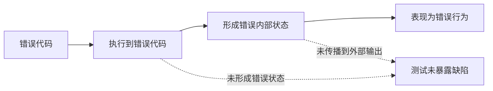
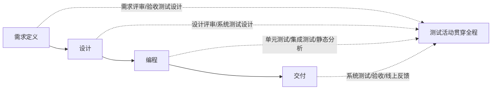
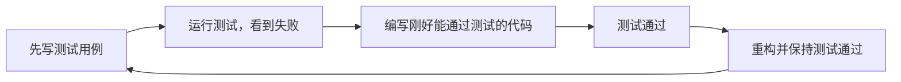

# 第1章：引论

本章按 PPT 重新整理。考试重点不是背故事，而是会用例子说明：==为什么要测试==、==软件测试是什么==、==测试和开发是什么关系==。

## 1. 本章考点地图

| 考点 | 必须会写 |
| --- | --- |
| 软件测试的必要性 | 软件规模增长，软件总可能出错，缺陷会造成质量、经济、安全风险 |
| 测试不能保证正确性 | 不存在万能正确性检测器；测试只能展示缺陷存在，不能证明缺陷不存在 |
| 错误代码到错误行为 | 错误代码不一定执行；执行后不一定形成错误状态；错误状态不一定外显为错误行为 |
| 软件测试定义 | 发现缺陷、检验需求、比较实际结果与预期结果、评估质量风险 |
| 测试与调试 | 测试发现问题，调试定位并修复问题 |
| 软件测试与程序测试 | 软件包括需求、设计、代码、可执行程序；评审属于静态测试 |
| 正向/反向测试思想 | 正向建立信心，反向寻找错误，实际测试需要平衡 |
| 测试与质量保证 | 质量保证偏管理和流程，测试偏技术和产品评估 |
| 测试与开发关系 | 测试不是开发后一道工序，应贯穿整个生命周期 |
| V 模型、W 模型、TDD | 知道含义、优缺点和考试表述 |

## 2. 为什么要进行软件测试

PPT 的核心结论：

> 软件总存在缺陷。通过测试发现软件缺陷并评估软件质量；测试投入的成本可以预防缺陷造成的损失。

软件测试越来越必要，原因有三个：

1. 软件规模不断增大，代码、接口、数据、运行环境都更复杂。
2. 软件缺陷可能造成经济损失、用户损失，甚至生命安全事故。
3. 完全证明软件正确通常不可行，只能通过测试降低风险。

### 2.1 PPT 典型事故

| 案例 | 问题 | 启示 |
| --- | --- | --- |
| 迪士尼《狮子王童话》光盘 | 缺少兼容性测试，只能在少数系统正常运行 | 用户环境差异会放大兼容性风险 |
| Pentium FDIV bug | 浮点除法硬件缺陷 | 底层计算错误影响巨大，Intel 损失约 4 亿美元 |
| 波音 737 MAX 8 | 传感器错误读数触发控制系统异常 | 安全关键系统必须重视验证、确认和风险测试 |
| 阿丽亚娜 5 火箭 | 64 位浮点转 16 位整数溢出 | 数据范围、类型转换、边界条件是高危点 |
| Zune 播放器 | 闰年日期处理问题 | 日期、时间、边界值容易漏测 |
| Therac-25 | 医疗设备软件缺陷 | 安全关键软件缺陷可能造成严重伤害 |

考试写法：

> 软件测试的必要性来自软件缺陷不可避免和缺陷后果严重。测试通过发现缺陷、评估质量、降低风险，使测试成本小于缺陷造成的损失。

## 3. 测试不能保证程序完全正确

PPT 明确说：没有万能正确性检测器。计算理论告诉我们，不能存在一个通用程序，对任意输入代码都判断其是否完全正确。

测试不保证正确性，原因是：

- 输入域可能非常大甚至无限。
- 分支、循环、并发、外部环境会造成路径爆炸。
- 错误代码未必被执行。
- 错误代码执行了也未必产生错误状态。
- 错误状态产生了也未必传播为外部可观察的错误行为。

PPT 的平均数例子说明：代码中有错误，但输入不同，可能仍然得到正确输出。因此，测试用例设计的关键不是随便跑程序，而是选择能让错误暴露出来的数据。

## 4. 什么是软件测试

### 4.1 测试不等于调试

| 对比项 | 软件测试 | 调试 |
| --- | --- | --- |
| 目标 | 发现缺陷、暴露失败、评估质量 | 找出缺陷原因并修复 |
| 典型问题 | 系统是否表现出错误？ | 为什么错？错在哪里？怎么改？ |
| 输出 | 测试结果、缺陷报告、质量信息 | 修复后的代码、根因分析 |
| 关系 | 测试发现问题后，通常进入调试 | 调试之后还要重新测试和回归测试 |

一句话：

> 测试负责把问题暴露出来；调试负责把问题定位并修掉。

### 4.2 软件测试不等于程序测试

软件不只是可执行程序。需求、设计、代码、配置、数据、文档都属于软件相关工件。

| 测试对象 | 活动 | 类型 |
| --- | --- | --- |
| 需求 | 需求评审，检查正确性、完整性、一致性、可测试性 | 静态测试 |
| 设计 | 设计评审，检查架构、接口、可测试性、单点失效 | 静态测试 |
| 代码 | 代码评审、静态分析、编码规范检查 | 静态测试 |
| 可执行程序 | 输入测试数据，观察输出和行为 | 动态测试 |

考试判断：

> “软件测试就是运行程序找错”是不完整的。对需求、设计、代码的评审也属于测试活动。

## 5. 软件测试定义的两种思想

### 5.1 正向测试思想

Bill Hetzel 的定义强调：测试是为了建立程序或系统按预期设想运行的信心。

特点：

- 更强调验证系统符合需求。
- 以预期结果为依据。
- 适合验收、回归、合规类测试。

### 5.2 反向测试思想

Glenford J. Myers 的定义强调：测试是为了发现错误而执行程序。

特点：

- 假定软件总有错误。
- 成功的测试是发现了问题的测试。
- 更强调寻找薄弱环节、异常条件、容易出错的位置。

### 5.3 考试综合定义

IEEE 729 的表述重点是：使用人工或自动手段运行或测定系统，检验是否满足规定需求，弄清预期结果与实际结果之间的差别。

可以这样答：

> 软件测试是使用人工或自动手段，对软件及相关工件进行评审、运行或测定的活动，目的是发现缺陷，检验软件是否满足规定需求，比较实际结果与预期结果的差别，并评估软件质量和发布风险。

## 6. 从质量、风险、经济角度理解软件测试

| 角度 | 解释 |
| --- | --- |
| 质量角度 | 测试给出软件质量信息，判断质量是否满足设计和用户需求 |
| 风险角度 | 测试揭示和评估质量风险，引导开发把发布风险降到最低 |
| 经济角度 | 测试以相对较小成本发现缺陷，避免更大的后期损失 |

经济角度的核心话：

> 测试成本小于缺陷造成的损失时，测试才有意义。缺陷发现越早，返工越少，损失越小。

## 7. 软件测试与质量保证

| 对比项 | 软件质量保证 | 软件测试 |
| --- | --- | --- |
| 性质 | 管理性、过程性工作 | 技术性、产品评估工作 |
| 关注点 | 流程是否合规，活动是否受控 | 产品是否满足需求，是否存在缺陷 |
| 典型活动 | 评审、审计、质量计划、过程监控 | 测试分析、测试设计、测试执行、缺陷报告 |
| 目标 | 预防缺陷，保证过程质量 | 发现缺陷，评估产品质量 |

考试表达：

> 软件质量保证侧重流程评审和监控，软件测试侧重对产品进行评估和验证。

## 8. 测试与开发的关系

早期观点：测试是开发完成后的下一道工序。

PPT 强调的新观点：测试与开发是并行、协作关系，测试应该贯穿整个软件生命周期。

### 8.1 V 模型

V 模型强调开发阶段与测试阶段的对应：

| 开发活动 | 对应测试 |
| --- | --- |
| 需求分析 | 验收测试 |
| 概要设计 | 系统测试 |
| 详细设计 | 集成测试 |
| 编码 | 单元测试 |

优点：关系清楚，便于理解测试层次。

风险：容易被误解为测试只发生在后期。

### 8.2 W 模型

W 模型强调测试与开发同步进行：需求要评审，设计要评审，代码要测试，测试准备要尽早开始。

考试区别：

- V 模型强调开发与测试层次的对应。
- W 模型强调测试左移、测试与开发并行。

## 9. 测试驱动开发 TDD

TDD 是 PPT 中提到的开发方法：测试在前，编码在后。

流程：

价值：

- 先把需求具体化为可执行测试。
- 通过错误反馈推动编码。
- 形成可重复运行的回归测试集。
- 促进代码可测试性。

注意：TDD 不能替代系统测试、性能测试、安全测试等其他测试。

## 10. 本章速记

1. 测试必要性：软件总有缺陷，缺陷会造成损失，测试用于发现缺陷和评估质量。
2. 测试局限：测试不能证明缺陷不存在，只能展示缺陷存在。
3. 软件测试不等于程序测试：需求、设计、代码评审也是测试。
4. 测试不等于调试：测试发现问题，调试定位和修复问题。
5. 正向思想重验证，反向思想重发现错误。
6. 测试与开发并行协作，贯穿软件生命周期。
7. V 模型重对应，W 模型重同步和测试左移。

