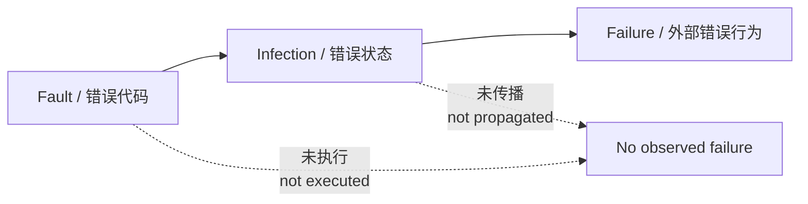
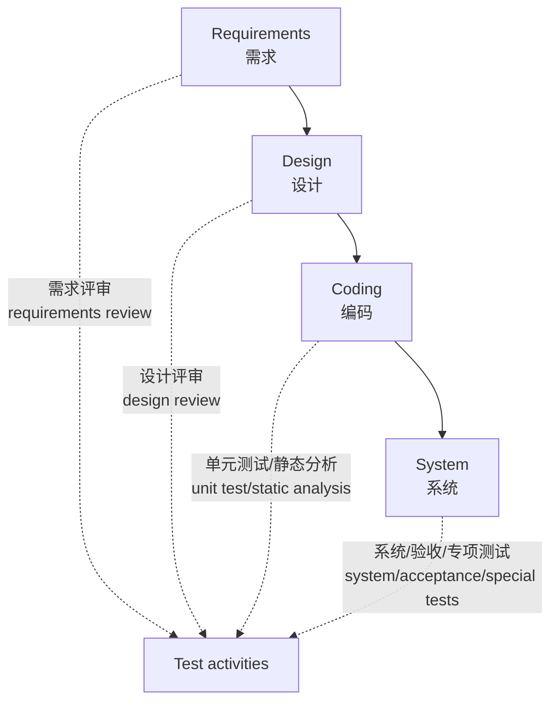
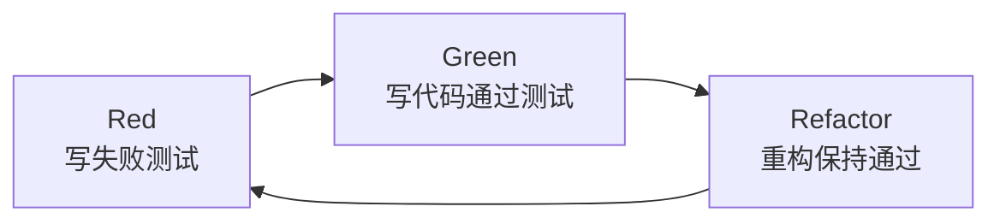

# 第1章：引论

本章回答三个问题：==为什么必须测试==、==软件测试到底是什么==、==测试和开发是什么关系==。
This chapter answers three questions: ==why testing is necessary==, ==what software testing means==, and ==how testing relates to development==.

## 1. 本章考试地图

| 考点 | 需要会到什么程度 | English |
| --- | --- | --- |
| 软件测试的必要性 | 能用事故案例说明软件缺陷会造成质量、经济和安全风险 | necessity of testing |
| 测试的定义 | 能说出“发现缺陷、评估质量、降低风险”，并知道测试不能证明无缺陷 | definition of testing |
| 测试 vs 调试 | 能区分测试发现问题，调试定位并修复问题 | testing vs debugging |
| 软件测试 vs 程序测试 | 知道需求、设计、代码也可以测试，程序运行只是动态测试的一部分 | software testing vs program testing |
| 正向/反向测试思维 | 正向建立信心，反向寻找错误；实际测试要平衡 | positive and negative view |
| QA vs Testing | QA 偏管理和流程，Testing 偏技术和产品验证 | quality assurance vs testing |
| V 模型 / W 模型 | 知道测试应贯穿生命周期，不是开发结束后的单一步骤 | V-model / W-model |
| TDD | 先写测试，再写代码，以测试反馈驱动实现 | Test-Driven Development |

## 2. 为什么要进行软件测试

软件测试的根本原因是：==软件总可能存在缺陷，而缺陷会转化为质量风险、经济损失甚至安全事故==。
The fundamental reason is: ==software can contain defects, and defects can become quality risks, economic loss, or safety incidents==.

课件中的典型事故可以按“缺陷类型 -> 后果 -> 启示”记忆：

| 案例 | 主要问题 | 后果 | 复习启示 |
| --- | --- | --- | --- |
| Disney《狮子王童话》光盘 | 缺少兼容性测试 | 用户安装失败或无法使用 | 兼容性不是小问题，用户环境会放大风险 |
| Pentium FDIV bug | 浮点除法硬件缺陷 | Intel 召回 CPU，损失巨大 | 底层计算错误影响范围极广 |
| Boeing 737 MAX 8 | 控制系统与传感器错误处理风险 | 重大安全事故 | 安全关键系统必须重视验证、确认和风险测试 |
| Ariane 5 火箭 | 64 位浮点到 16 位整数转换溢出 | 发射后自毁 | 数据范围和溢出是经典边界问题 |
| Zune 播放器 | 闰年/日期处理 bug | 特定日期无法启动 | 日期、时间和边界条件容易漏测 |
| Therac-25 | 医疗设备软件缺陷 | 患者受严重过量辐射 | 安全关键软件需要更强测试和验证 |

结论：测试投入的成本只有在小于缺陷造成的损失时才有经济意义；大型软件通常满足这一条件。
Conclusion: testing is economically meaningful when the cost of testing is lower than the loss caused by defects; for large software, this is usually true.

## 3. 测试不能证明程序没有缺陷

课件强调了一个很重要的思想：不存在万能正确性检测器。
The slides emphasize an important idea: there is no universal correctness detector.

原因是：

1. 输入域通常巨大甚至无限。
2. 执行路径会因为分支、循环、并发、外部环境而爆炸。
3. 一段错误代码可能没有被执行。
4. 错误代码即使被执行，也未必传播成外部可观察的错误行为。
5. 即使某些测试全部通过，也只能提高信心，不能证明没有其他未测场景。

考试表达：

> ==Testing can show the presence of bugs, but cannot prove their absence.==
> 测试可以证明缺陷存在，但不能证明缺陷不存在。

## 4. 什么是软件测试

### 4.1 正向定义

Bill Hetzel 代表的正向思维强调：测试是为了建立软件按预期运行的信心。
The positive view emphasizes that testing builds confidence that software works as expected.

适用场景：

- 需求明确、验收标准明确的业务系统。
- 需要证明“已满足规格说明”的场景。
- 验收测试、合规测试、回归测试。

### 4.2 反向定义

Glenford J. Myers 代表的反向思维强调：测试是为了发现错误而执行程序。
The negative view emphasizes that testing executes software to find errors.

适用场景：

- 系统复杂、质量风险高。
- 规格说明不完整，需要探索薄弱点。
- 安全测试、异常测试、探索式测试。

### 4.3 平衡定义

更完整的答案可以这样写：

> ==软件测试== 是使用人工或自动手段，对软件产品及其相关工件进行评审、运行或测定的活动，目的是发现缺陷、检验是否满足需求、评估质量并降低发布风险。
> ==Software testing== is an activity that reviews, executes, or measures software products and related artifacts manually or automatically, in order to find defects, check conformance to requirements, evaluate quality, and reduce release risk.

## 5. 测试不等于调试

| 对比项 | 软件测试 Testing | 调试 Debugging |
| --- | --- | --- |
| 目标 | 发现缺陷、暴露失败、评估质量 | 定位缺陷根因并修复 |
| 典型问题 | “这个系统有没有表现出错误？” | “为什么错？改哪里？” |
| 主要人员 | 测试人员、开发人员、用户代表都可参与 | 通常由开发人员完成 |
| 输入 | 需求、设计、代码、测试用例、测试数据 | 失败现象、日志、堆栈、代码 |
| 输出 | 缺陷报告、测试结果、质量信息 | 修复后的代码、根因说明 |
| English | testing finds failures | debugging locates and fixes faults |

速记：

> 测试让问题浮出水面；调试把问题拆开修掉。
> Testing exposes the problem; debugging diagnoses and fixes it.

## 6. 软件测试不等于程序测试

软件不仅包括可执行程序，还包括需求、设计、代码、配置、数据、文档和部署脚本。
Software includes not only executable programs, but also requirements, design, code, configuration, data, documents, and deployment scripts.

| 对象 | 可以怎样测试 | 类型 |
| --- | --- | --- |
| 需求文档 | 需求评审，检查完整性、一致性、可测试性 | 静态测试 Static testing |
| 设计文档 | 架构评审，检查接口、单点失效、可测试性 | 静态测试 |
| 源代码 | 代码评审、静态分析、编码规范检查 | 静态测试 |
| 可执行程序 | 输入数据并检查输出、状态和行为 | 动态测试 Dynamic testing |
| 安装包/部署脚本 | 安装测试、部署验证 | 动态测试 |

所以考试如果问“软件测试是否就是运行程序”，答案是否定的。
If asked whether software testing simply means running a program, the answer is no.

## 7. 从质量、风险、经济三个视角理解测试

| 视角 | 中文解释 | English |
| --- | --- | --- |
| 质量视角 | 测试给出软件质量信息，判断是否满足需求和用户期望 | Testing provides quality information. |
| 风险视角 | 测试揭示和评估质量风险，帮助降低发布风险 | Testing reveals and evaluates product risks. |
| 经济视角 | 测试要用较低成本避免更高缺陷损失 | Testing aims for better quality at acceptable cost. |

常考表述：

- 缺陷发现越早，修复成本越低。
- The earlier a defect is found, the cheaper it is to fix.
- 测试不是越多越好，而是在成本、风险、质量之间做权衡。
- Testing is not “the more the better”; it is a trade-off among cost, risk, and quality.

## 8. 测试和质量保证的关系

==Quality Assurance / QA / 软件质量保证== 是管理性、过程性的工作；==Testing / 软件测试== 是技术性、产品验证性的工作。

| 对比项 | QA | Testing |
| --- | --- | --- |
| 关注点 | 流程是否合规、是否有评审和审计 | 产品是否满足需求、是否存在缺陷 |
| 典型活动 | 过程评审、质量计划、审计、规范检查 | 测试设计、测试执行、缺陷报告 |
| 目标 | 预防缺陷，改进过程 | 发现缺陷，评估产品 |
| English | process-oriented | product-oriented |

一句话：

> QA 关注“过程有没有把质量做出来”，Testing 关注“产品质量到底怎么样”。
> QA asks whether the process can produce quality; testing asks what the product quality actually is.

## 9. 测试与开发的关系

早期观念把测试看作开发之后的“检验工序”；现代测试强调并行、协作、贯穿生命周期。
The old view sees testing as a post-development inspection step; modern testing emphasizes parallel collaboration throughout the life cycle.

### V 模型

V 模型强调开发阶段和测试阶段的对应关系：

| 开发侧 | 测试侧 |
| --- | --- |
| 需求分析 | 验收测试 |
| 概要设计 | 系统测试 |
| 详细设计 | 集成测试 |
| 编码 | 单元测试 |

V 模型优点是清晰，缺点是容易被误解成“测试在后面集中发生”。
The V-model is clear, but it may be misunderstood as testing happening only at the end.

### W 模型

W 模型强调测试活动与开发活动同步开始：需求要测，设计要测，代码也要测。
The W-model emphasizes that testing starts in parallel with development: requirements, design, and code all need testing.

考试易错：

- V 模型不是说只有编码完才测试。
- W 模型更强调测试左移和全过程质量控制。

## 10. 测试驱动开发 TDD

==Test-Driven Development / TDD== 的核心是：先写测试用例，再写刚好能让测试通过的代码，然后重构。

TDD 的价值：

- 让需求和行为先被具体化。
- 让代码天然更可测试。
- 形成快速回归测试集。
- 促使设计低耦合、高内聚。

不要把 TDD 理解成“不需要其他测试”。TDD 主要覆盖开发者层面的单元行为，系统测试、性能测试、安全测试仍然需要。
Do not interpret TDD as eliminating other tests. TDD mainly covers developer-level unit behavior; system, performance, and security tests are still needed.

## 11. 本章速记

| 关键词 | 速记 |
| --- | --- |
| 测试必要性 | 软件会错，错会带来损失 |
| 测试定义 | 发现缺陷 + 验证需求 + 评估质量 + 降低风险 |
| 测试局限 | 不能证明无缺陷 |
| 测试 vs 调试 | 测试发现，调试修复 |
| 软件测试 vs 程序测试 | 软件工件都可测试，运行程序只是动态测试 |
| QA vs Testing | QA 管过程，Testing 测产品 |
| V/W 模型 | V 看对应，W 看同步 |
| TDD | 测试在前，编码在后 |

## 12. 自测

### Q1. 为什么测试不能证明软件没有缺陷？

过程 / Process:

1. 先说明输入域和路径空间巨大，无法穷尽。
2. 再说明测试用例只是抽样。
3. 最后说明通过测试只能提高信心。

答案 / Answer:

中文：因为软件输入和执行路径通常无法穷尽，测试只能从无限或巨大执行域中选择有限测试用例；测试通过只能说明这些用例未发现失败，不能排除未测场景中仍有缺陷。

English: Because the input domain and execution paths are usually too large to exhaust. Testing samples only a finite set of cases; passing them increases confidence but does not exclude defects in untested cases.

### Q2. 区分软件测试和调试。

答案 / Answer:

中文：软件测试的目标是发现缺陷、暴露失败并评估质量；调试是在发现失败之后定位根因、修改代码并验证修复。测试问“有没有错”，调试问“为什么错、怎么修”。

English: Testing aims to reveal failures and evaluate quality, while debugging locates the root cause, fixes the code, and verifies the fix. Testing asks “is there a problem?”; debugging asks “why and how do we fix it?”.

### Q3. QA 和 Testing 有什么区别？

答案 / Answer:

中文：QA 更偏过程和管理，通过评审、审计和规范来预防缺陷；Testing 更偏技术和产品，通过设计并执行测试来发现缺陷、评估产品质量。

English: QA is process-oriented and managerial, preventing defects through reviews, audits, and standards. Testing is product-oriented and technical, revealing defects and evaluating product quality through test design and execution.

### Q4. V 模型和 W 模型的核心差异是什么？

答案 / Answer:

中文：V 模型强调开发阶段与测试阶段的对应关系；W 模型强调测试与开发同步进行，需求、设计、代码都要尽早测试，体现测试左移。

English: The V-model emphasizes correspondence between development and test levels. The W-model emphasizes that testing proceeds in parallel with development, including early testing of requirements, design, and code.
