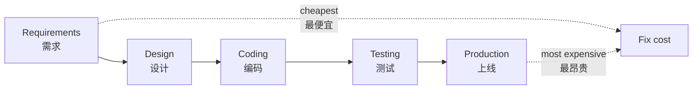
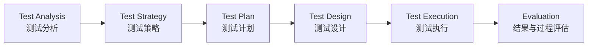

# 第2章：软件测试基本概念

本章是术语章。考试里很多判断题、选择题和简答题都来自这里：==质量、缺陷、测试分类、V&V、测试层次、测试用例、探索式测试==。
This is the vocabulary chapter. Many exam questions come from ==quality, defects, testing categories, V&V, test levels, test cases, and exploratory testing==.

## 1. 本章考试地图

| 模块 | 必背内容 | English |
| --- | --- | --- |
| 软件质量 | 内部质量、外部质量、使用质量；ISO 25010 八大特性 | software quality |
| 软件缺陷 | 缺陷定义、缺陷判断准则、test oracle | defect / bug |
| 测试分类 | 静态/动态、黑盒/白盒、手工/自动化、脚本/探索 | testing categories |
| 静态测试 | 需求评审、设计评审、代码评审、静态分析 | static testing |
| V&V | Verification: build the product right; Validation: build the right product | verification and validation |
| 测试层次 | 单元、集成、系统、验收 | test levels |
| 测试工作范畴 | 分析、策略、计划、设计、执行、评估 | testing workflow |

## 2. 软件质量 Quality

==软件质量== 是软件产品满足明示和隐含需求的能力。
==Software quality== is the ability of a software product to satisfy stated and implied needs.

### 2.1 内部质量、外部质量、使用质量

| 类型 | 谁能感知 | 例子 | English |
| --- | --- | --- | --- |
| 内部质量 | 开发者、维护者 | 代码规范性、复杂度、耦合度、可维护性 | internal quality |
| 外部质量 | 用户和测试者 | 正确性、可靠性、易用性、性能 | external quality |
| 使用质量 | 真实使用过程中的用户 | 操作效率、满意度、任务完成率 | quality in use |

课件强调：工期紧时，外部质量可能被迫妥协，但内部质量不应轻易妥协，因为内部质量恶化会持续推高维护和测试成本。
The slides emphasize that external quality may sometimes be compromised under schedule pressure, but internal quality should not be easily compromised because poor internal quality raises long-term maintenance and testing costs.

### 2.2 ISO 25010 产品质量八大特性

| 特性 | 中文解释 | 典型测试 |
| --- | --- | --- |
| Functional suitability | 功能适应性：功能是否满足需求 | 功能测试、验收测试 |
| Performance efficiency | 性能效率：响应时间、吞吐量、资源利用 | 性能测试 |
| Compatibility | 兼容性：与硬件、系统、浏览器、数据格式共存 | 兼容性测试 |
| Usability | 易用性：用户是否容易理解、学习和操作 | 可用性测试、A/B 测试 |
| Reliability | 可靠性：规定条件下持续运行的能力 | 可靠性测试、容错测试 |
| Security | 安全性：保密性、完整性、可用性等 | 安全测试、渗透测试 |
| Maintainability | 可维护性：易分析、易修改、易测试 | 代码评审、静态分析 |
| Portability | 可移植性：迁移到其他环境的能力 | 移植/安装/兼容测试 |

## 3. 软件缺陷 Defect

课件给出的核心观点：==缺陷是质量的对立面==。
A defect is the opposite of quality.

从内部看，缺陷是软件产品开发或维护过程中存在的错误、毛病、问题。
Internally, a defect is an error or problem in software development or maintenance.

从外部看，缺陷是系统功能的失效或对需求的违背。
Externally, a defect is a failure of required functionality or a violation of requirements.

### 3.1 哪些情况算缺陷

| 判断准则 | 例子 |
| --- | --- |
| 未实现需求说明书要求的功能 | 注册后应发送邮件，但没有发送 |
| 出现需求说明书说明不应出现的错误 | 输入合法数据却崩溃 |
| 实现了需求说明书未提到的功能 | 系统暴露了未授权管理入口 |
| 未实现虽未明确提及但应该实现的功能 | 密码框明文显示密码 |
| 用户体验不佳 | 流程难懂、响应很慢、错误提示无意义 |

### 3.2 缺陷类型

| 类型 | 说明 |
| --- | --- |
| 输入缺陷 | 对输入格式、范围、异常输入处理错误 |
| 输出缺陷 | 输出值、格式、提示、报表错误 |
| 计算缺陷 | 算法、公式、精度、溢出错误 |
| 接口缺陷 | 参数不匹配、协议不一致、数据丢失 |
| 数据缺陷 | 数据结构、持久化、一致性、迁移错误 |
| 逻辑缺陷 | 分支条件、业务流程、状态转换错误 |

### 3.3 缺陷产生原因

- 需求理解错误、不完整、不一致或频繁变化。
- 团队沟通不充分，职责划分不清。
- 对真实应用场景考虑不足，例如高并发、海量数据、第三方依赖。
- 技术复杂度高，算法、并发、内存、异常处理出错。
- 文档和评审不足。

## 4. Test Oracle 测试预言

==Test oracle / 测试预言== 是判断实际输出是否正确的依据。
==Test oracle== is the mechanism or source used to decide whether the observed result is correct.

常见来源：

| Oracle 来源 | 说明 |
| --- | --- |
| 需求规格说明书 | 最标准的判断依据 |
| 设计文档和接口文档 | 判断内部行为、接口和约束 |
| 启发式测试预言 | 基于经验判断“这个结果明显不合理” |
| 基于模型的预言 | 用模型计算期望状态或输出 |
| 一致性预言 | 不同版本、不同实现、同类产品之间应保持一致 |

考试表达：

> 没有 oracle，就难以判断测试是否通过。
> Without an oracle, it is difficult to decide whether a test passes.

## 5. 缺陷成本和早发现原则

缺陷越晚发现，修复成本通常越高。
The later a defect is found, the more expensive it is to fix.

原因：

- 需求缺陷会传递到设计、代码、测试用例和用户手册。
- 上线后的缺陷还包含用户损失、运维成本、声誉损失。
- 早期评审能把昂贵的后期返工转化为较低成本的前期发现。

## 6. 软件测试分类

### 6.1 按测试对象分类

| 层次 | 对象 | 目标 |
| --- | --- | --- |
| 单元测试 Unit testing | 函数、类、模块 | 验证最小设计单元是否正确 |
| 集成测试 Integration testing | 单元之间接口 | 发现参数不匹配、数据丢失、调用顺序错误 |
| 系统测试 System testing | 完整系统和运行环境 | 验证系统满足需求规格 |
| 验收测试 Acceptance testing | 面向用户业务 | 验证用户是否接受系统 |

### 6.2 按测试目的分类

| 类型 | 主要目标 |
| --- | --- |
| 功能测试 | 功能是否按需求工作 |
| 性能测试 | 响应时间、吞吐量、资源利用是否达标 |
| 可靠性测试 | 长时间运行、容错、恢复能力 |
| 安全性测试 | 身份认证、授权、漏洞、攻击防护 |
| 兼容性测试 | 平台、浏览器、硬件、数据格式兼容 |
| 回归测试 | 修改后原有功能是否被破坏 |

### 6.3 按是否执行程序分类

| 类型 | 是否执行程序 | 典型活动 | English |
| --- | --- | --- | --- |
| 静态测试 | 不执行 | 需求评审、设计评审、代码评审、静态分析 | static testing |
| 动态测试 | 执行 | 输入测试数据、观察输出和状态 | dynamic testing |

### 6.4 黑盒和白盒

| 对比项 | 黑盒测试 Black-box | 白盒测试 White-box |
| --- | --- | --- |
| 是否了解代码 | 不关注内部结构 | 了解代码和控制结构 |
| 依据 | 需求、规格说明、用户场景 | 源代码、控制流、数据流 |
| 设计思想 | 输入 -> 输出 | 覆盖语句、分支、条件、路径 |
| 优点 | 更接近用户视角，适合系统功能测试 | 能测内部路径和隐藏逻辑 |
| 缺点 | 可能漏掉内部路径错误 | 需要代码知识，成本较高 |

## 7. 静态测试 Static Testing

静态测试包括产品评审和静态分析。
Static testing includes reviews and static analysis.

### 7.1 评审类型

| 类型 | 特点 | English |
| --- | --- | --- |
| Peer review | 同伴互评，较轻量 | peer review |
| Walk-through | 作者带领成员走读材料 | walk-through |
| Inspection | 更正式，有角色、检查表和记录 | inspection |

### 7.2 需求评审要看什么

- 需求是否正确、完整、一致。
- 描述是否清楚，是否可测试。
- 是否有多余或无意义需求。
- 是否遗漏异常场景、边界场景、非功能需求。
- 用户代表、开发、测试是否对需求理解一致。

### 7.3 设计评审要看什么

- 架构是否合理，有无单点失效。
- 接口是否清楚，数据是否完整一致。
- 是否支持测试和监控。
- 需求是否被设计完整覆盖。
- 部署方案和外部依赖是否清楚。

### 7.4 静态分析

静态分析是在不运行程序的情况下分析源代码。
Static analysis analyzes source code without executing it.

可以检查：

- 编码规范。
- 可疑控制流。
- 数据流问题。
- 未初始化变量。
- 空指针风险。
- 安全漏洞模式。
- 复杂度和可维护性。

## 8. Verification 与 Validation

这组概念非常常考。

| 概念 | 经典英文问法 | 中文解释 | 关注点 |
| --- | --- | --- | --- |
| ==Verification== | Are we building the product right? | 是否正确地构造了软件 | 是否符合规格说明 |
| ==Validation== | Are we building the right product? | 是否构造了用户真正需要的软件 | 是否满足用户真实需求 |

例子：

- 需求说“导出 CSV”，系统严格导出了 CSV：这是 verification 角度通过。
- 用户真实需要的是 Excel 报表，但需求写错了 CSV：validation 角度可能失败。

## 9. 四个测试层次

| 层次 | 主要对象 | 常用方法 | 主要发现 |
| --- | --- | --- | --- |
| 单元测试 | 函数、类、模块 | 白盒、边界、Mock、桩/驱动 | 逻辑错误、边界错误、局部数据错误 |
| 集成测试 | 模块接口 | 接口测试、渐增式集成 | 参数不匹配、数据丢失、调用协议错误 |
| 系统测试 | 完整系统 | 黑盒、场景、自动化、非功能测试 | 功能缺陷、环境问题、性能安全问题 |
| 验收测试 | 用户业务 | 用户场景、Alpha/Beta | 是否满足用户合理期待 |

### Alpha 与 Beta

| 类型 | 地点/对象 | 说明 |
| --- | --- | --- |
| Alpha testing | 开发方场地，潜在用户或独立测试团队 | 内部验收测试的一种 |
| Beta testing | 发布给开发团队外的有限用户 | 在真实或接近真实环境下收集反馈 |

## 10. 软件测试工作范畴

课件给出的流程可以记成：

| 阶段 | 解决的问题 | 产物 |
| --- | --- | --- |
| 测试分析 | 测什么、不测什么、优先级是什么 | 测试范围、测试目标 |
| 测试策略 | 用什么方法、工具、层次和顺序测 | 测试策略 |
| 测试计划 | 谁、何时、资源、风险、进度 | 测试计划 |
| 测试设计 | 如何测，怎样设计用例 | 测试用例、测试数据 |
| 测试执行 | 运行用例、记录结果和缺陷 | 缺陷报告、执行记录 |
| 结果和过程评估 | 测得够不够，过程是否有效 | 覆盖率、缺陷趋势、测试报告 |

## 11. 测试用例 Test Case

==测试用例== 是为了特定测试目的而设计的测试条件、测试数据、操作步骤和预期结果构成的使用场景。
A ==test case== is a scenario consisting of test conditions, test data, actions, and expected results for a specific test objective.

高质量测试用例一般包含：

| 字段 | 说明 |
| --- | --- |
| 用例编号 | 便于追踪和复用 |
| 测试目标 | 为什么测 |
| 前置条件 | 环境、账号、数据状态 |
| 输入数据 | 具体值和来源 |
| 操作步骤 | 如何执行 |
| 预期结果 | oracle，判断是否通过 |
| 实际结果 | 执行后观察到的结果 |
| 通过/失败 | 结论 |

## 12. 脚本式测试与探索式测试

| 对比项 | Scripted Testing | Exploratory Testing |
| --- | --- | --- |
| 顺序 | 先设计，后执行 | 学习、设计、执行并行 |
| 关注 | 需求、文档、明确标准 | 产品交互、上下文、风险 |
| 优点 | 可重复、可管理、适合回归 | 灵活、善于发现未知问题 |
| 风险 | 容易机械执行，漏掉新风险 | 依赖测试人员能力，记录不足会难复现 |
| English | planned and documented | simultaneous learning and testing |

考试要点：

- 探索式测试不是随便乱点。
- Exploratory testing is not random clicking.
- 它强调在测试过程中不断学习、调整策略、记录发现。

## 13. 自测

### Q1. 什么是 test oracle？为什么重要？

过程 / Process:

1. 先定义 oracle 是判断实际结果是否正确的依据。
2. 再列出来源，如需求、模型、启发式规则。
3. 最后说明没有 oracle 就无法判断测试通过与否。

答案 / Answer:

中文：Test oracle 是比较实际输出和应有输出的依据，可以来自需求规格说明、设计文档、模型或启发式规则。它重要是因为测试执行后必须判断结果是否正确，没有 oracle 就无法可靠判定通过或失败。

English: A test oracle is the basis for comparing actual results with expected results. It may come from requirements, design documents, models, or heuristics. It is important because without it we cannot reliably decide whether a test passes or fails.

### Q2. Verification 和 Validation 的区别是什么？

答案 / Answer:

中文：Verification 问“是否正确地构造了软件”，关注软件是否符合规格说明；Validation 问“是否构造了正确的软件”，关注软件是否满足用户真实需求。

English: Verification asks “Are we building the product right?” and focuses on conformance to specifications. Validation asks “Are we building the right product?” and focuses on satisfying real user needs.

### Q3. 静态测试和动态测试有什么区别？

答案 / Answer:

中文：静态测试不执行程序，通过评审、走查、检查表和静态分析发现问题；动态测试执行程序，通过输入数据、观察输出和状态来发现问题。

English: Static testing does not execute the program; it finds issues through reviews, walkthroughs, checklists, and static analysis. Dynamic testing executes the program and observes outputs and states under test inputs.

### Q4. 单元测试、集成测试、系统测试、验收测试分别关注什么？

答案 / Answer:

中文：单元测试关注最小模块是否正确；集成测试关注模块接口和交互；系统测试关注完整系统是否满足需求；验收测试关注用户是否接受系统、系统是否符合用户合理期待。

English: Unit testing checks the smallest modules. Integration testing checks interfaces and interactions. System testing checks the complete system against requirements. Acceptance testing checks whether users can accept the system and whether it meets reasonable expectations.
