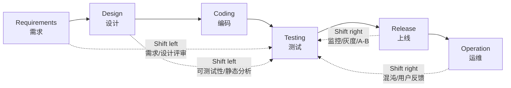
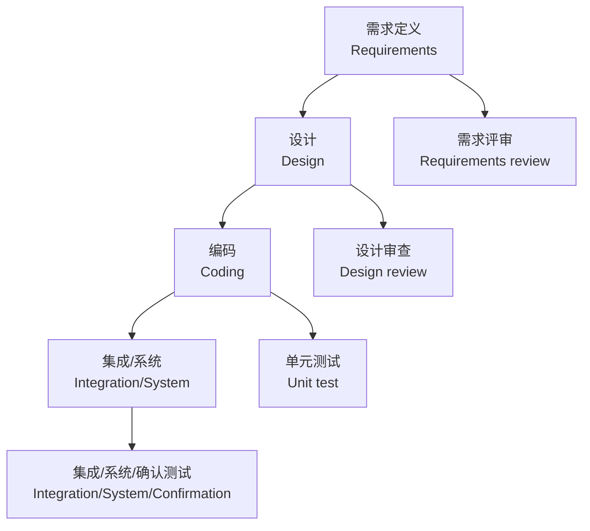

# 第3章：软件测试流程和规范

本章对应课件“软件测试流程和规范”。课件内部标号写作第 4 章，但这里按本次资料文件顺序作为第 3 章复习。
This chapter corresponds to the lecture file on software testing process and standards. The slide itself labels it as Chapter 4, but this review site follows the given course-material order.

## 1. 本章考试地图

| 模块 | 重点 | English |
| --- | --- | --- |
| 测试左移/右移 | 测试不只在执行阶段，需求前后、上线后都可测试 | shift-left / shift-right testing |
| 传统测试模型 | V 模型、W 模型、TMap | traditional testing process |
| TMap | 生命周期、三大基石、优点，考试选择题高风险 | Test Management Approach |
| 敏捷测试 | 敏捷宣言、敏捷测试原则、Scrum、SBTM | agile testing |
| 测试流派 | 分析、标准、质量、上下文驱动、敏捷 | testing schools |
| 测试过程改进 | TMM/TMMi、TPI，考试选择题高风险 | test process improvement |
| 标准规范 | ISO 29119、GB/T 38634、GB/T 15532 等 | standards and specifications |

## 2. 测试左移与测试右移

==Shift-left testing / 测试左移==：把测试活动向软件生命周期早期移动。
==Shift-left testing== moves testing activities earlier in the software life cycle.

常见活动：

- 产品需求文档评审。
- 研发设计评审。
- 单元测试。
- 代码规范检查。
- 代码复杂度检查。
- 静态分析和安全扫描。

价值：

- 越早发现不合理之处，修复成本越低。
- 测试团队更早理解需求并设计测试。
- 促使团队在需求和设计阶段就考虑可测试性。

==Shift-right testing / 测试右移==：把测试活动延伸到上线后和真实运行环境中。
==Shift-right testing== extends testing activities after release and into production-like or production environments.

常见活动：

- 灰度发布。
- 线上监控。
- 用户反馈分析。
- 混沌工程。
- A/B 测试。
- 真实流量回放和全链路压测。

考试速记：

| 概念 | 向哪里移动 | 典型目标 |
| --- | --- | --- |
| 左移 | 测试开始之前 | 早发现、早预防、低成本 |
| 右移 | 测试结束之后 | 真实环境质量反馈、稳定性、用户体验 |

## 3. 传统软件测试过程

传统过程从项目管理角度看，测试不仅包含执行，还包含计划、准备、设计、报告和完成。
From a project-management view, testing includes not only execution but also planning, preparation, design, reporting, and completion.

课件里有一个重要比例：明显可见的测试执行活动平均只占测试活动约 40%；计划约 20%，准备约 40%。
The slides state that visible test execution is only about 40% of testing work; planning is about 20%, and preparation about 40%.

### 3.1 W 模型

W 模型强调测试过程和开发过程同步、互相依赖。
The W-model emphasizes that testing and development processes proceed in parallel and depend on each other.

要点：

- 项目启动时测试也应启动。
- 需求、设计、代码都可能产生缺陷。
- 测试不是开发后唯一的检验工序，而是贯穿整个生命周期。

## 4. TMap 测试管理方法

==TMap / Test Management Approach== 是一种结构化的、基于风险策略的测试管理方法。
==TMap== is a structured, risk-based test management approach.

目标：

- 更早发现缺陷。
- 以较小成本有效完成测试。
- 减少软件发布后的支持成本。
- 使测试过程可计划、可控制、可报告、可复用。

### 4.1 TMap 生命周期

TMap 的测试生命周期包括：

| 阶段 | 核心任务 | 输出/关注 |
| --- | --- | --- |
| Planning and Control / 计划和控制 | 确定测试任务、范围、重点、策略、估算；监控并调整测试过程 | 测试计划、测试策略、进度/质量报告 |
| Preparation / 准备 | 对测试依据进行可测试性评审 | 可测试的需求/设计基础 |
| Specification / 说明 | 规划测试用例、测试脚本和前置条件 | 测试用例、测试脚本、测试数据 |
| Execution / 执行 | 检查测试对象完整性，安装环境，执行测试，记录差异 | 缺陷报告、测试执行结果 |
| Completion / 完成 | 保存测试件、复用测试资产、过程评估、经验总结 | 测试总结、复用资产、经验教训 |
| Infrastructure / 基础设施 | 准备和维护测试环境、工具、工作场所 | 测试环境、工具链、自动化框架 |

### 4.2 TMap 三大基石

| 基石 | 中文 | 含义 |
| --- | --- | --- |
| O | 组织融合 Organization integration | 测试小组融入项目组 |
| I | 基础设施和工具 Infrastructure and tools | 测试环境稳定、可控、有代表性 |
| T | 可用技术 Techniques | 用合适技术支持测试过程 |

TMap 还强调生命周期 L，即测试活动生命周期应与软件开发生命周期相配合。

### 4.3 TMap 优点

- 结构化测试方法，团队使用共同语言。
- 根据质量风险制定测试重点。
- 能早期发现和预防缺陷。
- 让测试执行尽量少占据关键路径。
- 支持测试用例、脚本、环境说明等测试产品复用。
- 让时间、成本、质量更可管理。
- 各阶段不必严格线性，可重叠进行。

### 4.4 TMap 高频选择题

| 问法 | 答案 |
| --- | --- |
| TMap 是什么？ | Test Management Approach，结构化、基于风险的测试管理方法 |
| TMap 生命周期阶段有哪些？ | 计划和控制、准备、说明、执行、完成；基础设施并行支持 |
| TMap 三大基石？ | 组织融合 O、基础设施和工具 I、可用技术 T |
| TMap 的思想像什么？ | 执行只是冰山一角，计划和准备同样重要 |

## 5. 敏捷测试过程

### 5.1 敏捷宣言

| Agile value | 中文 |
| --- | --- |
| Individuals and interactions over processes and tools | 个体和互动高于流程和工具 |
| Working software over comprehensive documentation | 工作的软件高于详尽的文档 |
| Customer collaboration over contract negotiation | 客户合作高于合同谈判 |
| Responding to change over following a plan | 响应变化高于遵循计划 |

注意：敏捷不是不要文档、不要流程、不要计划，而是更重视左侧价值。
Agile does not reject documentation, process, or planning; it values the left side more.

### 5.2 敏捷测试宣言式表达

课件中的敏捷测试倾向可以概括为：

- 开发协作测试胜于测试分工和测试工具。
- 可运行测试脚本胜于纸面测试用例。
- 从客户角度理解需求胜于只按已定义需求判断结果。
- 基于上下文及时调整测试策略胜于机械遵守测试计划。

### 5.3 传统测试 vs 敏捷测试

| 对比项 | 传统测试 | 敏捷测试 |
| --- | --- | --- |
| 阶段 | 阶段性明显 | 持续测试和快速反馈 |
| 角色 | 测试团队较独立 | 整个团队对质量负责 |
| 文档 | 重需求和测试文档 | 重面对面沟通和可运行测试 |
| 策略 | 强调计划性和规范性 | 强调速度、适应性和上下文 |
| 自动化 | 重要但不一定核心 | 更重视自动化和持续集成 |
| 思维 | 严谨、可控、缺陷预防 | 拥抱变化、批判性思维、自学习 |

## 6. Scrum 与敏捷测试

==Scrum== 是一种迭代和增量的产品开发框架，用短周期 sprint 处理频繁需求变化。

Scrum 三种角色：

| 角色 | 职责 |
| --- | --- |
| Product Owner | 代表业务和客户利益，管理产品价值和优先级 |
| Developers | 开发、测试、交付产品增量 |
| Scrum Master | 帮助团队理解并实践 Scrum，移除障碍 |

敏捷 Scrum 测试流程关注：

- 需求定义阶段就思考测试什么和工作量。
- 迭代任务划分时明确 Definition of Done。
- 迭代实施中执行 TDD、单元测试、BVT 等。
- 敏捷验收测试更关注功能特性是否真正完成。

## 7. SBTM 基于会话的测试管理

==SBTM / Session-Based Test Management== 是对探索式测试进行管理的方法。

核心概念：

| 概念 | 含义 |
| --- | --- |
| Session | 一段不受打扰的测试时间，通常约 90 分钟，是管理最小单元 |
| Mission | 会话关联的明确测试任务 |
| Charter | 会话章程，说明测什么、怎么测、找什么风险 |
| Session Sheet | 会话记录，记录 TBS、测试数据、笔记、问题、缺陷等 |
| Debriefing | 会话结束后的口头汇报 |

### 7.1 TBS

TBS = Test / Bug / Setup，用于度量会话时间分配：

- Test：真正测试时间。
- Bug：调查和记录缺陷时间。
- Setup：搭环境、准备数据时间。

### 7.2 PROOF 汇报

| 字母 | 问题 |
| --- | --- |
| Past | 已做了哪些测试？ |
| Results | 得到了什么结果？ |
| Obstacles | 遇到什么障碍？ |
| Outlook | 还需要做什么？ |
| Feelings | 测试者感觉如何？ |

## 8. 五大软件测试流派

| 流派 | 核心观点 | 典型关注 |
| --- | --- | --- |
| Analytical School / 分析流派 | 测试是严谨、技术化、逻辑性的活动 | 结构化测试、代码覆盖 |
| Standard School / 标准流派 | 测试是可重复、可衡量、按标准执行的工作 | IEEE 标准、进度和文档 |
| Quality School / 质量流派 | 测试是质量控制和风险度量活动 | 过程规范、质量管理 |
| Context-driven School / 上下文驱动流派 | 测试策略必须适配上下文，重视人的能力 | 探索式测试、启发式思维 |
| Agile School / 敏捷流派 | 测试快速验证开发完整性，强调自动化 | TDD、持续测试 |

考试不要只背名称，要能对应特点：

- 结构覆盖多：分析流派。
- 强调 IEEE 和标准：标准流派。
- 强调过程质量：质量流派。
- 强调探索式和人的能动性：上下文驱动流派。
- 强调 TDD 和自动化：敏捷流派。

## 9. 测试过程改进模型

### 9.1 TMM / TMMi

==TMMi / Testing Maturity Model integration== 吸收 CMM/CMMI 思想，描述组织测试过程能力成熟度。

TMM/TMMi 选择题重点：

| 内容 | 记忆 |
| --- | --- |
| 来源 | CMM/CMMI、历史演化测试过程、业界最佳实践 |
| 结构 | 多级成熟度定义 + 评价模型 |
| 目标 | 评估并改进测试过程能力 |
| 关键词 | maturity model, process capability |

TMMi 5 级可按 CMMI 风格理解：

| Level | 常见中文理解 | 复习解释 |
| --- | --- | --- |
| 1 Initial | 初始级 | 测试混乱、依赖个人 |
| 2 Managed / Phase definition | 管理/阶段定义 | 有基本计划、策略、环境和控制 |
| 3 Defined | 已定义 | 组织级标准过程和培训 |
| 4 Measured | 已度量 | 用度量和数据管理质量 |
| 5 Optimization | 优化级 | 持续改进、缺陷预防、创新优化 |

### 9.2 TPI

==TPI / Test Process Improvement== 是基于连续性表示法的测试过程改进参考模型。

TPI 关键点：

| 内容 | 说明 |
| --- | --- |
| 16 个关键域 | 度量、缺陷管理、测试件管理、测试方法实践、测试人员专业化、测试用例设计、测试工具、测试环境、承诺、介入程度、测试策略、测试组织、沟通、报告、过程管理、估算和计划 |
| 级别 | 每个关键域 A-D，A 最低 |
| 成熟度矩阵 | 将关键域级别映射到测试过程成熟度 |
| 检查点 | 判断关键域是否达到某级别 |
| 建议 | 指导如何改进到下一水平 |

TPI 成熟度尺度：

| 阶段 | 尺度 | 含义 |
| --- | --- | --- |
| 可控的 | 1-5 | 测试对象质量可视，按策略测试，缺陷被记录报告 |
| 有效的 | 6-10 | 不仅可控，而且效率较好 |
| 不断优化的 | 11-13 | 持续流程改进，引入新方法框架 |

### 9.3 TMap 和 TPI 区别

| 对比项 | TMap | TPI |
| --- | --- | --- |
| 主要回答 | 测试应该如何做？ | 什么样的测试过程是好的？ |
| 性质 | 测试方法和工具箱 | 测试过程衡量和改进体系 |
| 内容 | 策略、计划、设计、执行、模板、检查单 | 关键域、级别、检查点、成熟度矩阵 |
| English | test management approach | test process improvement model |

### 9.4 CTP 和 STEP

| 模型 | 全称 | 特点 |
| --- | --- | --- |
| CTP | Critical Test Process | 上下文相关，可裁剪，从评估现状开始改进 |
| STEP | Systematic Test and Evaluation Process | 系统化测试和评估，强调需求测试、早期测试、度量、缺陷分析 |

STEP 基本前提：

- 基于需求的测试策略。
- 生命周期初始即开始测试。
- 测试用作需求和使用模型。
- 测试件设计可反向影响软件设计。
- 及早发现缺陷或预防缺陷。
- 对缺陷进行系统分析。
- 测试人员和开发人员一起工作。

## 10. 软件测试标准与规范

标准层级：

| 层级 | 例子 |
| --- | --- |
| 国际标准 | ISO 29119, ISO 9000-3, ISO/IEC 12119 |
| 国家标准 | GB/T 38634, GB/T 15532, GB/T 9386 |
| 行业标准 | 金融、公安、电力、交通等行业测试规范 |
| 企业/机构规范 | 企业内部测试指南、模板、检查表 |
| 项目规范 | 某项目的测试流程和文档约定 |

### 10.1 ISO 29119 / GB/T 38634

| 部分 | 内容 |
| --- | --- |
| Part 1 Concepts & Vocabulary | 测试概念、测试类型、术语 |
| Part 2 Testing Process | 测试管理、计划、设计、执行、报告、环境支持 |
| Part 3 Documentation | 测试计划、规格说明、结果、异常报告、完成报告 |
| Part 4 Techniques | 静态测试、动态测试、黑盒、白盒、非功能、度量技术 |

### 10.2 完整测试规范包含什么

- 规范目的。
- 范围。
- 文档结构。
- 词汇表。
- 参考信息。
- 可追溯性。
- 方针。
- 过程/规范。
- 指南。
- 模板。
- 检查表。
- 培训。
- 工具。
- 参考资料。

制定项目测试规范时要考虑：

| 内容 | 说明 |
| --- | --- |
| 角色 | 谁负责计划、设计、执行、审批 |
| 进入准则 | 什么时候可以开始测试 |
| 输入项 | 需求、设计、代码、环境、数据 |
| 活动过程 | 如何设计、执行、报告 |
| 输出项 | 用例、缺陷、报告、度量 |
| V&V | 如何验证和确认 |
| 退出准则 | 什么条件下测试结束 |
| 度量 | 缺陷率、覆盖率、通过率、趋势 |

## 11. 本章速记

| 高频词 | 一句话 |
| --- | --- |
| Shift-left | 早评审、早测试、早预防 |
| Shift-right | 上线后监控、灰度、混沌、A/B |
| W 模型 | 测试和开发同步 |
| TMap | 结构化、风险驱动的测试管理方法 |
| TMap O/I/T | 组织融合、基础设施和工具、可用技术 |
| Agile testing | 持续反馈、团队共担质量、重自动化 |
| SBTM | 用 session 管探索式测试 |
| TMMi | 测试成熟度模型 |
| TPI | 测试过程改进模型 |
| ISO 29119 | 概念、过程、文档、技术 |

## 12. 自测

### Q1. 什么是测试左移和测试右移？

答案 / Answer:

中文：测试左移是把测试活动提前到需求、设计、编码早期，例如需求评审、设计评审、单元测试和静态分析；测试右移是把测试延伸到上线后，例如灰度发布、线上监控、用户反馈、混沌工程和 A/B 测试。

English: Shift-left testing moves testing activities earlier, such as requirements review, design review, unit testing, and static analysis. Shift-right testing extends testing after release, such as canary release, production monitoring, user feedback, chaos engineering, and A/B testing.

### Q2. TMap 是什么？生命周期包括哪些阶段？

过程 / Process:

1. 先说 TMap 是结构化、基于风险的测试管理方法。
2. 再列阶段。
3. 最后说明基础设施并行支持。

答案 / Answer:

中文：TMap 是 Test Management Approach，是结构化、基于风险策略的测试管理方法。生命周期包括计划和控制、准备、说明、执行、完成，基础设施和工具作为并行支持活动贯穿其中。

English: TMap stands for Test Management Approach. It is a structured, risk-based test management approach. Its life cycle includes planning and control, preparation, specification, execution, and completion, with infrastructure and tools supporting the process in parallel.

### Q3. TMap 和 TPI 的区别是什么？

答案 / Answer:

中文：TMap 主要回答“测试应该如何执行”，提供策略、计划、设计、模板和检查单；TPI 主要回答“测试过程好不好、如何改进”，通过关键域、级别、检查点和成熟度矩阵评估并改进测试过程。

English: TMap mainly answers how to perform testing and provides strategies, plans, designs, templates, and checklists. TPI mainly evaluates and improves the test process through key areas, levels, checkpoints, and a maturity matrix.

### Q4. SBTM 中 session、mission、charter 分别是什么？

答案 / Answer:

中文：Session 是一段不受打扰的测试时间；mission 是该 session 要完成的测试任务；charter 是测试章程，说明测什么、怎么测、寻找什么风险和缺陷。

English: A session is an uninterrupted block of testing time. A mission is the testing task for that session. A charter is a short guide describing what to test, how to test, and what risks or defects to look for.
