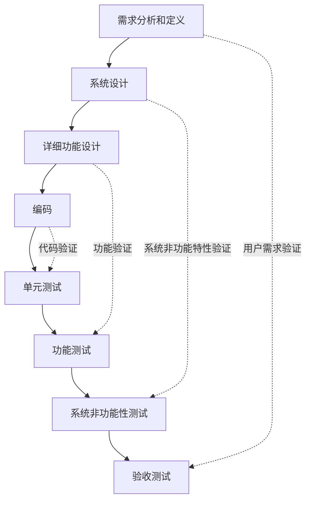
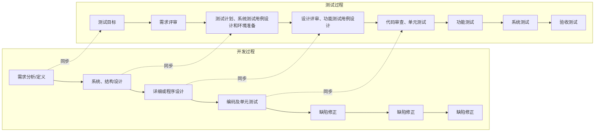
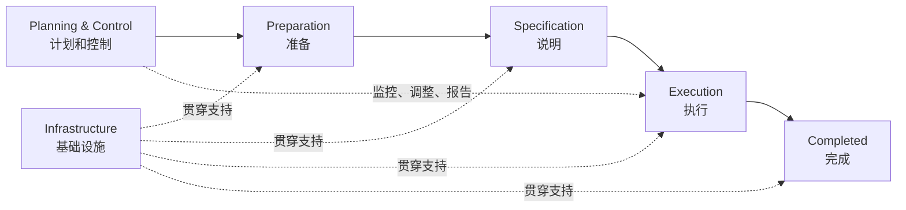
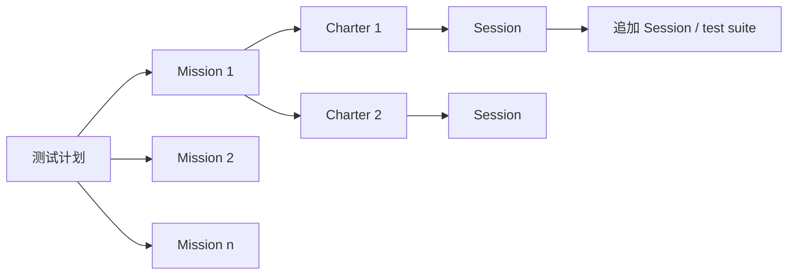

# 第3章：软件测试流程和规范

本章按 PPT“软件测试流程和规范”整理。考试重点不是只背几个模型名字，而是要能说明：==测试为什么要贯穿生命周期==、==传统过程如何安排测试活动==、==V 模型和 W 模型各自强调什么==、==TMap 怎么管理测试过程==、==敏捷测试如何持续反馈==、==测试过程如何改进与规范化==。

## 1. 本章考点地图

| 模块 | 必须掌握 | 容易考法 |
| --- | --- | --- |
| 测试左移与右移 | 左移是在测试“开始”之前发现问题；右移是在测试“结束”之后继续反馈质量 | 简答：解释左移/右移并举例 |
| 传统测试过程 | 软件工程角度：需求评审、设计评审、单元与集成测试、系统测试、验收测试；项目管理角度：计划、设计、开发、执行、评估、报告 | 画流程图、填阶段输入输出 |
| V 模型 | 构建过程和验证过程一一对应，左侧开发，右侧测试 | 画图、说明各测试级别对应的开发依据 |
| W 模型 | 测试过程和开发过程同步启动、互相依赖、重点不同 | 简答：为什么 W 模型比 V 模型更强调早期测试 |
| TMap | 结构化、基于风险策略的测试管理方法；生命周期包括计划与控制、准备、说明、执行、完成、基础设施 | 简答：生命周期、优点、基石 |
| 敏捷测试 | 持续测试、快速反馈、全团队关注质量 | 对比传统测试与敏捷测试 |
| Scrum | 角色、冲刺、测试流程：需求定义、任务划分、迭代实施、敏捷验收 | 简答：Scrum 角色与测试活动 |
| SBTM | 用 session 管理探索式测试；mission、charter、session sheet、TBS、PROOF | 概念解释、模板填空 |
| 测试流派 | 分析、标准、质量、上下文驱动、敏捷 | 选择题、简答区分 |
| 过程改进 | TMMi/TMM、TPI、CTP、STEP | 简答：TMap 与 TPI 区别；STEP 前提 |
| 标准与规范 | ISO 29119、GB/T 38634、GB/T 15532、GB/T 9386；规范内容、制定规范要考虑的内容 | 填空、简答 |

## 2. 测试左移与测试右移

早期测试经常被理解为：根据需求文档写测试用例和脚本，开始测试，提交缺陷，回归测试，测试通过后结束。PPT 强调：现代测试不能只停留在“测试阶段”，而要向前进入需求和设计，向后进入上线运行和用户反馈。

| 概念 | 含义 | PPT 中的典型活动 | 核心目的 |
| --- | --- | --- | --- |
| ==测试左移== | 向测试“开始”之前移动 | 产品需求文档评审、研发设计评审、单元测试、代码规范检查、代码复杂度检查 | 更早发现不合理的地方，降低后期修复成本 |
| ==测试右移== | 向测试“结束”之后移动 | 灰度发布、线上监控、用户反馈、混沌工程、A/B 测试 | 上线后继续观察性能、可用性和真实用户体验 |

### 2.1 测试左移怎么写

测试左移强调测试团队在软件开发周期早期与产品、开发、设计等人员合作，尽早理解需求、发现需求或设计中的问题，并提前设计测试用例。越早发现问题，修复代价越低，后期返工越少。

考试可以这样答：

> 测试左移是指把测试活动提前到需求、设计、编码等早期阶段，例如需求评审、设计评审、单元测试、代码规范检查等。它的作用是尽早发现需求不清、设计不合理、代码质量差等问题，降低后期修复成本。

### 2.2 测试右移怎么写

测试右移强调产品上线后仍然持续进行质量活动。上线不是测试结束，而是进入真实环境验证阶段。通过监控性能和可用率、收集用户反馈、灰度发布和 A/B 测试，可以尽快发现线上问题并快速响应。

考试可以这样答：

> 测试右移是指把测试活动延伸到产品上线之后，通过灰度发布、线上监控、用户反馈、混沌工程、A/B 测试等方式持续评估软件质量，保证线上问题能被及时发现和处理。

### 2.3 左移和右移的区别

| 对比项 | 测试左移 | 测试右移 |
| --- | --- | --- |
| 时间位置 | 测试开始之前 | 测试结束之后、上线之后 |
| 关注对象 | 需求、设计、代码质量、单元级问题 | 线上运行质量、用户体验、真实环境风险 |
| 常见活动 | 需求评审、设计评审、单元测试、代码检查 | 灰度、监控、反馈、混沌工程、A/B 测试 |
| 关键词 | 提前预防 | 持续反馈 |

## 3. 传统的软件测试过程

PPT 先从传统过程讲起，并分别给出软件工程过程角度和项目管理角度。

### 3.1 软件工程过程角度

从软件工程活动看，传统测试过程通常包括：

| 阶段 | 主要任务 | 主要发现的问题 |
| --- | --- | --- |
| 需求评审 | 检查需求是否正确、完整、一致、可测 | 需求缺陷 |
| 设计评审 | 检查设计是否满足需求、结构是否合理、接口是否清楚 | 设计缺陷 |
| 单元与集成测试 | 测代码单元、模块接口、模块协作 | 代码缺陷、接口缺陷 |
| 系统测试 | 在较完整系统上验证功能、性能、安全、兼容等 | 系统缺陷 |
| 验收测试 | 从用户/客户角度确认是否满足交付要求 | 其他各种交付相关缺陷 |

### 3.2 项目管理角度

从项目管理活动看，测试也可以理解为：

| 项目管理阶段 | 对测试的含义 |
| --- | --- |
| 计划 | 明确测试范围、目标、资源、进度、风险、进入和退出准则 |
| 设计 | 设计测试策略、测试用例、测试数据、测试环境方案 |
| 开发 | 准备脚本、工具、自动化、测试数据和环境 |
| 执行 | 执行测试、记录结果、提交缺陷、回归验证 |
| 评估 | 分析覆盖率、缺陷趋势、剩余风险、是否达到退出标准 |
| 报告 | 输出测试报告、缺陷状态报告、版本发布建议 |

### 3.3 阶段、输入、输出

PPT 给了一个非常重要的阶段输入输出表，容易考“填表/简答/过程题”。

| 阶段 | 输入 | 输出 |
| --- | --- | --- |
| 需求评审 | 需求定义、市场分析文档、相关技术文档 | 市场需求分析会议纪要、功能设计、技术设计 |
| 设计审查 | 市场需求文档、技术设计文档 | 测试计划、测试用例 |
| 单元测试、集成测试 | 代码完成文件包、功能详细设计说明书、最终技术文档 | 完整测试用例、完备的测试计划、缺陷报告、功能验证测试报告 |
| 系统测试 | 代码修改后的文件包、完整测试用例、完备的测试计划 | 缺陷报告、缺陷状态报告、项目阶段报告 |
| 确认测试 | 代码冻结文件包、确认测试用例 | 缺陷状态报告、缺陷报告审查、版本审查 |
| 版本发布 | 代码发布文件包、测试计划检查清单、当前版本已知问题清单 | 版本发布报告 |

### 3.4 缺陷类型与测试活动对应关系

| 缺陷类型 | 对应发现/预防活动 |
| --- | --- |
| 需求缺陷 | 需求评审 |
| 设计缺陷 | 设计评审 |
| 代码和接口缺陷 | 单元测试、集成测试 |
| 系统缺陷 | 系统测试 |
| 其他各种缺陷 | 验收测试 |

考试写法：

> 不同测试活动对应不同类型的缺陷。需求评审主要发现需求缺陷，设计评审主要发现设计缺陷，单元与集成测试主要发现代码和接口缺陷，系统测试发现系统层面的缺陷，验收测试从用户和交付角度发现其他问题。

## 4. V 模型

V 模型是 PPT 里的重点图。它把软件开发看成左侧的构建过程，把测试看成右侧的验证过程，中间通过不同层级的验证关系连接起来。

### 4.1 V 模型的左右两边

| 位置 | 内容 | 含义 |
| --- | --- | --- |
| 左侧 | 需求分析和定义、系统设计、详细功能设计、编码 | 构建过程，也就是软件逐步被定义、设计和实现 |
| 右侧 | 单元测试、功能测试、系统非功能性测试、验收测试 | 验证过程，也就是逐层检查软件是否符合前面阶段的要求 |

### 4.2 V 模型的对应关系

| 左侧开发活动 | 右侧测试活动 | 验证重点 |
| --- | --- | --- |
| 需求分析和定义 | 验收测试 | 验证软件是否满足用户需求和业务目标 |
| 系统设计 | 系统非功能性测试 | 验证性能、安全、可靠性、可用性等系统非功能特性 |
| 详细功能设计 | 功能测试 | 验证具体功能是否按详细设计实现 |
| 编码 | 单元测试 | 验证代码单元内部逻辑是否正确 |

### 4.3 V 模型的优点

1. 层次清晰，能把开发阶段和测试阶段对应起来。
2. 强调不同测试级别有不同依据：单元测试依据代码/详细设计，功能测试依据功能设计，系统非功能测试依据系统设计，验收测试依据用户需求。
3. 便于理解验证与确认：既要验证实现是否符合设计，也要确认最终产品是否符合用户需求。
4. 适合阶段性比较明确、文档比较完整的项目。

### 4.4 V 模型的局限

1. 容易被误解为“编码完成后才开始测试执行”，因此早期缺陷可能发现较晚。
2. 对需求变化的适应性较弱，因为模型假设前期需求和设计相对稳定。
3. 如果只按 V 模型右侧执行测试，而忽视需求评审、设计评审，就会把测试压到后期。

### 4.5 V 模型答题模板

> V 模型把软件开发活动和测试活动进行对应。左侧是构建过程，包括需求分析和定义、系统设计、详细功能设计、编码；右侧是验证过程，包括单元测试、功能测试、系统非功能性测试、验收测试。编码对应单元测试，详细功能设计对应功能测试，系统设计对应系统非功能性测试，需求分析和定义对应验收测试。V 模型优点是层次清楚、测试级别明确；不足是容易使人把测试理解为后期活动，因此需要结合早期评审或 W 模型思想来提前测试。

## 5. W 模型

W 模型也是 PPT 的重点。它不是简单把 V 模型画成两个 V，而是强调：==测试过程和开发过程保持同步==、==测试过程和开发过程互相依赖==、==测试过程和开发过程的重点不同==。

PPT 明确写到：==项目启动的同时测试工作也启动==。

### 5.1 W 模型强调什么

| 关键词 | 含义 |
| --- | --- |
| 同步 | 开发做需求、设计、编码时，测试也同步做目标分析、评审、计划、用例设计、环境准备 |
| 依赖 | 测试依据来自需求、设计、代码；测试结果又会推动缺陷修正和设计/代码调整 |
| 重点不同 | 开发重点是构建产品；测试重点是评审、验证、发现缺陷和反馈质量风险 |
| 早启动 | 项目启动的同时测试工作启动，而不是等代码完成 |

### 5.2 W 模型中的典型测试活动

| 开发活动 | 同步测试活动 |
| --- | --- |
| 需求分析/定义 | 明确测试目标，进行需求评审 |
| 系统、结构设计 | 制定测试计划，设计系统测试用例，准备测试环境 |
| 详细或程序设计 | 设计评审，设计功能测试用例 |
| 编码 | 代码审查，单元测试 |
| 构建和集成 | 功能测试、系统测试 |
| 发布前 | 验收测试，版本审查 |

### 5.3 W 模型和 V 模型对比

| 对比项 | V 模型 | W 模型 |
| --- | --- | --- |
| 核心思想 | 开发阶段和测试级别一一对应 | 测试活动与开发活动同步进行 |
| 测试开始时间 | 容易被理解为编码后进入右侧测试 | 项目启动时测试就启动 |
| 强调重点 | 测试级别和验证关系 | 早期评审、早期测试设计、全过程质量反馈 |
| 优点 | 层次清楚、对应关系清楚 | 能更早发现需求和设计缺陷，降低返工 |
| 局限 | 对变化适应弱，早期测试体现不足 | 对测试计划、评审、协作和管理要求更高 |

### 5.4 W 模型答题模板

> W 模型强调测试过程与开发过程同步。项目启动时测试工作也启动，需求阶段进行测试目标分析和需求评审，设计阶段进行测试计划、测试用例和环境准备，编码阶段进行代码审查和单元测试，后续再开展功能测试、系统测试、验收测试。W 模型说明测试不是编码完成后的活动，而是贯穿需求、设计、编码、执行和修正全过程。

## 6. 测试工作与冰山模型

PPT 用冰山说明测试工作比例：明显可见的测试执行活动只是海面以上部分，平均只占测试活动 40%；海面以下的计划和准备工作分别约占 20% 和 40%。

| 部分 | 比例 | 含义 |
| --- | --- | --- |
| 测试执行 | 约 40% | 可见活动，如执行用例、记录结果、提交缺陷 |
| 测试计划 | 约 20% | 明确范围、策略、资源、进度、风险 |
| 测试准备 | 约 40% | 评审依据、设计用例、准备环境、准备数据和工具 |

重要结论：

1. 测试不能只理解为执行用例。
2. 计划和准备越充分，测试执行越少占据项目关键路径。
3. TMap 测试生命周期正是基于这种思想建立起来的。

## 7. TMap

TMap 是 PPT 里的核心模型之一。TMap 全称是 Test Management Approach，意思是测试管理方法。PPT 定义：TMap 是一种==结构化的、基于风险策略的测试方法体系==，目的在于更早发现缺陷，以最小成本有效、彻底地完成测试任务，减少软件发布后的支持成本。

### 7.1 TMap 生命周期总览

PPT 中 TMap 生命周期由计划和控制、准备、说明、执行和完成等阶段组成，并把基础设施作为贯穿测试过程的重要部分。

| 阶段 | PPT 中的含义 | 记忆关键词 |
| --- | --- | --- |
| 计划和控制 | 包括评审和研究、开发测试策略、风险分析、测试估算、建立测试组织、准备计划、管理和控制 | 定任务、定范围、定策略、控过程 |
| 基础设施 | 建立测试执行、测试件管理、缺陷管理等所需环境，包含自动化测试框架 | 环境、工具、工作场所 |
| 准备 | 包括可测试性评审、确定技术方法 | 审测试依据 |
| 说明 | 详细设计测试用例，建立测试的基础设施和前置条件 | 设计用例和条件 |
| 执行 | 包括预测试、测试、重新测试、检查、评估等活动 | 真正执行并记录缺陷 |
| 完成 | 维护测试件，评估测试过程 | 保存复用、经验总结 |

### 7.2 计划阶段

计划阶段首先要确定测试任务，并就测试范围、测试重点与主要干系人达成一致。由于大多数组织没有足够时间和金钱对系统进行完全测试，所以必须根据风险分析制定测试策略、测试估算和测试计划。

计划阶段要做的事：

1. 明确测试任务、范围和重点。
2. 分析测试依据、主要问题和组织结构。
3. 基于风险分析制定测试策略。
4. 进行测试估算和测试策划。
5. 与客户或干系人协商测试投入和测试重点。
6. 确定测试技术，选择合适覆盖率。
7. 初步规划测试组织、人员和基础设施。

### 7.3 控制阶段

PPT 强调：主要测试过程很少能完全按计划执行，因此要监控和调整测试计划。控制阶段的目标是以最优方式控制和报告测试过程，让客户/干系人了解测试进度、测试对象质量、风险、时间和成本。

控制阶段要做的事：

1. 监控测试计划执行情况。
2. 根据开发延迟、需求变更、项目调整等信息修正测试安排。
3. 管理测试过程、基础设施和测试产品。
4. 使用测试数据做趋势分析。
5. 从结果、风险、时间、成本四个方面向不同对象报告。

### 7.4 安装和维护基础设施阶段

基础设施阶段的目标是为测试基础设施和资源做好准备，主要包括测试环境、测试工具和工作场所。没有基础设施就无法执行测试，因此 TMap 把它作为独立过程持续关注。

需要注意：

1. 基础设施活动通常与准备、设计、执行和结束阶段并行。
2. 测试团队常常依赖外部部门搭建环境，但测试主管需要持续关注。
3. 测试基础设施包括测试环境、缺陷管理工具、测试件管理、自动化测试框架等。

### 7.5 准备阶段

准备阶段的核心是对测试依据进行可测试性评审。目标是使测试依据的质量满足测试设计要求。

为什么重要：

1. 需求、设计、系统文档都可能存在错误。
2. 开发团队会依据这些文档进行开发。
3. 如果早期没有发现文档错误，后期会导致大量修正工作。
4. 错误越早发现，修复越容易，代价越小。

### 7.6 说明阶段

说明阶段规划所需的测试用例和前置条件。目的是尽可能提前准备，使开发团队交付测试对象后，测试团队能尽快执行测试。

说明阶段的特点：

1. 在测试依据可测试性评审完成后即可开始。
2. 测试设计可以与软件实现同步进行。
3. 输出重点是测试用例、测试脚本、前置条件、测试数据和执行准备。

### 7.7 执行阶段

执行阶段的目标是通过执行已商定的测试用例来了解测试对象质量。真正执行通常从测试对象或可测试部分交付给测试团队开始。

执行阶段的一般顺序：

1. 检查测试对象完整性。
2. 将测试对象安装到测试环境。
3. 进行预测试或接收测试，确认对象质量是否达到深入测试要求。
4. 根据测试脚本执行测试。
5. 验证测试结果。
6. 用缺陷报告记录预期结果与实际结果差异。
7. 修复后重新测试和回归测试。

### 7.8 完成阶段

完成阶段包括测试件保存、测试成果复用和测试过程评估。

| 内容 | 说明 |
| --- | --- |
| 保存测试件 | 保存测试用例、测试脚本、测试基础架构说明等 |
| 复用成果 | 后续测试可复用用例、脚本、环境说明和经验 |
| 保持一致 | 测试用例应尽量与测试依据、测试对象保持一致 |
| 过程评估 | 总结经验教训，作为最终报告和新项目改进依据 |

如果无法保存所有测试件，通常优先保存测试用例。

### 7.9 TMap 的基石

PPT 标题写“TMap 三大基石”，内容中列出 L、O、I、T。考试按 PPT 写即可。

| 缩写 | 名称 | 含义 |
| --- | --- | --- |
| L | 测试活动生命周期 | 与软件开发生命周期一致，描述各阶段需要实施的活动 |
| O | 组织融合 | 测试小组融入项目组 |
| I | 基础设施和工具 | 测试环境必须稳定、可控制、有代表性 |
| T | 可用的技术 | 支持测试过程的技术 |

### 7.10 TMap 生命周期模型的优点

1. 提供结构化测试方法。
2. 能针对被测软件质量风险提供深入认知和建议。
3. 能在早期发现缺陷。
4. 能预防缺陷。
5. 能让测试执行尽量短地占据开发项目关键路径，从而缩短交付时间。
6. 能复用测试产品，如测试脚本和测试用例。
7. 建立清晰测试过程，使时间、成本和质量更便于管理。
8. 促进一致性和标准化，让参与者使用同样的测试语言。

### 7.11 TMap 不必严格按时序执行

TMap 的生命周期不是简单线性流程。只有执行阶段是最明显的“可见”活动，也最容易占据项目关键路径；其他阶段，如计划、准备、说明、基础设施准备，都可以尽量提前或并行完成。

答题关键句：

> 当计划、准备和说明阶段工作越充分，测试执行阶段所需要的时间越少。TMap 允许不同测试阶段出现时间重叠或同步进行。

### 7.12 TMap 与开发生命周期的关系

TMap 可以与不同开发生命周期配合使用。两个固定时间点很重要：

1. 准备阶段开始时间与获得测试依据的时间对应。
2. 执行阶段开始时间与获得测试对象的时间对应。

也就是说，有了需求、设计等测试依据，就可以开始准备和设计；有了可测试的软件对象，才真正进入执行。

### 7.13 基于 TMap 提出的其他方法

PPT 中列为了解：

| 方法 | 含义 |
| --- | --- |
| TPI | Test Process Improvement，测试过程改进 |
| TAKT | Test Automation Knowledge and Tools |
| Tsite | 与测试站点/测试环境相关的方法 |
| TEmb | 与嵌入式测试相关的方法 |

### 7.14 BDTM：业务驱动测试管理方法

BDTM 是 Business Driven Test Management，PPT 列为了解。它强调测试选择要受业务目标、风险和资源驱动。

| 步骤 | 内容 |
| --- | --- |
| Step 1 | 建立任务并收集测试目标 |
| Step 2 | 确定风险等级 |
| Step 3 | 确定测试强度 |
| Step 4 | 估算、计划和反馈 |
| Step 5 | 分配测试设计技术 |
| Step 6 | 提供洞察和控制选项 |

## 8. 敏捷测试过程

PPT 中敏捷部分包括：敏捷测试的价值观和原则、传统测试和敏捷测试区别、敏捷测试流程、Scrum、SBTM。

### 8.1 敏捷开发

敏捷开发是一种应对快速变化需求的软件开发模式，描述了一套软件开发价值观和原则。

敏捷宣言四组价值观：

| 更重视 | 相对不那么重视 |
| --- | --- |
| 个体和互动 | 流程和工具 |
| 工作的软件 | 详尽的文档 |
| 客户合作 | 合同谈判 |
| 响应变化 | 遵循计划 |

注意：这不是说不要流程、工具、文档和计划，而是当两者发生冲突时，左侧价值更高。

### 8.2 敏捷开发十二条原则

考试一般不要求逐字背英文，但要知道核心含义。

1. 尽早和持续交付有价值的软件来满足客户。
2. 欢迎需求变更，即使在开发后期也要善于利用变化。
3. 频繁交付可用软件，周期越短越好。
4. 业务人员与开发人员要在项目过程中共同工作。
5. 围绕受激励的个体构建项目，给予环境、支持和信任。
6. 面对面交谈是最有效的沟通方式。
7. 可用的软件是衡量进度的主要指标。
8. 敏捷过程提倡可持续开发，保持长期稳定速度。
9. 持续关注技术卓越和良好设计。
10. 简单，尽最大可能减少不必要工作。
11. 最佳架构、需求和设计来自自组织团队。
12. 团队定期反省如何更有效，并相应调整行为。

### 8.3 敏捷测试宣言

PPT 中敏捷测试宣言：

| 更重视 | 相对不那么重视 |
| --- | --- |
| 开发协作测试 | 测试分工和测试工具 |
| 可运行的测试脚本 | 写在纸上的测试用例 |
| 从客户角度理解需求 | 从已定义需求判定测试结果 |
| 基于上下文及时调整测试策略 | 遵守测试计划 |

### 8.4 敏捷测试原则

1. 尽早和持续地开展测试。
2. 基于风险的测试策略是必需的。
3. 测试计划、设计和执行力求简单。
4. 能及时完成对软件质量的全面评估。
5. 软件本身是测试研究和分析最主要的对象。
6. 在满足所要求质量的前提下，测试进行得越快越好。
7. 对测试技术精益求精。
8. 不断反思，持续优化测试流程与设计。

### 8.5 传统测试和敏捷测试的区别

| 对比项 | 传统测试 | 敏捷测试 |
| --- | --- | --- |
| 流程特点 | 重流程，阶段性明确 | 持续测试，持续质量反馈，没有明显阶段边界 |
| 团队关系 | 测试团队独立性较强，测试人员职责细化 | 整个团队对测试负责，可以弱化单独测试角色 |
| 需求变化 | 更关注已确定的需求和测试文档 | 拥抱变化，以用户需求和交付价值为中心 |
| 沟通方式 | 强调文档、计划和规范 | 强调面对面沟通和快速反馈 |
| 测试方式 | V+V、严谨规范、缺陷预防、过程改进 | TDD、ATDD、持续测试、探索式测试、测试自动化 |
| 能力要求 | 分析能力、文档能力、规范执行 | 批判性思维、自我学习、个人技能、自动化能力 |

### 8.6 敏捷测试流程

PPT 强调敏捷测试要尽早开始，并及时、持续地对产品质量进行反馈。

敏捷测试不是等迭代末尾统一测试，而是在需求、设计、代码、功能、非功能特性中持续提供质量反馈。

## 9. Scrum 与敏捷测试流程

Scrum 是一种敏捷分组合作开发框架，也是一种迭代和增量的产品开发框架。它允许持续反馈，以处理需求频繁变化。任务被划分为在规定时间内完成的目标，称为冲刺，每个冲刺不超过 1 个月。

### 9.1 Scrum 小组角色

| 角色 | 职责 |
| --- | --- |
| product owner | 专注业务方面，代表利益相关方和客户利益 |
| developers | 在产品开发和支持中发挥作用 |
| scrum master | 指导和教育团队理解、实践 Scrum |

### 9.2 Scrum 测试流程

| 阶段 | 测试关注点 |
| --- | --- |
| 需求定义阶段 | 明确测试什么，估算测试工作量 |
| 迭代任务划分和安排 | 明确每项任务结束的要求，也就是完成标准 |
| 迭代实施阶段 | 完成已定义任务，执行 TDD、单元测试和 BVT |
| 敏捷验收测试 | 验证功能特性是否真正完成 |

### 9.3 敏捷验收测试和传统验收测试区别

| 对比项 | 传统验收测试 | 敏捷验收测试 |
| --- | --- | --- |
| 发生时间 | 常在项目后期或交付前 | 可在每个迭代、每个功能完成时进行 |
| 关注点 | 整体系统是否满足合同/需求 | 单个功能特性是否真正完成 |
| 反馈速度 | 反馈相对较晚 | 反馈更快 |
| 与开发关系 | 阶段边界较清晰 | 与开发和测试紧密交织 |

## 10. SBTM：基于会话的测试管理

SBTM 是 Session-Based Test Management，基于会话的测试管理。PPT 说明：敏捷测试中新功能测试以探索式测试为主，需要流程管理，SBTM 是一个解决方案。

### 10.1 为什么需要 SBTM

探索式测试灵活，但如果完全不记录、不管理，就容易出现：

1. 测过什么不清楚。
2. 为什么这样测不清楚。
3. 哪些风险还没覆盖不清楚。
4. 测试效率和产出难以评估。

SBTM 用 session 把探索式测试管理起来，使测试既保留灵活性，又能被计划、跟踪、复盘。

### 10.2 SBTM 核心概念

| 概念 | 含义 |
| --- | --- |
| session | 一段不受打扰的测试时间，通常 90 分钟，是测试管理最小单元 |
| mission | 每个 session 关联的、目标明确的测试任务 |
| charter | 章程/测试指导，简要描述 session 如何执行，相当于简要计划 |
| session sheet | 结果报告，记录任务、执行者、时间分布、测试数据、笔记、问题、缺陷 |

### 10.3 mission、session、charter 的关系

理解方法：

1. 测试计划可以拆成多个 mission。
2. 每个 mission 可以由一个或多个 charter 指导。
3. 每个 charter 落到具体 session 执行。
4. 多个 session 组合起来，周密测试整个产品。

### 10.4 Charter 要写什么

PPT 说，Charter 要清晰指导 session 执行任务：测什么、怎么测试、寻找什么样的缺陷、关注哪些产品质量风险。它强调策略，不是详细测试步骤。

| 内容 | 说明 |
| --- | --- |
| 角色/主题 | 本次测试针对的用户角色或业务主题 |
| 测试目标 | 本次 session 要达成什么目标 |
| 优先级 | 本次任务的重要程度 |
| 参考 | 产品愿景、用户故事、需求、设计等 |
| 测试判断依据 | 用户故事验收标准、需求规则、业务规则等 |
| 环境配置 | 操作系统、浏览器、设备、版本等 |
| 测试数据 | 数据库、账号、文件、边界数据等 |
| 如何测试 | 测试策略，如异常操作、互操作、大数据、组合场景 |

### 10.5 Session Sheet 要写什么

| 内容 | 含义 |
| --- | --- |
| Session charter | 任务陈述、测试范围等 |
| Tester name(s) | 测试执行者 |
| TBS | Test/Bug/Setup 时间分布，用于估算速度、评估效率 |
| 测试数据、数据文件 | 为测试数据复用提供基础 |
| Note 测试笔记 | 记录为什么测试、如何测试、为什么这样的测试足够好 |
| Issues 问题/风险 | 测试过程中的疑问和未来参考资料 |
| 缺陷 | 测试的直接产出 |

### 10.6 TBS

TBS 是 Task Breakdown 里的时间分布指标：

| 缩写 | 含义 |
| --- | --- |
| T | Test，真正执行测试的时间 |
| B | Bug，调查、记录、复现缺陷的时间 |
| S | Setup，准备环境、数据、工具的时间 |

TBS 的作用是帮助分析测试效率。如果 Setup 时间过高，可能说明环境和数据准备不足；如果 Bug 时间很高，可能说明缺陷多或缺陷复现成本高。

### 10.7 Debriefing 与 PROOF

PPT 中 session 结束后有口头汇报，任务报告可用 PROOF 组织：

| 缩写 | 含义 | 可回答的问题 |
| --- | --- | --- |
| P | Past 已做了哪些测试 | What happened during the session? |
| R | Results 测试结果 | What was achieved during the session? |
| O | Obstacles 障碍 | What got in the way of good testing? |
| O | Outlook 未来要做哪些测试 | What still needs to be done? |
| F | Feelings 感觉 | How does the tester feel about all this? |

考试如果问 SBTM，可以按“session 是单位、mission 是任务、charter 是指导、session sheet 是记录、TBS 度量时间、PROOF 做汇报”来答。

## 11. 软件测试流派

PPT 给出五大软件测试流派：分析流派、标准流派、质量流派、上下文驱动流派、敏捷流派。

| 流派 | 核心观点 | 关键词 |
| --- | --- | --- |
| 分析流派 | 测试是逻辑性的、技术性的，从计算机科学角度看测试 | 结构化测试、代码覆盖、规格说明 |
| 标准流派 | 测试看作具有可重复标准、旨在衡量进度的一项工作 | 标准化、可重复、进度衡量 |
| 质量流派 | 测试是过程质量控制以及度量项目风险的活动 | 过程规范、质量控制、风险度量 |
| 上下文驱动流派 | 强调人的能动性和启发式测试思维 | 探索式测试、上下文、人的技能 |
| 敏捷流派 | 强调自动化测试，用测试快速验证开发是否完整 | TDD、自动化、快速反馈 |

### 11.1 分析流派

分析流派认为测试是严格的、技术性的，强调结构化测试。它拥有许多代码覆盖度量，并试图提供客观的测试度量。

特点：

1. 精确详细的规格说明是测试前提。
2. 测试人员验证软件行为是否符合规格说明。
3. 多见于学术界和高可靠性行业。
4. 关注覆盖率、路径、结构、逻辑等。

### 11.2 上下文驱动流派

上下文驱动流派强调探索式测试，强调学习、测试设计和测试执行同步进行。它更关注产品和人，而不是固定流程。

特点：

1. 预期变化，并根据测试结果调整测试计划。
2. 不受挑战的假设是危险的。
3. 测试策略是否有效，需要结合实际场景判断。
4. 更看重技能而不是机械实践。
5. 多见于商业化、市场驱动的软件。

### 11.3 流派区分速记

| 看到这些词 | 选哪个流派 |
| --- | --- |
| 代码覆盖、结构化测试、规格说明 | 分析流派 |
| 可重复、标准、衡量进度 | 标准流派 |
| 质量控制、过程规范、风险度量 | 质量流派 |
| 探索式、启发式、上下文、人的能动性 | 上下文驱动流派 |
| TDD、自动化、快速验证、持续反馈 | 敏捷流派 |

## 12. 软件测试过程改进

PPT 的过程改进部分包括 TMMi、TPI、CTP、STEP。

### 12.1 TMMi

TMMi 是 Testing Maturity Model integration，测试成熟度模型集成。它用于描述和改进测试过程能力。

PPT 提到 TMMi 的建立得益于：

1. 充分吸收 CMM/CMMi 的精华。
2. 基于历史演化的测试过程。
3. 业界最佳实践。

过程能力描述的是：遵循一个软件测试过程可能达到的预期结果范围。

### 12.2 TMM

PPT 提到 TMM 由两个主要部分组成：

| 部分 | 内容 |
| --- | --- |
| 5 个级别的测试能力成熟度定义 | 每个级别包括成熟目标、成熟子目标、活动、任务和职责等 |
| 一套评价模型 | 包括成熟度问卷、评估程序、团队选拔培训指南 |

常见记忆：TMM/TMMi 都是从“成熟度”角度评价测试过程，核心是过程能力由低到高逐步改进。

### 12.3 TMMi 五个级别

PPT 展示 TMM/TMMi 五级，考试可按通用名称理解：

| 级别 | 名称 | 含义 |
| --- | --- | --- |
| 1 | 初始级 | 测试过程混乱、依赖个人经验，缺少稳定管理 |
| 2 | 已管理/阶段定义级 | 开始有基本测试管理，测试计划、监控、设计和环境逐渐规范 |
| 3 | 已定义级 | 测试过程被组织级定义和标准化 |
| 4 | 已测量级 | 能用度量数据管理测试质量和过程表现 |
| 5 | 优化级 | 持续改进、缺陷预防、过程优化 |

如果题目严格按 PPT 填空，重点记住“5 个级别”和“阶段定义级”等表述；如果简答，写出成熟度逐步提升即可。

## 13. TPI

TPI 是 Test Process Improvement，测试过程改进。PPT 定义：TPI 是基于连续性表示法的测试过程改进参考模型，是在软件控制、测试知识以及过往经验基础上开发出来的。

### 13.1 TPI 关键域

测试过程的各个方面称为关键域。PPT 给出 TPI 的 16 个关键域：

| 序号 | 关键域 |
| --- | --- |
| 1 | 度量 |
| 2 | 缺陷管理 |
| 3 | 测试件管理 |
| 4 | 测试方法实践 |
| 5 | 测试人员专业化 |
| 6 | 测试用例设计 |
| 7 | 测试工具 |
| 8 | 测试环境 |
| 9 | 对相关利益者的承诺 |
| 10 | 介入程度 |
| 11 | 测试策略 |
| 12 | 测试组织 |
| 13 | 沟通 |
| 14 | 报告 |
| 15 | 测试过程管理 |
| 16 | 估算和计划 |

### 13.2 TPI 级别

| 内容 | 说明 |
| --- | --- |
| 级别含义 | 每个关键域所处状态，即关键域评估结果 |
| 级别数量 | 模型提供 4 个级别，由 A 到 D，A 是最低级 |
| 级别提升依据 | 测试过程可视性改善、测试效率提高、成本降低、质量提高 |
| 限制 | 一些关键域只能达到 B 级，如“估计和计划” |
| 依赖关系 | 关键域级别之间有依赖，例如“报告”未达 A，则“度量与分析”无法达 A |

### 13.3 TPI 成熟度矩阵

PPT 提到 TPI 成熟度矩阵共 13 个尺度：

| 范围 | 名称 | 含义 |
| --- | --- | --- |
| 1-5 | 可控的 | 为测试对象质量提供足够可视性，按策略完成测试，采用合适说明技术，缺陷被记录和报告 |
| 6-10 | 有效的 | 测试不仅可控，而且效率良好 |
| 11-13 | 不断优化的 | 持续流程改进，引入新的方法和框架 |

### 13.4 TPI 检查点和建议

| 概念 | 含义 |
| --- | --- |
| 检查点 | 用来客观决定关键域级别的度量工具 |
| 建议 | 帮助解决检查点发现的问题，指导过程改进 |

例子：沟通级别 A 的“内部沟通”检查点包括：测试团队是否有定期会议，会议是否有固定日程并集中讨论测试进度和测试对象质量，成员是否定期参加会议，执行偏离计划是否记录在案。

## 14. TMap 和 TPI 的关系

### 14.1 相同点

PPT 说，测试和测试提升都会面临同一个问题：没有足够时间和资源做所有测试，也没有足够资源提升到最高测试水平，所以必须做选择。这个选择依赖三点：

1. 风险。
2. 整个团队希望达到的测试结果。
3. 可用的时间和钱。

因此，TMap 和 TPI 都体现业务驱动思想，都需要用商业方法、工具和技术来引导和控制测试活动。

### 14.2 不同点

| 对比项 | TMap | TPI |
| --- | --- | --- |
| 核心问题 | 测试应该如何做 | 什么样的测试是好的测试 |
| 性质 | 测试方法，讲如何执行测试过程 | 测试过程衡量和改进体系 |
| 关注内容 | 如何建立测试策略、编写测试计划、设计测试用例、执行测试 | 测试过程是否高效、受控、可度量，是否在合适时间启动合适动作 |
| 提供内容 | 工具、技术、指导方针、模板、检查单、各测试过程详细描述 | 关键域、成熟度、检查点、最佳实践、改进建议 |

一句话记忆：

> TMap 解决“测试应该怎么做”，TPI 解决“测试过程好不好、怎么改进”。

## 15. CTP

CTP 是 Critical Test Process，关键测试过程。PPT 列为了解。

CTP 的特点：

1. 它是一个内容参考模型。
2. 采用上下文相关的方法。
3. 能够对模型进行裁剪。
4. 使用 CTP 改进过程时，先评估现有测试过程，识别强弱，再结合组织需要提出改进意见。

### 15.1 CTP 12 个关键过程

| 序号 | 关键过程 |
| --- | --- |
| 1 | 测试 |
| 2 | 建立上下文关系和测试环境 |
| 3 | 质量风险评估 |
| 4 | 测试估算 |
| 5 | 测试计划 |
| 6 | 测试团队开发 |
| 7 | 测试管理系统开发 |
| 8 | 测试发布管理 |
| 9 | 测试执行 |
| 10 | 缺陷报告 |
| 11 | 测试结果报告 |
| 12 | 变更管理 |

## 16. STEP

STEP 是 Systematic Test and Evaluation Process，系统化测试和评估过程。PPT 也列为了解，但其中基本前提容易考简答。

### 16.1 STEP 基本前提

1. 基于需求的测试策略。
2. 在生命周期初始开始进行测试。
3. 测试用作需求和使用模型。
4. 由测试件设计导出软件设计，也就是测试驱动开发思想。
5. 及早发现缺陷或完全的缺陷预防。
6. 对缺陷进行系统分析。
7. 测试人员和开发人员一起工作。

### 16.2 STEP 强调的度量

| 度量内容 | 说明 |
| --- | --- |
| 不同时期的测试状态 | 跟踪测试进度和阶段状态 |
| 测试需求和风险覆盖 | 看需求和风险是否被测试覆盖 |
| 缺陷趋势 | 包括发现、等级、分类分项数据 |
| 缺陷密度 | 单位规模中的缺陷数量 |
| 缺陷移除效率 | 已移除缺陷占应移除缺陷的比例 |
| 缺陷发现率 | 单位时间发现缺陷数量 |
| 缺陷引进、发现和移除阶段 | 分析缺陷生命周期 |
| 测试成本 | 包括时间、工作量和资金 |

### 16.3 STEP 与 CTP

PPT 说 STEP 与 CTP 比较类似，不像 TMMi 和 TPI 那样要求改进遵循特定顺序。某些情况下，STEP 评估模型可以与 TPI 成熟度模型结合使用。

## 17. 软件测试标准与规范

PPT 最后一部分是软件测试标准与规范。考试通常会考“有哪些标准层级”“完整规范包含什么”“制定规范要考虑什么”。

### 17.1 标准和规范的层级

| 类别 | PPT 中的例子 |
| --- | --- |
| 国际标准 | ISO 9000-3、ISO/IEC 12119、ISO 29119 系列 |
| 国家标准 | GB/T 15532-2008《计算机软件测试规范》、GB/T 9386-2008《计算机软件测试文档编制规范》 |
| 行业标准 | 证券期货业、银行业、公安、电力、交通等行业测试规范 |
| 企业/机构规范 | 企业内部测试流程、模板、检查表，如 IBM 程序设计开发指南 |
| 项目规范 | 某个项目内部的测试计划、准入准出、报告、缺陷管理要求 |

### 17.2 主要软件质量与测试标准

PPT 提到 ISO 29119 系列标准对应国内 GB/T 38634 系列：

| 标准 | 内容 |
| --- | --- |
| GB/T 38634.1-2020 | 系统与软件工程 软件测试 第 1 部分：概念和定义 |
| GB/T 38634.2-2020 | 系统与软件工程 软件测试 第 2 部分：测试过程 |
| GB/T 38634.3-2020 | 系统与软件工程 软件测试 第 3 部分：测试文档 |
| GB/T 38634.4-2020 | 系统与软件工程 软件测试 第 4 部分：测试技术 |
| GB/T 15532-2008 | 计算机软件测试规范 |
| GB/T 9386-2008 | 计算机软件测试文档编制规范 |
| GB/T 33447-2016 | 地理信息系统软件测试规范 |
| GB/T 37715-2019 | 公安物联网基础平台与应用系统软件测试规范 |

### 17.3 软件测试行业标准

| 行业 | 标准 |
| --- | --- |
| 证券期货 | JR/T 0175-2019《证券期货业软件测试规范》 |
| 银行业 | JR/T 0101-2013 银行业软件测试文档规范 |
| 证券期货安全测试 | JR/T 0191-2020 证券期货业软件测试指南 软件安全测试 |
| 公安 | GA/T 1765-2021 公安视频图像信息应用平台软件测试规范 |
| 电力 | DL/T 2031-2019 电力移动应用软件测试规范 |
| 交通 | JT/T 966-2015 收费公路联网收费系统软件测试方法 |

### 17.4 完整的软件测试规范包含什么

PPT 给出的完整软件测试规范内容：

1. 规范目的。
2. 范围。
3. 文档结构。
4. 词汇表。
5. 参考信息。
6. 可追溯性。
7. 方针。
8. 过程/规范。
9. 指南。
10. 模板。
11. 检查表。
12. 培训。
13. 工具。
14. 参考资料等。

### 17.5 制定测试规范需要考虑什么

| 内容 | 说明 |
| --- | --- |
| 角色的确定 | 谁负责计划、设计、执行、评审、批准 |
| 进入的准则 | 满足什么条件可以开始测试 |
| 输入项 | 需求、设计、代码包、测试环境、测试数据等 |
| 活动过程 | 每个阶段做什么，按什么流程做 |
| 输出项 | 测试计划、测试用例、缺陷报告、测试报告等 |
| 验证与确认 | 如何确认测试活动和结果有效 |
| 退出的准则 | 满足什么条件可以结束测试 |
| 度量 | 进度、覆盖率、缺陷趋势、风险、成本等 |

### 17.6 ISO 29119 各部分

| 部分 | 内容 |
| --- | --- |
| Part 1：概念和词汇 | 软件测试概念、测试介绍、测试与开发维护关系、生命周期模型影响、测试类型、测试词汇等 |
| Part 2：测试过程 | 测试管理过程、测试策略、过程监控、项目完成、测试计划、测试设计、测试执行、异常报告、测试完成、状态报告、测试环境支持等 |
| Part 3：测试文档 | 测试管理文档、测试策略、测试项目完成报告、测试计划、测试规格说明、测试结果、异常报告、测试级别完成报告、测试状态报告、测试环境报告等 |
| Part 4：测试技术 | 测试用例设计技术、静态测试技术、评审和走查、动态测试技术、黑盒白盒、非功能测试技术、安全性能、测试度量技术等 |

## 18. 本章高频简答模板

### 18.1 简述测试左移和测试右移

测试左移是指把测试活动提前到需求、设计、编码等早期阶段，如需求评审、设计评审、单元测试、代码规范检查和代码复杂度检查，目的是尽早发现缺陷、降低后期修复成本。测试右移是指把测试活动延伸到产品上线之后，如灰度发布、线上监控、用户反馈、混沌工程和 A/B 测试，目的是持续关注线上质量和用户体验，及时发现并处理真实环境问题。

### 18.2 简述 V 模型

V 模型把软件开发活动和测试活动对应起来。左侧是构建过程，包括需求分析和定义、系统设计、详细功能设计、编码；右侧是验证过程，包括单元测试、功能测试、系统非功能性测试、验收测试。编码对应单元测试，详细功能设计对应功能测试，系统设计对应系统非功能性测试，需求分析和定义对应验收测试。其优点是层次清楚、测试依据明确，局限是容易使测试被理解为后期活动。

### 18.3 简述 W 模型

W 模型强调测试过程和开发过程保持同步、互相依赖但重点不同。项目启动的同时测试也启动，需求阶段进行测试目标分析和需求评审，设计阶段制定测试计划、设计测试用例和准备环境，编码阶段进行代码审查和单元测试，后续开展功能测试、系统测试和验收测试。W 模型的意义在于强调早期测试和全过程质量反馈。

### 18.4 简述 TMap

TMap 是 Test Management Approach，即测试管理方法，是一种结构化、基于风险策略的测试方法体系，目标是更早发现缺陷，以较小成本有效完成测试并降低发布后支持成本。TMap 生命周期包括计划和控制、基础设施、准备、说明、执行和完成。它的优点是结构化、基于风险、能早期发现和预防缺陷、缩短测试执行占用关键路径的时间、支持测试产品复用并促进标准化。

### 18.5 简述传统测试与敏捷测试区别

传统测试重流程、阶段明确、测试团队相对独立，关注需求文档和测试文档，强调计划性、规范性和过程改进。敏捷测试强调以人为本、持续测试、快速质量反馈，整个团队对测试负责，拥抱变化，重视面对面沟通、自动化测试、TDD、ATDD 和探索式测试。

### 18.6 简述 SBTM

SBTM 是基于会话的测试管理，用于管理探索式测试。session 是一段不受打扰的测试时间，通常 90 分钟，是测试管理最小单元；mission 是目标明确的测试任务；charter 是每个 session 的简要测试指导；session sheet 是测试结果记录，包含执行者、TBS 时间分布、测试数据、测试笔记、问题风险和缺陷。SBTM 使探索式测试既保持灵活性，又能被管理、度量和复盘。

### 18.7 简述 TMap 与 TPI 的区别

TMap 是测试方法，回答“测试应该如何做”，关注测试策略、测试计划、测试用例设计、测试执行、模板和检查单等。TPI 是测试过程改进参考模型，回答“什么样的测试是好的测试”，关注关键域、级别、成熟度矩阵、检查点和改进建议。二者都受风险、期望测试结果、可用时间和资金驱动。

### 18.8 简述制定测试规范需要考虑的内容

制定测试规范需要考虑角色的确定、进入准则、输入项、活动过程、输出项、验证与确认、退出准则和度量。规范还应包含目的、范围、文档结构、词汇表、参考信息、可追溯性、方针、过程、指南、模板、检查表、培训和工具等内容。

## 19. 本章速记

1. 左移：测试向前，需求/设计/代码阶段提前发现问题。
2. 右移：测试向后，上线后继续监控、反馈和实验。
3. 传统过程：需求评审、设计评审、单元与集成测试、系统测试、验收测试。
4. V 模型：左侧构建，右侧验证；需求对应验收，系统设计对应非功能测试，详细设计对应功能测试，编码对应单元测试。
5. W 模型：开发和测试同步，项目启动测试就启动。
6. 冰山模型：执行 40%，计划 20%，准备 40%。
7. TMap：结构化、基于风险；计划控制、准备、说明、执行、完成、基础设施。
8. TMap 基石：生命周期、组织融合、基础设施和工具、可用技术。
9. 敏捷测试：持续测试、快速反馈、全团队负责质量。
10. Scrum：product owner、developers、scrum master；冲刺不超过 1 个月。
11. SBTM：session、mission、charter、session sheet、TBS、PROOF。
12. 五大流派：分析、标准、质量、上下文驱动、敏捷。
13. TMMi：测试成熟度模型；TPI：测试过程改进参考模型。
14. CTP 可裁剪，STEP 强调生命周期初始开始测试、基于需求、缺陷系统分析、开发测试协作。
15. ISO 29119/GB/T 38634：概念定义、测试过程、测试文档、测试技术。
