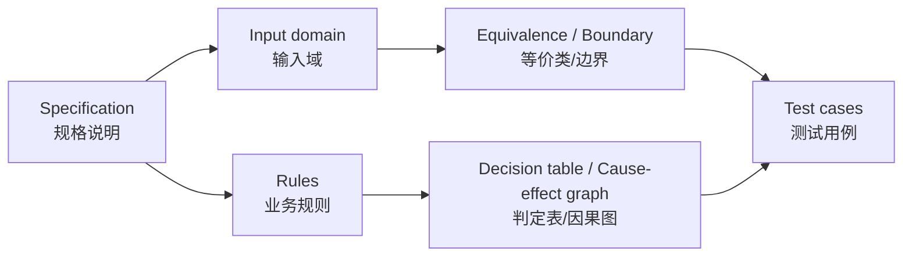
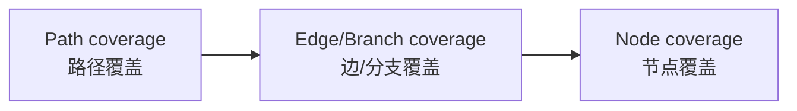
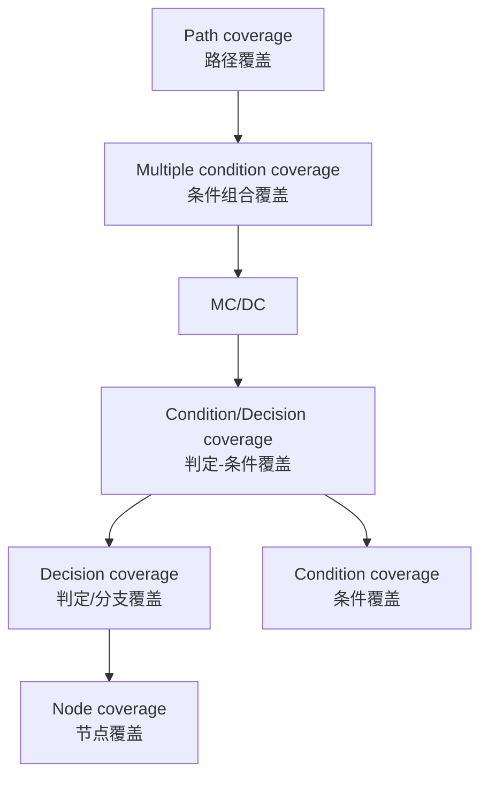

# 第4章：软件测试方法

本章是整门课的考试核心。2025 考情中特别点名：==等价类划分==、==因果图==、==判定/条件/判定-条件/条件组合覆盖==、==逻辑覆盖测试用例==、==基本路径测试==。这一章要按“会解释 + 会设计用例 + 会画图/表 + 会算公式”的标准复习。
This is the core exam chapter. You must be able to explain concepts, design test cases, draw tables/graphs, and compute basic-path formulas.

## 1. 本章考试地图

| 模块 | 掌握程度 | English |
| --- | --- | --- |
| Ad-hoc / ALAC / 错误推测 | 会解释，选择题 | experience-based testing |
| 边界值分析 | 会选边界值，会写用例表 | boundary value analysis |
| 等价类划分 | 会定义有效/无效等价类，会设计用例 | equivalence partitioning |
| 判定表 | 会由条件组合推动作，写测试用例 | decision table |
| 因果图 | 会找原因/结果/约束，转判定表 | cause-effect graph |
| Pairwise / 正交 | 了解组合爆炸和两两覆盖思想 | pairwise / orthogonal array |
| 控制流图/DD 路径图 | 会从代码抽象图 | CFG / DD-path graph |
| 节点/边/路径覆盖 | 会定义和比较强弱 | node / edge / path coverage |
| 逻辑覆盖 | 重点，会定义、比较、设计用例 | logical coverage |
| 基本路径 | 重点，会画图、算圈复杂度、列基本路径基 | basis path testing |
| 数据流测试 | 会解释定义、使用、定义-清除路径 | data-flow testing |
| 变异测试/符号执行 | 了解思想和公式 | mutation testing / symbolic execution |

## 2. 经验型测试方法

### 2.1 Ad-hoc 测试

==Ad-hoc testing== 是测试人员基于经验和系统知识灵活开展的测试。

经验来源包括：

- 开发经验。
- 和缺陷打交道的经验。
- 对被测系统的业务知识。
- 对用户使用习惯的理解。

优点是快、灵活；缺点是可重复性和覆盖说明较弱。

### 2.2 ALAC 测试

==ALAC / Act-like-a-customer==：像客户那样使用系统。

思想：

- 大量错误可能集中在常用功能中。
- Pareto 80/20 规律：20% 的功能占据用户 80% 的使用时间，80% 的错误可能集中在常用 20% 程序中。
- 适合测试日程紧、预算低的情况。

### 2.3 错误推测法

==Error guessing== 基于经验推测程序可能出错的地方，再有针对性测试。

常见推测点：

- 旧版本曾经出错的功能。
- 空指针、未初始化、内存未释放。
- 边界值、特殊字符、空输入。
- 日期、闰年、时区。
- 并发、超时、网络失败。

## 3. 黑盒测试总览

==Black-box testing / 黑盒测试== 不关注内部代码结构，而根据需求、规格说明、输入输出关系设计用例。

步骤：

1. 阅读规格说明。
2. 找输入、输出、业务规则和异常场景。
3. 选择测试方法。
4. 设计测试用例。
5. 执行测试用例。
6. 根据 oracle 分析结果。



## 4. 边界值分析法

==Boundary Value Analysis / BVA== 的依据：许多错误发生在输入范围的边界或边界附近。

### 4.1 基本选值

如果输入范围是 `[a,b]`：

| 类别 | 取值 |
| --- | --- |
| 略小于下界 | a - 1 或刚小于 a |
| 下界 | a |
| 略大于下界 | a + 1 或刚大于 a |
| 正常值 | mid |
| 略小于上界 | b - 1 或刚小于 b |
| 上界 | b |
| 略大于上界 | b + 1 或刚大于 b |

如果是数量范围 `[a,b]`，常取 `a-1, a, a+1, b-1, b, b+1`。

### 4.2 边界值四分类

设有 n 个输入变量，每个变量有最小值 min、略大于 min、正常值 nom、略小于 max、max，并可考虑 min-、max+。

| 类型 | 是否考虑无效输入 | 是否考虑多个变量同时极值 | 用例数常见公式 |
| --- | --- | --- | --- |
| 普通边界值测试 Normal BVA | 否 | 否，单缺陷假设 | `4n + 1` |
| 健壮性测试 Robust BVA | 是 | 否，单缺陷假设 | `6n + 1` |
| 最坏情况测试 Worst-case | 否 | 是，多缺陷假设 | `5^n` |
| 健壮最坏情况 Robust worst-case | 是 | 是，多缺陷假设 | `7^n` |

考试常见解释：

- 单缺陷假设：一次主要让一个变量取边界，其余变量取正常值。
- 多缺陷假设：多个变量同时取极端组合也可能触发错误。

### 4.3 边界值答题步骤

1. 列出所有输入变量和合法范围。
2. 确认是否需要无效值。
3. 对每个变量选 `min, min+, nom, max-, max`，必要时加 `min-, max+`。
4. 如果变量之间有业务组合，补充组合边界。
5. 写测试用例表：编号、输入、预期输出、覆盖的边界。

### 4.4 易错提醒

边界不一定只来自输入变量本身，也可能来自输出或中间业务规则。
For example, a commission calculation may have sales amount thresholds, so sales amount boundaries must also be tested.

## 5. 等价类划分法

==Equivalence Partitioning / 等价类划分== 把输入数据划分为若干类，假设同一类中的数据对发现错误具有相同效果，从每类选代表值测试。

### 5.1 有效等价类与无效等价类

| 概念 | 定义 | English |
| --- | --- | --- |
| 有效等价类 | 对规格说明合理、有意义的输入集合，可检验程序是否实现规定功能 | valid equivalence class |
| 无效等价类 | 不合理、异常、非法输入集合，可检验程序异常处理能力 | invalid equivalence class |

考试问“等价类划分是什么，有效/无效等价类含义是什么”时，可以这样答：

> 等价类划分是把输入域按规格说明划分为若干行为等价的数据集合，并从每个集合选代表值作为测试用例。有效等价类代表合法且有意义的输入，用于检查正常功能；无效等价类代表非法或异常输入，用于检查程序的错误处理和健壮性。

### 5.2 划分原则

| 输入条件 | 等价类划分 |
| --- | --- |
| 范围 `[a,b]` | `<a`、`[a,b]`、`>b` |
| 数量范围 `[a,b]` | 数量 `<a`、数量 `[a,b]`、数量 `>b` |
| 必须满足条件 C | 满足 C、不满足 C |
| 输入属于集合 S | 属于 S、不属于 S |
| 布尔输入 | true、false |
| 多条件组合 | 满足所有条件、只违反某个条件、违反多个条件 |
| 某类内处理方式不同 | 继续细分等价类 |

### 5.3 等价类测试四分类

| 类型 | 是否考虑无效类 | 是否考虑所有组合 | 说明 |
| --- | --- | --- | --- |
| 弱一般等价类 | 否 | 否 | 每个有效类至少出现一次 |
| 弱健壮等价类 | 是 | 否 | 每个有效/无效类至少出现一次 |
| 强一般等价类 | 否 | 是 | 有效类所有组合都覆盖 |
| 强健壮等价类 | 是 | 是 | 有效/无效类所有组合都覆盖 |

弱 vs 强：

- 弱：只要求每个输入变量的每个类被某个用例覆盖。
- 强：要求多个输入变量的等价类组合都覆盖。

一般 vs 健壮：

- 一般：只考虑有效类。
- 健壮：考虑有效类和无效类。

### 5.4 三角形问题示例

输入 `a,b,c` 是三条边，范围 `[1,100]`，输出等边、等腰、普通三角形或非三角形。

第一层等价类：

| 变量 | 有效类 | 无效类 |
| --- | --- | --- |
| a | `1<=a<=100` | `a<1`, `a>100` |
| b | `1<=b<=100` | `b<1`, `b>100` |
| c | `1<=c<=100` | `c<1`, `c>100` |

但是这还不够，因为所有边合法后输出仍可分：

| 输出类 | 示例 |
| --- | --- |
| 等边三角形 | `50,50,50` |
| 等腰三角形 | `50,50,60`, `50,60,50`, `60,50,50` |
| 普通三角形 | `30,40,50` |
| 非三角形 | `1,2,3` 或 `2,2,4` |

考试提醒：等价类不仅可按输入域划分，也可按输出域和业务规则继续细分。

## 6. 判定表方法

==Decision table / 判定表== 适合多个条件组合决定多个动作的场景。

### 6.1 结构

| 组成 | 含义 |
| --- | --- |
| 条件桩 | 所有输入条件 |
| 动作桩 | 所有输出动作 |
| 条件项 | 某条规则下条件的取值 |
| 动作项 | 某条规则下动作是否发生 |
| 规则 | 一列条件项 + 一列动作项 |

### 6.2 使用步骤

1. 列出所有条件。
2. 列出所有动作。
3. 枚举条件组合。
4. 根据规格说明填写动作。
5. 合并无关条件，用 `-` 表示 don't care。
6. 检查是否有不一致规则：输入重叠但输出不同。
7. 每列规则转为至少一个测试用例。

### 6.3 打印机例子

条件：

- C1: 驱动程序是否正确。
- C2: 是否有纸张。
- C3: 是否有墨粉。

动作：

- A1: 打印内容。
- A2: 提示驱动程序不对。
- A3: 提示没有纸张。
- A4: 提示没有墨粉。

可优化规则：

| 规则 | C1 驱动正确 | C2 有纸 | C3 有墨 | A1 打印 | A2 驱动错 | A3 无纸 | A4 无墨 |
| --- | --- | --- | --- | --- | --- | --- | --- |
| R1 | 1 | 1 | 1 | 1 | 0 | 0 | 0 |
| R2 | 0 | 1 | 1 | 0 | 1 | 0 | 0 |
| R3 | - | 1 | 0 | 0 | 0 | 0 | 1 |
| R4 | - | 0 | - | 0 | 0 | 1 | 0 |

解释：

- R3 中驱动是否正确不影响“有纸但无墨”的核心提示。
- R4 中驱动和墨粉不影响“无纸”的核心提示。
- 如果 `-` 合并后两个规则输入重叠但动作不同，就是不一致判定表。

## 7. 因果图法

==Cause-effect graph / 因果图== 用图表示输入原因和输出结果之间的逻辑关系，再转换为判定表和测试用例。

### 7.1 使用步骤

1. 分析规格说明，确定原因（输入条件）和结果（输出动作）。
2. 给每个原因和结果编号。
3. 找原因与结果之间的逻辑关系。
4. 找原因与原因之间的约束。
5. 画因果图。
6. 根据因果图构造判定表。
7. 把判定表每列转化为测试用例。

### 7.2 基本逻辑关系

| 关系 | 含义 |
| --- | --- |
| Identity / 恒等 | 原因成立，结果成立 |
| NOT / 非 | 原因不成立，结果成立 |
| OR / 或 | 多个原因任一成立，结果成立 |
| AND / 与 | 多个原因都成立，结果成立 |

### 7.3 常见约束

| 约束 | 含义 | 例子 |
| --- | --- | --- |
| E / Exclusive | 互斥，最多一个成立 | 只能选可乐、雪碧、红茶之一 |
| I / Inclusive | 至少一个成立 | 至少选择一种支付方式 |
| O / One and only one | 有且仅有一个成立 | 投币 1.5 元或 2 元二选一 |
| R / Requires | 一个成立要求另一个成立 | 选择找零要求已投 2 元 |
| M / Mask | 一个原因屏蔽另一个原因 | 权限不足时后续操作不再判断 |

### 7.4 自动售货机例子

规格：饮料单价 1.5 元。投入 1.5 元并按可乐/雪碧/红茶，送出相应饮料。投入 2 元并选择饮料，送出饮料并找零 0.5 元。

原因：

- C1: 投入 1.5 元。
- C2: 投入 2 元。
- C3: 按可乐。
- C4: 按雪碧。
- C5: 按红茶。

结果：

- E1: 送出可乐。
- E2: 送出雪碧。
- E3: 送出红茶。
- E4: 找零 0.5 元。

中间状态：

- M1: 已投币 = C1 OR C2。
- M2: 已选择饮料 = C3 OR C4 OR C5。

约束：

- C1 和 C2 有且仅有一个成立。
- C3、C4、C5 有且仅有一个成立。
- E4 需要 C2 且 M2。

答题时不一定要画得很美，但要把原因、结果、逻辑关系、约束和判定表说清楚。

## 8. Pairwise 和正交试验法

### 8.1 Pairwise

==Pairwise testing / 两两组合测试== 试图覆盖所有任意两个参数取值的组合。

背景：所有参数全组合数量巨大，无法穷尽。

例子：A、B、C 各有 3 个取值，全组合 `3*3*3=27`；pairwise 可用 9 个用例覆盖所有两两组合。

优点：

- 大幅减少用例数量。
- 经验上很多错误由一个或两个因素交互触发。

局限：

- 少数错误可能需要三个或更多因素共同触发。
- 约束关系需要工具处理，否则可能生成无效组合。

### 8.2 正交试验法

正交试验法与 pairwise 类似，也是从大量潜在用例中挑选有代表性的组合。

步骤：

1. 确定因素（输入属性）。
2. 确定水平（每个属性取值）。
3. 选择合适正交表。
4. 将正交表映射成测试数据。
5. 执行并分析结果。

## 9. 黑盒综合题答题模板

综合题常要求“写测试用例表，并给出解释”。可以按这个结构答：

1. **需求理解**：列输入、输出、约束、业务规则。
2. **等价类划分**：列有效/无效等价类。
3. **边界值分析**：列关键边界及边界附近值。
4. **判定表/因果图**：如果多条件影响输出，给规则表。
5. **测试用例表**：编号、输入、预期输出、覆盖点、说明。
6. **补充异常场景**：空值、非法类型、重复操作、权限、并发等。

测试用例表推荐格式：

| ID | 输入数据 | 前置条件 | 预期输出 | 覆盖点 | 说明 |
| --- | --- | --- | --- | --- | --- |
| TC-01 | ... | ... | ... | 有效等价类 | 正常主流程 |
| TC-02 | ... | ... | ... | 下边界 | 边界值 |
| TC-03 | ... | ... | ... | 无效等价类 | 异常处理 |

## 10. 白盒测试总览

==White-box testing / 白盒测试== 基于源代码结构设计测试用例，也称结构性测试或覆盖测试。

步骤：

1. 阅读代码并分析结构。
2. 构造控制流图或 DD 路径图。
3. 选择覆盖标准。
4. 设计测试用例。
5. 执行并分析覆盖率。

注意：100% 覆盖率不等于程序正确。
100% coverage does not mean the program is correct.

## 11. 控制流图和 DD 路径图

==Control Flow Graph / CFG==：

- 节点表示程序语句或语句块。
- 边表示执行流转移。
- 图中存在路径不等于路径实际可行。

==DD path / Decision-to-Decision path==：

一条 DD 路径从入口或判定节点出发，到判定节点或出口结束，中间不包含其他判定节点。

==DD path graph==：

把控制流图中连续串行语句压缩为节点，图更简洁，便于覆盖和基本路径分析。

## 12. 基于程序图的覆盖

| 覆盖标准 | 定义 | 强弱 |
| --- | --- | --- |
| 节点覆盖 Node coverage | 每个节点至少执行一次 | 最弱 |
| 边覆盖 Edge coverage / Branch coverage | 每条边至少执行一次 | 强于节点覆盖 |
| 路径覆盖 Path coverage | 每条路径至少执行一次 | 最强但通常不可行 |

关系：



注意：循环可能导致路径无穷多，因此完整路径覆盖通常不现实。

## 13. 逻辑覆盖

逻辑覆盖是考试重中之重。

术语：

- ==Condition / 条件==：不可再分的布尔表达式，如 `x>0`。
- ==Decision / 判定==：分支或循环使用的最终复合布尔表达式，如 `x>0 && y<10`。

### 13.1 判定覆盖/逻辑覆盖

==Decision Coverage / Branch Coverage / 判定覆盖/分支覆盖==：

要求每个判定的真分支和假分支都至少执行一次。

例：`if (x>0 && y<10)` 要让整个判定结果至少出现 true 和 false。

### 13.2 条件覆盖

==Condition Coverage / 条件覆盖==：

要求每个判定中的每个基本条件都至少取 true 和 false 一次。

例：`x>0 && y<10` 中：

- `x>0` 要取 T 和 F。
- `y<10` 要取 T 和 F。

### 13.3 判定-条件覆盖/逻辑-条件覆盖

==Condition/Decision Coverage, C/DC / 判定-条件覆盖==：

要求同时满足：

- 每个判定整体结果取 true 和 false。
- 每个条件分别取 true 和 false。

因此它蕴含判定覆盖和条件覆盖。

### 13.4 条件组合覆盖

==Multiple Condition Coverage / 条件组合覆盖==：

要求每个判定中所有条件取值组合都出现。

如果一个判定有 k 个独立条件，理论组合数是 `2^k`。

注意：这是对每个判定分别要求，不是把程序所有判定的所有条件合起来做笛卡尔积。

### 13.5 MC/DC

==MC/DC / Modified Condition/Decision Coverage==：

在满足判定-条件覆盖基础上，要求每个条件都能独立影响判定结果。

对每个条件 C，要找到两次执行：

- C 取值相反。
- 同一判定中的其他条件取值相同。
- 判定整体结果相反。

MC/DC 常用于安全关键系统，比判定-条件覆盖更强，但通常弱于条件组合覆盖。

## 14. 覆盖强弱关系

### 14.1 考试最稳答法

| 关系 | 结论 |
| --- | --- |
| 判定覆盖 vs 条件覆盖 | 二者互不蕴含 |
| 判定-条件覆盖 | 蕴含判定覆盖，也蕴含条件覆盖 |
| 条件组合覆盖 | 强于判定-条件覆盖 |
| MC/DC | 强于判定-条件覆盖，通常弱于条件组合覆盖 |
| 路径覆盖 | 在无循环可行路径讨论中很强，但有循环时通常不可完全实现 |

如果题目只问“逻辑覆盖、条件覆盖、逻辑-条件覆盖、条件组合覆盖覆盖率排名”，不要简单把判定覆盖和条件覆盖排成强弱。应写：

> 判定覆盖和条件覆盖互不蕴含；判定-条件覆盖强于二者；条件组合覆盖强于判定-条件覆盖。

English:

> Decision coverage and condition coverage do not imply each other. Condition/decision coverage is stronger than both. Multiple condition coverage is stronger than condition/decision coverage.

### 14.2 覆盖关系图



图是复习上的简化关系；严格关系会受程序结构、短路求值、可行路径影响。

## 15. 逻辑覆盖例题模板

设代码有两个判定：

```text
D1 = (x > 0) && (y < 10)
D2 = (x == 2) && (z > 6)
```

条件：

- C1: `x > 0`
- C2: `y < 10`
- C3: `x == 2`
- C4: `z > 6`

### 15.1 判定-条件覆盖用例

| 用例 | x | y | z | C1 | C2 | D1 | C3 | C4 | D2 |
| --- | --- | --- | --- | --- | --- | --- | --- | --- | --- |
| TC1 | 2 | 5 | 8 | T | T | T | T | T | T |
| TC2 | -1 | 12 | 5 | F | F | F | F | F | F |

满足：

- 每个条件 T/F 都出现。
- 每个判定 T/F 都出现。

但不满足条件组合覆盖，因为每个二条件判定的四种组合没有都出现。

### 15.2 条件组合覆盖用例

| 用例 | x | y | z | C1 | C2 | D1 | C3 | C4 | D2 |
| --- | --- | --- | --- | --- | --- | --- | --- | --- | --- |
| TC1 | 2 | 5 | 8 | T | T | T | T | T | T |
| TC2 | 2 | 12 | 5 | T | F | F | T | F | F |
| TC3 | -1 | 5 | 8 | F | T | F | F | T | F |
| TC4 | -1 | 12 | 5 | F | F | F | F | F | F |

每个判定中条件组合 `TT, TF, FT, FF` 均出现。

## 16. 基本路径测试

路径覆盖太强，循环会导致路径数量爆炸。==Basis Path Testing / 基本路径测试== 用“基本路径基”选出一组线性无关的代表路径。

### 16.1 圈复杂度

==Cyclomatic Complexity / 圈复杂度== 度量基本路径基中的路径数量。

课件公式：

- 如果程序图是强连通图：`V(G) = E - N + 1`
- 如果程序图不是强连通图：`V(G) = E - N + 2`

考试最常用：

> 对单入口单出口 CFG/DD 路径图，基本路径数量通常用 `V(G)=E-N+2`。

常见等价公式：

| 公式 | 使用场景 |
| --- | --- |
| `V(G)=E-N+2` | 单入口单出口连通控制流图 |
| `V(G)=P+1` | P 是二分支判定节点数 |
| `V(G)=区域数` | 平面控制流图可数区域 |

### 16.2 基本路径测试流程

1. 根据代码画控制流图或 DD 路径图。
2. 计算圈复杂度 `V(G)`。
3. 构造基本路径基，路径数应等于 `V(G)`。
4. 为每条基本路径设计测试用例。
5. 执行测试并记录路径覆盖情况。

### 16.3 构造基本路径基思路

课件给出的思路：

1. 初始路径集合 S 为空。
2. 先取一条从入口到出口的最短路径加入 S。
3. 找 S 中路径上第一个未完全覆盖的分支。
4. 让该分支选择与已有路径不同的分支结果。
5. 从新节点按最短路径到出口。
6. 重复直到所有分支都完全。

“分支完全”表示该分支的各个可能出口都已被路径集合覆盖。

### 16.4 两重 for 循环题答题模板

如果题目给两重 `for` 循环并要求画控制图、写基本路径基、计算基本路径数量：

1. 把每个循环条件画成判定节点。
2. 外层循环有进入循环和退出循环两条边。
3. 内层循环也有进入循环和退出循环两条边。
4. 循环体语句按顺序连接。
5. 统计边 E 和节点 N。
6. 用 `V(G)=E-N+2` 计算基本路径数。
7. 写路径时至少包含：
   - 外层 0 次。
   - 外层 1 次、内层 0 次。
   - 外层 1 次、内层 1 次。
   - 覆盖内层循环回边。
   - 覆盖外层循环回边。

具体路径数以题目图的节点和边为准，不要凭“两重循环一定多少条”死背。

## 17. 数据流测试

==Data-flow testing== 从变量定义和使用角度设计测试。

### 17.1 基本概念

| 概念 | 含义 |
| --- | --- |
| Definition / 定义 | 变量声明、初始化、赋值、输入、动态分配等 |
| Use / 使用 | 变量出现在表达式、参数、条件、输出、return 等 |
| p-use | 谓词使用，变量用于条件判断 |
| c-use | 计算使用，变量用于计算或输出 |
| def-use path | 从某变量定义到同变量使用的路径 |
| definition-clear path | 定义到使用之间没有再次定义该变量的路径 |

### 17.2 数据流能发现的问题

- 定义后从未使用。
- 未定义就使用。
- 使用前被定义两次。
- 读取已定义但未初始化的数据。
- 释放后继续使用。

### 17.3 覆盖标准

| 覆盖标准 | 要求 |
| --- | --- |
| 全定义 All-defs | 每个变量的每个定义至少到达某个使用 |
| 全使用 All-uses | 每个定义到每个可达使用至少有一条定义-清除路径被覆盖 |
| 全 p-use / 部分 c-use | 优先覆盖谓词使用；无谓词使用时覆盖某个计算使用 |
| 全 c-use / 部分 p-use | 优先覆盖计算使用；无计算使用时覆盖某个谓词使用 |
| 全定义-使用 All-du-paths | 覆盖定义到使用之间所有无环或只绕环一次的定义-清除路径 |

## 18. 变异测试

==Mutation testing / 变异测试== 用微小故障改写原程序，检查现有测试用例能否发现这些故障，从而评估测试用例有效性。

### 18.1 核心概念

| 概念 | 含义 |
| --- | --- |
| Mutant / 变体 | 对原程序 P 做微小变异得到的程序 Q |
| Kill / 击杀 | 某测试用例使 P 和 Q 输出不同，则 Q 被击杀 |
| Equivalent mutant / 等价变体 | 与原程序行为等价，任何测试用例都无法区分 |
| Mutation operator / 变异算子 | 模拟简单错误的改写规则，如替换操作符、删除语句 |

### 18.2 两个假设

| 假设 | 含义 |
| --- | --- |
| Competent programmer hypothesis | 程序通常接近正确版本，小修改即可修正 |
| Coupling effect | 能发现简单缺陷的测试，也往往能发现复杂缺陷 |

### 18.3 强变异与弱变异

击杀一个变体的三条件：

1. 测试路径经过被改变语句。
2. 改变语句造成内部状态差异。
3. 状态差异传播到外部可见输出。

| 类型 | 要求 |
| --- | --- |
| 强变异 Strong mutation | 满足三条件，外部输出不同 |
| 弱变异 Weak mutation | 只要求路径经过变异点且内部状态不同 |

### 18.4 变异评分

公式：

```text
Mutation Score = killed mutants / (total mutants - equivalent mutants)
```

中文：

```text
变异评分 = 被击杀的变体数 / (变体总数 - 等价变体数)
```

缺点：

- 变体数量过多。
- 变异后程序需要重新编译/执行。
- 等价变体难识别。
- 成本高。

## 19. 符号执行与基于约束的测试

==Constraint-based testing / 基于约束的测试== 通过生成路径约束并求解约束来自动生成测试输入。

流程：

1. 约束生成：从代码和测试目标生成逻辑约束。
2. 约束求解：用求解器求满足约束的输入。
3. 测试用例生成：把输入转成测试数据。

==Symbolic execution / 符号执行== 把输入当作符号而不是具体值执行程序，路径执行结果表示为公式。

符号状态可记为三元组：

```text
(path, symbolic state, path condition)
```

即：

- path：当前路径。
- symbolic state：变量当前符号表达式。
- path condition：要走到当前路径必须满足的条件。

如果 path condition 可满足，则路径实际可行；如果不可满足，则图上路径不可执行。

==Dynamic symbolic execution / Concolic execution== 结合具体执行和符号执行：

1. 随机生成输入并具体执行。
2. 收集路径条件。
3. 取反最后一个或某个条件。
4. 用约束求解器生成新输入。
5. 探索新路径。

## 20. 本章速记表

| 高频词 | 一句话 |
| --- | --- |
| 边界值 | 错误常在边界附近 |
| 等价类 | 同类选代表值，有效测正常，无效测异常 |
| 判定表 | 多条件组合决定动作 |
| 因果图 | 原因结果逻辑图 -> 判定表 -> 用例 |
| 判定覆盖 | 每个判定真假都走 |
| 条件覆盖 | 每个基本条件真假都走 |
| 判定-条件覆盖 | 判定真假 + 条件真假 |
| 条件组合覆盖 | 每个判定内条件组合都走 |
| MC/DC | 每个条件能独立影响判定结果 |
| 圈复杂度 | 基本路径数量，常用 `E-N+2` |
| 变异测试 | 用变体衡量测试用例杀错能力 |
| 符号执行 | 用路径条件自动生成输入 |

## 21. 自测

### Q1. 什么是等价类划分？有效等价类和无效等价类是什么？

答案 / Answer:

中文：等价类划分是把输入域按照规格说明划分为若干行为等价的数据集合，并从每类选择代表值测试。有效等价类是合法、有意义、符合规格说明的输入集合，用来检查正常功能；无效等价类是非法或异常输入集合，用来检查错误处理和健壮性。

English: Equivalence partitioning divides the input domain into behaviorally equivalent classes according to the specification and selects representative values from each class. Valid classes contain legal and meaningful inputs; invalid classes contain illegal or abnormal inputs for robustness testing.

### Q2. 判定覆盖、条件覆盖、判定-条件覆盖、条件组合覆盖如何比较？

过程 / Process:

1. 先定义判定和条件。
2. 说明判定覆盖与条件覆盖互不蕴含。
3. 说明判定-条件覆盖强于二者。
4. 说明条件组合覆盖强于判定-条件覆盖。

答案 / Answer:

中文：判定覆盖要求每个判定真假分支至少执行一次；条件覆盖要求每个基本条件真假至少出现一次。二者互不蕴含。判定-条件覆盖同时要求判定真假和条件真假，因此强于二者。条件组合覆盖要求每个判定内条件取值组合都出现，因此强于判定-条件覆盖。

English: Decision coverage requires each decision to evaluate to true and false. Condition coverage requires each atomic condition to be true and false. They do not imply each other. Condition/decision coverage requires both and is stronger than both. Multiple condition coverage requires all combinations of conditions within each decision and is stronger than condition/decision coverage.

### Q3. 基本路径测试的步骤是什么？基本路径数量怎么算？

答案 / Answer:

中文：先根据代码画控制流图或 DD 路径图，再计算圈复杂度，然后构造基本路径基，最后为每条基本路径设计测试用例。单入口单出口图常用公式为 `V(G)=E-N+2`，其中 E 是边数，N 是节点数；结构化程序也常用“判定节点数 + 1”估算。

English: Draw the control-flow or DD-path graph, compute cyclomatic complexity, construct a basis set of paths, and design test cases for each basis path. For a single-entry single-exit graph, the common formula is `V(G)=E-N+2`, where E is the number of edges and N is the number of nodes. For structured programs, it is often the number of decision nodes plus one.

### Q4. 因果图法如何转成测试用例？

答案 / Answer:

中文：先从规格说明中找原因和结果并编号，再画出原因到结果、原因到原因之间的逻辑关系和约束；然后把因果图转成判定表，最后把判定表每一列规则转成测试用例。

English: Identify and label causes and effects from the specification, draw logical relations and constraints among them, convert the cause-effect graph into a decision table, and finally convert each rule column into a test case.

### Q5. 什么是变异评分？

答案 / Answer:

中文：变异评分用于衡量测试用例击杀变体的能力，公式是被击杀变体数除以非等价变体数，即 `killed mutants / (total mutants - equivalent mutants)`。

English: Mutation score measures how well tests kill mutants. It is `killed mutants / (total mutants - equivalent mutants)`.
