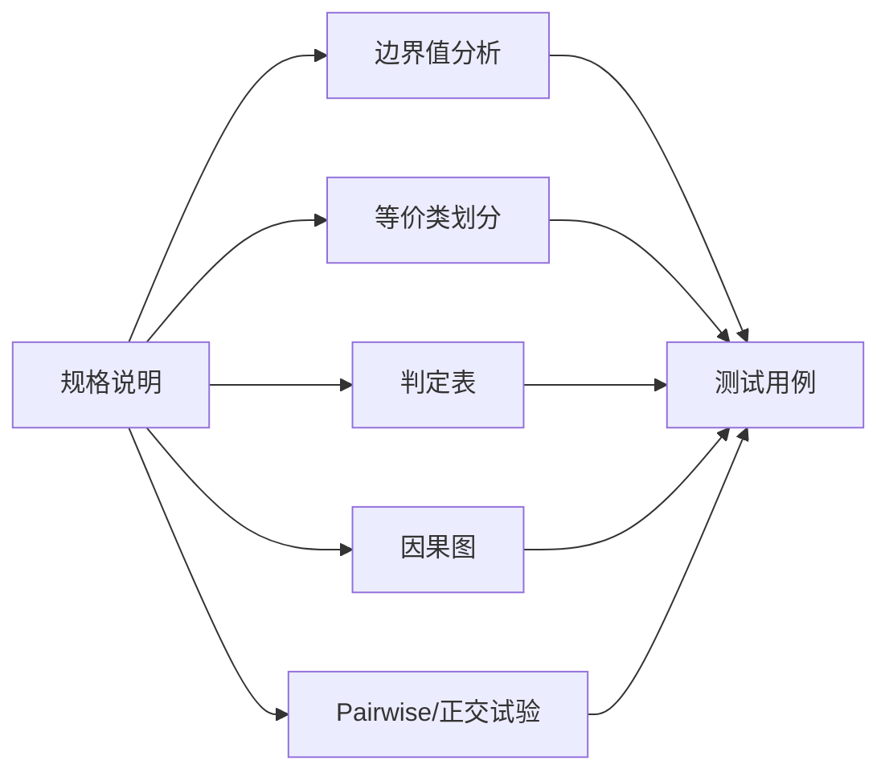

# 第4章：软件测试方法

本章是考试核心。按 PPT 分成三部分：==黑盒测试方法==、==白盒测试方法==、==变异测试与符号执行==。中文考试不需要中英对照，只保留 PPT 中原本出现的重要英文术语和缩写。

## 1. 本章考点地图

| 模块 | 高频程度 | 大题形式 |
| --- | --- | --- |
| 边界值分析 | 高频 | 给范围，列边界，写测试用例表 |
| 等价类划分 | 高频 | 划分有效/无效等价类，设计用例 |
| 判定表 | 高频 | 条件桩、动作桩、规则、测试用例 |
| 因果图 | 高频 | 原因、结果、约束、因果图、判定表 |
| Pairwise/正交 | 中频 | 解释组合爆炸、两两覆盖 |
| CFG/DD 路径图 | 高频 | 按代码画程序图 |
| 节点/边/路径覆盖 | 高频 | 判断覆盖强弱，设计用例 |
| 逻辑覆盖 | 高频 | 判定、条件、判定-条件、MC/DC、条件组合 |
| 基本路径测试 | 高频 | DD 图、圈复杂度、基本路径、测试用例 |
| 数据流测试 | 高频 | 定义、使用、p-use、c-use、定义-清除路径 |
| 变异测试 | 了解 | 变异体、杀死变异体、变异评分 |
| 符号执行 | 了解 | 路径条件、约束求解、可达路径 |

## 2. 黑盒测试总览

黑盒测试不关注程序内部结构，而根据需求规格、输入输出关系和用户场景设计测试用例。

黑盒测试的典型方法：



PPT 中黑盒部分重点掌握：边界值、等价类、判定表、因果图。

## 3. 基于直觉和经验的方法

| 方法 | 含义 | 适合场景 |
| --- | --- | --- |
| Ad-hoc 测试 | 测试人员凭经验和直觉自由测试 | 时间紧、快速探索、补充测试 |
| ALAC 测试 | Act-like-a-customer，像客户一样使用系统 | 常用功能、主流程、用户高频场景 |
| 错误推测法 | 根据经验猜测容易出错的地方 | 边界、空值、旧缺陷、异常流程 |

PPT 强调 ALAC 和 80/20 规律：少数常用功能可能承载大多数使用量，也可能集中暴露大量缺陷。

## 4. 边界值分析

边界值分析依据：很多错误发生在输入范围的边界或边界附近。

### 4.1 基本选值

若输入范围为 `[a,b]`：

| 类型 | 取值 |
| --- | --- |
| 下界外 | `a-1` 或刚小于 a |
| 下界 | `a` |
| 下界内侧 | `a+1` |
| 正常值 | `nom` |
| 上界内侧 | `b-1` |
| 上界 | `b` |
| 上界外 | `b+1` |

### 4.2 四类边界值测试

| 类型 | 是否考虑无效值 | 是否多个变量同时极端 | 常见用例数 |
| --- | --- | --- | --- |
| 普通边界值测试 | 否 | 否 | `4n+1` |
| 健壮边界值测试 | 是 | 否 | `6n+1` |
| 最坏情况测试 | 否 | 是 | `5^n` |
| 健壮最坏情况测试 | 是 | 是 | `7^n` |

说明：

- 单缺陷假设：一次只让一个变量取边界值，其余变量取正常值。
- 多缺陷假设：多个变量同时取极端组合也可能触发错误。

### 4.3 答题步骤

1. 找输入变量和合法范围。
2. 确认是否需要非法边界。
3. 为每个变量列 `min, min+1, nom, max-1, max`，必要时加 `min-1, max+1`。
4. 如果还有输出或业务阈值，也要补边界。
5. 写用例表：编号、输入、预期输出、覆盖边界。

考试提醒：边界不只来自输入范围，也可能来自业务规则，例如佣金分段的 `1000`、`2400`。

## 5. 等价类划分

等价类划分把输入域划分为若干类，认为同一类中的数据对发现错误具有相似作用，从每类选代表值测试。

### 5.1 有效等价类和无效等价类

| 类型 | 含义 |
| --- | --- |
| 有效等价类 | 对规格说明合理、有意义的输入集合 |
| 无效等价类 | 不合理、异常、非法输入集合 |

### 5.2 划分原则

| 输入条件 | 等价类划分方式 |
| --- | --- |
| 范围 `[a,b]` | `<a`、`[a,b]`、`>b` |
| 数量范围 | 数量不足、数量合法、数量过多 |
| 必须满足条件 C | 满足 C、不满足 C |
| 输入属于集合 S | 属于 S、不属于 S |
| 布尔输入 | true、false |
| 类内处理不同 | 继续细分 |

### 5.3 四种等价类测试

| 类型 | 是否考虑无效类 | 是否考虑组合 |
| --- | --- | --- |
| 弱一般等价类 | 否 | 否 |
| 强一般等价类 | 否 | 是 |
| 弱健壮等价类 | 是 | 否 |
| 强健壮等价类 | 是 | 是 |

弱：每类至少覆盖一次。强：覆盖多个输入变量的类组合。

一般：只考虑有效类。健壮：有效类和无效类都考虑。

## 6. 判定表

判定表适合多个条件组合决定多个动作的场景。

### 6.1 组成

| 组成 | 含义 |
| --- | --- |
| 条件桩 | 所有输入条件 |
| 动作桩 | 所有输出动作 |
| 条件项 | 某条规则下条件取值 |
| 动作项 | 某条规则下动作是否发生 |
| 规则 | 一列条件项和动作项 |

### 6.2 使用步骤

1. 列条件。
2. 列动作。
3. 枚举条件组合。
4. 根据规格说明填写动作。
5. 合并无关条件，用 `-` 表示无关。
6. 检查是否有不一致规则。
7. 每一列规则转成测试用例。

### 6.3 答题模板

| 条件/动作 | R1 | R2 | R3 | R4 |
| --- | --- | --- | --- | --- |
| 条件 1 | 1 | 1 | 0 | 0 |
| 条件 2 | 1 | 0 | 1 | 0 |
| 动作 1 | X |  |  |  |
| 动作 2 |  | X | X | X |

判定表题必须有条件桩和动作桩，只写普通用例表不够。

## 7. 因果图

因果图用图表示输入原因与输出结果之间的逻辑关系，再转换为判定表和测试用例。

### 7.1 基本步骤

1. 分析规格说明，确定原因和结果。
2. 给原因和结果编号。
3. 找原因与结果之间的逻辑关系。
4. 找原因之间的约束。
5. 画因果图。
6. 转成判定表。
7. 每列规则转成测试用例。

### 7.2 基本逻辑关系

| 关系 | 含义 |
| --- | --- |
| 恒等 | 原因成立，结果成立 |
| 非 | 原因不成立，结果成立 |
| 或 | 多个原因任一成立，结果成立 |
| 与 | 多个原因都成立，结果成立 |

### 7.3 常见约束

| 约束 | 含义 | 例子 |
| --- | --- | --- |
| E | 互斥，最多一个成立 | 不能同时选择两种投币金额 |
| I | 至少一个成立 | 至少选择一种支付方式 |
| O | 有且仅有一个成立 | 三种饮料必须且只能选一种 |
| R | 要求，一个成立要求另一个成立 | 选择找零要求已投 10 元 |
| M | 屏蔽，一个原因屏蔽另一个原因 | 权限不足时不再判断后续输入 |

考试提醒：有且仅有一个是 `O`；互斥最多一个是 `E`。

## 8. Pairwise 与正交试验

所有参数全组合数量巨大时，可以用组合优化思想减少用例。

| 方法 | 核心思想 |
| --- | --- |
| Pairwise | 覆盖任意两个参数取值的组合 |
| 正交试验 | 用正交表选取有代表性的组合 |

局限：

- 可能漏掉三个或更多因素共同触发的错误。
- 有约束关系时要避免生成无效组合。

## 9. 白盒测试总览

白盒测试基于源代码结构设计测试用例，也称结构性测试或覆盖测试。

步骤：

1. 阅读代码并分析结构。
2. 构造控制流图或 DD 路径图。
3. 选择覆盖标准。
4. 设计测试用例。
5. 执行并分析覆盖率。

注意：100% 覆盖率只能说明达到某覆盖标准，不能保证程序正确。

## 10. CFG 与 DD 路径图

### 10.1 控制流图 CFG

控制流图中：

- 节点表示程序语句或语句块。
- 边表示执行流。
- 图中存在路径不等于实际执行中一定存在该路径。

### 10.2 DD 路径

DD 路径是一条从入口或判定节点出发，到判定节点或出口结束，中间不包含其他判定节点的路径。

DD 路径图把控制流图中连续串行语句压缩为节点，使图更简洁。PPT 后续默认使用 DD 路径图。

画图考试要求：

- 用圆圈节点表示压缩后的 DD 节点。
- 用有向边表示控制转移。
- 节点、边最好编号。
- 节点含义可单独用表说明。

## 11. 基于程序图的覆盖

| 覆盖 | 要求 | 强弱 |
| --- | --- | --- |
| 节点覆盖 | 所有节点至少访问一次 | 最弱 |
| 边覆盖 | 所有边至少执行一次 | 强于节点覆盖 |
| 路径覆盖 | 所有路径至少执行一次 | 最强但通常不现实 |

PPT 提醒：循环可能导致路径无穷多，因此完整路径覆盖通常不可行。

## 12. 逻辑覆盖

### 12.1 基本术语

| 术语 | 含义 |
| --- | --- |
| 条件 | 不可再分的逻辑表达式，如 `x>0` |
| 判定 | 分支或循环使用的最终复合逻辑表达式，如 `x>0 && y<10` |

### 12.2 判定覆盖

判定覆盖又称分支覆盖，要求每个判定的真分支和假分支至少执行一次。

### 12.3 条件覆盖

条件覆盖要求每个判定中的每个基本条件都至少取真和取假一次。

判定覆盖和条件覆盖互不蕴含：

- 满足判定覆盖，不一定满足条件覆盖。
- 满足条件覆盖，不一定满足判定覆盖。

### 12.4 判定-条件覆盖

判定-条件覆盖要求同时满足：

1. 每个判定取真和取假。
2. 每个条件取真和取假。

它强于单独的判定覆盖，也强于单独的条件覆盖。

### 12.5 条件组合覆盖

条件组合覆盖要求每个判定内部的条件取值组合都出现。

注意：是对每个判定分别看，不是把全程序所有条件合在一起做笛卡尔积。

### 12.6 MC/DC

MC/DC 要求在满足判定-条件覆盖的基础上，对每个条件 C，存在两次计算：

- 条件 C 取值相反。
- 同一判定内其他条件取值相同。
- 判定结果相反。

一句话：每个条件都要能独立影响判定结果。

## 13. 覆盖标准关系

考试稳妥写法：

| 关系 | 结论 |
| --- | --- |
| 判定覆盖 vs 条件覆盖 | 二者互不蕴含 |
| 判定-条件覆盖 | 蕴含判定覆盖和条件覆盖 |
| 条件组合覆盖 | 强于判定-条件覆盖 |
| MC/DC | 强于判定-条件覆盖，通常弱于条件组合覆盖 |
| 路径覆盖 | 对无循环程序很强；有循环时通常不可完全实现 |

不要简单把判定覆盖和条件覆盖排成强弱。

## 14. 基本路径测试

基本路径测试是一种有理论定义的路径测试方法。基本路径数由圈复杂度决定。

### 14.1 圈复杂度

对单入口单出口、非强连通图：

```text
V(G) = E - N + 2
```

其中 `E` 是边数，`N` 是节点数。

也可用：

```text
V(G) = 判定节点数 + 1
```

前提是图和判定节点数没有数错。

### 14.2 基本路径测试流程

1. 根据代码画 DD 路径图。
2. 计算圈复杂度。
3. 构造基本路径基。基本路径基不唯一。
4. 为每条基本路径设计测试用例。

### 14.3 构造基本路径基的 PPT 思路

1. 初始集合为空。
2. 先选择一条入口到出口的最短路径。
3. 对已有路径中第一个未完全的分支，选择不同分支，再按最短路径到出口。
4. 重复直到分支都被覆盖。

## 15. 数据流测试

数据流测试从变量定义和使用角度设计测试。

### 15.1 基本概念

| 概念 | 含义 |
| --- | --- |
| 定义 | 变量声明、初始化、赋值左侧、输入参数实例化等 |
| 使用 | 变量出现在表达式、条件、输出、return 等 |
| p-use | 变量在谓词/判断条件中使用 |
| c-use | 变量在计算或其他非谓词位置使用 |
| 定义-使用路径 | 从某变量定义到同一变量使用的路径 |
| 定义-清除路径 | 从定义到使用，中间没有该变量再次被定义 |

### 15.2 数据流覆盖指标

| 指标 | 要求 |
| --- | --- |
| 全定义 | 每个变量的每个定义至少到达某个使用 |
| 全使用 | 每个定义到能到达的每个使用都要覆盖；p-use 要考虑后继边 |
| 全谓词使用/部分计算 | 优先覆盖所有 p-use，若没有 p-use 再覆盖部分 c-use |
| 全计算使用/部分谓词 | 优先覆盖所有 c-use，若没有 c-use 再覆盖部分 p-use |
| 全定义-使用路径 | 覆盖从定义到使用的无环或只执行一次循环的定义-清除路径 |

考试做法：

1. 列变量。
2. 列定义节点。
3. 列使用节点，区分 p-use/c-use。
4. 列定义-清除路径。
5. 根据覆盖标准选测试用例。

## 16. 变异测试

变异测试思想：通过对原程序做小修改生成变异体，用测试用例区分原程序和变异体。

| 概念 | 含义 |
| --- | --- |
| 变异体 | 对原程序进行小改动后得到的程序 |
| 杀死变异体 | 测试用例使原程序和变异体输出不同 |
| 等价变异体 | 与原程序行为等价，无法被测试杀死 |
| 变异评分 | 被杀死的非等价变异体比例 |

常见变异操作：

- 替换关系运算符。
- 替换算术运算符。
- 删除语句。
- 修改常量。
- 修改逻辑运算符。

变异测试用于评价测试用例发现细微错误的能力。

## 17. 符号执行

符号执行不直接给变量具体值，而用符号表达式表示变量。

基本思想：

1. 用符号值代替具体输入。
2. 沿程序路径收集路径条件。
3. 遇到分支就给不同路径添加不同约束。
4. 用约束求解器判断路径条件是否可满足。
5. 若可满足，可生成具体测试输入。

作用：

- 自动生成测试数据。
- 判断某些路径是否可达。
- 辅助发现错误状态。

局限：

- 路径爆炸。
- 复杂约束求解困难。
- 外部环境、库函数、指针、并发等处理困难。

## 18. 本章大题答题模板

| 题型 | 答题结构 |
| --- | --- |
| 边界值 | 输入范围 -> 边界值 -> 正常值 -> 用例表 |
| 等价类 | 输入条件 -> 有效/无效等价类 -> 代表值 -> 用例表 |
| 判定表 | 条件桩 -> 动作桩 -> 规则 -> 用例 |
| 因果图 | 原因 -> 结果 -> 约束 -> 因果图 -> 判定表 -> 用例 |
| 逻辑覆盖 | 判定/条件拆分 -> 覆盖准则 -> 用例表 -> 说明 |
| 基本路径 | DD 图 -> E/N 或判定节点数 -> V(G) -> 基本路径 -> 用例 |
| 数据流 | 变量 -> 定义/使用 -> p-use/c-use -> 定义-清除路径 -> 用例 |

## 19. 本章速记

1. 黑盒四大重点：边界值、等价类、判定表、因果图。
2. 因果图约束：E 互斥，O 有且仅有一个，R 要求，M 屏蔽。
3. DD 路径图是压缩后的控制流图，PPT 后续默认用 DD 图。
4. 判定覆盖和条件覆盖互不蕴含。
5. MC/DC 要证明每个条件独立影响判定。
6. 圈复杂度：`V(G)=E-N+2=判定节点数+1`。
7. 数据流测试核心：定义、使用、p-use、c-use、定义-清除路径。

