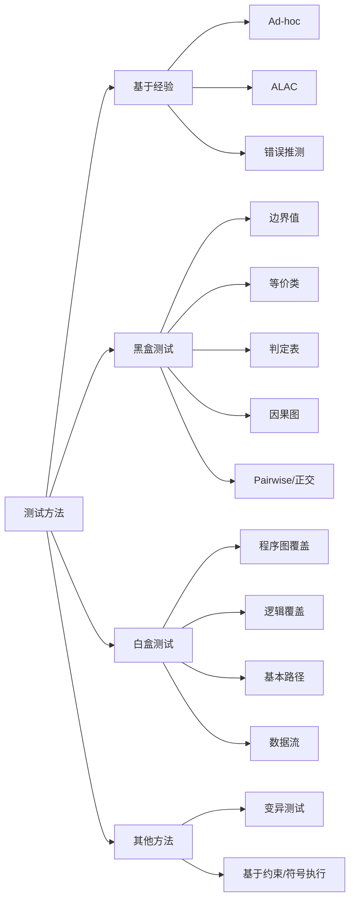

# 第4章：软件测试方法

本章是软件测试考试的核心章。PPT 分成三部分：==黑盒测试==、==白盒测试==、==其他测试方法：变异测试与基于约束的测试==。这一章最容易考大题：给规格说明让你画表、给代码让你画 DD 路径图、算圈复杂度、列基本路径、写测试用例。

中文考试不需要一句英文一句中文，只保留 PPT 中出现的重要术语：Ad-hoc、ALAC、Pairwise、DD 路径、MC/DC、mutation test、mutant、SMT、Z3、concolic execution。

## 1. 本章考点地图

| 模块 | PPT 要求 | 常见考法 |
| --- | --- | --- |
| 基于直觉和经验的方法 | Ad-hoc、ALAC、错误推测 | 选择题、简答 |
| 黑盒测试总论 | 基于规格说明、考虑有效和无效输入 | 简答：黑盒测试步骤和特点 |
| 边界值分析 | 掌握 | 给范围，列边界值，写测试用例表 |
| 等价类划分 | 掌握 | 划分有效/无效等价类，写代表值和测试用例 |
| 判定表 | 掌握 | 条件桩、动作桩、规则、合并无关条件、用例 |
| 因果图 | 掌握 | 原因/结果编号，画因果图，转判定表 |
| Pairwise | 了解 | 解释两两组合覆盖，说明优缺点 |
| 正交试验 | 了解 | 说明用正交表选代表性组合 |
| CFG 和 DD 路径图 | 掌握 | 根据代码画图，压缩 DD 路径 |
| 节点/边/路径覆盖 | 掌握 | 判断覆盖标准、设计用例、说明局限 |
| 逻辑覆盖 | 重点 | 判定覆盖、条件覆盖、C/DC、MC/DC、条件组合覆盖 |
| 基本路径测试 | 重点 | 画 DD 图、算圈复杂度、列基本路径、写用例 |
| 数据流测试 | 重点 | 定义/使用、p-use/c-use、定义-清除路径、覆盖准则 |
| 变异测试 | 了解 | mutant、killed、equivalent mutant、mutation score |
| 基于约束的测试 | 了解 | 约束生成、约束求解、测试用例生成 |
| 符号执行 | 了解 | 路径条件、符号状态、SMT、动态符号执行 |

## 2. 测试方法总览

PPT 先说明：测试方法可以来自方法论或测试流派，也可以来自软件开发方法或应用领域。

### 2.1 按方法来源理解

| 来源 | 典型方法 |
| --- | --- |
| 基于直觉和经验 | Ad-hoc、ALAC、错误推测 |
| 基于模型 | 黑盒规格模型、因果图、判定表、状态模型等 |
| 基于代码 | 白盒测试、覆盖测试、基本路径、数据流测试 |
| 基于故障模式 | 错误推测、变异测试、缺陷模式库 |
| 来自开发方法/应用领域 | 面向对象、面向服务、嵌入式、CPS 等领域测试方法 |

考试不要把“黑盒/白盒”理解成全部方法。黑盒和白盒是本章重点，但测试方法还可以来自经验、模型、代码、故障模式和具体应用领域。

### 2.2 本章主线



## 3. 基于直觉和经验的方法

PPT 讲三种：Ad-hoc、ALAC、错误推测法。

### 3.1 Ad-hoc 测试

Ad-hoc 测试是测试人员根据自己的经验，灵活地进行各种测试。这里的经验包括：

1. 开发经验。
2. 与缺陷打交道的经验。
3. 对被测系统的知识。
4. 业务知识。
5. 对用户常见操作习惯的理解。

特点：

| 方面 | 内容 |
| --- | --- |
| 优点 | 灵活、成本低、能快速发现明显问题 |
| 缺点 | 依赖个人经验，不够系统，难以复现和度量 |
| 适用场景 | 时间紧、需求不完整、探索性补充测试、快速冒烟 |

考试写法：

> Ad-hoc 测试是测试人员凭经验和直觉灵活测试的方法，适合快速探索和补充测试，但系统性、可重复性和覆盖度较弱。

### 3.2 ALAC 测试

ALAC 是 Act-like-a-customer，意思是像客户那样做。它是一种基于客户使用产品的知识开发出来的测试方法。

PPT 的核心思想：

1. 大量错误存在于常用功能中。
2. 符合 Pareto 80/20 规律。
3. 20% 的功能是常用功能，占据用户 80% 的使用时间。
4. 80% 的错误很可能集中在常用的 20% 程序中。
5. 适合测试日程紧、预算低的情况。

考试写法：

> ALAC 测试强调像真实客户一样使用系统，把有限测试资源优先投入高频、核心、常用功能，适合进度紧和预算低的项目。

### 3.3 错误推测法

错误推测法是基于经验和直觉推测程序中所有可能存在的各种错误，从而有针对性地进行测试。

PPT 提到的错误来源：

| 来源 | 例子 |
| --- | --- |
| 之前版本的缺陷 | 回归旧 bug、相似模块旧 bug |
| 代表性测试数据 | 空值、边界值、特殊字符、超长输入 |
| 常见编程错误 | 空指针、内存未释放、数组越界、除零 |
| 业务经验 | 高频异常流程、权限边界、支付失败、库存不足 |

错误推测法不是乱猜，而是用缺陷经验来提高命中率。

## 4. 黑盒测试总览

黑盒测试不关注程序内部代码结构，而基于规格说明、输入输出关系和业务规则设计测试用例。

PPT 中黑盒测试的特点：

1. 有时无法得到程序代码，所以需要黑盒测试。
2. 黑盒测试相对简单，便于尽早测试。
3. 基于规约说明设计测试。
4. 同时考虑有效输入和无效输入。

### 4.1 黑盒测试步骤


| 步骤 | 说明 |
| --- | --- |
| 阅读规格说明 | 找输入、输出、业务规则、边界、异常情况 |
| 设计测试用例 | 用边界值、等价类、判定表、因果图等方法 |
| 执行测试用例 | 输入数据，观察输出 |
| 分析测试结果 | 比较预期和实际，记录缺陷 |

### 4.2 黑盒测试主要方法

| 方法 | 适合场景 |
| --- | --- |
| 边界值分析 | 输入范围、数量范围、金额分段、日期边界 |
| 等价类划分 | 输入很多，需要用少量代表值覆盖输入域 |
| 判定表 | 多个条件组合决定输出动作 |
| 因果图 | 规格说明中输入原因和输出结果存在逻辑关系 |
| Pairwise | 多参数多取值，全组合太多 |
| 正交试验 | 从大量潜在组合中选择代表性组合 |

## 5. 基于输入域的方法

PPT 把边界值分析和等价类划分都归为基于输入域的方法。

定义：

> 通过对不同数据的输入，检查其输出数据以判断测试是否通过的方法，都可以归为基于输入域的方法。

关键点：

1. 对输入数据既要用有效输入测试，也要用无效输入测试。
2. 测试用例数量要达到合理测试所需的“最少”，不能无脑穷举。
3. 边界值分析重点在边界附近。
4. 等价类划分重点在如何划分输入类。

## 6. 边界值分析法

边界值分析依据：实践表明，许多错误发生在数据范围的边界或边界附近。PPT 还用 Zune 软件错误说明边界问题可能导致严重缺陷。

### 6.1 基本步骤

1. 确定输入数据边界。
2. 选取边界值、刚刚大于边界值、刚刚小于边界值的数据作为测试数据。
3. 如存在多个输入变量，决定是单缺陷假设还是多缺陷假设。
4. 如需要健壮性测试，要加入无效边界值。
5. 写成测试用例表，标明输入、预期输出和覆盖点。

### 6.2 常见边界选值

如果输入值范围为 `[a,b]`：

| 位置 | 取值 |
| --- | --- |
| 略小于下界 | `a-1` 或刚小于 `a` |
| 下界 | `a` |
| 略大于下界 | `a+1` 或刚大于 `a` |
| 中间正常值 | `nom` |
| 略小于上界 | `b-1` 或刚小于 `b` |
| 上界 | `b` |
| 略大于上界 | `b+1` 或刚大于 `b` |

如果输入值有数目要求 `[a,b]`：

| 位置 | 取值 |
| --- | --- |
| 数量不足 | `a-1` |
| 最小合法数量 | `a` |
| 刚大于最小数量 | `a+1` |
| 刚小于最大数量 | `b-1` |
| 最大合法数量 | `b` |
| 数量过多 | `b+1` |

如果输入是数组或其他数据结构，也按边界思想选：第 0 个、第 1 个、倒数第 2 个、倒数第 1 个、越界位置等。

### 6.3 程序中常见特殊边界

PPT 给了常见数据范围和 ASCII 表，意思是提醒你：边界不一定只来自业务范围，也可能来自计算机表示。

| 类型 | 常见边界 |
| --- | --- |
| Bit | 0、1 |
| Nibble | 0、15 |
| Byte | 0、255 |
| Word | 0、65535 或 4294967295 |
| Kilo/Mega/Giga/Tera | 1024、1048576、1073741824、1099511627776 |
| ASCII 字符 | Null、Space、`/`、`0`、`9`、`;`、`@`、`A`、`Z`、`[`、`` ` ``、`a`、`z`、`{` |

### 6.4 四类边界值测试

PPT 按两个维度分类：

1. 是否关心无效输入。
2. 是否考虑错误由多个输入同时取极值造成。

| 类型 | 假设 | 是否含无效值 | 是否多个变量同时极端 | n 个变量常见用例数 |
| --- | --- | --- | --- | --- |
| 普通边界值测试 | 单缺陷假设 | 否 | 否 | `4n + 1` |
| 健壮性测试 | 单缺陷假设 | 是 | 否 | `6n + 1` |
| 最坏情况测试 | 多缺陷假设 | 否 | 是 | `5^n` |
| 健壮最坏情况测试 | 多缺陷假设 | 是 | 是 | `7^n` |

### 6.5 普通边界值测试

普通边界值测试基于单缺陷假设：某些错误发生在一个属性取极值时。只考虑有效值。

对两个输入 `x in [a,b]`、`y in [c,d]`：

| 用例类型 | x | y |
| --- | --- | --- |
| 正常值 | nom | nom |
| x 边界 | a、a+、b-、b | nom |
| y 边界 | nom | c、c+、d-、d |

不要让 x 和 y 同时取极值，这是最坏情况测试才做的。

### 6.6 健壮性测试

健壮性测试仍然是单缺陷假设，但允许输入取有效值或无效值。

对每个变量都取：

```text
min-1, min, min+1, nom, max-1, max, max+1
```

一次只让一个变量取边界或越界值，其余变量取正常值。

### 6.7 最坏情况测试

最坏情况测试基于多缺陷假设：某些错误需要多个属性同时取极值才出现。只考虑有效值。

每个变量取：

```text
min, min+1, nom, max-1, max
```

如果有 n 个输入变量，就做所有组合，数量是 `5^n`。

### 6.8 健壮最坏情况测试

健壮最坏情况测试同时考虑多缺陷和无效值。

每个变量取：

```text
min-1, min, min+1, nom, max-1, max, max+1
```

如果有 n 个输入变量，就做所有组合，数量是 `7^n`。覆盖最强，但用例数也最多。

### 6.9 佣金问题：PPT 例题思路

PPT 中的佣金问题：

| 内容 | 规则 |
| --- | --- |
| 产品 | 主控模块、通信模块、执行模块 |
| 销售数量下限 | 每种模块每月至少 1 个 |
| 销售数量上限 | 主控最多 80，通信最多 90，执行最多 100 |
| 单价 | 主控 90，通信 60，执行 50 |
| 佣金 | 销售额 `<=1000` 部分 10%，`>1000 且 <=2400` 部分 15%，`>2400` 部分 20% |

普通边界值测试如果只围绕三个输入数量取边界，可能覆盖：

| 变量 | 边界 |
| --- | --- |
| 主控模块数量 | 1、2、79、80 |
| 通信模块数量 | 1、2、89、90 |
| 执行模块数量 | 1、2、99、100 |

但 PPT 指出：这种用例没有反映销售额在 1000 和 2400 附近的情况。

所以要补充销售额输出/业务分段边界：

| 销售额范围 | 要关注的边界 |
| --- | --- |
| `[200,1000]` | 200、接近 1000、1000 |
| `(1000,2400]` | 刚超过 1000、接近 2400、2400 |
| `(2400,17600]` | 刚超过 2400、接近最大值、17600 |

考试结论：

> 边界值不仅来自输入变量范围，也来自输出域、业务阈值和计算分段。佣金问题中除了三个模块数量边界，还要考虑销售额 1000、2400 等佣金分段边界。

### 6.10 边界值大题答题模板

1. 写出输入变量及取值范围。
2. 写出业务/输出边界。
3. 判断采用普通、健壮、最坏情况还是健壮最坏情况。
4. 列边界值集合。
5. 写测试用例表。
6. 标明预期输出和覆盖的边界。

## 7. 等价类划分法

等价类划分的出发点：完全测试输入数据是不现实的，因此希望把输入数据划分成若干类。每个类内部的数据在揭示错误方面具有相同或相似效果，从每个等价类选择代表值即可。

### 7.1 等价类核心定义

| 概念 | 含义 |
| --- | --- |
| 等价类 | 在规格说明下被认为具有相同行为模式的一组输入 |
| 有效等价类 | 对规格说明合理、有意义的输入数据 |
| 无效等价类 | 异常、非法、不满足规格说明的输入数据 |
| 代表值 | 从某个等价类中选出的测试输入 |

等价类测试的关键是选择等价关系。如果等价关系选错，测试用例会看起来覆盖了，但实际没有覆盖重要行为。

### 7.2 等价类和边界值的区别

| 对比项 | 等价类划分 | 边界值分析 |
| --- | --- | --- |
| 关注点 | 如何划分类 | 边界和边界附近 |
| 代表值位置 | 类内任意典型值 | 下界、上界、刚内侧、刚外侧 |
| 思想 | 同类数据等价，选代表 | 错误常在边界附近 |
| 常用组合 | 先划等价类，再对每类补边界值 | 常和等价类一起使用 |

### 7.3 等价类划分指导原则

| 输入条件 | 等价类划分 |
| --- | --- |
| 输入值处于区间 `[a,b]` | `<a`、`[a,b]`、`>b` |
| 输入数据个数要求 `[a,b]` | 数量 `<a`、数量 `[a,b]`、数量 `>b` |
| 输入需要是某个数字值 | 等于该值、不等于该值 |
| 输入属于集合 S | 属于 S、不属于 S |
| 输入必须满足条件 C | 满足 C、不满足 C |
| 输入是布尔量 | true、false |
| 已划分类中处理方式不同 | 继续细分为更小等价类 |

PPT 中强调“复合应用”：当输入需要同时满足多个条件时，要考虑满足全部条件、只满足部分条件、不满足任何条件等。

### 7.4 等价类测试流程


考试写法：

> 等价类划分首先确定输入条件和等价关系，然后对每个输入划分有效等价类和无效等价类，最后不断编写新的测试用例覆盖尚未出现的等价类。

### 7.5 四种等价类测试

PPT 按两个维度分类：

1. 是否考虑无效值。
2. 多个输入时，是覆盖所有等价类组合，还是只保证每个输入的每个等价类至少出现。

| 类型 | 是否考虑无效类 | 是否覆盖组合 | 说明 |
| --- | --- | --- | --- |
| 弱一般等价类测试 | 否 | 否 | 只考虑有效类，每个有效类至少出现一次 |
| 弱健壮等价类测试 | 是 | 否 | 有效类和无效类都考虑，但不做全组合 |
| 强一般等价类测试 | 否 | 是 | 所有有效等价类组合都覆盖 |
| 强健壮等价类测试 | 是 | 是 | 有效和无效等价类的组合都覆盖 |

记忆：

| 词 | 含义 |
| --- | --- |
| 弱 | 每类至少出现一次，不要求组合全覆盖 |
| 强 | 多输入的等价类组合要覆盖 |
| 一般 | 只考虑有效类 |
| 健壮 | 有效类和无效类都考虑 |

### 7.6 三角形问题：PPT 例题思路

题目：输入三个整数 `a,b,c` 代表三角形三条边，取值范围都是 `[1,100]`，输出等边三角形、不等边但等腰三角形、不等腰三角形、不构成三角形。

第一版只按输入范围划分：

| 输入 | 有效等价类 | 无效等价类 |
| --- | --- | --- |
| a | `1<=a<=100` | `a<1`、`a>100` |
| b | `1<=b<=100` | `b<1`、`b>100` |
| c | `1<=c<=100` | `c<1`、`c>100` |

这种划分的问题：如果合法输入只选 `(50,50,50)`，只覆盖了等边三角形，没有覆盖其他合法三角形类型。

所以 PPT 继续基于输出域细分：

| 合法三角形进一步划分 | 示例 |
| --- | --- |
| 等边三角形 | `(50,50,50)` |
| 不等边但等腰三角形 | `(60,50,50)` |
| 不等腰三角形 | `(30,40,50)` |

还要继续细分等腰三角形：

| 等腰情况 | 示例 |
| --- | --- |
| `a=b!=c` | `(50,50,60)` |
| `b=c!=a` | `(60,50,50)` |
| `c=a!=b` | `(50,60,50)` |

考试结论：

> 等价类划分不能只按输入范围机械划分。如果同一有效类内部程序处理方式不同，必须继续细分。三角形问题中，合法三角形还应按等边、等腰、一般三角形、不构成三角形继续划分。

### 7.7 注册程序：PPT 例题思路

注册程序输入：用户名、密码、确认密码、验证码。确认密码应与密码相同，用户名和密码有额外要求。

PPT 抽象出条件：

| 编号 | 条件 | 有效等价类 | 无效等价类 |
| --- | --- | --- | --- |
| C1 | 用户名长度是否 4 到 18 | 长度 4-18 | 长度小于 4 或大于 18 |
| C2 | 用户名是否以字母开头 | 是 | 否 |
| C3 | 用户名是否只包含字母、数字和下划线 | 是 | 否 |
| C4 | 密码长度是否 6 到 16 | 长度 6-16 | 长度小于 6 或大于 16 |
| C5 | 确认密码是否与密码相同 | 是 | 否 |
| C6 | 验证码是否正确 | 是 | 否 |

弱健壮/弱一般设计思路：

1. 先写一个全部有效的成功用例。
2. 每次只让一个条件无效，其他条件保持有效。
3. 分别覆盖 C1-C6 的无效等价类。

### 7.8 等价类大题答题模板

1. 列输入条件。
2. 对每个输入条件划分有效等价类和无效等价类。
3. 如果类内处理不同，继续细分。
4. 说明使用弱/强、一般/健壮哪一种策略。
5. 选代表值。
6. 写测试用例表：编号、输入、覆盖等价类、预期输出。

## 8. 判定表方法

判定表适合多个输入条件组合决定输出动作的场景。PPT 说：当程序有多个输入，且根据输入组合就能判断输出，输入输出均是二值时，可以使用判定表；如果输入输出不是二值，可以先抽象。

### 8.1 判定表基本思想

判定表是组合分析思想的例子。实际应用中，一些错误触发需要多个因素共同发挥作用，因此需要测试不同因素的各种组合。

| 概念 | 含义 |
| --- | --- |
| 条件 | 输入 |
| 活动/动作 | 输出 |
| 判定表 | 用表格列出输入组合及对应输出组合 |
| 测试用例 | 判定表中每一列规则通常转成一个测试用例 |

### 8.2 判定表组成

| 组成 | 含义 |
| --- | --- |
| 条件桩 | 所有输入属性 |
| 动作桩 | 所有输出属性 |
| 条件项 | 某条规则下输入属性的赋值 |
| 动作项 | 某条规则下输出属性的赋值 |
| 规则 | 每一列条件项和动作项的组合 |

### 8.3 判定表设计步骤

1. 找出所有输入条件，写成条件桩。
2. 找出所有输出动作，写成动作桩。
3. 枚举条件组合。
4. 根据规格说明填写对应动作。
5. 如果某些条件取 1 还是 0 不影响结果，用 `-` 表示无关并合并列。
6. 检查判定表是否存在不一致。
7. 每一列规则设计一个测试用例。

### 8.4 打印机例题：PPT 思路

输入条件：

| 条件 | 含义 |
| --- | --- |
| C1 | 驱动程序是否正确 |
| C2 | 是否有纸张 |
| C3 | 是否有墨粉 |

输出动作：

| 动作 | 含义 |
| --- | --- |
| A1 | 打印内容 |
| A2 | 提示驱动程序不对 |
| A3 | 提示没有纸张 |
| A4 | 提示没有墨粉 |

完整判定表有 `2^3=8` 列规则。优化后可以把不影响结果的条件用 `-` 合并。

| 条件/动作 | R1 | R2 | R3 | R4 |
| --- | --- | --- | --- | --- |
| C1 驱动正确 | 1 | 0 | - | - |
| C2 有纸张 | 1 | 1 | 1 | 0 |
| C3 有墨粉 | 1 | 1 | 0 | - |
| A1 打印内容 | 1 | 0 | 0 | 0 |
| A2 提示驱动不对 | 0 | 1 | 0 | 0 |
| A3 提示没有纸张 | 0 | 0 | 0 | 1 |
| A4 提示没有墨粉 | 0 | 0 | 1 | 0 |

解释：

1. R1：驱动、纸张、墨粉都正常，打印。
2. R2：驱动不正确，提示驱动不对。
3. R3：缺墨粉，只要有纸张但没墨粉，提示没有墨粉，驱动条件可忽略。
4. R4：没有纸张，提示没有纸张，驱动和墨粉可忽略。

### 8.5 `-` 符号带来的问题

`-` 表示该条件无关，可以是 0 也可以是 1。但是 PPT 特别提醒：合并后要检查不一致判定表。

不一致判定表：

> 某两列输出不同，但输入组合有重叠。

例如某列 C1 为 `1`、C2 为 `-`，另一列 C1 为 `1`、C2 为 `0`，如果两列输出不同，就可能重叠在 `C1=1,C2=0` 上，造成同一输入对应不同输出。

### 8.6 NextDate 例题：PPT 思路

NextDate 输入：年 year、月 month、日 day。输出：这个日期之后那一天的日期。

输入范围：

```text
1896 <= year <= 2096
1 <= month <= 12
1 <= day <= 31
```

第一版只用范围条件：

| 条件 | 说明 |
| --- | --- |
| C1 | year 是否在范围内 |
| C2 | month 是否在范围内 |
| C3 | day 是否在范围内 |

问题：太粗。例如 `2000-2-31` 和 `2000-8-31` 不能处于同一列，因为 2 月和 8 月天数不同。

改进：基于月份天数和闰年细分。

| 分类 | 含义 |
| --- | --- |
| M1 | 30 天的月份 |
| M2 | 31 天的月份 |
| M3 | 2 月 |
| D1 | 1-28 日 |
| D2 | 29 日 |
| D3 | 30 日 |
| D4 | 31 日 |
| Y1 | 闰年 |
| Y2 | 非闰年 |

考试结论：

> 判定表中的条件不是越粗越好。条件抽象过粗会把处理方式不同的情况合在一起，导致测试不充分。

### 8.7 判定表大题答题模板

1. 抽象条件，写条件桩。
2. 抽象动作，写动作桩。
3. 枚举规则。
4. 填动作项。
5. 用 `-` 合并无关条件。
6. 检查是否有规则重叠且动作不一致。
7. 每列规则转测试用例。

## 9. 因果图方法

因果图适合规格说明中输入原因和输出结果存在逻辑关系的场景。它先用图表达逻辑关系，再转换为判定表，最后转测试用例。

### 9.1 因果图设计步骤

PPT 给出的步骤：

1. 分析软件规格说明书，确定原因和结果。
2. 给每个原因和结果赋予标识符。
3. 找出原因与结果、原因与原因之间的逻辑关系，画出因果图。
4. 在因果图上标注不可能发生的因果关系，说明约束或限制条件。
5. 根据因果图构造判定表。
6. 把判定表的每一列转化为一个测试用例。

### 9.2 原因和结果

| 类型 | 含义 |
| --- | --- |
| 原因 | 输入条件、输入动作、前置状态 |
| 结果 | 输出动作、系统响应、错误提示、状态变化 |

做题时先编号，例如：

| 编号 | 类型 | 含义 |
| --- | --- | --- |
| C1 | 原因 | 投入 1.5 元 |
| C2 | 原因 | 投入 2 元 |
| E1 | 结果 | 送出可乐 |
| E4 | 结果 | 找零 5 角 |

### 9.3 基本逻辑关系

| 关系 | 含义 | 写题方式 |
| --- | --- | --- |
| 恒等/蕴含 | 原因成立，则结果成立 | `Ci -> Ej` |
| 非 | 原因不成立，则结果成立 | `not Ci -> Ej` |
| 或 | 多个原因至少一个成立，则结果成立 | `C1 or C2 -> E` |
| 与 | 多个原因都成立，则结果成立 | `C1 and C2 -> E` |

### 9.4 常见约束

| 约束 | 含义 | 例子 |
| --- | --- | --- |
| E | 互斥，最多一个成立 | 不能同时投入 1.5 元和 2 元 |
| I | 包含/至少一个成立 | 至少选择一种输入 |
| O | 有且仅有一个成立 | 可乐、雪碧、红茶必须且只能选一种 |
| R | 要求，一个成立要求另一个成立 | 找零要求投入 2 元 |
| M | 屏蔽，一个条件成立会屏蔽另一个条件 | 权限不足时不再判断后续条件 |

易错点：

> “有且仅有一个成立”是 O，不是 E。E 是最多一个成立，可以一个都不成立；O 是必须且只能一个成立。

### 9.5 自动售货机例题：PPT 思路

题目：盒装饮料单价 1 元 5 角。若投入 1.5 元，按下可乐、雪碧或红茶按钮，则送出相应饮料。若投入 2 元，在送出饮料的同时退还 5 角。

原因：

| 编号 | 原因 |
| --- | --- |
| C1 | 投入 1.5 元 |
| C2 | 投入 2 元 |
| C3 | 按可乐按钮 |
| C4 | 按雪碧按钮 |
| C5 | 按红茶按钮 |

结果：

| 编号 | 结果 |
| --- | --- |
| E1 | 送出可乐 |
| E2 | 送出雪碧 |
| E3 | 送出红茶 |
| E4 | 找零 5 角 |

中间状态：

| 编号 | 含义 |
| --- | --- |
| Cm1 | 已投币 |
| Cm2 | 已按按钮 |

关系：

| 关系 | 含义 |
| --- | --- |
| C1 或 C2 -> Cm1 | 投入任一种合法金额，表示已投币 |
| C3 或 C4 或 C5 -> Cm2 | 按任一种饮料按钮，表示已按按钮 |
| C3 且 Cm1 -> E1 | 已投币且按可乐，送出可乐 |
| C4 且 Cm1 -> E2 | 已投币且按雪碧，送出雪碧 |
| C5 且 Cm1 -> E3 | 已投币且按红茶，送出红茶 |
| C2 且 Cm2 -> E4 | 投入 2 元且已选择饮料，找零 5 角 |

约束：

| 约束 | 说明 |
| --- | --- |
| C1、C2 为 O | 投币金额有且仅有一个 |
| C3、C4、C5 为 O | 饮料按钮有且仅有一个 |

考试提醒：

1. 因果图可以有中间状态，考试如果时间紧，不画中间状态也可以直接用逻辑表达式写清楚，但判定表必须正确。
2. 判定表不能出现不存在的规则。例如 C1=1 表示投入 1.5 元，找零结果 E4 不应为 1，因为找零只在 C2=1 且已按按钮时发生。
3. 因果图题最后必须落到判定表和测试用例，不能只画图。

### 9.6 因果图大题答题模板

1. 列原因 C1...Cn。
2. 列结果 E1...Em。
3. 必要时列中间状态 Cm。
4. 写逻辑关系。
5. 写约束关系。
6. 画因果图。
7. 转判定表。
8. 每列规则转测试用例。

## 10. Pairwise 方法

Pairwise 方法处理的问题：一个属性往往有多个可能取值，所有属性元组的总数太大，穷尽组合不现实。

核心思想：

> 覆盖所有任意两个属性取值的组合。

PPT 说明经验表明，通过考察两个属性的取值组合足以找到大部分错误。Pairwise 可以大幅减少测试用例数量。

### 10.1 例子

三个属性：

| 属性 | 取值 |
| --- | --- |
| A | A1、A2、A3 |
| B | B1、B2、B3 |
| C | C1、C2、C3 |

全组合数量是：

```text
3 * 3 * 3 = 27
```

PPT 给出满足 Pairwise 的 9 个测试用例：

| 用例 | A | B | C |
| --- | --- | --- | --- |
| 1 | A1 | B1 | C1 |
| 2 | A1 | B2 | C2 |
| 3 | A1 | B3 | C3 |
| 4 | A2 | B1 | C2 |
| 5 | A2 | B2 | C3 |
| 6 | A2 | B3 | C1 |
| 7 | A3 | B1 | C3 |
| 8 | A3 | B2 | C1 |
| 9 | A3 | B3 | C2 |

这 9 个用例能覆盖任意两个属性之间的所有取值组合。

### 10.2 Pairwise 优点和局限

| 方面 | 说明 |
| --- | --- |
| 优点 | 大幅降低用例数量，适合多参数多取值 |
| 局限 | 可能漏掉三个或更多因素共同触发的错误 |
| 约束问题 | 不同属性之间可能有约束，不能生成无效组合 |
| 工具 | 手工生成繁琐且容易冗余，常用工具生成 |

注意：少部分错误不等于不重要的错误。Pairwise 是成本和覆盖之间的折中。

## 11. 正交试验法

正交试验法和 Pairwise 类似，也用于从大量潜在测试用例中挑选适量、有代表性的测试用例。

PPT 中的关键点：

1. 需要确定输入属性数目。
2. 需要确定每个属性的取值范围。
3. 可能考虑权重。
4. 涉及正交表选择。
5. 利用正交表构造测试数据集。

| 对比项 | Pairwise | 正交试验 |
| --- | --- | --- |
| 核心 | 任意两个参数取值组合都覆盖 | 用正交表选择代表性组合 |
| 目标 | 减少全组合测试数量 | 合理安排实验组合 |
| 难点 | 约束处理、工具生成 | 选择合适正交表 |

## 12. 黑盒课堂练习：保险费计算

PPT 的保险费计算例题用于说明同一个需求可用边界值、等价类、判定表多种方法分析。

规则：

```text
保险费 = 基础价 * 年龄因子 - 优惠
基础费用 = 1000
年龄范围 = 2-80
如果过去一年就医次数超过 8 次，则拒绝投保
如果就医次数超过对应年龄门限，则无法得到优惠
```

| 年龄范围 | 年龄因子 | 就医次数门限 | 优惠 |
| --- | --- | --- | --- |
| `[2,12]` | 1.5 | 4 | 100 |
| `(12,25]` | 0.8 | 2 | 150 |
| `(25,45]` | 1 | 4 | 200 |
| `(45,65]` | 1.2 | 4 | 150 |
| `(65,80]` | 2 | 6 | 100 |

### 12.1 边界值分析

输入变量：年龄、过去一年就医次数。

普通边界值可能选：

| 变量 | 最小 | 略大于最小 | 正常 | 略小于最大 | 最大 |
| --- | --- | --- | --- | --- | --- |
| 年龄 | 2 | 3 | 41 | 79 | 80 |
| 就医次数 | 0 | 1 | 4 | 7 | 8 |

但 PPT 指出：这些用例不够，因为没有覆盖不同年龄段和就医次数组合。

### 12.2 等价类划分

年龄可划分为 7 个等价类：

| 类型 | 等价类 |
| --- | --- |
| 无效 | `age < 2` |
| 有效 | `2<=age<=12` |
| 有效 | `12<age<=25` |
| 有效 | `25<age<=45` |
| 有效 | `45<age<=65` |
| 有效 | `65<age<=80` |
| 无效 | `age > 80` |

就医次数可划分为：

| 等价类 | 含义 |
| --- | --- |
| `{0,1,2}` | 低就医次数 |
| `{3,4}` | 中等，就看年龄门限 |
| `{5,6}` | 较高，就看年龄门限 |
| `{7,8}` | 高但未超过拒保线 |
| `>8` | 拒绝投保 |

### 12.3 判定表

PPT 中判定表按年龄范围和就医次数门限组合：

| 年龄 | 就医次数 | 年龄因子 | 优惠 |
| --- | --- | --- | --- |
| 2-12 | 0-4 | 1.5 | 100 |
| 2-12 | 5-8 | 1.5 | 0 |
| 12-25 | 0-2 | 0.8 | 150 |
| 12-25 | 3-8 | 0.8 | 0 |
| 25-45 | 0-4 | 1 | 200 |
| 25-45 | 5-8 | 1 | 0 |
| 45-65 | 0-4 | 1.2 | 150 |
| 45-65 | 5-8 | 1.2 | 0 |
| 65-80 | 0-6 | 2 | 100 |
| 65-80 | 7-8 | 2 | 0 |
| 任意 | >8 | - | 拒绝投保 |

考试结论：边界值能发现边界错误，等价类能覆盖输入类别，判定表能系统覆盖年龄段和就医门限组合。

## 13. 白盒测试总览

白盒测试也称结构性测试。它基于被测程序源代码设计测试用例，要求对程序结构特性做到一定程度覆盖，并用覆盖程度度量测试效果。

### 13.1 白盒测试步骤

1. 读代码并分析。
2. 设计测试用例。
3. 执行测试用例。
4. 分析覆盖率等测试结果。

### 13.2 白盒测试优点

PPT 中的优点：

1. 相比黑盒测试，可以测试一些无法从外部观察的细节。
2. 可以对程序模块的所有独立执行路径至少测试一次。
3. 可以对所有逻辑判定的真、假分支至少测试一次。
4. 支持严格定义和度量。

### 13.3 白盒测试的局限

重点句：

> 100% 覆盖率不等于无错误。

原因：

1. 覆盖某种指标，只说明测试执行到了这些结构。
2. 同一覆盖指标可能对应很多测试用例，采样用例不一定能展示错误。
3. 覆盖率的价值在于指出哪些错误模式没有测试，而不是保证测试过的部分没有错误。

## 14. 控制流图 CFG 和 DD 路径图

### 14.1 为什么需要程序图

PPT 通过二次方程例子说明：有些错误来自执行某条特定分支，触发条件不是明显边界值。把程序表示为图后，就能把执行建模为图上的路径。

### 14.2 控制流图 CFG

控制流图中：

| 元素 | 含义 |
| --- | --- |
| 节点 | 程序语句或语句块 |
| 边 | 程序执行流 |
| 路径 | 可能的执行顺序 |

注意：

> 控制流图中存在一条路径，不等于这条路径在实际执行中一定存在。

因为路径条件可能互相矛盾。

### 14.3 控制流图构造过程

PPT 给出的构造方法：

1. 根据程序代码由外向内构造控制流图。
2. 先构造最外层 `if/while/do-while/for/break/continue/switch` 对应的控制流图。
3. 此时每个节点可以先看成一个语句块。
4. 再对每个语句块绘制其内部控制流图。
5. PPT 中假定程序不含过程调用。

### 14.4 DD 路径定义

DD 路径是 decision-to-decision path。PPT 中定义为流图中的一条路径，满足：

1. 第一条边从入口节点或判定框发出。
2. 最后一条边终止于判定框或出口节点。
3. 除两端外，路径中没有判定框。

### 14.5 DD 路径图

DD 路径图通过把控制流图中连续串行语句压缩为一个节点，使图更简洁。

| 图 | 特点 |
| --- | --- |
| CFG | 节点可能较多，细到语句 |
| DD 路径图 | 把连续串行语句合并，突出判定和路径 |

PPT 后续默认叙述的是 DD 路径图。

画图考试要求：

1. 圆圈/节点表示 DD 路径节点。
2. 有向边表示控制转移。
3. 判定节点要画出不同分支。
4. 循环要画回边。
5. 节点和边最好编号，便于算 E、N 和列路径。

## 15. 关于覆盖

PPT 先讲两个基本事实：

1. 测试不能穷尽输入数据和执行，只能取样。
2. 测试只能展示 bug 的存在，不能证实 bug 不存在。

### 15.1 测试标准

测试标准描述测试用例要达到的效果，即达到什么程度可认为测试足够全面。

测试标准来自我们对错误原因的假设。例如：

| 假设 | 对应标准 |
| --- | --- |
| 错误可能藏在未执行语句 | 节点覆盖 |
| 错误可能藏在未执行分支 | 边覆盖/判定覆盖 |
| 错误可能藏在条件真假 | 条件覆盖 |
| 错误可能藏在路径组合 | 路径覆盖/基本路径 |
| 错误可能藏在变量定义使用 | 数据流覆盖 |

### 15.2 覆盖率

覆盖率度量测试用例对测试标准的覆盖程度。

重要结论：

1. 低覆盖率说明测试不足。
2. 高覆盖率不能保证程序正确。
3. 100% 覆盖率只说明达到某覆盖标准。
4. 覆盖率可以告诉用户哪些错误模式没有测试。

## 16. 基于程序图的覆盖

基于程序图的覆盖把图上的点、边、路径等作为测试项。

### 16.1 三种覆盖标准

| 覆盖标准 | 要求 | 覆盖率 |
| --- | --- | --- |
| 节点覆盖 | 程序图中所有节点至少被访问一次 | 已访问节点数 / 总节点数 |
| 边覆盖 | 程序图中所有边至少被访问一次 | 已访问边数 / 总边数 |
| 路径覆盖 | 程序图中所有路径至少被执行一次 | 已执行路径数 / 总路径数 |

### 16.2 强弱关系

| 关系 | 说明 |
| --- | --- |
| 边覆盖通常强于节点覆盖 | 覆盖所有边通常会覆盖所有可达节点 |
| 路径覆盖强于边覆盖 | 覆盖所有路径必然覆盖路径上的边 |
| 路径覆盖通常不可完全实现 | 循环可能导致无穷路径 |

PPT 例子说明：节点覆盖可能只走了每个 if 成立的情况，没走不成立分支；边覆盖比节点覆盖强，但仍可能遗漏某些路径组合；路径覆盖最强，但遇到循环会爆炸。

### 16.3 路径覆盖的局限

1. 带循环的程序可能有无穷条路径。
2. 函数调用会带来模块之间跳转。
3. 面向对象程序中继承和多态会导致执行跳转。
4. 某些图上路径实际不可行。

## 17. 逻辑覆盖

基于程序图的覆盖粒度是点和边，但有时不够。两个测试可能走同一路径，一个展示错误，一个不展示错误。因此需要基于逻辑的覆盖。

### 17.1 条件和判定

| 术语 | 含义 | 例子 |
| --- | --- | --- |
| 条件 | 不可再分的逻辑语句 | `x>0`、`y<10` |
| 判定 | 分支或循环判断的最终复合逻辑语句 | `x>0 && y<10` |

例如：

```c
if (x > 0 && y < 10) { ... }
```

这里：

| 内容 | 类型 |
| --- | --- |
| `x > 0` | 条件 |
| `y < 10` | 条件 |
| `x > 0 && y < 10` | 判定 |

### 17.2 判定覆盖

判定覆盖又称分支覆盖，要求程序中每个判定语句的真分支和假分支都至少执行一次。

| 判定 | 需要覆盖 |
| --- | --- |
| `if (D)` | `D=true` 和 `D=false` |
| `while (D)` | 进入循环和退出循环 |

局限：判定覆盖粒度是判定，不是条件。一个复合判定整体真假都覆盖了，里面某些条件可能始终只取一个值。

### 17.3 条件覆盖

条件覆盖要求每个判定中的每个具体条件都至少取真和取假一次。

例如对：

```c
if (x > 0 && y < 10)
```

需要覆盖：

| 条件 | 需要覆盖 |
| --- | --- |
| `x > 0` | true、false |
| `y < 10` | true、false |

### 17.4 判定覆盖和条件覆盖的关系

PPT 明确通过例子说明：

| 问题 | 答案 |
| --- | --- |
| 判定覆盖是否蕴含条件覆盖？ | 否 |
| 条件覆盖是否蕴含判定覆盖？ | 否 |

所以考试不要写“判定覆盖比条件覆盖强”或“条件覆盖比判定覆盖强”。二者互不蕴含。

### 17.5 条件/判定覆盖 C/DC

条件/判定覆盖要求：

1. 每个判定取真和取假都出现过。
2. 每个条件取真和取假都出现过。

关系：

| 结论 | 说明 |
| --- | --- |
| C/DC 蕴含判定覆盖 | 因为要求每个判定真假都出现 |
| C/DC 蕴含条件覆盖 | 因为要求每个条件真假都出现 |
| C/DC 严格强于单独判定覆盖和单独条件覆盖 | 同时满足两者 |

### 17.6 条件组合覆盖

条件组合覆盖要求：每个判定中的条件取值的每个组合都出现。

注意：

1. 是对每个判定分别要求。
2. 不是把全程序所有条件合在一起做组合。
3. 是非常强的覆盖标准。
4. 测试用例数会随条件数指数增长。
5. 某些条件组合可能不可达，因为条件之间可能不独立。

例子：

```c
if (x > 5 && x > 50)
```

条件组合 `x>5=false` 且 `x>50=true` 不可能出现。

### 17.7 MC/DC

MC/DC 是 Modified Condition/Decision Coverage。

PPT 中定义：

MC/DC 首先要求实现条件/判定覆盖。此外，对于每一个条件 C，要求存在两次计算满足：

1. C 所在判定内的其他条件取值完全相同。
2. C 的取值相反。
3. C 所在判定的计算结果相反。

一句话：

> 每个条件都必须被证明能独立影响判定结果。

### 17.8 MC/DC 例子

PPT 给出表：

| 用例 | A | B | C | 结果 |
| --- | --- | --- | --- | --- |
| 1 | 1 | 1 | 0 | 1 |
| 2 | 0 | 1 | 0 | 0 |
| 3 | 1 | 0 | 0 | 0 |
| 4 | 1 | 0 | 1 | 1 |

说明：

| 条件 | 证明用例 | 为什么 |
| --- | --- | --- |
| A | 用例 1 和 2 | B、C 相同，A 相反，结果相反 |
| B | 用例 1 和 3 | A、C 相同，B 相反，结果相反 |
| C | 用例 3 和 4 | A、B 相同，C 相反，结果相反 |

这 4 个用例满足 MC/DC，但显然不满足条件组合覆盖，因为 3 个条件的完整组合有 8 种。

### 17.9 覆盖标准关系速记

| 关系 | 结论 |
| --- | --- |
| 判定覆盖 vs 条件覆盖 | 互不蕴含 |
| C/DC | 蕴含判定覆盖和条件覆盖 |
| 条件组合覆盖 | 强于 C/DC |
| MC/DC | 强于 C/DC，要求每个条件独立影响判定 |
| 条件组合覆盖 vs MC/DC | 条件组合覆盖通常更强，但代价更高 |
| 边覆盖 vs 判定覆盖 | 在简单二分支控制流中常近似对应 |
| 路径覆盖 | 对无循环程序强；有循环时通常不可完全实现 |

## 18. 基本路径测试

PPT 说：路径覆盖在实际中不现实。如果程序循环 20 轮，每轮 5 个分支，路径数就是天文数字。基本路径测试是一种有严格定义和理论保障的妥协方法。

### 18.1 基本路径思想

基本路径是一组典型路径。每条程序路径可以被编码成向量，如果所有路径都能由这些典型路径线性组合得到，那么这些典型路径就足以作为测试依据。

考试不用深究线性代数，但要知道：

1. 基本路径基中的路径彼此线性无关。
2. 任意路径都可由基本路径基线性组合得到。
3. 基本路径基数量由圈复杂度决定。
4. 基本路径基不唯一。

### 18.2 圈复杂度

圈复杂度度量基本路径基中的路径数目。

PPT 给出：

| 图类型 | 公式 |
| --- | --- |
| 强连通图 | `V(G) = E - N + 1` |
| 非强连通图 | `V(G) = E - N + 2` |

考试中通常使用单入口单出口非强连通 DD 路径图，所以常用：

```text
V(G) = E - N + 2
```

其中：

| 符号 | 含义 |
| --- | --- |
| E | 边数 |
| N | 节点数 |
| V(G) | 圈复杂度，也就是基本路径条数 |

常用简化公式：

```text
V(G) = 判定节点数 + 1
```

前提是图画对、判定节点数数对。

### 18.3 基本路径测试流程

1. 根据代码绘制 DD 路径图。
2. 计算圈复杂度。
3. 构造基本路径基。
4. 为基本路径基中的每条路径设计测试用例。

### 18.4 构造基本路径基的方法

PPT 给出的思路：

1. 给定单入口单出口 DD 路径图，初始路径集合 S 为空。
2. 给出一条从入口到出口的最短路径，加入 S。
3. 对 S 中每条路径，找到路径上第一个不完全的分支语句。
4. 让该分支选择与已有路径不同的判断结果，并从到达点按最短路径到出口。
5. 把得到的新路径加入 S。
6. 重复直到所有分支都完全。

“完全”的含义：

> S 中某个分支语句如果已有路径分别覆盖了它的真分支和假分支，则该分支完全。多分支语句类似处理。

### 18.5 基本路径基不唯一

PPT 明确说基本路径基可以不唯一。只要满足：

1. 路径数等于圈复杂度。
2. 路径之间线性无关。
3. 能覆盖独立路径结构。

那么不同答案也可能都正确。

### 18.6 基本路径题答题模板

1. 画 DD 路径图。
2. 标节点编号。
3. 标边编号。
4. 数 `N` 和 `E`。
5. 算 `V(G)=E-N+2`。
6. 或用 `判定节点数+1` 验算。
7. 列出 `V(G)` 条基本路径。
8. 为每条路径写测试用例。

### 18.7 易错点

| 易错点 | 正确理解 |
| --- | --- |
| 把所有可能结果当基本路径数 | 基本路径数由圈复杂度决定，不是简单数结果 |
| 把每个 if 都当节点 | DD 图中连续串行语句可压缩，节点按 DD 路径图数 |
| 忘记循环回边 | 循环一定有回边，影响 E 和 V(G) |
| 基本路径必须唯一 | 基本路径基不唯一 |
| 只列路径不写用例 | 大题通常还要给输入，使路径可执行 |

## 19. 数据流测试

数据流测试从变量定义和使用角度对程序行为进行覆盖。PPT 说：节点覆盖和边覆盖能力不够强，路径覆盖代价过高，基本路径是对路径覆盖的简化，逻辑覆盖从条件角度覆盖，而数据流从数据定义和使用角度覆盖。

### 19.1 数据流分析想发现的问题

PPT 提到：

1. 一个数据被定义但从未使用。
2. 一个数据在没有定义的情况下被使用。
3. 一个数据在被使用前被定义了两次。
4. 读取一个已经定义但未初始化的数据。

### 19.2 数据定义

数据定义包括：

| 定义情况 | 例子 |
| --- | --- |
| 变量声明 | `int x;` |
| 变量初始化 | `int x = 0;` |
| 赋值语句左侧 | `x = y + 1;` |
| 输入函数赋值 | `scanf("%d",&x);` |
| 过程调用参数实例化 | 形参获得实参值 |
| 动态内存分配 | `malloc` 等 |
| 打开文件 | 文件对象被定义 |

### 19.3 数据使用

数据使用包括：

| 使用情况 | 例子 |
| --- | --- |
| 出现在表达式中 | `z = x + y` |
| 作为参数传入过程 | `foo(x)` |
| 出现在条件语句中 | `if (x > 0)` |
| 出现在输出语句中 | `printf("%d", x)` |
| 出现在 return 中 | `return x` |
| 对文件对象读写 | `read(file)` |

一些动作不属于定义也不属于使用：

1. 释放后的数据处于未定义状态。
2. 过程返回后，原本的非静态局部数据处于未定义状态。

### 19.4 p-use 和 c-use

| 概念 | 含义 |
| --- | --- |
| p-use | predicate use，变量作为谓词/判断条件的一部分使用 |
| c-use | computation use，变量以其他方式使用，尤其在计算中使用 |

例子：

```c
if (x > 0) {      // x 是 p-use
  y = x + 1;      // x 是 c-use，y 是定义
}
```

### 19.5 数据流核心概念

| 概念 | 含义 |
| --- | --- |
| 定义节点 | 图上某节点定义了变量 v |
| 使用节点 | 图上某节点使用了变量 v |
| 谓词使用节点 | 变量 v 在谓词中使用 |
| 计算使用节点 | 变量 v 在计算或其他非谓词位置使用 |
| 定义-使用路径 | 从变量 v 的定义开始，到同一变量 v 的使用结束的路径 |
| 定义-清除路径 | 从定义到使用，中间没有该变量再次被定义的路径 |

定义-清除路径很重要：

> 如果中间变量被重新定义，前面的定义已经被覆盖，就不能认为前一个定义到达后面的使用。

### 19.6 数据流覆盖指标

| 覆盖指标 | 要求 |
| --- | --- |
| 全定义 | 每个变量的每个定义节点，至少通过一条定义-清除路径到达某个使用 |
| 全使用 | 每个变量的每个定义到能到达的每个使用都要覆盖；若使用是 p-use，还要考虑后继边 |
| 全谓词使用/部分计算 | 优先覆盖每个定义到所有 p-use 的定义-清除路径；如果没有 p-use，再覆盖某些 c-use |
| 全计算使用/部分谓词 | 优先覆盖每个定义到所有 c-use 的定义-清除路径；如果没有 c-use，再覆盖某些 p-use |
| 全定义-使用路径 | 覆盖每个定义到每个使用之间所有无环或只执行一次循环的定义-清除路径 |

### 19.7 覆盖指标强弱直觉

| 指标 | 覆盖强度直觉 |
| --- | --- |
| 全定义 | 较弱，只要求每个定义至少被用到一次 |
| 全使用 | 更强，要求定义到每个可达使用都覆盖 |
| 全定义-使用路径 | 最强，要求覆盖定义到使用之间多条定义-清除路径 |

PPT 的覆盖关系图说明：数据流覆盖标准与节点、边、路径覆盖存在一定强弱关系，但考试通常重点考定义、使用、p-use、c-use、定义-清除路径和覆盖要求。

### 19.8 数据流题答题模板

1. 画或读取 DD 路径图。
2. 列变量。
3. 列每个变量的定义节点。
4. 列每个变量的使用节点。
5. 区分 p-use 和 c-use。
6. 列定义-使用路径。
7. 判断哪些路径是定义-清除路径。
8. 按覆盖指标选择测试路径。
9. 设计输入数据执行这些路径。

## 20. 变异测试

PPT 第 3 部分讲变异测试。它用于从另一个角度度量测试用例能力。

### 20.1 为什么需要变异测试

白盒测试定义覆盖标准和覆盖率。高覆盖率说明执行覆盖了大量错误可能发生的情况，但：

> 100% 覆盖率不等于无错误。

变异测试的思路是：好的测试用例应该能充分暴露错误。既然没有真实错误程序，就从已有代码出发，人为注入微小故障，观察测试用例能否发现。

### 20.2 变异测试定义

变异测试是一种检测测试用例有效性的技术。它基于已有代码，向代码中注入微小故障，通过度量已有测试用例捕捉这些错误的能力来度量测试用例能力。

| 情况 | 说明 |
| --- | --- |
| 注入错误被某个测试用例捕捉 | 测试用例有效，变体被击杀 |
| 注入错误未被任何测试用例捕捉 | 测试用例不够有效，需补充测试 |

### 20.3 变异算子

变异测试使用变异算子对原代码进行改写。变异算子的目的是模拟程序员可能出现的简单错误。

典型变异算子：

| 类型 | 例子 |
| --- | --- |
| 删除语句 | 去掉一部分语句 |
| 算术操作符替换 | `+` 改为 `-` |
| 关系操作符替换 | `>` 改为 `>=` |
| 逻辑符号替换 | `&&` 改为 `||` |
| 常量修改 | `0` 改为 `1` |
| 插入绝对值 | `x` 改为 `abs(x)` |

PPT 还提到 Java 有很多变异算子，包括方法级、类级、封装相关、继承相关、多态相关和 Java 特有变异算子。

### 20.4 变异测试的两个假设

| 假设 | 含义 |
| --- | --- |
| 熟练程序员假设 | 假定程序与正确代码较接近，只需小修改就可变正确 |
| 耦合效应 | 如果能检查出简单缺陷，往往也可能发现更复杂缺陷，因为复杂缺陷可视为简单缺陷组合 |

### 20.5 mutant 和 killed

| 概念 | 含义 |
| --- | --- |
| 原程序 P | 待测程序 |
| 变体 Q / mutant | 从 P 出发经过变异得到的程序 |
| killed | 存在某个测试用例，使 P 和 Q 执行结果不同，则 Q 被杀死 |
| equivalent mutant | 与原程序行为等价，任何测试用例都无法区分 |

### 20.6 击杀变体的条件

PPT 给出击杀需要满足：

1. 测试路径必须经过改变后的语句。
2. 经过改变后语句与经过原本语句进入不同状态。
3. 这些状态差异最终传递到外部可见语句并展示出来。

| 类型 | 要求 |
| --- | --- |
| 强变异测试 | 满足以上三条 |
| 弱变异测试 | 只满足前两条即可 |

强变异看最终输出是否不同；弱变异只要内部状态不同也算检测到。

### 20.7 变异评分

变异评分用于评价测试用例集合杀死非等价变体的能力。

```text
变异评分 = 被杀死的变体数 / (变体总数 - 等价变体数)
```

如果等价变体无法被杀死，不能把它们算进分母，否则评分会不公平。

### 20.8 变异测试流程

1. 生成变体。
2. 遍历变体并运行测试用例。
3. 计算被击杀的变体集合。
4. 识别等价变体集合。
5. 代入公式计算变异评分。
6. 对未击杀的非等价变体补充测试用例。

### 20.9 变异测试缺陷

| 缺陷 | 说明 |
| --- | --- |
| 变体数目过多 | 每条语句都有变异可能 |
| 变异算子庞大 | 算术、关系、逻辑、类级、继承、多态等 |
| 成本高 | 变异程序需要重新编译和执行 |
| 测试组合多 | 每个变体都要跑测试用例集合 |
| 等价变体难识别 | 判断变体是否等价可能很困难 |

## 21. 基于约束的测试

PPT 后半部分从基于约束的测试讲到符号执行。

### 21.1 为什么需要基于约束的测试

以前很多测试用例是手工生成的，但自动生成特定测试用例很有挑战。例如：如何生成一个能到达程序中某个目标点 E 的输入？

要到达某个目标，若干条件需要被满足，这些条件就构成了约束。

困难：

1. 变量值在执行过程中会变化。
2. 不同变量可能指向同一块内存。
3. 其他进程可能修改值。
4. 复杂数据结构、指针、库函数会增加求解难度。

### 21.2 基于约束的测试步骤

PPT 给出的步骤：


| 步骤 | 说明 |
| --- | --- |
| 约束生成 | 从程序和待测试目标生成约束 |
| 约束求解 | 使用约束求解器构造满足约束的输入 |
| 测试用例生成 | 用这些输入构造测试用例 |

### 21.3 约束

约束是逻辑公式。

例子：

```text
x > 5
y < 10
year % 4 == 0 && year % 400 != 0
```

关注的问题是可满足性：

> 是否能找到一个赋值，使约束在该赋值下为真？

约束中可以使用布尔、整数、限界整数、有理数、实数等。

### 21.4 约束系统

PPT 定义：

一个约束系统 S 包含：

1. 有穷变量集合 V。
2. 有穷取值域集合 D。
3. 有穷大小的约束集合 C。

S 的一个解是对 V 中变量的一个赋值，使 C 中约束都得到满足。

### 21.5 SMT 和 Z3

SMT 是 Satisfiability Modulo Theories，是对布尔公式可满足性问题的扩展。

| 内容 | 说明 |
| --- | --- |
| SMT | 布尔公式 + 特定理论 |
| 可包含 | 整数、实数、数组、链表等 |
| 求解器 | Z3 是一个 SMT 求解器 |

PPT 中用 Z3 演示求解方程组，重点不是会写 Z3，而是知道它可用于约束求解。

## 22. Path-Oriented Testing 与符号执行

Path-Oriented Testing 是基于约束测试的子问题，PPT 列为了解。

### 22.1 路径导向测试步骤

1. 在控制流图/DD 路径图上选择路径。
2. 生成路径上的条件，即符号求值。
3. 求解路径条件。
4. 生成合法输入数据。
5. 构造测试用例。

重要提醒：

> 控制流图/DD 路径图中的路径未必在实际执行中可行。一般意义上，判定一条路径是否在实际执行中存在是不可判定的。

### 22.2 符号执行

符号执行是一种抽象执行程序的方式。它把输入值视为符号，一个抽象执行对应一个公式，对应若干具体执行。

基本思想：

1. 用符号变量表示输入。
2. 沿某条路径执行程序。
3. 每次赋值都更新符号表达式。
4. 每次经过分支都把分支条件加入路径条件。
5. 最后得到符号状态和路径条件。
6. 如果路径条件可满足，就能生成执行该路径的具体输入。

### 22.3 符号状态

PPT 定义符号状态为三元组：

```text
(p, s, c)
```

| 元素 | 含义 |
| --- | --- |
| p | 控制流图/DD 路径图中的一条路径 |
| s | 变量到符号表达式的映射集合 |
| c | 路径条件，是一个逻辑公式 |

其中 `s` 中可以使用输入变量和内部变量，`c` 中使用输入变量。

### 22.4 路径条件例子

PPT 对一条路径 `A->B->C->B->C->B->D->F` 做符号执行，最终路径条件类似：

```text
abs(y) != 0
and abs(y) - 1 != 0
and abs(y) - 2 = 0
and y >= 0
```

这个约束可满足，因为 `y=2` 可以满足。因此这条路径实际存在，只要 `y=2` 的测试用例就会执行这条路径。

考试写法：

> 给定一条路径，符号执行可以计算其路径条件。如果路径条件可满足，则该路径实际可行，并且求解器给出的变量赋值可作为测试输入；如果不可满足，则该路径不可行。

### 22.5 动态符号执行

Dynamic Symbolic Execution 也称 concolic execution，组合了 concrete execution 和 symbolic execution。

PPT 中步骤：

1. 随机生成一个输入并执行对应路径。
2. 收集路径条件。
3. 将最后一个条件取反。
4. 判断新约束是否可满足。
5. 如果可满足，生成新的测试用例。
6. 重复该过程，逐步探索新路径。

作用：

1. 自动生成覆盖新路径的输入。
2. 尝试到达错误点，如 `abort()`。
3. 减少完全静态符号执行的困难。

## 23. 黑盒与白盒对比

| 对比项 | 黑盒测试 | 白盒测试 |
| --- | --- | --- |
| 测试依据 | 规格说明、输入输出、业务规则 | 源代码、程序结构、控制流、数据流 |
| 是否关注内部结构 | 不关注 | 关注 |
| 典型方法 | 边界值、等价类、判定表、因果图、Pairwise | CFG/DD、节点/边/路径覆盖、逻辑覆盖、基本路径、数据流 |
| 优点 | 可早期测试，贴近需求和用户 | 可测试内部细节，可度量覆盖 |
| 局限 | 可能遗漏代码内部路径 | 100% 覆盖也不能保证无错 |
| 大题形式 | 画表、划分类、列用例 | 画图、算复杂度、列路径、列覆盖用例 |

## 24. 高频大题答题模板

### 24.1 边界值分析

1. 找输入变量和范围。
2. 找业务阈值和输出边界。
3. 选择普通/健壮/最坏/健壮最坏。
4. 列边界值。
5. 写用例表。
6. 给预期输出。

### 24.2 等价类划分

1. 找输入条件。
2. 划分有效等价类。
3. 划分无效等价类。
4. 如类内处理不同，继续细分。
5. 选代表值。
6. 写用例表。

### 24.3 判定表

1. 条件桩。
2. 动作桩。
3. 条件项。
4. 动作项。
5. 合并无关项。
6. 检查不一致。
7. 每列规则转测试用例。

### 24.4 因果图

1. 原因编号。
2. 结果编号。
3. 逻辑关系。
4. 约束关系。
5. 因果图。
6. 判定表。
7. 测试用例。

### 24.5 逻辑覆盖

1. 拆判定和条件。
2. 写每个条件的真假。
3. 按覆盖标准设计用例。
4. 标明覆盖到的判定/条件/组合。
5. 判断是否满足 MC/DC 时，要给出“只改变一个条件，其他条件不变，结果改变”的用例对。

### 24.6 基本路径测试

1. 根据代码画 DD 路径图。
2. 数节点 N 和边 E。
3. 算 `V(G)=E-N+2`。
4. 用判定节点数 + 1 验算。
5. 列基本路径。
6. 为每条路径写测试用例。

### 24.7 数据流测试

1. 列变量。
2. 列定义节点。
3. 列使用节点。
4. 区分 p-use 和 c-use。
5. 列定义-使用路径。
6. 判断定义-清除路径。
7. 按覆盖指标选测试用例。

## 25. 本章速记

1. Ad-hoc 凭经验，ALAC 像客户，错误推测靠缺陷经验。
2. 黑盒基于规格说明，白盒基于源代码结构。
3. 边界值：错误常在边界附近。
4. 普通边界 `4n+1`，健壮 `6n+1`，最坏 `5^n`，健壮最坏 `7^n`。
5. 等价类：有效/无效；弱/强；一般/健壮。
6. 等价类如果类内处理不同，必须继续细分。
7. 判定表：条件桩、动作桩、条件项、动作项、规则。
8. `-` 表示无关，但要防止规则重叠导致不一致。
9. 因果图：原因、结果、逻辑关系、约束、判定表、用例。
10. E 是最多一个，O 是有且仅有一个。
11. Pairwise 覆盖任意两个参数取值组合。
12. DD 路径图是压缩后的控制流图，后续默认用 DD 图。
13. 节点覆盖弱于边覆盖，路径覆盖强但循环下通常不可完全实现。
14. 判定覆盖和条件覆盖互不蕴含。
15. C/DC 蕴含判定覆盖和条件覆盖。
16. MC/DC 要证明每个条件独立影响判定结果。
17. 圈复杂度：`V(G)=E-N+2=判定节点数+1`。
18. 基本路径基不唯一，数量等于圈复杂度。
19. 数据流核心：定义、使用、p-use、c-use、定义-清除路径。
20. 变异测试：mutant、killed、equivalent mutant、mutation score。
21. 变异评分：被杀死变体数 / 非等价变体总数。
22. 基于约束测试：约束生成、约束求解、测试用例生成。
23. 符号执行：符号状态 `(p,s,c)`，路径条件可满足则路径可行。
24. 动态符号执行也叫 concolic execution，通过取反路径条件生成新输入。
