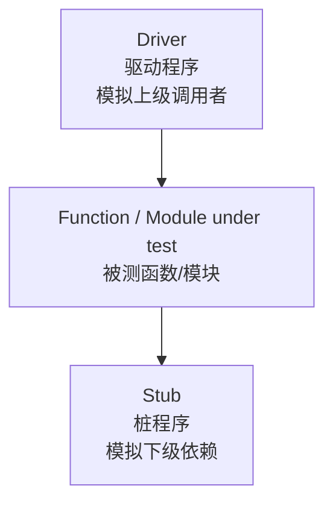

# 第5章：单元测试与集成测试

本章重点不是“会用 JUnit”，而是理解 ==单元测试测什么==、==驱动程序与桩程序是什么==、==集成测试为什么会发现接口问题==、==自顶向下/自底向上/三明治集成怎么区别==。
The focus is not simply using JUnit, but understanding what unit testing checks, what drivers and stubs are, why integration testing finds interface issues, and how integration strategies differ.

## 1. 本章考试地图

| 模块 | 重点 | English |
| --- | --- | --- |
| 代码评审 | 代码审查、走查、会议审查、检查表 | code review |
| 静态检测工具 | FindBugs、PMD、Checkstyle、SonarLint、SAST | static analysis tools |
| 单元测试目标 | 最小设计单元，检查功能、接口、边界、容错、覆盖率 | unit testing |
| 驱动程序与桩程序 | 简答题高频：driver 模拟上级，stub 模拟下级 | driver and stub |
| Mock / Stub / Fake | 会区分测试替身 | test doubles |
| JUnit / Mockito / JaCoCo | 了解用途 | unit testing tools |
| 集成测试 | 大棒、渐增式、自顶向下、自底向上、三明治 | integration testing |
| 微服务集成 | 契约测试、Mock 解除依赖 | contract testing |
| CI/CD | 持续集成、持续交付、持续部署、持续测试 | CI/CD |

## 2. 代码评审与静态测试

==Code review / 代码审查== 是一种有效的静态测试方法。课件提到统计上代码审查可以发现代码中相当比例的缺陷。

### 2.1 编码标准和规范

编码标准提高：

- 可读性 readability。
- 可靠性 reliability。
- 可维护性 maintainability。
- 可移植性 portability。

例子：

- MISRA C。
- Google C++ Style Guide。
- Google Java Style Guide。

### 2.2 评审形式

| 形式 | 说明 | 典型特点 |
| --- | --- | --- |
| Peer review / 代码互查 | 同伴之间互相检查 | 轻量、灵活 |
| Walk-through / 代码走查 | 作者引导成员读设计和代码，模拟运行 | 相对正式，重讨论 |
| Inspection / 会议审查 | 逐句说明逻辑，按检查表检查，记录缺陷 | 最正式，有报告和复查 |

### 2.3 代码走查和会议审查对比

| 对比项 | 走查 Walk-through | 会议审查 Inspection |
| --- | --- | --- |
| 准备 | 通读设计和材料 | 准备需求、设计、代码、编码标准、缺陷检查表 |
| 形式 | 非正式会议 | 正式会议 |
| 参加人员 | 开发人员为主 | 项目组成员可包含测试人员 |
| 技术方法 | 讲解、讨论、模拟运行 | 缺陷检查表 |
| 注意事项 | 限时，不现场修改代码 | 限时，不现场修改代码 |
| 输出 | 会议记录 | 静态分析/评审错误报告 |

### 2.4 常见代码问题

- 空指针保护错误。
- 数据类型转换错误。
- 字符串或数组越界。
- 资源未关闭。
- 不当同步导致并发性能差。
- SQL 注入、XSS 等安全风险。
- 硬编码凭据。

## 3. 静态检测工具

| 语言/方向 | 工具示例 |
| --- | --- |
| Java | FindBugs, PMD, Checkstyle, SonarLint |
| C/C++ | Coverity Static Analysis, Flawfinder |
| 安全 | SAST 工具、OWASP Source Code Analysis Tools |
| 覆盖/质量平台 | SonarQube |

==SAST / Static Application Security Testing== 通常通过词法、语法、控制流、数据流、SSA、指针分析、抽象解释、符号执行等技术识别缺陷模式。

## 4. 为什么要进行单元测试

==Unit testing / 单元测试== 针对软件设计的最小单位，如函数、类、模块。

价值：

| 价值 | 说明 |
| --- | --- |
| 早发现缺陷 | 编码后尽早发现，修复成本低 |
| 易定位问题 | 单元范围小，失败原因更集中 |
| 提高设计质量 | 可测试代码通常依赖更少、职责更清楚 |
| 支持变化 | 修改代码后快速回归 |
| 避免回归缺陷 | 防止旧功能被新改动破坏 |
| 节省时间 | 单元测试快、廉价，适合频繁执行 |
| 记录行为 | 单元测试也是代码行为示例 |

课件中的关键句：==单元质量是系统质量的基石==。
Unit quality is the foundation of system quality.

## 5. 单元测试目标和任务

### 5.1 测试依据

单元测试依据：

- 软件需求规格说明书。
- 软件详细设计说明书。
- 接口说明。
- 代码逻辑和设计约束。

通过标准：

- 功能与设计需求一致。
- 接口与设计需求一致。
- 达到相关覆盖率要求。
- 关键边界和异常处理通过。

### 5.2 六类任务

| 任务 | 检查内容 | 常见问题 |
| --- | --- | --- |
| 模块独立执行路径测试 | 每条语句/路径/分支是否按预期执行 | 算符优先级、变量初始化、精度、逻辑运算符 |
| 局部数据结构测试 | 内部数据是否正确完整 | 类型不兼容、默认值错误、溢出、地址异常 |
| 模块接口测试 | 输入输出和调用接口是否正确 | 参数个数/类型/量纲不匹配、修改只读参数 |
| 单元边界条件测试 | 临界数据是否正确处理 | 合法边界、非法边界、空输入 |
| 单元容错测试 | 出错处理是否正确有效 | 错误信息难懂、异常处理不当 |
| 内存分析 | 内存分配、泄漏、释放是否正确 | 内存泄漏、越界、释放后使用 |

## 6. 驱动程序与桩程序

这是 2025 考情简答题点名内容。

### 6.1 定义

| 概念 | 中文定义 | English |
| --- | --- | --- |
| ==Driver / 驱动程序== | 模拟被测模块的上级模块，用来调用被测模块、传入数据、接收结果 | A driver simulates the caller or upper-level module of the unit under test. |
| ==Stub / 桩程序== | 模拟被测模块运行时调用的下层模块，向被测模块返回受控结果 | A stub simulates lower-level modules called by the unit under test. |

一句话：

> 驱动程序在上面“叫它干活”，桩程序在下面“假装被它调用”。
> A driver calls the unit from above; a stub pretends to be the dependency below.

### 6.2 图示

### 6.3 为什么需要

- 被测模块不能独立运行。
- 上层模块还没完成，需要 driver 来调用。
- 下层模块还没完成或不稳定，需要 stub 来隔离。
- 想控制外部依赖返回值，例如数据库、网络、第三方服务。
- 便于定位缺陷是否来自被测单元本身。

### 6.4 和集成策略的关系

| 集成策略 | 更常需要什么 | 原因 |
| --- | --- | --- |
| 自顶向下 | 桩程序 Stub | 上层先测，下层模块未接入，需要模拟下层 |
| 自底向上 | 驱动程序 Driver | 底层先测，上层未接入，需要模拟上层调用 |

## 7. 类测试和分层单元测试

类的单元测试可看作对成员函数进行测试，但还要考虑：

- 构造函数和初始化状态。
- 成员方法之间的状态依赖。
- 父类/子类继承。
- 多态分派。
- 私有状态是否通过公共行为间接验证。

分层单元测试：

- Action 层测试。
- 数据访问层测试。
- Servlet/Controller 测试。
- Service 层业务逻辑测试。

分层测试的意义是隔离依赖，让问题更容易定位。

## 8. JUnit、Mockito、JaCoCo

### 8.1 JUnit

==JUnit== 是 Java 常用单元测试框架，属于 xUnit 家族。

常见概念：

| 概念 | 说明 |
| --- | --- |
| Assert | 断言实际结果是否等于预期结果 |
| @Test | 标记测试方法 |
| @ParameterizedTest | 参数化测试 |
| @BeforeEach / @AfterEach | 每个测试前后执行 |
| @BeforeAll / @AfterAll | 全部测试前后执行 |

断言本质：

> expected == actual 则测试通过，否则失败。

### 8.2 Stub、Mock、Fake

| 测试替身 | 定义 | 重点 |
| --- | --- | --- |
| Stub | 持有预定义数据并返回给被测对象 | 占位和固定返回 |
| Mock | 记录收到的调用，并可验证调用是否符合预期 | 带断言和交互验证 |
| Fake | 有可工作的简化实现，但不是生产实现 | 简化实现 |

区别速记：

- Stub 主要回答“返回什么”。
- Mock 还回答“有没有按预期调用”。
- Fake 是“简化版真实实现”。

### 8.3 Mockito

Mockito 常用能力：

- `mock()` / `@Mock` 创建 mock。
- `when()` / `given()` 指定行为。
- `verify()` 检查方法是否被调用、调用次数、调用顺序。
- `spy()` 部分模拟真实对象。
- `@InjectMocks` 自动注入 mock。

### 8.4 JaCoCo

==JaCoCo / Java Code Coverage== 是 Java 覆盖率统计工具。

覆盖维度：

- 指令。
- 分支。
- 行。
- 方法。
- 类。
- 圈复杂度。

注意：覆盖率是充分性线索，不是正确性证明。

## 9. 集成测试

==Integration testing / 集成测试== 在单元测试基础上，把已测单元按设计要求集成起来，检查单元之间接口是否存在问题。

典型发现：

- 参数不匹配。
- 参数传递错误。
- 数据丢失。
- 调用顺序错误。
- 接口协议不一致。
- 异常处理不一致。

## 10. 单体架构集成策略

### 10.1 非渐增式：大棒集成

==Big-bang integration / 大棒集成==：

- 先分别测试每个模块。
- 再一次性把所有模块集成。

优点：

- 简单，前期集成规划少。

缺点：

- 很难定位错误在哪个模块或接口。
- 不推荐用于大系统。
- 只适合规模较小系统。

### 10.2 渐增式集成

==Incremental integration== 每次把一个或一组模块加入已测试模块中。

优点：

- 问题更容易定位。
- 可以逐步构造系统。
- 支持回归测试。

### 10.3 自顶向下集成

步骤：

1. 从主控模块开始测试。
2. 用桩代替所有下层模块。
3. 每次用一个真实模块替换一个桩。
4. 加入新单元后测试并必要时回归。
5. 重复直到所有单元加入。

优点：

- 较早发现上层、主控和关键业务流程问题。

缺点：

- 需要大量桩。
- 底层模块测试较晚。

### 10.4 自底向上集成

步骤：

1. 从底层模块开始。
2. 需要写驱动程序调用底层模块。
3. 把底层模块组合成更大功能族。
4. 去掉旧驱动，继续向上集成。
5. 直到所有单元集成完成。

优点：

- 底层基础模块较早得到充分测试。

缺点：

- 需要驱动程序。
- 上层业务流程较晚验证。

### 10.5 三明治集成

==Sandwich integration== 结合自顶向下和自底向上。

| 内容 | 说明 |
| --- | --- |
| 方法 | 上层自顶向下，下层自底向上，中间会合 |
| 优点 | 综合两者优点，减少部分桩/驱动成本 |
| 缺点 | 真正集成前某些独立模块可能未完全测试 |
| 改进三明治 | 两头向中间集成，同时保证每个模块单独测试 |

## 11. 微服务架构集成测试

微服务集成关注：

- 外部通信是否通畅。
- 协议层是否正确，如 HTTP header、SSL、请求/响应格式。
- 数据库访问和 ORM 映射是否正确。
- 网络错误、超时、重试是否处理合理。

### 11.1 消费者驱动契约测试

==Consumer Driven Contract Testing / CDC testing==：

服务消费者和提供者之间交互协作的约定，包括 request 和 response 数据格式。

流程：

1. Consumer 根据自己的需求写测试。
2. 测试生成 contract。
3. Provider 用 contract verifier 验证自己是否满足契约。

价值：

- 降低联调成本。
- 支持离线验证。
- 接口变更有迹可循。
- 常见工具：Pact、Spring Cloud Contract 等。

## 12. CI/CD 与持续测试

| 概念 | 含义 |
| --- | --- |
| Continuous Integration / CI | 开发者提交后自动构建、测试并合并 |
| Continuous Delivery | 自动测试并产生可发布版本，部署仍可人工批准 |
| Continuous Deployment | 持续交付后自动部署到生产或目标环境 |
| Continuous Testing | 测试自动化和质量反馈贯穿开发、交付、部署 |

CI/CD 的价值：

- 更早发现错误。
- 避免代码积压。
- 提高生产率。
- 缩短开发周期。
- 倒逼测试自动化和持续监控。

## 13. 本章速记

| 高频词 | 一句话 |
| --- | --- |
| 单元测试 | 测最小设计单元，是系统质量基石 |
| 驱动程序 | 模拟上级调用者 |
| 桩程序 | 模拟下级被调用模块 |
| Stub | 固定/预设返回 |
| Mock | 可验证交互 |
| Fake | 简化实现 |
| 大棒集成 | 一次性集成，难定位 |
| 自顶向下 | 上层先测，用桩 |
| 自底向上 | 底层先测，用驱动 |
| 三明治 | 上下结合，中间会合 |
| CDC | 消费者驱动契约测试 |

## 14. 自测

### Q1. 什么是驱动程序和桩程序？

答案 / Answer:

中文：驱动程序模拟被测模块的上级模块，用来调用被测模块并传入测试数据；桩程序模拟被测模块调用的下层模块，向被测模块提供受控返回结果。二者用于隔离被测单元，使单元在上下游未完成或不稳定时也能测试。

English: A driver simulates the upper-level caller of the unit under test and invokes it with test data. A stub simulates lower-level modules called by the unit and returns controlled results. They isolate the unit so that it can be tested even when surrounding modules are incomplete or unstable.

### Q2. 自顶向下和自底向上集成的区别是什么？

答案 / Answer:

中文：自顶向下从主控模块开始，逐步用真实模块替换桩，优点是早测上层关键流程，缺点是需要大量桩且底层测试晚；自底向上从底层模块开始，需要驱动程序调用底层模块，优点是底层基础模块早测，缺点是上层业务流程验证较晚。

English: Top-down integration starts from the main control module and gradually replaces stubs with real modules. It tests high-level flows early but needs many stubs. Bottom-up integration starts from lower-level modules and uses drivers to call them. It tests foundations early but verifies high-level business flows later.

### Q3. Stub、Mock、Fake 有什么区别？

答案 / Answer:

中文：Stub 主要提供预设返回值；Mock 不仅模拟对象，还记录调用并能验证调用是否符合预期；Fake 是具有可工作逻辑的简化实现，但不是生产实现。

English: A stub mainly provides predefined return values. A mock simulates an object and records interactions for verification. A fake has a working but simplified implementation that differs from production code.

### Q4. 为什么集成测试能发现单元测试发现不了的问题？

答案 / Answer:

中文：单元测试主要验证单个模块内部逻辑，集成测试把模块连接起来后会暴露接口和交互问题，例如参数不匹配、数据丢失、调用顺序错误、协议不一致和异常处理不一致。

English: Unit testing mainly verifies internal logic of individual modules. Integration testing connects modules and reveals interface and interaction issues, such as parameter mismatch, data loss, wrong call order, protocol inconsistency, and inconsistent exception handling.
