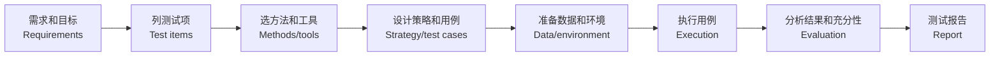
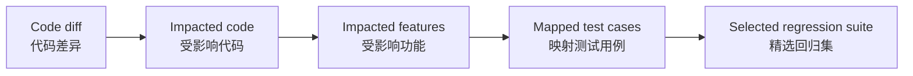

# 第6章：系统测试

本章关注完整系统。复习主线是：==系统测试定义 -> 系统功能测试 -> 接口/UI/移动端自动化 -> 回归测试 -> 精准测试==。
The main line is: ==system testing definition -> system functional testing -> API/UI/mobile automation -> regression testing -> precision testing==.

## 1. 本章考试地图

| 模块 | 重点 | English |
| --- | --- | --- |
| 系统测试定义 | 完成集成后，在完整环境中验证系统满足需求 | system testing |
| 系统功能测试 | 功能、界面、数据、逻辑、接口 | system functional testing |
| 接口测试 | HTTP、Web Service、RESTful | API testing |
| 功能自动化 | 接口自动化、Web UI 自动化、Android UI 自动化 | functional test automation |
| 工具 | Postman、Selenium、Cypress、Appium、MonkeyRunner | tools |
| 回归测试 | 修改后再次测试，发现回归缺陷 | regression testing |
| 精准测试 | 代码变更与测试用例映射，选择受影响用例 | precision testing |

## 2. 系统测试定义

==System testing / 系统测试== 是在完成集成测试之后，将待测软件与计算机硬件、输入输出设备、数据、网络、支撑软件和第三方软件等综合在一起进行测试，以验证系统在功能和性能等方面满足用户预期和需求。

目的：

> 验证整个系统与需求规格说明书一致。
> Verify that the complete system conforms to the requirements specification.

## 3. 系统测试类型

产品质量包括功能适应性、兼容性、性能、安全性、可靠性和易用性，所以系统测试也可以分为：

| 类型 | 说明 | 后续位置 |
| --- | --- | --- |
| 功能测试 | 系统功能是否正确满足需求 | 本章 |
| 兼容性测试 | 硬件、软件、数据兼容 | 第 7 章 |
| 性能测试 | 响应时间、吞吐量、资源利用 | 第 7 章 |
| 安全性测试 | 安全功能和安全漏洞 | 第 7 章 |
| 可靠性测试 | 持续运行、容错、恢复 | 第 7 章 |
| 易用性测试 | 用户体验、A/B 测试 | 第 7 章 |

## 4. 系统功能测试

功能测试既可以发生在单元层，也可以发生在系统层。

| 层次 | 目标 | 判断依据 |
| --- | --- | --- |
| 单元功能测试 | 独立模块功能是否正确 | 详细设计、代码逻辑 |
| 系统功能测试 | 完整系统业务是否正确 | 需求规格说明书、用户场景 |

系统功能测试要模拟用户完成完整业务流程，同时考虑模块交互和运行环境。

### 4.1 系统功能测试测什么

| 测试对象 | 关注点 |
| --- | --- |
| Function / 功能 | 每项功能是否满足实际要求 |
| UI / 界面 | 菜单、按钮、页面清晰、美观、可操作 |
| Data / 数据 | 输入、输出、保存、读取、格式是否正确 |
| Logic / 逻辑 | 业务状态是否按流程变化 |
| API / 接口 | 请求、响应、错误码、协议是否正确 |

### 4.2 基本思路

详细步骤：

1. 明确质量要求和测试目标。
2. 阅读需求文档，分析被测功能，列出测试项。
3. 选择合适测试方法和工具。
4. 设计测试策略和测试用例。
5. 准备测试数据，搭建测试环境。
6. 执行测试用例。
7. 分析结果，评估测试充分性。
8. 提交测试报告。

### 4.3 功能测试要点

- 每项功能符合实际要求。
- 菜单、按钮操作正常，能处理异常操作。
- 能接受正确输入，对异常输入有容错。
- 输出结果准确，格式清晰，可保存和读取。
- 功能逻辑清楚，符合使用者习惯。
- 系统状态按业务流程变化并保持稳定。

系统测试通常采用黑盒测试技术，例如等价类划分、边界值分析、判定表和因果图。

## 5. 面向接口的功能测试

接口测试通过调用软件接口模拟客户端请求，验证服务器返回信息和系统功能。

常见接口：

- HTTP 接口。
- Web Service 接口。
- RESTful 接口。

接口测试不只是验证接口“能不能调通”，更重要的是通过接口验证系统功能和业务规则。

### 5.1 HTTP 接口

| 报文 | 组成 |
| --- | --- |
| 请求报文 | 请求行、请求头、空行、请求数据 |
| 响应报文 | 状态行、响应头、空行、响应数据 |

接口用例应检查：

- URL 和方法是否正确。
- 参数必填/可选/边界/非法值。
- Header、认证、Cookie/Token。
- 状态码。
- 响应体字段和数据类型。
- 错误信息。
- 幂等性和重复提交。

### 5.2 Web Service

Web Service 常见三要素：

| 概念 | 说明 |
| --- | --- |
| SOAP | 基于 XML 的通信协议 |
| WSDL | 描述服务、函数、参数、返回值和访问方式 |
| UDDI | 描述、发布和查找 Web 服务的机制 |

### 5.3 RESTful 接口

==REST / Representational State Transfer== 是一种架构风格。

特点：

- 资源用 URI 表示。
- URL 中尽量使用名词，不使用动词。
- 使用 HTTP 方法表达操作：GET、POST、PUT、DELETE。
- 无状态：服务端不保存客户端会话状态，请求携带必要状态信息。

例子：

| 操作 | 推荐 |
| --- | --- |
| 获取动物园 | `GET /zoos/{id}` |
| 新增动物园 | `POST /zoos` |
| 更新动物园 | `PUT /zoos/{id}` |
| 删除动物园 | `DELETE /zoos/{id}` |

## 6. 面向 UI 的功能测试

UI 功能测试重点：

- 按功能、子功能、功能点分层展开。
- 基于输入域和组合测试设计输入。
- 从用户角色和使用场景遍历主要路径。
- 针对不同设置测试。
- 检查异常提示、权限、状态变化、数据展示。

UI 测试更接近用户，但自动化维护成本通常比接口测试高。

## 7. 功能测试自动化

自动化测试分层：

| 层次 | 特点 | ROI |
| --- | --- | --- |
| 单元测试 | 快、稳定、易自动化 | 高 |
| 接口测试 | 覆盖业务逻辑，维护成本中等 | 中高 |
| UI 测试 | 接近用户，但脆弱、维护成本高 | 中低 |

### 7.1 接口自动化

工具：

- Postman。
- Swagger。
- Easy Mock。
- Mockbin。
- RAP。
- Doclever。

Postman 关键概念：

| 概念 | 说明 |
| --- | --- |
| Collection | 测试请求集合，相当于测试用例集 |
| Pre-request script | 请求发送前执行 |
| Post-response script | 收到响应后执行断言 |
| `pm.response.test` | 检查响应是否符合预期 |
| Chai.js / `pm.expect` | 编写断言 |

### 7.2 Web UI 自动化：Selenium

Selenium 是开源 Web 自动化框架。

组件：

| 组件 | 说明 |
| --- | --- |
| Selenium WebDriver | 核心组件，向浏览器发送指令 |
| Selenium IDE | 浏览器插件式录制/回放工具 |
| Selenium Grid | 支持远端多浏览器/多机器执行 |

典型流程：

1. 创建 WebDriver。
2. 打开网页。
3. 定位元素并执行动作。
4. 断言页面状态或数据。

### 7.3 Web UI 自动化：Cypress

Cypress 是基于 JavaScript 的前端测试工具。

特点：

- 自集成，安装后可快速编写运行用例。
- 支持 Vue、React 等前端框架。
- 支持端到端、集成、单元测试。
- 测试代码和应用运行在 Cypress 控制的浏览器中。
- 支持步骤回看，调试体验好。

### 7.4 Android UI 自动化

常见工具：

- Robotium。
- UIAutomator。
- MonkeyRunner。
- Appium。
- Espresso。
- Selendroid。

两种机制：

| 机制 | 工具例子 | 特点 |
| --- | --- | --- |
| UIAutomator 机制 | Appium | 测试进程和目标应用进程分离，只能模拟触发事件 |
| Instrumentation 机制 | Robotium, Espresso, Selendroid | 测试进程和目标应用在同一进程，可精确控制 Activity 生命周期 |

MonkeyRunner：

- 在 Android 代码之外控制设备或模拟器。
- 可安装应用、运行程序、模拟按键、截图。
- 用 Python 脚本编写。

## 8. 回归测试

==Regression testing / 回归测试== 是在已开发并测试过的软件发生改变之后，再次进行功能或非功能测试，以保证程序行为仍符合预期。

改变来源：

- 修复 bug。
- 软件增强。
- 配置改变。
- 重要部件替换。

==Regression defect / 回归缺陷==：原来正常工作的功能，在需求未变化的情况下，因为其他改动影响而出错。

### 8.1 为什么需要回归测试

- 代码存在依赖，一个修改可能影响其他功能。
- 缺陷修复可能引入新缺陷。
- 配置、库、环境变化会改变行为。
- 系统复杂后人工判断影响范围困难。

### 8.2 回归测试策略

| 策略 | 说明 | 优缺点 |
| --- | --- | --- |
| Retest all | 重新运行所有测试用例 | 最稳但成本高 |
| Risk-based selection | 选择质量风险高的用例 | 成本可控，但依赖风险判断 |
| Operational profile selection | 按用户常用路径选择 | 贴近真实使用 |
| Retest modified parts | 只测试修改部分 | 成本低但可能漏掉间接受影响功能 |

测试自动化对回归测试非常重要，因为回归需要频繁重复执行。

## 9. 精准测试

==Precision testing / 精准测试== 建立软件功能、代码和测试用例之间的映射。

流程：

1. 比较新旧代码差异。
2. 定位被修改代码。
3. 分析受影响代码和功能。
4. 根据代码-用例映射选择回归测试用例。

价值：

- 减少不必要回归用例。
- 缩短回归周期。
- 降低遗漏风险。
- 让测试选择更数据化。

## 10. 本章速记

| 高频词 | 一句话 |
| --- | --- |
| 系统测试 | 集成后，完整环境中验证完整系统 |
| 系统功能测试 | 从用户业务角度测功能、UI、数据、逻辑、接口 |
| 接口测试 | 不只测接口通不通，还测业务是否正确 |
| SOAP/WSDL/UDDI | Web Service 三要素 |
| REST | URI 表资源，HTTP 方法表操作，无状态 |
| Selenium | Web UI 自动化 |
| Cypress | 前端端到端测试体验好 |
| MonkeyRunner | Android 外部脚本控制设备 |
| 回归测试 | 修改后再测，防止旧功能被破坏 |
| 精准测试 | 用代码变更映射选择回归用例 |

## 11. 自测

### Q1. 系统测试和单元测试中的功能测试有什么区别？

答案 / Answer:

中文：单元测试中的功能测试关注独立模块输入输出是否符合详细设计；系统测试中的功能测试关注完整系统在真实或模拟环境中是否按照需求规格完成用户业务流程，并考虑模块交互和系统运行环境。

English: Functional testing in unit testing checks whether an individual module's inputs and outputs conform to detailed design. Functional testing in system testing checks whether the complete system performs user business flows according to requirements in a realistic environment, including module interactions.

### Q2. 回归测试是什么？什么是回归缺陷？

答案 / Answer:

中文：回归测试是在软件修改后再次测试功能或非功能行为，以保证程序仍符合预期。回归缺陷是原来正常工作的功能在需求未变化时，因为其他改动影响而产生的问题。

English: Regression testing retests functional or non-functional behavior after changes to ensure the software still behaves as expected. A regression defect is a problem introduced into previously working functionality without a requirement change.

### Q3. RESTful 接口的核心特点是什么？

答案 / Answer:

中文：RESTful 接口把对象实例抽象为资源，每个资源有唯一 URI；用 HTTP 的 GET、POST、PUT、DELETE 表达操作；URL 尽量使用名词；服务端无状态，每次请求携带必要状态信息。

English: RESTful APIs model object instances as resources with unique URIs, use HTTP methods such as GET, POST, PUT, and DELETE for operations, prefer nouns in URLs, and are stateless so each request carries necessary state information.

### Q4. 精准测试如何选择回归用例？

答案 / Answer:

中文：精准测试先比较新旧代码差异，定位改动代码，再分析受影响功能和代码路径，最后根据代码与测试用例的映射选择需要执行的回归测试用例。

English: Precision testing compares code changes, identifies modified code, analyzes impacted features and code paths, and selects regression test cases through mappings between code and tests.
